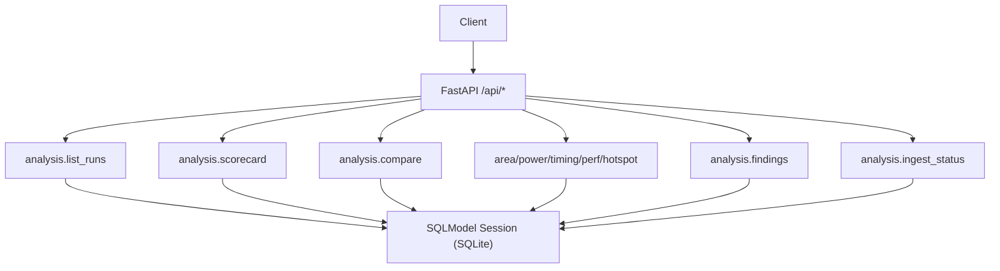
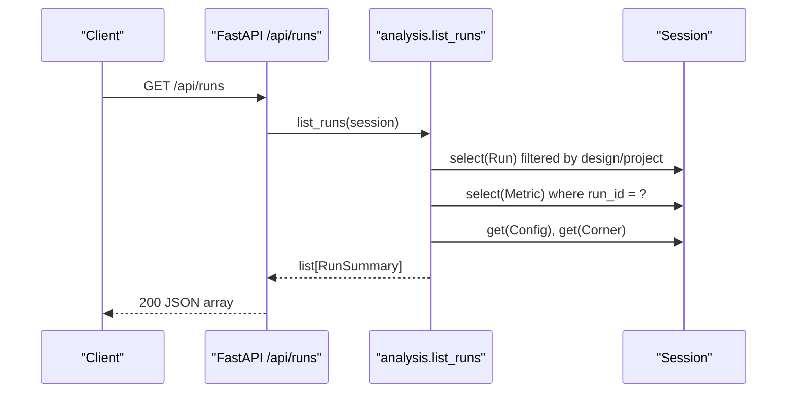
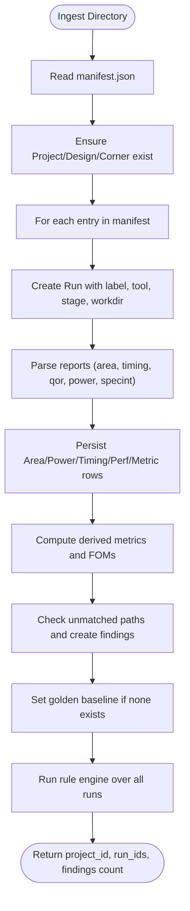

# Run Management API

<cite>
**Referenced Files in This Document**
- [main.py](file://backend/ppa/main.py)
- [analysis.py](file://backend/ppa/analysis.py)
- [models.py](file://backend/ppa/models.py)
- [ingest.py](file://backend/ppa/ingest.py)
- [api.ts](file://frontend/src/api.ts)
- [types.ts](file://frontend/src/types.ts)
</cite>

## Table of Contents
1. [Introduction](#introduction)
2. [Project Structure](#project-structure)
3. [Core Components](#core-components)
4. [Architecture Overview](#architecture-overview)
5. [Detailed Component Analysis](#detailed-component-analysis)
6. [Dependency Analysis](#dependency-analysis)
7. [Performance Considerations](#performance-considerations)
8. [Troubleshooting Guide](#troubleshooting-guide)
9. [Conclusion](#conclusion)

## Introduction
This document provides detailed API documentation for run management endpoints, focusing on listing and filtering runs, run lifecycle states, metadata structure, baseline relationships, ingestion-driven creation, error handling, and pagination behavior. It is intended for developers integrating with or consuming the PPA-Profiler backend APIs.

## Project Structure
The run-related API surface is implemented as a FastAPI application that exposes REST endpoints under /api. The core logic for listing runs and other analysis operations lives in an analysis module, while data models are defined using SQLModel. Ingestion creates runs from report directories and populates metrics and findings.

**Diagram sources**
- [main.py:38-105](file://backend/ppa/main.py#L38-L105)
- [analysis.py:46-439](file://backend/ppa/analysis.py#L46-L439)

**Section sources**
- [main.py:1-206](file://backend/ppa/main.py#L1-L206)
- [analysis.py:1-439](file://backend/ppa/analysis.py#L1-L439)

## Core Components
- Runs endpoint: GET /api/runs returns a list of runs with summary fields including label, stage, started_at, config, corner, figures of merit, timing summaries, and open findings count.
- Scorecard endpoint: GET /api/scorecard/{run_id} returns a comprehensive view for a single run, including figures of merit, deltas vs baseline, budgets, domain metrics, and top findings.
- Compare endpoint: GET /api/compare?run_ids=... compares multiple runs against the first one.
- Explorers: area/power/timing/perf/hotspot endpoints provide detailed breakdowns per run.
- Findings: GET /api/findings supports filtering by run_id, severity, category, status.
- Ingest status: GET /api/ingest-status returns parse statuses for raw reports.

Run model fields include identity, provenance, stage, timestamps, and work directory path. Metrics are stored in a tall table keyed by run_id. Baseline assignments link a project to a specific run used as reference for comparisons.

**Section sources**
- [main.py:38-105](file://backend/ppa/main.py#L38-L105)
- [analysis.py:46-125](file://backend/ppa/analysis.py#L46-L125)
- [models.py:55-166](file://backend/ppa/models.py#L55-L166)

## Architecture Overview
The run listing flow is straightforward: the client calls GET /api/runs; the route delegates to analysis.list_runs which queries runs, aggregates metrics, and enriches results with configuration and corner details.

**Diagram sources**
- [main.py:38-40](file://backend/ppa/main.py#L38-L40)
- [analysis.py:46-64](file://backend/ppa/analysis.py#L46-L64)

## Detailed Component Analysis

### Runs Listing Endpoint
- Method and path: GET /api/runs
- Purpose: List all runs with summary information suitable for exploration and filtering on the frontend.
- Query parameters: None currently supported by the route. Filtering by status, date ranges, or metadata must be done client-side based on returned fields.
- Response shape: Array of objects with fields:
  - run_id: integer
  - label: string
  - stage: string (e.g., rtla_predict)
  - started_at: ISO datetime string
  - config: object (params_json from Config)
  - corner: string (corner name)
  - fom: object (figures of merit keys without "fom." prefix)
  - timing: object with wns_ns, tns_ns, nve
  - open_findings: integer count of open findings for the run
- Error handling: No explicit validation errors for invalid IDs since this endpoint lists runs. Errors would arise from database/session issues.
- Pagination: Not implemented. All runs are returned. Clients should handle large datasets accordingly.

Request example:
- GET /api/runs

Response example (fields only):
- [
    {
      "run_id": 1,
      "label": "rob128",
      "stage": "rtla_predict",
      "started_at": "2024-01-01T12:00:00Z",
      "config": {"param_a": 1},
      "corner": "tt_0p80v_25c",
      "fom": {"area_mm2": 0.5, "total_power_mw": 100},
      "timing": {"wns_ns": 0.1, "tns_ns": -0.2, "nve": 5},
      "open_findings": 2
    }
  ]

**Section sources**
- [main.py:38-40](file://backend/ppa/main.py#L38-L40)
- [analysis.py:46-64](file://backend/ppa/analysis.py#L46-L64)
- [types.ts:1-11](file://frontend/src/types.ts#L1-L11)

### Scorecard Endpoint
- Method and path: GET /api/scorecard/{run_id}
- Purpose: Provide a comprehensive scorecard for a run, including figures of merit, deltas vs baseline, budgets, domain metrics, and top findings.
- Path parameter: run_id (integer)
- Error handling: Returns empty object if run not found; clients may treat this as 404-like behavior.
- Response shape includes:
  - run: id, label, stage
  - fom: figures of merit
  - fom_delta_vs_baseline: deltas compared to baseline run
  - budgets: area_mm2, power_mw, fmax_mhz with budget/target/current
  - domains: timing, area, power, performance metrics
  - findings: top findings sorted by severity

Request example:
- GET /api/scorecard/1

Response example (fields only):
- {
    "run": {"id": 1, "label": "rob128", "stage": "rtla_predict"},
    "fom": {"area_mm2": 0.5, "total_power_mw": 100},
    "fom_delta_vs_baseline": {...},
    "budgets": {"area_mm2": {"budget": 0.6, "current": 0.5}, ...},
    "domains": {"timing": {...}, "area": {...}, "power": {...}, "performance": {...}},
    "findings": [...]
  }

**Section sources**
- [main.py:45-50](file://backend/ppa/main.py#L45-L50)
- [analysis.py:69-125](file://backend/ppa/analysis.py#L69-L125)

### Compare Endpoint
- Method and path: GET /api/compare?run_ids=a,b,c
- Purpose: Compare multiple runs against the first run in the list.
- Query parameter: run_ids (comma-separated integers)
- Validation: Requires at least two run IDs; otherwise returns 400 with message.
- Response shape includes:
  - runs: list of run summaries with config and fom
  - comparisons: per-run comparisons including fom_delta, decomposition, config_diff, area_waterfall, power_waterfall

Request example:
- GET /api/compare?run_ids=1,2

Error example:
- GET /api/compare?run_ids=1
- 400: "run_ids must list at least two runs"

**Section sources**
- [main.py:55-60](file://backend/ppa/main.py#L55-L60)
- [analysis.py:139-167](file://backend/ppa/analysis.py#L139-L167)

### Explorers Endpoints
- Methods and paths:
  - GET /api/area/{run_id}
  - GET /api/power/{run_id}
  - GET /api/timing/{run_id}
  - GET /api/perf/{run_id}?baseline_id=...
  - GET /api/hotspot/{run_id}
- Purpose: Provide detailed hierarchical breakdowns for area, power, timing, performance, and hotspot analysis per run.
- Parameters:
  - run_id: required integer path parameter
  - baseline_id: optional query parameter for perf explorer to override baseline selection
- Responses: Structured arrays of rows with computed shares, deltas vs baseline where applicable, and aggregate totals.

**Section sources**
- [main.py:73-96](file://backend/ppa/main.py#L73-L96)
- [analysis.py:224-398](file://backend/ppa/analysis.py#L224-L398)

### Findings Endpoint
- Method and path: GET /api/findings
- Purpose: List findings with optional filters.
- Query parameters:
  - run_id: integer filter
  - severity: string filter (critical, high, medium, low, info)
  - category: string filter (timing, area, power, performance, cross_domain, data_quality)
  - status: string filter (open, acknowledged, fixed, wont_fix)
- Response shape: Array of finding objects with id, run_id, rule_id, severity, category, scope_path, title, evidence, status, ai_explanation, ai_proposal, and run_label.

Request examples:
- GET /api/findings?run_id=1&severity=high
- GET /api/findings?category=timing&status=open

**Section sources**
- [main.py:101-105](file://backend/ppa/main.py#L101-L105)
- [analysis.py:403-423](file://backend/ppa/analysis.py#L403-L423)
- [types.ts:13-26](file://frontend/src/types.ts#L13-L26)

### Ingest Status Endpoint
- Method and path: GET /api/ingest-status
- Purpose: Return parse status for each raw report across all runs.
- Response shape: Array of objects with run_id, run_label, kind, file, sha256 (truncated), parser_version, status (ok/warnings/error), log (truncated).

Request example:
- GET /api/ingest-status

**Section sources**
- [main.py:154-156](file://backend/ppa/main.py#L154-L156)
- [analysis.py:428-438](file://backend/ppa/analysis.py#L428-L438)

## Dependency Analysis
Runs are created through the ingestion pipeline, which reads report files from a manifest-defined directory structure, parses them, persists metrics and findings, and sets up baseline assignments.

**Diagram sources**
- [ingest.py:267-311](file://backend/ppa/ingest.py#L267-L311)
- [ingest.py:61-240](file://backend/ppa/ingest.py#L61-L240)
- [models.py:55-166](file://backend/ppa/models.py#L55-L166)

**Section sources**
- [ingest.py:61-311](file://backend/ppa/ingest.py#L61-L311)
- [models.py:55-166](file://backend/ppa/models.py#L55-L166)

## Performance Considerations
- The runs listing endpoint returns all runs without pagination. For large datasets, consider implementing server-side pagination or client-side virtualization.
- Metric aggregation occurs per run during listing; caching strategies could reduce repeated computations if needed.
- Explorers return hierarchical data; ensure efficient rendering on the frontend for large hierarchies.

[No sources needed since this section provides general guidance]

## Troubleshooting Guide
- Invalid run IDs:
  - Scorecard endpoint returns an empty object when run_id does not exist; clients should handle this case appropriately.
  - Compare endpoint validates run_ids and returns 400 if fewer than two IDs are provided.
- Ingestion issues:
  - Use GET /api/ingest-status to inspect parse statuses and logs for missing or errored reports.
  - RawReport.parse_status indicates ok, warnings, or error; parse_log contains truncated diagnostics.
- Findings status:
  - Findings can be filtered by status; use PATCH /api/findings/{finding_id} to update status and AI explanations/proposals.

**Section sources**
- [main.py:45-60](file://backend/ppa/main.py#L45-L60)
- [analysis.py:69-72](file://backend/ppa/analysis.py#L69-L72)
- [analysis.py:428-438](file://backend/ppa/analysis.py#L428-L438)
- [main.py:114-131](file://backend/ppa/main.py#L114-L131)

## Conclusion
The run management API provides robust endpoints for listing, scoring, comparing, and exploring runs, along with ingestion-driven creation and status monitoring. While filtering and pagination are not fully exposed on the runs listing endpoint, the rich metadata enables effective client-side filtering. Baseline relationships support meaningful comparisons and delta calculations. Error handling is present for key endpoints, and ingestion diagnostics help troubleshoot parsing issues.

[No sources needed since this section summarizes without analyzing specific files]