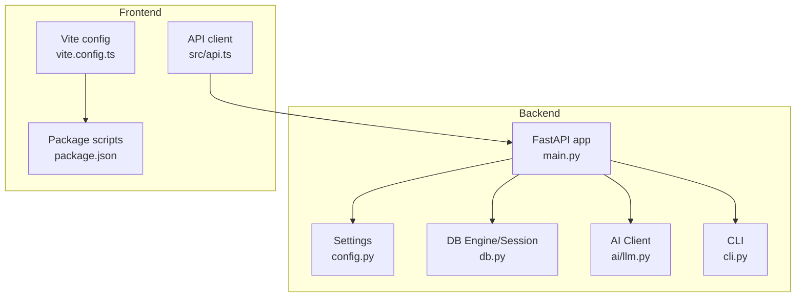
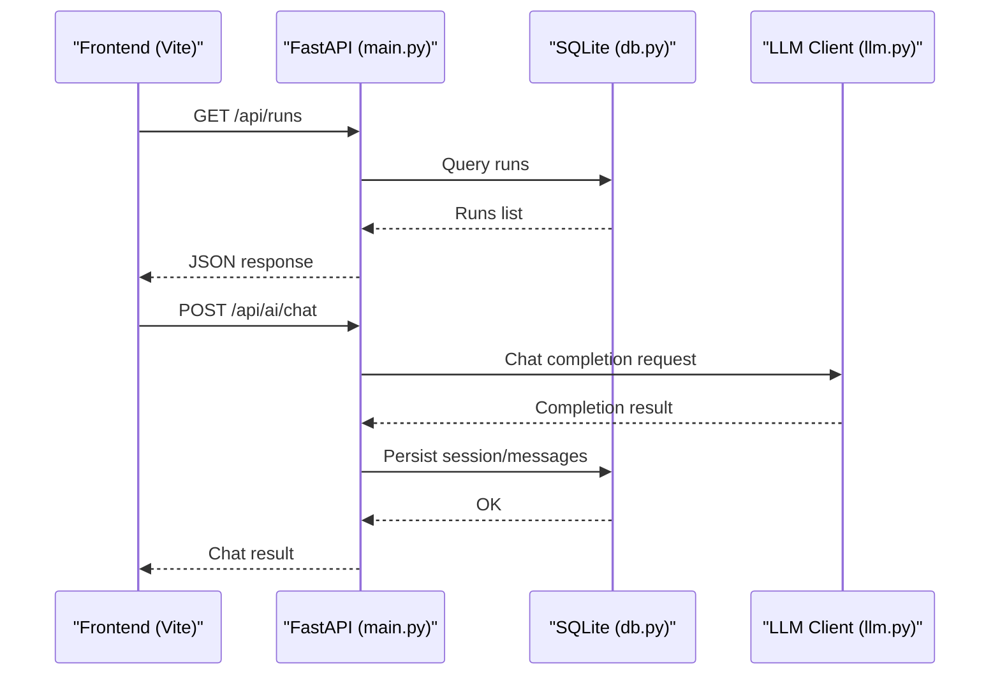
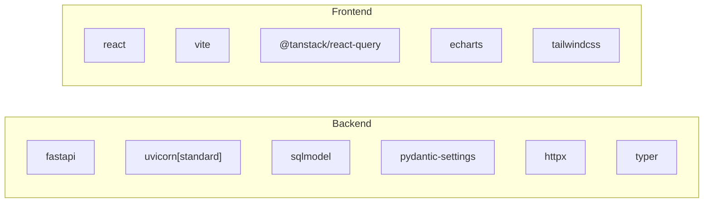

# Configuration & Deployment

<cite>
**Referenced Files in This Document**
- [config.py](file://backend/ppa/config.py)
- [main.py](file://backend/ppa/main.py)
- [db.py](file://backend/ppa/db.py)
- [llm.py](file://backend/ppa/ai/llm.py)
- [cli.py](file://backend/ppa/cli.py)
- [models.py](file://backend/ppa/models.py)
- [requirements.txt](file://backend/requirements.txt)
- [package.json](file://frontend/package.json)
- [vite.config.ts](file://frontend/vite.config.ts)
- [api.ts](file://frontend/src/api.ts)
</cite>

## Table of Contents
1. Introduction
2. Project Structure
3. Core Components
4. Architecture Overview
5. Detailed Component Analysis
6. Dependency Analysis
7. Performance Considerations
8. Troubleshooting Guide
9. Conclusion
10. Appendices

## Introduction
This document provides comprehensive configuration and deployment guidance for PPA-Profiler, covering runtime settings, environment variable overrides, build processes, packaging, deployment options across environments, monitoring and logging, operational considerations, scaling guidelines, database optimization, performance tuning, and security practices.

## Project Structure
PPA-Profiler consists of:
- Backend (FastAPI + SQLModel + SQLite): API endpoints, AI integration, static frontend serving, CLI tools.
- Frontend (React + Vite + Tailwind): SPA served by the backend or via dev server with API proxy.

**Diagram sources**
- [main.py:1-206](file://backend/ppa/main.py#L1-L206)
- [config.py:1-31](file://backend/ppa/config.py#L1-L31)
- [db.py:1-50](file://backend/ppa/db.py#L1-L50)
- [llm.py:1-60](file://backend/ppa/ai/llm.py#L1-L60)
- [cli.py:1-99](file://backend/ppa/cli.py#L1-L99)
- [vite.config.ts:1-14](file://frontend/vite.config.ts#L1-L14)
- [package.json:1-30](file://frontend/package.json#L1-L30)
- [api.ts:1-48](file://frontend/src/api.ts#L1-L48)

**Section sources**
- [main.py:1-206](file://backend/ppa/main.py#L1-L206)
- [config.py:1-31](file://backend/ppa/config.py#L1-L31)
- [db.py:1-50](file://backend/ppa/db.py#L1-L50)
- [llm.py:1-60](file://backend/ppa/ai/llm.py#L1-L60)
- [cli.py:1-99](file://backend/ppa/cli.py#L1-L99)
- [vite.config.ts:1-14](file://frontend/vite.config.ts#L1-L14)
- [package.json:1-30](file://frontend/package.json#L1-L30)
- [api.ts:1-48](file://frontend/src/api.ts#L1-L48)

## Core Components
- Settings and environment variables: Centralized configuration with environment overrides using a prefix.
- Database: SQLite engine with WAL mode and foreign keys enabled; schema defined via models.
- API and routing: FastAPI application exposing analysis, findings, AI chat/status, and static frontend.
- AI integration: OpenAI-compatible client to on-prem endpoints (e.g., Ollama, vLLM).
- CLI: Commands to initialize DB, generate sample data, ingest reports, serve the app, and inspect parsers.
- Frontend build: Vite-based React app with Tailwind; dev server proxies API calls to backend.

Key configuration options (all overridable via environment variables with the configured prefix):
- Storage:
  - Database path
  - Sample runs directory
- AI service:
  - Base URL
  - Model name
  - API key
  - Timeout seconds
  - Max tool rounds
- Server:
  - Frontend distribution directory

Environment variable override mechanism:
- All settings are loaded from environment variables prefixed consistently, enabling production deployments to inject values without code changes.

**Section sources**
- [config.py:12-30](file://backend/ppa/config.py#L12-L30)
- [db.py:13-30](file://backend/ppa/db.py#L13-L30)
- [main.py:22-24](file://backend/ppa/main.py#L22-L24)
- [llm.py:15-43](file://backend/ppa/ai/llm.py#L15-L43)
- [cli.py:18-69](file://backend/ppa/cli.py#L18-L69)
- [package.json:6-10](file://frontend/package.json#L6-L10)
- [vite.config.ts:5-13](file://frontend/vite.config.ts#L5-L13)

## Architecture Overview
The system exposes a REST API that serves both data and the built frontend. The frontend communicates with the backend through a consistent base path. AI features call an external LLM endpoint compatible with the OpenAI protocol.

**Diagram sources**
- [main.py:38-40](file://backend/ppa/main.py#L38-L40)
- [main.py:177-194](file://backend/ppa/main.py#L177-L194)
- [db.py:43-49](file://backend/ppa/db.py#L43-L49)
- [llm.py:15-43](file://backend/ppa/ai/llm.py#L15-L43)

**Section sources**
- [main.py:1-206](file://backend/ppa/main.py#L1-L206)
- [db.py:1-50](file://backend/ppa/db.py#L1-L50)
- [llm.py:1-60](file://backend/ppa/ai/llm.py#L1-L60)

## Detailed Component Analysis

### Configuration and Environment Variables
- Settings class defines all runtime parameters with defaults and an environment prefix for overrides.
- Typical overrides include database path, AI endpoint/model/key/timeout, and frontend dist path.
- Use environment variables to tailor behavior per environment without modifying code.

Operational notes:
- Ensure the database directory exists before starting the server; initialization creates it if missing.
- When deploying behind a reverse proxy, set CORS appropriately and ensure the frontend dist path points to the built assets.

**Section sources**
- [config.py:12-30](file://backend/ppa/config.py#L12-L30)
- [db.py:13-19](file://backend/ppa/db.py#L13-L19)

### Database Setup and Schema
- SQLite is used with WAL journaling, foreign keys enforced, and synchronous mode tuned for performance.
- Schema includes identity/provenance, metrics, analysis artifacts, and AI chat logs.
- Initialization creates tables automatically at startup or via CLI.

Performance tips:
- WAL mode improves concurrent reads.
- For high-throughput ingestion, consider batching writes and ensuring sufficient disk I/O capacity.

**Section sources**
- [db.py:13-30](file://backend/ppa/db.py#L13-L30)
- [models.py:17-217](file://backend/ppa/models.py#L17-L217)

### API Endpoints and Health Checks
- Public endpoints expose runs, scorecards, comparisons, design space, explorers, findings, rules, and AI status/chat.
- Health checks:
  - AI status endpoint probes the configured LLM endpoint and returns availability and model info.
  - Ingest status endpoint lists raw report parsing results.

Security note:
- CORS is currently configured to allow all origins and methods; tighten this in production to specific domains.

**Section sources**
- [main.py:38-169](file://backend/ppa/main.py#L38-L169)
- [llm.py:46-60](file://backend/ppa/ai/llm.py#L46-L60)

### AI Integration
- Thin HTTP client wraps OpenAI-compatible endpoints.
- Supports configurable base URL, model, API key, timeout, and optional tool usage.
- Probe function validates connectivity and model presence.

Operational guidance:
- Set appropriate timeouts based on model size and network conditions.
- For local development, default endpoint targets a common local server; adjust for your environment.

**Section sources**
- [llm.py:15-43](file://backend/ppa/ai/llm.py#L15-L43)
- [llm.py:46-60](file://backend/ppa/ai/llm.py#L46-L60)
- [config.py:17-22](file://backend/ppa/config.py#L17-L22)

### CLI Tools
- Initialize database, generate sample data, ingest reports, run demo pipeline, and serve the application.
- Useful for local setup, testing, and automated pipelines.

Usage highlights:
- Serve command starts the API and optionally serves the built frontend.
- Ingest command parses reports under a directory and loads them into the database.

**Section sources**
- [cli.py:18-69](file://backend/ppa/cli.py#L18-L69)

### Frontend Build and Dev Proxy
- Vite builds the React app; scripts provide development, build, and preview workflows.
- Development server proxies API requests to the backend running locally.

Build outputs:
- Production build generates static assets served by the backend when the configured frontend dist path exists.

**Section sources**
- [package.json:6-10](file://frontend/package.json#L6-L10)
- [vite.config.ts:5-13](file://frontend/vite.config.ts#L5-L13)
- [main.py:199-206](file://backend/ppa/main.py#L199-L206)

## Dependency Analysis
- Backend dependencies include FastAPI, Uvicorn, SQLModel, Pydantic, PyYAML, httpx, Typer, Rich, and pytest.
- Frontend dependencies include React, ECharts, TanStack Query/Table, Zustand, Vite, TypeScript, and Tailwind CSS.

**Diagram sources**
- [requirements.txt:1-11](file://backend/requirements.txt#L1-L11)
- [package.json:11-28](file://frontend/package.json#L11-L28)

**Section sources**
- [requirements.txt:1-11](file://backend/requirements.txt#L1-L11)
- [package.json:11-28](file://frontend/package.json#L11-L28)

## Performance Considerations
- Database:
  - SQLite WAL mode is enabled for better concurrency.
  - Foreign keys are enforced to maintain referential integrity.
  - Synchronous mode is set to NORMAL for balanced durability/performance.
- AI:
  - Tune timeout and model selection based on latency requirements.
  - Consider caching frequent queries or results where appropriate.
- Frontend:
  - Use production builds to minimize payload size and improve load times.
  - Configure reverse proxy caching for static assets.

Scaling guidelines:
- For high-throughput scenarios, consider:
  - Increasing worker processes via the server runner.
  - Offloading heavy computations to background tasks.
  - Using faster storage for the database file.
  - Tuning connection limits and timeouts for the AI service.

[No sources needed since this section provides general guidance]

## Troubleshooting Guide
Common issues and resolutions:
- AI endpoint unreachable:
  - Check the configured base URL and network connectivity.
  - Use the AI status endpoint to verify availability and model presence.
- Frontend not served:
  - Ensure the frontend has been built and the configured dist path exists.
  - If missing, the root route returns a hint indicating API availability.
- CORS errors:
  - Adjust allowed origins and headers to match your deployment domain.
- Database errors:
  - Verify the database path is writable and the directory exists.
  - Confirm WAL mode and foreign keys are active.

Health checks:
- AI status endpoint returns availability and model information.
- Ingest status endpoint shows parsing results and logs for raw reports.

**Section sources**
- [main.py:22-24](file://backend/ppa/main.py#L22-L24)
- [main.py:167-169](file://backend/ppa/main.py#L167-L169)
- [main.py:199-206](file://backend/ppa/main.py#L199-L206)
- [llm.py:46-60](file://backend/ppa/ai/llm.py#L46-L60)
- [db.py:22-28](file://backend/ppa/db.py#L22-L28)

## Conclusion
PPA-Profiler provides a flexible, configurable backend with a modern frontend, supporting local and production deployments. Configuration is centralized and environment-driven, making it straightforward to adapt to different environments. With SQLite’s WAL mode and careful tuning, the system can handle moderate workloads efficiently. Security should be hardened in production by tightening CORS and securing AI endpoints.

[No sources needed since this section summarizes without analyzing specific files]

## Appendices

### Build Process
- Backend:
  - Install Python dependencies listed in the requirements file.
  - Initialize the database using the CLI or rely on startup initialization.
  - Run the server via the CLI serve command or directly with the ASGI server.
- Frontend:
  - Install Node dependencies and build the app using the provided scripts.
  - Place the built assets at the configured frontend distribution path so the backend can serve them.

Packaging strategies:
- Containerize the backend and frontend separately or together, ensuring environment variables are injected at runtime.
- Use multi-stage builds to keep images lean by separating build and runtime stages.

**Section sources**
- [cli.py:65-69](file://backend/ppa/cli.py#L65-L69)
- [package.json:6-10](file://frontend/package.json#L6-L10)
- [main.py:199-206](file://backend/ppa/main.py#L199-L206)

### Deployment Options
- Local development:
  - Start the backend server and use the frontend dev server with API proxy configured.
- Docker containers:
  - Build the frontend, copy artifacts into the backend image, and configure environment variables for production.
- Cloud platforms:
  - Deploy the backend as a managed service; configure CORS and secrets securely.
  - Serve the built frontend via CDN or static hosting and proxy API calls.
- Bare metal servers:
  - Run the server process with a process manager; configure reverse proxy for TLS and caching.

**Section sources**
- [vite.config.ts:7-12](file://frontend/vite.config.ts#L7-L12)
- [main.py:22-24](file://backend/ppa/main.py#L22-L24)
- [cli.py:65-69](file://backend/ppa/cli.py#L65-L69)

### Monitoring and Logging
- Logging:
  - Enable server-level logging via the ASGI server configuration.
  - Capture AI request/response logs for debugging and auditing.
- Metrics:
  - Expose basic health endpoints for liveness/readiness checks.
  - Track ingestion status and AI availability via dedicated endpoints.

**Section sources**
- [main.py:167-169](file://backend/ppa/main.py#L167-L169)
- [main.py:154-156](file://backend/ppa/main.py#L154-L156)

### Scaling Guidelines
- Increase worker processes to handle more concurrent requests.
- Optimize database access patterns and consider read replicas if necessary.
- Cache frequently accessed data at the application layer or via a reverse proxy.
- Tune AI timeouts and model selection for throughput vs. latency trade-offs.

[No sources needed since this section provides general guidance]

### Security Considerations
- CORS:
  - Restrict allowed origins, methods, and headers to trusted domains in production.
- Input validation:
  - Leverage Pydantic models for request/response validation.
- Secure deployment:
  - Use HTTPS termination at the reverse proxy.
  - Store secrets (e.g., API keys) via environment variables or secret managers.
  - Limit exposure of administrative endpoints and enforce authentication where applicable.

**Section sources**
- [main.py:22-24](file://backend/ppa/main.py#L22-L24)
- [config.py:17-22](file://backend/ppa/config.py#L17-L22)