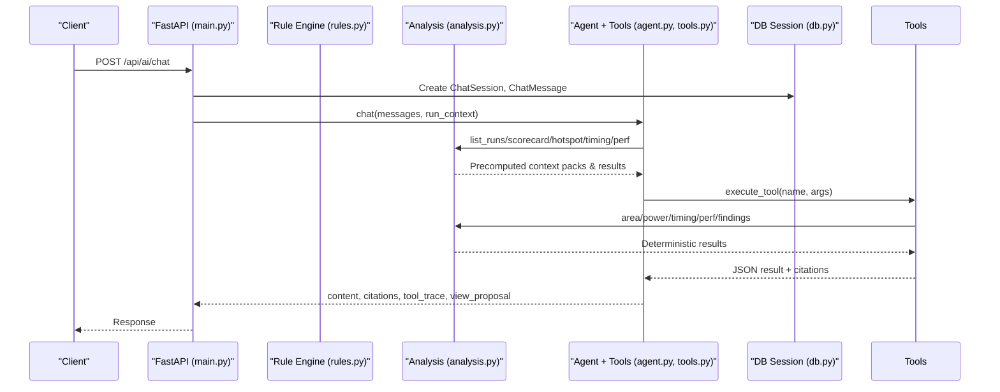
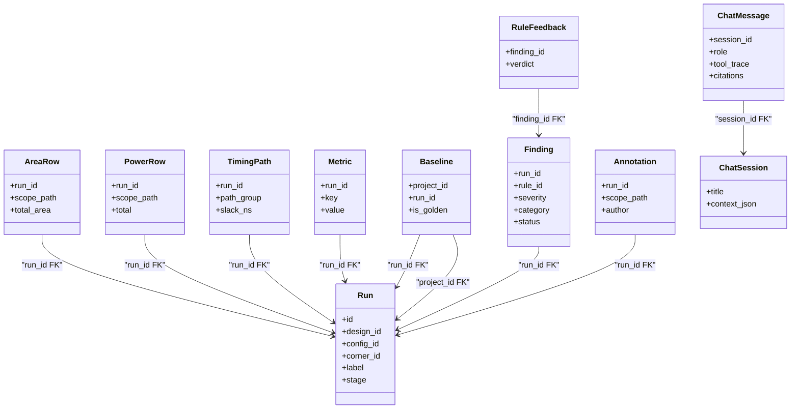

# Analysis Data Models

<cite>
**Referenced Files in This Document**
- [models.py](file://backend/ppa/models.py)
- [analysis.py](file://backend/ppa/analysis.py)
- [db.py](file://backend/ppa/db.py)
- [rules.py](file://backend/ppa/rules.py)
- [context_pack.py](file://backend/ppa/ai/context_pack.py)
- [tools.py](file://backend/ppa/ai/tools.py)
- [agent.py](file://backend/ppa/ai/agent.py)
- [llm.py](file://backend/ppa/ai/llm.py)
- [main.py](file://backend/ppa/main.py)
</cite>

## Table of Contents
1. [Introduction](#introduction)
2. [Project Structure](#project-structure)
3. [Core Components](#core-components)
4. [Architecture Overview](#architecture-overview)
5. [Detailed Component Analysis](#detailed-component-analysis)
6. [Dependency Analysis](#dependency-analysis)
7. [Performance Considerations](#performance-considerations)
8. [Troubleshooting Guide](#troubleshooting-guide)
9. [Conclusion](#conclusion)

## Introduction
This document explains PPA-Profiler’s analysis-related data models and how they power the end-to-end analysis workflow: from baseline comparison to AI-powered insights. It focuses on ScopeAlias, Baseline, Finding, Annotation, ChatSession, ChatMessage, and RuleFeedback, and shows how they integrate with the deterministic rule engine, the analysis query layer, and the AI tooling stack. You will learn how findings are generated, tracked, and reviewed; how chat sessions preserve context and tool traceability; and how annotations support collaborative review.

## Project Structure
PPA-Profiler organizes its backend around a small set of layers:
- Data models (SQLModel tables) define identity, metrics, and analysis artifacts.
- The analysis layer provides deterministic queries for views and AI tools.
- The rule engine evaluates YAML-defined rules against run facts to produce findings.
- The AI layer composes precomputed “context packs” and typed tools to answer questions safely.
- The FastAPI application exposes endpoints that persist chat sessions and manage findings.

```mermaid
graph TB
subgraph "Data Layer"
M["models.py"]
DB["db.py"]
end
subgraph "Analysis Layer"
A["analysis.py"]
R["rules.py"]
end
subgraph "AI Layer"
Ctx["ai/context_pack.py"]
Tools["ai/tools.py"]
Agent["ai/agent.py"]
LLM["ai/llm.py"]
end
subgraph "API"
API["main.py"]
end
API --> A
API --> R
API --> Agent
Agent --> Tools
Tools --> A
Ctx --> A
R --> M
A --> M
API --> M
DB --> M
```

**Diagram sources**
- [models.py:17-216](file://backend/ppa/models.py#L17-L216)
- [analysis.py:1-439](file://backend/ppa/analysis.py#L1-L439)
- [rules.py:1-361](file://backend/ppa/rules.py#L1-L361)
- [context_pack.py:1-82](file://backend/ppa/ai/context_pack.py#L1-L82)
- [tools.py:1-265](file://backend/ppa/ai/tools.py#L1-L265)
- [agent.py:1-231](file://backend/ppa/ai/agent.py#L1-L231)
- [llm.py:1-60](file://backend/ppa/ai/llm.py#L1-L60)
- [main.py:1-206](file://backend/ppa/main.py#L1-L206)

**Section sources**
- [models.py:17-216](file://backend/ppa/models.py#L17-L216)
- [analysis.py:1-439](file://backend/ppa/analysis.py#L1-L439)
- [rules.py:1-361](file://backend/ppa/rules.py#L1-L361)
- [context_pack.py:1-82](file://backend/ppa/ai/context_pack.py#L1-L82)
- [tools.py:1-265](file://backend/ppa/ai/tools.py#L1-L265)
- [agent.py:1-231](file://backend/ppa/ai/agent.py#L1-L231)
- [llm.py:1-60](file://backend/ppa/ai/llm.py#L1-L60)
- [main.py:1-206](file://backend/ppa/main.py#L1-L206)

## Core Components
The following models underpin the analysis workflow:

- ScopeAlias: Maps tool-specific module paths to canonical paths per run, enabling consistent cross-tool comparisons.
- Baseline: Associates a project’s reference run with a current run to enable delta analysis.
- Finding: Captures rule-detected issues with severity, category, scope, evidence, status, and optional AI-generated explanation/proposal.
- Annotation: Adds human notes tied to a run and optionally a scope path for collaborative review.
- ChatSession: Stores a conversation’s title and persistent UI context snapshot.
- ChatMessage: Persists each user/assistant message along with tool traces and citations for verifiability.
- RuleFeedback: Records user feedback on individual findings to improve future rule tuning or triage.

These models are persisted via SQLModel and accessed through SQLAlchemy sessions configured in the database layer.

**Section sources**
- [models.py:153-216](file://backend/ppa/models.py#L153-L216)
- [db.py:13-50](file://backend/ppa/db.py#L13-L50)

## Architecture Overview
The analysis workflow connects deterministic data access, rule evaluation, and AI assistance while preserving provenance.



**Diagram sources**
- [main.py:177-194](file://backend/ppa/main.py#L177-L194)
- [agent.py:51-115](file://backend/ppa/ai/agent.py#L51-L115)
- [tools.py:171-265](file://backend/ppa/ai/tools.py#L171-L265)
- [analysis.py:24-423](file://backend/ppa/analysis.py#L24-L423)
- [db.py:43-50](file://backend/ppa/db.py#L43-L50)

## Detailed Component Analysis

### ScopeAlias
Purpose: Normalize module paths across different tools so that area/power/timing breakdowns can be compared consistently within a run.

Key aspects:
- Scoped per run to avoid cross-run alias conflicts.
- Indexed by tool_path and canonical_path for fast lookups during analysis and visualization.

Typical usage:
- During ingestion, map tool-reported module names to canonical names.
- During analysis, resolve scope_path values to canonical identifiers for aggregation.

**Section sources**
- [models.py:153-158](file://backend/ppa/models.py#L153-L158)

### Baseline
Purpose: Define the reference run for a project to compute deltas in figures of merit, area, power, and performance.

Key aspects:
- Links a project to a specific run used as the baseline.
- Used by analysis functions to compute deltas and waterfalls.

Typical usage:
- Set one run per project as golden or reference.
- Use baseline_run helper to fetch the baseline run for any given run.

**Section sources**
- [models.py:160-166](file://backend/ppa/models.py#L160-L166)
- [analysis.py:34-41](file://backend/ppa/analysis.py#L34-L41)

### Finding
Purpose: Record rule-detected abnormalities with rich metadata for triage and resolution.

Attributes:
- Severity levels: critical, high, medium, low, info.
- Categories: timing, area, power, performance, cross_domain, data_quality.
- Status tracking: open, acknowledged, fixed, wont_fix.
- Evidence stored as structured JSON for drill-down.
- Optional AI explanation and proposal fields for narrative guidance.

Lifecycle:
- Creation: Determined by the rule engine based on thresholds and conditions.
- Querying: Filterable by run, severity, category, and status.
- Updating: PATCH endpoint allows status changes and attaching AI explanations/proposals.
- Feedback: Users can upvote/downvote findings via RuleFeedback.

Example queries:
- List all open findings for a run.
- List critical timing findings.
- List data quality findings with warnings.

**Section sources**
- [models.py:168-181](file://backend/ppa/models.py#L168-L181)
- [analysis.py:403-423](file://backend/ppa/analysis.py#L403-L423)
- [main.py:114-131](file://backend/ppa/main.py#L114-L131)
- [rules.py:313-352](file://backend/ppa/rules.py#L313-L352)

### Annotation
Purpose: Allow reviewers to add contextual notes to a run or specific scope path.

Key aspects:
- Tied to a run and optionally scoped to a module path.
- Author and timestamp recorded for auditability.

Typical usage:
- Add notes when investigating a finding or confirming a known issue.
- Share observations across team members reviewing the same run.

**Section sources**
- [models.py:183-190](file://backend/ppa/models.py#L183-L190)

### ChatSession and ChatMessage
Purpose: Persist AI conversations with full context and tool traceability for reproducibility and auditing.

ChatSession:
- Title derived from last user message.
- Context snapshot stores UI state (e.g., current run_id) to keep answers grounded.

ChatMessage:
- Role indicates user vs assistant.
- Tool trace records which tools were called and their argument sizes.
- Citations link back to runs and sources for verifiable claims.
- Offline flag indicates whether the response came from deterministic offline mode.

Persistence pattern:
- Each chat request creates a session and persists both user and assistant messages.
- Citations and tool traces travel with assistant messages for transparency.

**Section sources**
- [models.py:192-207](file://backend/ppa/models.py#L192-L207)
- [main.py:177-194](file://backend/ppa/main.py#L177-L194)
- [agent.py:51-115](file://backend/ppa/ai/agent.py#L51-L115)
- [tools.py:171-180](file://backend/ppa/ai/tools.py#L171-L180)

### RuleFeedback
Purpose: Capture user verdicts on findings to inform future rule tuning and triage workflows.

Key aspects:
- Verdict is up or down.
- Comment and author recorded for context.
- Linked to a specific finding.

Typical usage:
- After reviewing a finding, mark it as relevant (up) or not (down).
- Provide comments explaining why a finding is or isn’t actionable.

**Section sources**
- [models.py:210-216](file://backend/ppa/models.py#L210-L216)
- [main.py:140-149](file://backend/ppa/main.py#L140-L149)

### Finding System: Severity, Categories, and Status
Severity levels:
- critical, high, medium, low, info — used to prioritize attention.

Categories:
- timing, area, power, performance, cross_domain, data_quality — group findings by domain.

Status tracking:
- open: newly created or untriaged.
- acknowledged: recognized but not yet resolved.
- fixed: resolved.
- wont_fix: intentionally not addressed.

Querying and filtering:
- Endpoints accept filters for run_id, severity, category, and status.
- Results are sorted by severity then category for consistent presentation.

**Section sources**
- [models.py:168-181](file://backend/ppa/models.py#L168-L181)
- [analysis.py:403-423](file://backend/ppa/analysis.py#L403-L423)
- [main.py:101-105](file://backend/ppa/main.py#L101-L105)

### Chat Session Management and AI Interactions
Context preservation:
- ChatSession.context_json stores the UI context at the time of the conversation, ensuring answers remain grounded in the user’s current view.

Tool traceability:
- ChatMessage.tool_trace records each tool call name, arguments, and result size.
- Citations record run IDs and source types, enabling users to verify where numbers came from.

Offline fallback:
- When the local LLM is unavailable, the agent uses deterministic logic to assemble answers from context packs and analysis functions, marking responses as offline.

Conversation persistence:
- Every chat request persists a session and two messages (user and assistant), including tool traces and citations.

**Section sources**
- [models.py:192-207](file://backend/ppa/models.py#L192-L207)
- [main.py:177-194](file://backend/ppa/main.py#L177-L194)
- [agent.py:51-115](file://backend/ppa/ai/agent.py#L51-L115)
- [agent.py:120-231](file://backend/ppa/ai/agent.py#L120-L231)
- [tools.py:171-265](file://backend/ppa/ai/tools.py#L171-L265)

### Annotation Capabilities for Collaborative Review
Annotations attach free-form text to a run or a specific scope path, enabling:
- Shared notes about known issues or workarounds.
- Contextual reminders for reviewers examining the same run.
- Audit trails with author and timestamps.

While there is no dedicated CRUD endpoint shown here, the model supports storing and retrieving annotations per run and scope path for integration into review workflows.

**Section sources**
- [models.py:183-190](file://backend/ppa/models.py#L183-L190)

### Examples of Analysis Queries
Baseline comparison:
- Retrieve scorecard for a run and compare FOMs against baseline using delta computations.

Area and power breakdowns:
- Get hierarchical breakdowns at a chosen depth to identify top contributors.

Timing exploration:
- List worst setup timing paths grouped by path group with slack histograms and module leaderboards.

Performance explorer:
- Compare per-benchmark IPC and ratios against baseline to isolate regressions.

Findings:
- List findings filtered by severity, category, and status for targeted triage.

**Section sources**
- [analysis.py:69-125](file://backend/ppa/analysis.py#L69-L125)
- [analysis.py:179-274](file://backend/ppa/analysis.py#L179-L274)
- [analysis.py:279-326](file://backend/ppa/analysis.py#L279-L326)
- [analysis.py:331-356](file://backend/ppa/analysis.py#L331-L356)
- [analysis.py:403-423](file://backend/ppa/analysis.py#L403-L423)

### Finding Lifecycle Management
Creation:
- The rule engine evaluates YAML-defined rules against run facts and inserts new findings.

Triage:
- Users filter findings by severity/category/status and update status via PATCH.

Resolution:
- Mark as fixed or wont_fix after action or decision.

Feedback:
- Submit RuleFeedback to indicate relevance and provide comments.

**Section sources**
- [rules.py:313-352](file://backend/ppa/rules.py#L313-L352)
- [main.py:114-131](file://backend/ppa/main.py#L114-L131)
- [main.py:140-149](file://backend/ppa/main.py#L140-L149)

### AI Conversation Persistence Patterns
Pattern:
- On each chat request, create a ChatSession with a short title and context snapshot.
- Persist the user message and the assistant response, including tool_trace and citations.
- Use offline flag to distinguish deterministic responses when the LLM is unavailable.

Benefits:
- Full audit trail of decisions and data sources.
- Ability to replay or analyze past conversations.
- Clear separation between live LLM-assisted and offline deterministic answers.

**Section sources**
- [main.py:177-194](file://backend/ppa/main.py#L177-L194)
- [agent.py:51-115](file://backend/ppa/ai/agent.py#L51-L115)
- [agent.py:120-231](file://backend/ppa/ai/agent.py#L120-L231)

## Dependency Analysis
The analysis data models interact across layers:



**Diagram sources**
- [models.py:55-216](file://backend/ppa/models.py#L55-L216)

**Section sources**
- [models.py:55-216](file://backend/ppa/models.py#L55-L216)

## Performance Considerations
- SQLite with WAL mode improves concurrency and durability for moderate datasets (tens of runs).
- Analysis functions return compact, deterministic structures suitable for AI consumption.
- Tool outputs are clipped to bounded sizes to prevent oversized payloads.
- Indexes on frequently queried columns (run_id, severity, category, scope_path) speed up filtering and joins.

[No sources needed since this section provides general guidance]

## Troubleshooting Guide
Common issues and resolutions:
- No runs ingested: Ensure reports have been parsed and metrics populated before querying findings or running comparisons.
- LLM unavailable: The system falls back to offline deterministic answers; check configuration and endpoint availability if you need conversational features.
- Invalid finding status: Only open, acknowledged, fixed, wont_fix are accepted; ensure PATCH requests use valid values.
- Missing baseline: If no baseline is set for the project, delta computations will be empty; configure a baseline run to enable comparisons.

**Section sources**
- [db.py:13-30](file://backend/ppa/db.py#L13-L30)
- [main.py:114-131](file://backend/ppa/main.py#L114-L131)
- [agent.py:51-115](file://backend/ppa/ai/agent.py#L51-L115)

## Conclusion
PPA-Profiler’s analysis data models provide a robust foundation for deterministic analysis, collaborative review, and AI-assisted insights. Findings capture actionable issues with clear severity and categories, while chat sessions and messages preserve context and tool traces for verifiable conversations. Annotations enable team collaboration, and baselines enable meaningful delta analysis. Together, these components form a cohesive workflow from ingestion to insight.