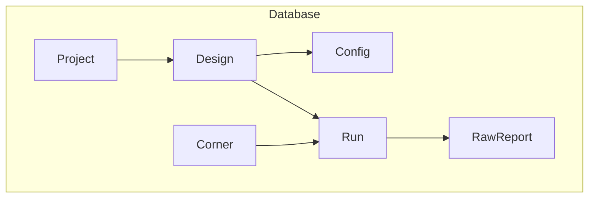
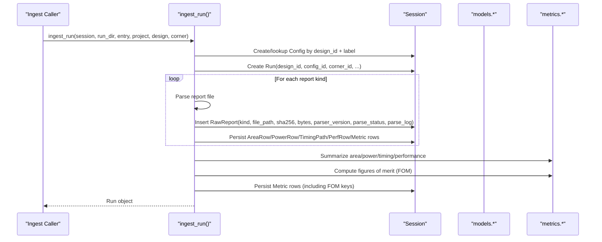
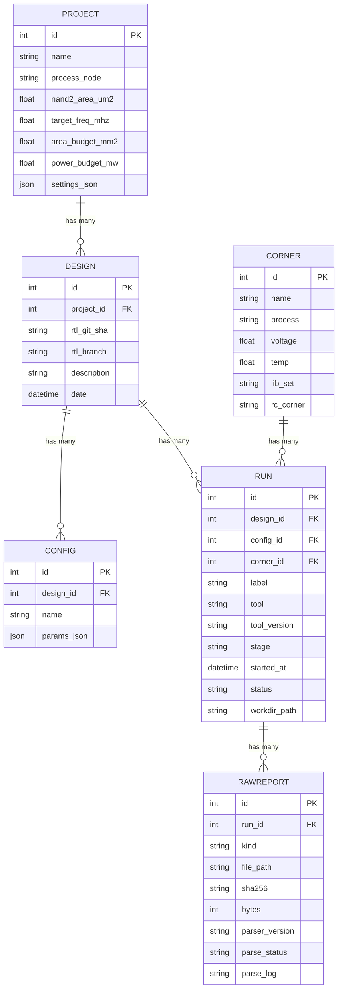
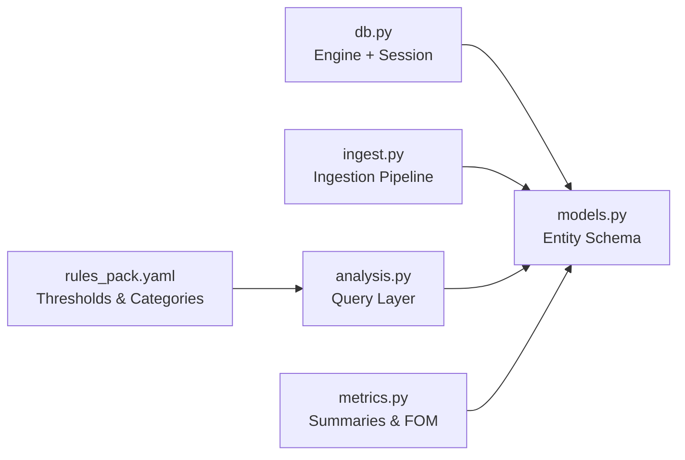

# Core Entities & Relationships

<cite>
**Referenced Files in This Document**
- [models.py](file://backend/ppa/models.py)
- [db.py](file://backend/ppa/db.py)
- [config.py](file://backend/ppa/config.py)
- [ingest.py](file://backend/ppa/ingest.py)
- [analysis.py](file://backend/ppa/analysis.py)
- [metrics.py](file://backend/ppa/metrics.py)
- [rules_pack.yaml](file://backend/ppa/rules_pack.yaml)
</cite>

## Table of Contents
1. [Introduction](#introduction)
2. [Project Structure](#project-structure)
3. [Core Components](#core-components)
4. [Architecture Overview](#architecture-overview)
5. [Detailed Component Analysis](#detailed-component-analysis)
6. [Dependency Analysis](#dependency-analysis)
7. [Performance Considerations](#performance-considerations)
8. [Troubleshooting Guide](#troubleshooting-guide)
9. [Conclusion](#conclusion)
10. [Appendices](#appendices)

## Introduction
This document explains PPA-Profiler’s core entity models and their relationships: Project, Design, Config, Corner, Run, and RawReport. It describes how runs represent individual analysis executions with design configuration and corner parameters, and how raw EDA tool outputs are captured as RawReport records. It also covers field definitions, data types, constraints, foreign key relationships, validation rules, default values, and business logic constraints. Entity relationship diagrams illustrate the complete hierarchy from project to raw reports, and examples of typical data structures and common query patterns are provided for navigating the entity graph.

## Project Structure
The core entities are defined using SQLModel (SQLAlchemy-based ORM). The database engine is configured with SQLite, WAL mode, and foreign keys enabled. Configuration provides defaults for storage paths and environment overrides. Ingestion parses EDA reports, persists raw artifacts, derives metrics, and enforces data quality checks.

**Diagram sources**
- [models.py:17-79](file://backend/ppa/models.py#L17-L79)
- [db.py:13-30](file://backend/ppa/db.py#L13-L30)

**Section sources**
- [models.py:17-79](file://backend/ppa/models.py#L17-L79)
- [db.py:13-30](file://backend/ppa/db.py#L13-L30)
- [config.py:12-30](file://backend/ppa/config.py#L12-L30)

## Core Components
This section details each core entity, its fields, types, defaults, constraints, and relationships.

- Project
  - Purpose: Top-level container for designs and budgets.
  - Key fields: id (PK), name (indexed), process_node (default N7), nand2_area_um2 (default 0.0594), target_freq_mhz (default 1000.0), area_budget_mm2 (nullable), power_budget_mw (nullable), settings_json (JSON dict).
  - Constraints: None beyond DB defaults; budget fields are optional.
  - Usage: Provides budgets and technology constants used by derived metrics and rule evaluation.

- Design
  - Purpose: Represents a specific RTL version under a project.
  - Key fields: id (PK), project_id (FK to Project.id, indexed), rtl_git_sha (default unknown), rtl_branch (default main), description (default empty), date (UTC timestamp).
  - Constraints: project_id must reference an existing Project.

- Config
  - Purpose: Named configuration tied to a Design, storing parameter sets.
  - Key fields: id (PK), design_id (FK to Design.id, indexed), name (indexed), params_json (JSON dict).
  - Constraints: design_id must reference an existing Design.

- Corner
  - Purpose: Process/voltage/temperature corner describing silicon conditions.
  - Key fields: id (PK), name (indexed), process (default tt), voltage (default 0.80), temp (default 25.0), lib_set (default n7_tt_0p80v_25c), rc_corner (default typical).
  - Constraints: None beyond DB defaults.

- Run
  - Purpose: Individual analysis execution combining a Design, Config, and Corner.
  - Key fields: id (PK), design_id (FK to Design.id, indexed), config_id (FK to Config.id, indexed), corner_id (FK to Corner.id, indexed), label (default empty), tool (default empty), tool_version (default empty), stage (default rtla_predict), started_at (UTC timestamp), status (default complete), workdir_path (default empty).
  - Constraints: design_id, config_id, corner_id must exist. Stage and status are free-form strings but commonly follow documented values.

- RawReport
  - Purpose: Records of parsed EDA tool output files per Run.
  - Key fields: id (PK), run_id (FK to Run.id, indexed), kind (indexed; e.g., rtla_area, rtla_timing, rtla_qor, primepower, specint), file_path (default empty), sha256 (default empty), bytes (default 0), parser_version (default empty), parse_status (default ok; allowed: ok, warnings, error), parse_log (default empty).
  - Constraints: run_id must exist; kind identifies the report type.

**Section sources**
- [models.py:17-79](file://backend/ppa/models.py#L17-L79)

## Architecture Overview
The ingestion pipeline creates or reuses Project, Design, and Corner, then creates a Config per run label and a Run linking them. For each expected report file, it parses content, stores a RawReport record, and persists derived hierarchical metrics and summaries. Rule evaluation later produces findings based on these metrics.

**Diagram sources**
- [ingest.py:61-240](file://backend/ppa/ingest.py#L61-L240)
- [metrics.py:90-137](file://backend/ppa/metrics.py#L90-L137)
- [models.py:55-79](file://backend/ppa/models.py#L55-L79)

## Detailed Component Analysis

### Entity Relationship Diagram (Project → RawReport)

**Diagram sources**
- [models.py:17-79](file://backend/ppa/models.py#L17-L79)

### Field Definitions, Types, Defaults, and Constraints
- Project
  - Fields: id (int PK), name (str), process_node (str, default N7), nand2_area_um2 (float, default 0.0594), target_freq_mhz (float, default 1000.0), area_budget_mm2 (float nullable), power_budget_mw (float nullable), settings_json (dict JSON).
  - Constraints: None beyond DB defaults; budget fields optional.

- Design
  - Fields: id (int PK), project_id (int FK to Project.id), rtl_git_sha (str, default unknown), rtl_branch (str, default main), description (str, default ""), date (datetime UTC).
  - Constraints: project_id references Project.

- Config
  - Fields: id (int PK), design_id (int FK to Design.id), name (str), params_json (dict JSON).
  - Constraints: design_id references Design.

- Corner
  - Fields: id (int PK), name (str), process (str, default tt), voltage (float, default 0.80), temp (float, default 25.0), lib_set (str, default n7_tt_0p80v_25c), rc_corner (str, default typical).
  - Constraints: None beyond DB defaults.

- Run
  - Fields: id (int PK), design_id (int FK to Design.id), config_id (int FK to Config.id), corner_id (int FK to Corner.id), label (str, default ""), tool (str, default ""), tool_version (str, default ""), stage (str, default rtla_predict), started_at (datetime UTC), status (str, default complete), workdir_path (str, default "").
  - Constraints: design_id, config_id, corner_id must exist.

- RawReport
  - Fields: id (int PK), run_id (int FK to Run.id), kind (str), file_path (str, default ""), sha256 (str, default ""), bytes (int, default 0), parser_version (str, default ""), parse_status (str, default ok; allowed: ok, warnings, error), parse_log (str, default "").
  - Constraints: run_id references Run; kind enumerates supported report types.

**Section sources**
- [models.py:17-79](file://backend/ppa/models.py#L17-L79)

### Validation Rules, Default Values, and Business Logic Constraints
- Database-level constraints
  - Foreign keys enforced via PRAGMA foreign_keys=ON at connection time.
  - Indices on frequently queried fields (e.g., names, ids, kinds).

- Ingestion-time validation
  - Missing report files result in RawRecord with parse_status="error" and log indicating missing file.
  - Parser exceptions produce RawReport entries with parse_status="error" and exception message logged.
  - Successful parsing sets parse_status="ok" or "warnings" depending on rep.warnings.

- Data quality rules (rule pack)
  - TIM_WNS_NEG: triggers when setup WNS is below threshold (negative timing violation).
  - AREA_OVER_BUDGET: triggers when total area exceeds project.area_budget_mm2.
  - PWR_OVER_BUDGET: triggers when total power exceeds project.power_budget_mw.
  - DQ_MISSING_REPORT: triggers when a required report kind is absent for a run.
  - DQ_PARSE_WARNINGS: triggers when a report parsed with warnings.
  - Additional domain-specific thresholds are defined in the rule pack.

- Derived metrics and FOM
  - Figures of merit include specint_score, fmax_mhz, area_mm2, total_power_mw, mean_ipc, and efficiency ratios. Frequency source is recorded as fixed or timing-derived.
  - Power and area summaries use top-level scope to avoid double-counting hierarchical totals.

**Section sources**
- [db.py:22-28](file://backend/ppa/db.py#L22-L28)
- [ingest.py:93-113](file://backend/ppa/ingest.py#L93-L113)
- [rules_pack.yaml:6-119](file://backend/ppa/rules_pack.yaml#L6-L119)
- [metrics.py:90-137](file://backend/ppa/metrics.py#L90-L137)

### Runs Represent Individual Analysis Executions
A Run ties together:
- Design: the RTL version being analyzed.
- Config: named parameter set for that design.
- Corner: process/voltage/temperature conditions.
- Tool metadata: tool bundle and version used to generate reports.
- Stage: indicates analysis phase (e.g., rtla_predict, synth, place, cts, route).
- Status and timestamps: capture lifecycle state.

During ingestion, a Run is created once per directory entry, then multiple RawReport records are added for each report kind present. Derived metrics and hierarchical area/power/timing/performance rows are persisted alongside.

**Section sources**
- [models.py:55-79](file://backend/ppa/models.py#L55-L79)
- [ingest.py:61-240](file://backend/ppa/ingest.py#L61-L240)

### Typical Data Structures and Query Patterns
- List runs for a project
  - Retrieve all Designs for a given project_id, then filter Runs by those design_ids.
  - Attach Config and Corner info and open findings count per run.

- Scorecard for a run
  - Fetch run, metrics, project budgets, baseline run metrics, and top findings.
  - Compute deltas vs baseline and summarize domains (timing, area, power, performance).

- Compare runs
  - Gather FOMs and configs for selected runs, compute deltas and Pareto front membership.

- Area/Power explorers
  - Load hierarchical rows for a run, compute shares and deltas vs baseline, sort by module path.

- Timing explorer
  - Aggregate timing groups, build slack histogram, identify critical modules.

- Performance explorer
  - Load PerfRow entries, compare IPC and ratios vs baseline, compute geomean delta.

- Findings
  - Filter by run_id, severity, category, status; attach run labels.

These patterns are implemented in the analysis layer and rely on the entity graph described above.

**Section sources**
- [analysis.py:46-167](file://backend/ppa/analysis.py#L46-L167)
- [analysis.py:224-356](file://backend/ppa/analysis.py#L224-L356)
- [analysis.py:403-423](file://backend/ppa/analysis.py#L403-L423)

## Dependency Analysis
The core dependency chain for entity persistence and querying:
- db.py initializes the SQLAlchemy engine with SQLite, enabling WAL and foreign keys.
- models.py defines all tables and relationships.
- ingest.py orchestrates creation of Project/Design/Corner/Config/Run and insertion of RawReport and derived metric rows.
- analysis.py reads from the entity graph to provide views and comparisons.
- metrics.py computes summaries and figures of merit used across views.
- rules_pack.yaml defines thresholds and categories for automated findings.

**Diagram sources**
- [db.py:13-30](file://backend/ppa/db.py#L13-L30)
- [models.py:17-79](file://backend/ppa/models.py#L17-L79)
- [ingest.py:61-240](file://backend/ppa/ingest.py#L61-L240)
- [analysis.py:46-167](file://backend/ppa/analysis.py#L46-L167)
- [metrics.py:90-137](file://backend/ppa/metrics.py#L90-L137)
- [rules_pack.yaml:6-119](file://backend/ppa/rules_pack.yaml#L6-L119)

**Section sources**
- [db.py:13-30](file://backend/ppa/db.py#L13-L30)
- [models.py:17-79](file://backend/ppa/models.py#L17-L79)
- [ingest.py:61-240](file://backend/ppa/ingest.py#L61-L240)
- [analysis.py:46-167](file://backend/ppa/analysis.py#L46-L167)
- [metrics.py:90-137](file://backend/ppa/metrics.py#L90-L137)
- [rules_pack.yaml:6-119](file://backend/ppa/rules_pack.yaml#L6-L119)

## Performance Considerations
- SQLite WAL mode improves concurrency and write throughput during ingestion.
- Foreign key enforcement ensures referential integrity without application-side checks.
- Indexes on frequently filtered fields (name, ids, kind) speed up queries.
- Hierarchical area/power rows are summarized at top-level depth to avoid double-counting and reduce aggregation cost.
- Figures of merit computation is centralized in Python to ensure deterministic results and avoid floating-point drift in SQL.

[No sources needed since this section provides general guidance]

## Troubleshooting Guide
Common issues and diagnostics:
- Missing report files
  - RawReport entries will have parse_status="error" and parse_log indicating missing file.
  - Check run directories and manifest entries.

- Parser errors
  - RawReport entries will capture exception messages; inspect parse_log for details.
  - Verify report format compatibility with parser versions.

- Data quality mismatches
  - Rule DQ_UNMATCHED_PATHS may be raised if power-report paths do not match area-report paths after canonicalization.
  - Ensure consistent path naming and canonicalization.

- Budget violations
  - AREA_OVER_BUDGET and PWR_OVER_BUDGET trigger when metrics exceed project budgets.
  - Adjust budgets or optimize designs accordingly.

- Timing violations
  - TIM_WNS_NEG indicates negative setup slack; investigate critical paths and clock constraints.

- Baseline comparisons
  - Use scorecard and compare functions to compute deltas and understand regressions/improvements.

**Section sources**
- [ingest.py:93-113](file://backend/ppa/ingest.py#L93-L113)
- [rules_pack.yaml:109-119](file://backend/ppa/rules_pack.yaml#L109-L119)
- [analysis.py:69-125](file://backend/ppa/analysis.py#L69-L125)

## Conclusion
PPA-Profiler’s core entities form a clear hierarchy: Project contains Designs; Designs associate with Configurations and Runs; Runs bind to Corners and produce RawReport artifacts. Ingestion persists raw reports and derived metrics, while analysis and rule engines provide insights and diagnostics. The schema supports robust querying, comparison, and exploration across area, power, timing, and performance domains.

[No sources needed since this section summarizes without analyzing specific files]

## Appendices

### Example Data Structures
- Project example
  - name: "riscv-demo", process_node: "N7", nand2_area_um2: 0.0594, target_freq_mhz: 833.0, area_budget_mm2: 0.60, power_budget_mw: 150.0, settings_json: {}

- Design example
  - project_id: <id>, rtl_git_sha: "a1b2c3d", rtl_branch: "main", description: "rv_ooc_core demo sweep", date: UTC timestamp

- Config example
  - design_id: <id>, name: "rob192", params_json: {"param_a": 1, "param_b": 2}

- Corner example
  - name: "tt_0p80v_25c", process: "tt", voltage: 0.80, temp: 25.0, lib_set: "n7_tt_0p80v_25c", rc_corner: "typical"

- Run example
  - design_id: <id>, config_id: <id>, corner_id: <id>, label: "rob192", tool: "rtla+primepower+perfsim", tool_version: "T-2022.03-SP4/P-2019.06-SP1", stage: "rtla_predict", started_at: UTC timestamp, status: "complete", workdir_path: "/path/to/run"

- RawReport example
  - run_id: <id>, kind: "rtla_area", file_path: "/path/to/rtla_area.rpt", sha256: "<hash>", bytes: 12345, parser_version: "1.0", parse_status: "ok", parse_log: ""

**Section sources**
- [ingest.py:267-311](file://backend/ppa/ingest.py#L267-L311)
- [models.py:17-79](file://backend/ppa/models.py#L17-L79)

### Common Query Patterns
- List runs for a project
  - Select Designs by project_id, then select Runs where design_id in those ids; join Config and Corner; count open findings.

- Scorecard for a run
  - Get Run, metrics, Project budgets, baseline Run metrics; compute deltas and domain summaries.

- Compare runs
  - Collect FOMs and configs for selected runs; compute deltas and Pareto front membership.

- Area/Power explorers
  - Load hierarchical rows for a run; compute shares and deltas vs baseline; sort by module path.

- Timing explorer
  - Aggregate timing groups; build slack histogram; identify critical modules.

- Performance explorer
  - Load PerfRow entries; compare IPC and ratios vs baseline; compute geomean delta.

- Findings
  - Filter by run_id, severity, category, status; attach run labels.

**Section sources**
- [analysis.py:46-167](file://backend/ppa/analysis.py#L46-L167)
- [analysis.py:224-356](file://backend/ppa/analysis.py#L224-L356)
- [analysis.py:403-423](file://backend/ppa/analysis.py#L403-L423)