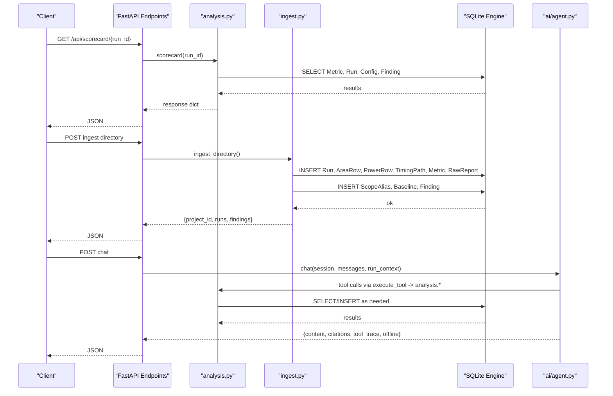
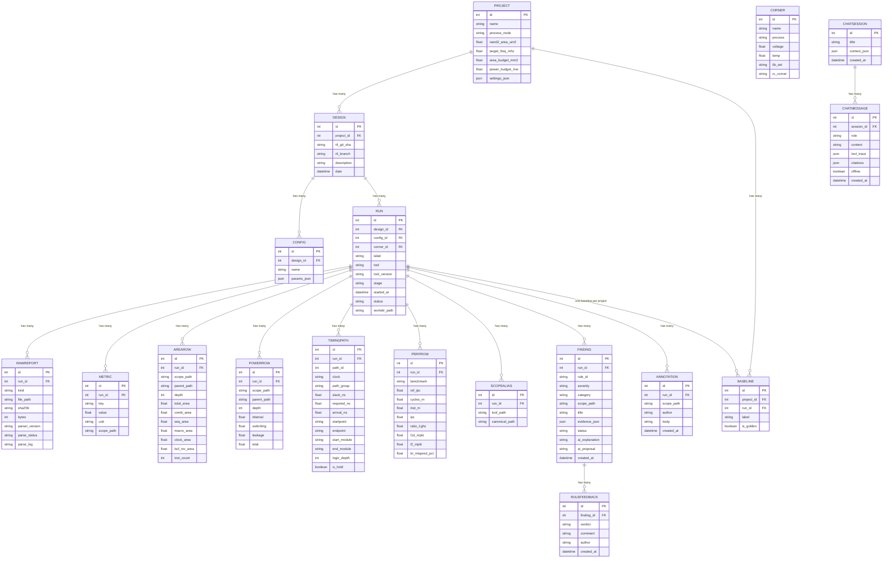
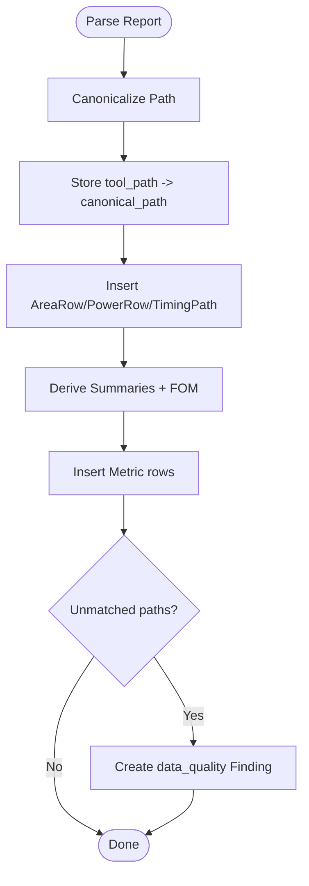
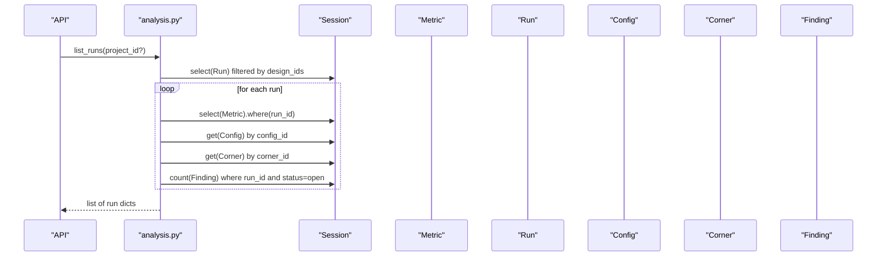
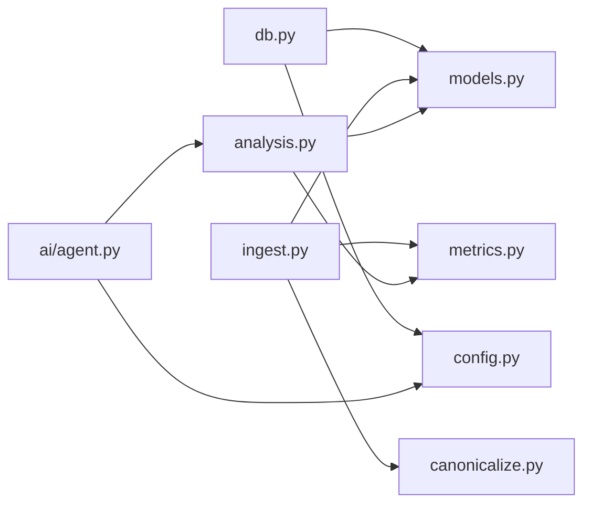

# Data Models & Schema

<cite>
**Referenced Files in This Document**
- [models.py](file://backend/ppa/models.py)
- [db.py](file://backend/ppa/db.py)
- [canonicalize.py](file://backend/ppa/canonicalize.py)
- [ingest.py](file://backend/ppa/ingest.py)
- [analysis.py](file://backend/ppa/analysis.py)
- [metrics.py](file://backend/ppa/metrics.py)
- [config.py](file://backend/ppa/config.py)
- [agent.py](file://backend/ppa/ai/agent.py)
</cite>

## Table of Contents
1. Introduction
2. Project Structure
3. Core Components
4. Architecture Overview
5. Detailed Component Analysis
6. Dependency Analysis
7. Performance Considerations
8. Troubleshooting Guide
9. Conclusion
10. Appendices

## Introduction
This document describes PPA-Profiler’s data model and database schema, focusing on the SQLModel ORM layer and how it supports EDA report ingestion, canonicalization, metrics storage, analysis, and AI-driven conversation persistence. It explains entity relationships, field definitions, keys, indexes, constraints, and the flexible “tall table” pattern used for metrics. It also documents data access patterns via SQLModel queries, caching strategies, performance considerations, lifecycle management, security, privacy, and backup/recovery practices grounded in the codebase.

## Project Structure
PPA-Profiler stores all persistent state in a single SQLite database using SQLModel. The schema is defined declaratively in models, initialized at startup, and populated by an ingestion pipeline that parses EDA reports, canonicalizes hierarchy paths, and derives domain summaries and figures of merit. Analysis functions provide read-only views over the data for UI endpoints and AI tools.

```mermaid
graph TB
subgraph "Persistence"
DB["SQLite Engine<br/>WAL + Foreign Keys"]
end
subgraph "Schema (SQLModel)"
M["Models<br/>Run, Metric, Finding,<br/>AreaRow, PowerRow,<br/>TimingPath, ChatSession,<br/>ChatMessage, ..."]
end
subgraph "Ingestion"
I["Ingest Pipeline<br/>Parsers + Canonicalize<br/>+ Derived Metrics"]
end
subgraph "Analysis"
A["Query Layer<br/>list_runs, scorecard,<br/>compare, explorers"]
end
subgraph "AI"
AI["Agent<br/>Tool calls, citations,<br/>offline fallback"]
end
I --> DB
A --> DB
AI --> A
M --> DB
```

**Diagram sources**
- [db.py:13-30](file://backend/ppa/db.py#L13-L30)
- [models.py:17-216](file://backend/ppa/models.py#L17-L216)
- [ingest.py:61-240](file://backend/ppa/ingest.py#L61-L240)
- [analysis.py:46-439](file://backend/ppa/analysis.py#L46-L439)
- [agent.py:51-115](file://backend/ppa/ai/agent.py#L51-L115)

**Section sources**
- [db.py:1-50](file://backend/ppa/db.py#L1-L50)
- [models.py:1-216](file://backend/ppa/models.py#L1-L216)

## Core Components
The core entities are organized into identity/provenance, metrics/tall tables, domain rows, analysis artifacts, and AI conversation records.

- Identity and provenance
  - Project, Design, Config, Corner, Run, RawReport
- Metrics and tall table
  - Metric (key/value tall table), AreaRow, PowerRow, PerfRow, TimingPath
- Analysis artifacts
  - ScopeAlias, Baseline, Finding, Annotation, RuleFeedback
- AI conversations
  - ChatSession, ChatMessage

Key design principles:
- All numeric metrics are persisted as key/value pairs in Metric to support arbitrary parser outputs without schema churn.
- Domain-specific tall tables (AreaRow, PowerRow) store hierarchical breakdowns with scope_path, parent_path, depth for efficient rollups.
- Hierarchy paths are canonicalized to ensure cross-tool consistency; original tool paths are preserved in ScopeAlias.
- Findings capture rule-engine violations and data-quality issues with evidence JSON.
- Conversations persist user/assistant messages with tool traces and citations for reproducibility.

**Section sources**
- [models.py:17-216](file://backend/ppa/models.py#L17-L216)
- [canonicalize.py:19-79](file://backend/ppa/canonicalize.py#L19-L79)
- [ingest.py:116-240](file://backend/ppa/ingest.py#L116-L240)

## Architecture Overview
The system follows a clear separation between ingestion, analysis, and AI layers, all backed by a single SQLite engine configured with WAL and foreign keys enabled.



**Diagram sources**
- [db.py:13-30](file://backend/ppa/db.py#L13-L30)
- [ingest.py:267-312](file://backend/ppa/ingest.py#L267-L312)
- [analysis.py:69-167](file://backend/ppa/analysis.py#L69-L167)
- [agent.py:51-115](file://backend/ppa/ai/agent.py#L51-L115)

## Detailed Component Analysis

### Entity Relationship Model
The following diagram maps the primary entities and their relationships as defined in the SQLModel layer.



**Diagram sources**
- [models.py:17-216](file://backend/ppa/models.py#L17-L216)

**Section sources**
- [models.py:17-216](file://backend/ppa/models.py#L17-L216)

### Field Definitions, Types, Keys, Indexes, Constraints
- Primary keys: Every model defines an integer auto-incrementing id as primary key.
- Foreign keys:
  - Design.project_id references Project.id
  - Config.design_id references Design.id
  - Run.design_id, Run.config_id, Run.corner_id reference Design, Config, Corner respectively
  - RawReport.run_id references Run.id
  - Metric, AreaRow, PowerRow, TimingPath, PerfRow, ScopeAlias, Finding, Annotation run_id references Run.id
  - Baseline.project_id references Project.id; Baseline.run_id references Run.id
  - ChatMessage.session_id references ChatSession.id
  - RuleFeedback.finding_id references Finding.id
- Indexes:
  - Explicitly indexed fields include: Project.name, Design.project_id, Config.design_id, Config.name, Corner.name, Run.design_id, Run.config_id, Run.corner_id, RawReport.kind, Metric.key, Metric.scope_path, AreaRow.scope_path, PowerRow.scope_path, TimingPath.path_group, PerfRow.benchmark, ScopeAlias.tool_path, ScopeAlias.canonical_path, Finding.rule_id, Finding.category, ChatMessage.session_id.
- Constraints:
  - SQLite PRAGMA foreign_keys=ON enforced at connection time.
  - No explicit CHECK constraints beyond Python defaults; validation occurs in ingestion and analysis layers.
- JSON columns:
  - Project.settings_json, Config.params_json, Finding.evidence_json, ChatSession.context_json, ChatMessage.tool_trace, ChatMessage.citations use SQLAlchemy Column(JSON).

**Section sources**
- [models.py:17-216](file://backend/ppa/models.py#L17-L216)
- [db.py:22-28](file://backend/ppa/db.py#L22-L28)

### Tall Table Pattern for Metrics and Canonicalization
- Metric tall table:
  - Stores arbitrary key/value metrics per run with optional unit and scope_path. Keys follow a namespaced convention (e.g., timing.wns_ns, area.total_um2, power.total_mw, perf.geomean_ratio_1ghz, fom.*) enabling flexible extension without schema changes.
- Domain tall tables:
  - AreaRow and PowerRow store hierarchical breakdowns keyed by scope_path with parent_path and depth to enable efficient aggregation and comparisons across runs.
- Canonicalization:
  - Paths from different tools (RTLA, PrimePower, RTL) are normalized to a canonical form using separator unification, generate block index normalization, and dangling underscore cleanup. Original tool_path is stored alongside canonical_path in ScopeAlias to preserve provenance and detect unmatched paths.
- Data quality:
  - Unmatched power vs area paths are surfaced as findings to avoid silent data loss.



**Diagram sources**
- [canonicalize.py:19-79](file://backend/ppa/canonicalize.py#L19-L79)
- [ingest.py:116-240](file://backend/ppa/ingest.py#L116-L240)

**Section sources**
- [canonicalize.py:19-79](file://backend/ppa/canonicalize.py#L19-L79)
- [ingest.py:116-240](file://backend/ppa/ingest.py#L116-L240)
- [metrics.py:90-137](file://backend/ppa/metrics.py#L90-L137)

### Data Access Patterns via SQLModel Queries
- List runs and scorecards:
  - Reads Metric rows grouped by run_id, joins Config and Corner, counts open Findings.
- Compare runs:
  - Loads metrics for base and current runs, computes deltas and decomposition using metrics module.
- Explorers:
  - AreaExplorer and PowerExplorer load hierarchical rows, compute totals, shares, and deltas against baseline.
- Timing explorer:
  - Aggregates TimingPath rows by path_group, builds histograms and critical-module leaderboards.
- Findings:
  - Filters by run_id, severity, category, status; sorts by severity order.



**Diagram sources**
- [analysis.py:46-64](file://backend/ppa/analysis.py#L46-L64)
- [analysis.py:29-31](file://backend/ppa/analysis.py#L29-L31)

**Section sources**
- [analysis.py:46-439](file://backend/ppa/analysis.py#L46-L439)

### Caching Strategies
- In-memory caches within query functions:
  - Baseline row lookups and metric dictionaries are cached locally in compare and explorers to avoid repeated queries for the same run within a request.
- Session-scoped reads:
  - Each request uses a fresh Session; no global cache is implemented. For high-throughput scenarios, consider application-level memoization or Redis-backed caches keyed by run_id.

[No sources needed since this section provides general guidance based on observed patterns]

### Performance Considerations
- SQLite configuration:
  - WAL journal mode improves concurrency and durability; synchronous=NORMAL balances safety and speed; foreign_keys=ON ensures referential integrity.
- Index usage:
  - Frequent filters on run_id, key, scope_path, path_group, benchmark leverage indexes to reduce scan costs.
- Query batching:
  - Ingestion batches inserts for AreaRow, PowerRow, TimingPath, PerfRow, Metric, ScopeAlias before committing to minimize transaction overhead.
- Avoid double-counting:
  - Summaries read top-level rows only to prevent hierarchical double counting when aggregating area/power.

**Section sources**
- [db.py:22-28](file://backend/ppa/db.py#L22-L28)
- [ingest.py:216-228](file://backend/ppa/ingest.py#L216-L228)
- [metrics.py:192-221](file://backend/ppa/metrics.py#L192-L221)

### Data Lifecycle Management, Retention, and Migration
- Creation:
  - Database schema is created automatically via SQLModel metadata.create_all on initialization.
- Ingestion:
  - ingest_directory creates Project/Design/Corner if missing, ingests runs, sets golden baseline, and runs rule engine to populate findings.
- Retention:
  - No automatic retention policy is implemented; data persists until explicitly deleted. Implement periodic archival or deletion jobs if needed.
- Migration:
  - No migration framework is present; schema evolution requires manual updates to models and reinitialization. Add a migration strategy (e.g., Alembic) for production environments.

**Section sources**
- [db.py:43-44](file://backend/ppa/db.py#L43-L44)
- [ingest.py:267-312](file://backend/ppa/ingest.py#L267-L312)

### Security, Privacy, Backup/Recovery
- Security:
  - SQLite file-based storage; ensure filesystem permissions restrict access to ppa.db.
  - No authentication or authorization is implemented in the backend; integrate with an auth layer in production.
- Privacy:
  - Sensitive data may be stored in JSON fields (settings_json, params_json, evidence_json, tool_trace, citations). Apply masking or redaction at ingestion or query time if needed.
- Backup/Recovery:
  - Use OS-level backups of the SQLite file. With WAL enabled, perform consistent backups by copying both .db and -wal files or using SQLite backup APIs. Test restore procedures regularly.

**Section sources**
- [db.py:13-30](file://backend/ppa/db.py#L13-L30)
- [config.py:12-30](file://backend/ppa/config.py#L12-L30)

## Dependency Analysis
The following diagram shows how components depend on each other through imports and runtime interactions.



**Diagram sources**
- [db.py:1-50](file://backend/ppa/db.py#L1-L50)
- [ingest.py:1-24](file://backend/ppa/ingest.py#L1-L24)
- [analysis.py:1-13](file://backend/ppa/analysis.py#L1-L13)
- [agent.py:1-20](file://backend/ppa/ai/agent.py#L1-L20)

**Section sources**
- [db.py:1-50](file://backend/ppa/db.py#L1-L50)
- [ingest.py:1-24](file://backend/ppa/ingest.py#L1-L24)
- [analysis.py:1-13](file://backend/ppa/analysis.py#L1-L13)
- [agent.py:1-20](file://backend/ppa/ai/agent.py#L1-L20)

## Performance Considerations
- Prefer filtering by indexed fields (run_id, key, scope_path, path_group, benchmark) to leverage SQLite indexes.
- Batch writes during ingestion to reduce commit overhead.
- Cache baseline and metric lookups within request scopes to avoid redundant queries.
- Use hierarchical depth to aggregate efficiently rather than summing entire trees.

[No sources needed since this section provides general guidance]

## Troubleshooting Guide
Common issues and diagnostics:
- Missing or malformed reports:
  - RawReport.parse_status indicates errors; parse_log contains details. Re-ingest after fixing inputs or updating parsers.
- Unmatched hierarchy paths:
  - DQ_UNMATCHED_PATHS findings indicate power-report paths not found in area-report; review canonicalization rules and parser outputs.
- Timing violations:
  - Negative WNS/TNS and NVE > 0 trigger findings; inspect TimingPath rows and group summaries.
- AI offline mode:
  - When LLM endpoint is unavailable, agent returns offline answers with deterministic insights; verify settings.ai_base_url and availability.

**Section sources**
- [ingest.py:93-113](file://backend/ppa/ingest.py#L93-L113)
- [ingest.py:230-239](file://backend/ppa/ingest.py#L230-L239)
- [analysis.py:403-423](file://backend/ppa/analysis.py#L403-L423)
- [agent.py:120-231](file://backend/ppa/ai/agent.py#L120-L231)

## Conclusion
PPA-Profiler’s data model centers on a robust, extensible schema that captures EDA run provenance, hierarchical metrics, timing paths, and analysis findings while supporting flexible metrics via a tall table. Canonicalization ensures consistency across tools, and the ingestion pipeline derives domain summaries and figures of merit. The analysis layer provides focused queries for UI and AI features. For production, add migrations, retention policies, authentication, and robust backup procedures.

[No sources needed since this section summarizes without analyzing specific files]

## Appendices

### Sample Data Structures
- Metric example keys: timing.wns_ns, area.total_um2, power.total_mw, perf.geomean_ratio_1ghz, fom.specint_score
- AreaRow/PowerRow: hierarchical rows keyed by scope_path with depth and aggregates
- TimingPath: per-path slack, groups, modules, hold/setup flags
- Finding: rule_id, severity, category, evidence_json, status
- ChatSession/ChatMessage: conversation history with tool traces and citations

[No sources needed since this section provides conceptual examples]