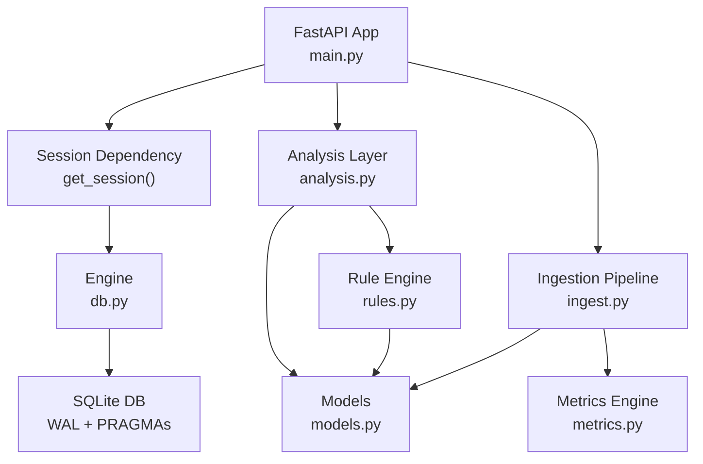
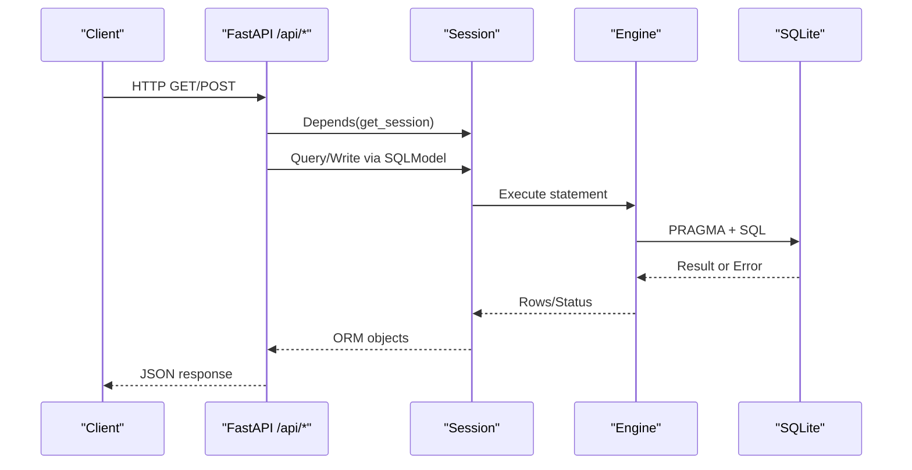
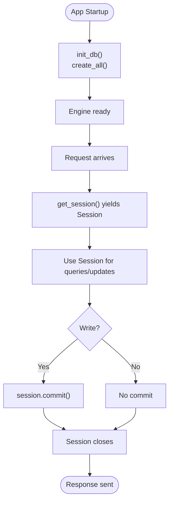
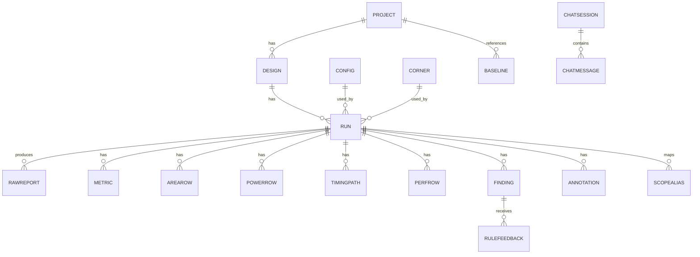
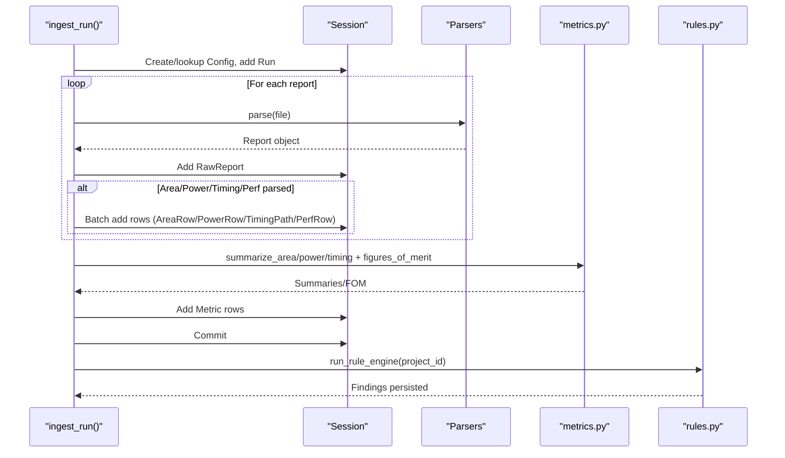
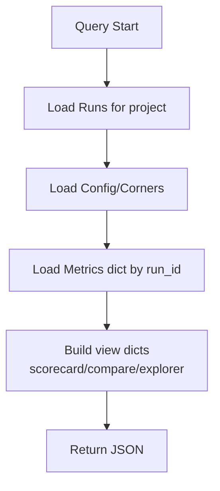
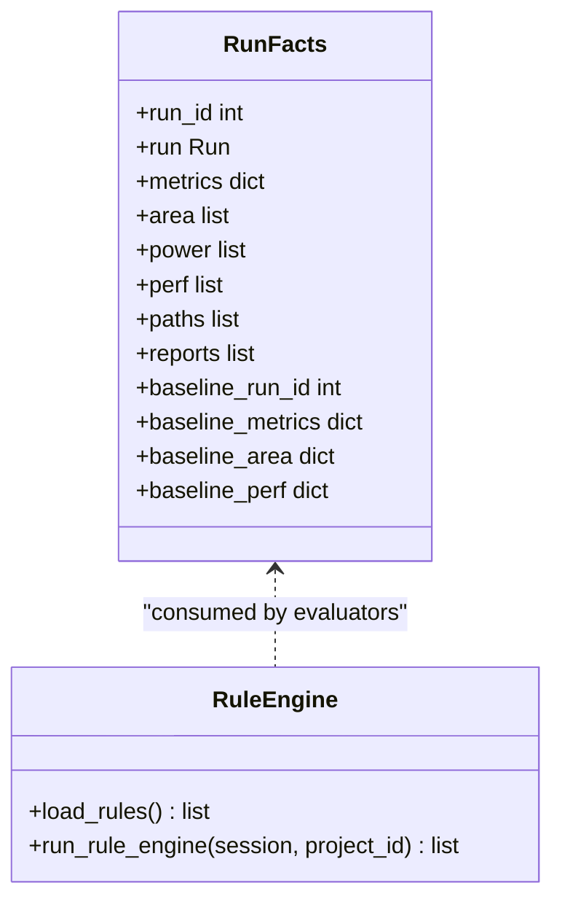
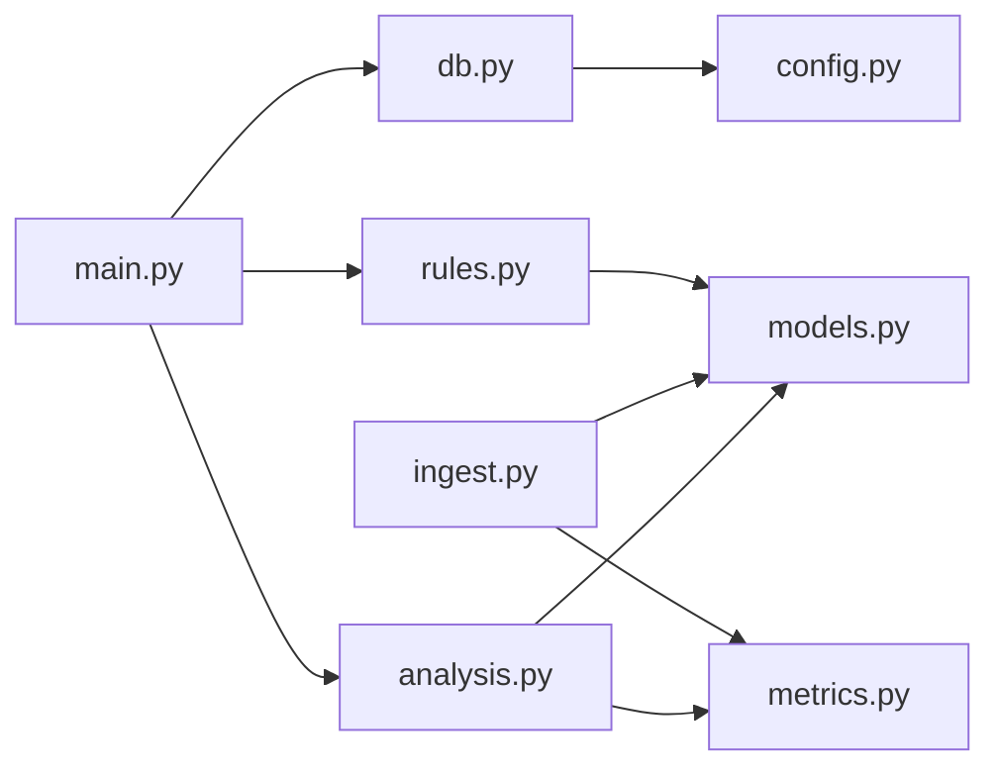

# Database Operations & Access Patterns

<cite>
**Referenced Files in This Document**
- [db.py](file://backend/ppa/db.py)
- [models.py](file://backend/ppa/models.py)
- [ingest.py](file://backend/ppa/ingest.py)
- [analysis.py](file://backend/ppa/analysis.py)
- [rules.py](file://backend/ppa/rules.py)
- [metrics.py](file://backend/ppa/metrics.py)
- [config.py](file://backend/ppa/config.py)
- [main.py](file://backend/ppa/main.py)
</cite>

## Table of Contents
1. [Introduction](#introduction)
2. [Project Structure](#project-structure)
3. [Core Components](#core-components)
4. [Architecture Overview](#architecture-overview)
5. [Detailed Component Analysis](#detailed-component-analysis)
6. [Dependency Analysis](#dependency-analysis)
7. [Performance Considerations](#performance-considerations)
8. [Troubleshooting Guide](#troubleshooting-guide)
9. [Conclusion](#conclusion)
10. [Appendices](#appendices)

## Introduction
This document explains how PPA-Profiler uses SQLModel to manage its SQLite database, focusing on connection management, transaction handling, and query patterns used by the analysis engine. It covers CRUD operations, bulk ingestion of metrics, complex joins across the entity graph, caching strategies via Python-side structures, connection pooling considerations for SQLite, performance tuning for large datasets, typical queries used by the API endpoints, batch operations for data ingestion, migration procedures, error handling patterns, retry mechanisms, and backup/recovery strategies.

## Project Structure
PPA-Profiler’s backend is organized around a small set of focused modules:
- Configuration and settings
- Engine and session lifecycle
- Data models (SQLModel tables)
- Ingestion pipeline (parsing reports into rows and derived metrics)
- Analysis layer (queries and views)
- Rule engine (data quality and findings)
- Metrics computations (pure-Python summaries and figures of merit)
- FastAPI application wiring sessions to endpoints

**Diagram sources**
- [main.py:27-33](file://backend/ppa/main.py#L27-L33)
- [db.py:13-49](file://backend/ppa/db.py#L13-L49)
- [ingest.py:61-240](file://backend/ppa/ingest.py#L61-L240)
- [analysis.py:16-439](file://backend/ppa/analysis.py#L16-L439)
- [rules.py:24-352](file://backend/ppa/rules.py#L24-L352)
- [metrics.py:13-258](file://backend/ppa/metrics.py#L13-L258)
- [models.py:17-217](file://backend/ppa/models.py#L17-L217)

**Section sources**
- [main.py:27-33](file://backend/ppa/main.py#L27-L33)
- [db.py:13-49](file://backend/ppa/db.py#L13-L49)
- [config.py:12-30](file://backend/ppa/config.py#L12-L30)

## Core Components
- Engine and Session Management:
  - Creates a single SQLAlchemy engine with SQLite WAL mode enabled and foreign keys enforced.
  - Provides a context-managed session generator for request-scoped transactions.
- Models:
  - SQLModel classes define the schema for projects, designs, configs, corners, runs, raw reports, area/power/timing/perf rows, scope aliases, baselines, findings, annotations, chat sessions/messages, and rule feedback.
- Ingestion:
  - Parses multiple report types, canonicalizes paths, persists raw reports and hierarchical rows, computes summaries, writes derived metrics, and records data-quality findings.
- Analysis:
  - Exposes view functions that read from the database to build scorecards, comparisons, explorers, hotspot analysis, and findings lists.
- Rules:
  - Loads rules from YAML, precomputes facts per run, evaluates rules, and persists findings.
- Metrics:
  - Pure-Python computations for timing/area/power summaries, figures of merit, deltas, ROI, Pareto front, and net-score decomposition.

**Section sources**
- [db.py:13-49](file://backend/ppa/db.py#L13-L49)
- [models.py:17-217](file://backend/ppa/models.py#L17-L217)
- [ingest.py:61-240](file://backend/ppa/ingest.py#L61-L240)
- [analysis.py:16-439](file://backend/ppa/analysis.py#L16-L439)
- [rules.py:24-352](file://backend/ppa/rules.py#L24-L352)
- [metrics.py:13-258](file://backend/ppa/metrics.py#L13-L258)

## Architecture Overview
The system follows a layered architecture:
- API layer (FastAPI) depends on a session dependency that yields a short-lived session per request.
- The analysis layer composes queries using SQLModel select statements and aggregates results in Python.
- The ingestion pipeline batches inserts for large tables and commits once per run.
- The rule engine reads precomputed facts and persists findings.

**Diagram sources**
- [main.py:27-33](file://backend/ppa/main.py#L27-L33)
- [db.py:13-49](file://backend/ppa/db.py#L13-L49)
- [analysis.py:46-64](file://backend/ppa/analysis.py#L46-L64)
- [ingest.py:61-240](file://backend/ppa/ingest.py#L61-L240)

## Detailed Component Analysis

### Connection Management and Transactions
- Engine creation:
  - Uses SQLite with WAL journal mode, foreign keys enabled, and synchronous NORMAL for better throughput.
  - Disables thread-safety checks to allow concurrent access within the process.
- Session lifecycle:
  - Each request gets a new Session via a generator; the session is closed automatically when the request completes.
  - No explicit rollback is used; errors propagate to the caller and the session is discarded.
- Initialization:
  - On startup, tables are created if missing using metadata.create_all.

**Diagram sources**
- [db.py:13-49](file://backend/ppa/db.py#L13-L49)
- [main.py:27-33](file://backend/ppa/main.py#L27-L33)

**Section sources**
- [db.py:13-49](file://backend/ppa/db.py#L13-L49)
- [main.py:27-33](file://backend/ppa/main.py#L27-L33)

### Entity Graph and Relationships
Key relationships:
- Project has many Designs; Design has many Runs; Run belongs to Config and Corner.
- Run has many RawReport, Metric, AreaRow, PowerRow, TimingPath, PerfRow, Finding, Annotation.
- Baseline links Project to a reference Run.
- ScopeAlias maps tool-specific paths to canonical paths per Run.
- ChatSession has many ChatMessage; RuleFeedback references Finding.

**Diagram sources**
- [models.py:17-217](file://backend/ppa/models.py#L17-L217)

**Section sources**
- [models.py:17-217](file://backend/ppa/models.py#L17-L217)

### Ingestion Pipeline: Bulk Insertion and Derived Metrics
- For each run directory, the pipeline:
  - Ensures Config exists or creates it.
  - Creates a Run record.
  - Parses each expected report file; records RawReport entries with checksums and parser versions.
  - Builds hierarchical AreaRow and PowerRow entries using canonicalized paths and depth/parent info.
  - Persists TimingPath and PerfRow entries.
  - Computes summaries and figures of merit in Python and stores them as key-value Metric rows.
  - Records data-quality findings (e.g., unmatched power vs area paths).
  - Commits once per run to minimize transaction overhead.

**Diagram sources**
- [ingest.py:61-240](file://backend/ppa/ingest.py#L61-L240)
- [metrics.py:90-137](file://backend/ppa/metrics.py#L90-L137)
- [rules.py:313-352](file://backend/ppa/rules.py#L313-L352)

**Section sources**
- [ingest.py:61-240](file://backend/ppa/ingest.py#L61-L240)
- [metrics.py:90-137](file://backend/ppa/metrics.py#L90-L137)
- [rules.py:313-352](file://backend/ppa/rules.py#L313-L352)

### Analysis Queries and Complex Joins
Common query patterns:
- List runs with metrics, config, corner, and open findings count.
- Scorecard: fetch run, project/design, baseline metrics, domain summaries, top findings.
- Compare: fetch two or more runs, compute deltas and decompositions.
- Explorers: load hierarchical area/power/timing/perf rows and compute shares/deltas against baseline.
- Hotspot: combine area, power, timing path criticality, and baseline deltas.
- Findings: filter by run, severity, category, status; sort by severity order.

These use simple selects with where clauses and in-memory joins (dict lookups) to avoid expensive multi-table joins in SQLite.

**Diagram sources**
- [analysis.py:46-64](file://backend/ppa/analysis.py#L46-L64)
- [analysis.py:69-125](file://backend/ppa/analysis.py#L69-L125)
- [analysis.py:139-167](file://backend/ppa/analysis.py#L139-L167)
- [analysis.py:224-274](file://backend/ppa/analysis.py#L224-L274)
- [analysis.py:361-398](file://backend/ppa/analysis.py#L361-L398)
- [analysis.py:403-423](file://backend/ppa/analysis.py#L403-L423)

**Section sources**
- [analysis.py:46-64](file://backend/ppa/analysis.py#L46-L64)
- [analysis.py:69-125](file://backend/ppa/analysis.py#L69-L125)
- [analysis.py:139-167](file://backend/ppa/analysis.py#L139-L167)
- [analysis.py:224-274](file://backend/ppa/analysis.py#L224-L274)
- [analysis.py:361-398](file://backend/ppa/analysis.py#L361-L398)
- [analysis.py:403-423](file://backend/ppa/analysis.py#L403-L423)

### Rule Engine: Facts Precomputation and Findings Persistence
- Per-run facts are loaded once: metrics, area/power/perf/timing rows, reports, project/config/baseline context.
- Rules are evaluated; hits are converted to Finding records and committed.
- Old findings for affected runs are deleted before re-evaluation to ensure idempotency.

**Diagram sources**
- [rules.py:24-73](file://backend/ppa/rules.py#L24-L73)
- [rules.py:313-352](file://backend/ppa/rules.py#L313-L352)

**Section sources**
- [rules.py:24-73](file://backend/ppa/rules.py#L24-L73)
- [rules.py:313-352](file://backend/ppa/rules.py#L313-L352)

### Caching Strategies
- In-memory caches:
  - Analysis functions build dictionaries keyed by scope_path or benchmark to enable O(1) lookups during comparisons and waterfall computations.
  - RunFacts caches all relevant rows for a run to avoid repeated queries.
- No external cache (Redis/Memcached) is used; this is appropriate for tens of runs and SQLite.

**Section sources**
- [analysis.py:179-199](file://backend/ppa/analysis.py#L179-L199)
- [analysis.py:224-274](file://backend/ppa/analysis.py#L224-L274)
- [rules.py:24-73](file://backend/ppa/rules.py#L24-L73)

### Connection Pooling and Concurrency
- SQLite with WAL supports concurrent readers and one writer at a time.
- The engine disables check_same_thread to allow shared connections within the process.
- There is no explicit pool size configuration; default behavior applies.
- For high concurrency, consider:
  - Limiting write endpoints to serialized calls.
  - Using a queue for ingestion tasks.
  - Monitoring WAL file growth and checkpointing if needed.

**Section sources**
- [db.py:13-49](file://backend/ppa/db.py#L13-L49)

### Performance Tuning for Large Datasets
- Indexes:
  - Many columns are indexed (e.g., run_id, scope_path, kind, path_group, benchmark), improving lookup and join performance.
- Batch inserts:
  - Ingestion builds lists of rows and adds them in bulk before committing once per run.
- Avoid heavy joins:
  - Analysis prefers loading sets into memory and joining in Python.
- WAL and pragmas:
  - WAL mode, foreign keys ON, synchronous NORMAL improve throughput and safety.

**Section sources**
- [models.py:17-217](file://backend/ppa/models.py#L17-L217)
- [ingest.py:216-228](file://backend/ppa/ingest.py#L216-L228)
- [db.py:22-28](file://backend/ppa/db.py#L22-L28)

### Typical Queries Used by the Analysis Engine
- List runs with metrics and counts:
  - Selects runs filtered by design/project, loads config/corners, and counts open findings.
- Scorecard:
  - Fetches run, project/design, baseline metrics, domain summaries, and top findings.
- Compare:
  - Loads multiple runs and their metrics, computes deltas and decompositions.
- Explorers:
  - Loads hierarchical rows (area/power/timing/perf), computes shares and deltas vs baseline.
- Findings:
  - Filters by run/severity/category/status and sorts by severity order.

**Section sources**
- [analysis.py:46-64](file://backend/ppa/analysis.py#L46-L64)
- [analysis.py:69-125](file://backend/ppa/analysis.py#L69-L125)
- [analysis.py:139-167](file://backend/ppa/analysis.py#L139-L167)
- [analysis.py:224-274](file://backend/ppa/analysis.py#L224-L274)
- [analysis.py:403-423](file://backend/ppa/analysis.py#L403-L423)

### Migration Procedures
- Schema evolution:
  - Tables are created on startup via metadata.create_all.
  - To evolve schema, modify SQLModel classes and restart the app; existing data remains intact unless explicitly altered.
- Recommended practices:
  - For destructive changes, implement explicit migration scripts outside the app and apply them before starting.
  - Back up the database before migrations.

**Section sources**
- [db.py:43-44](file://backend/ppa/db.py#L43-L44)

### Error Handling Patterns and Retry Mechanisms
- Ingestion:
  - Exceptions during parsing are caught and recorded in RawReport.parse_status and parse_log; ingestion continues for other reports.
- Rule evaluation:
  - Exceptions in rule evaluators are caught and skipped so a broken rule does not halt ingestion.
- API:
  - Missing resources raise HTTP 404; invalid inputs raise HTTP 400.
- Retries:
  - No automatic retry logic is implemented; callers should handle transient failures at the API boundary if needed.

**Section sources**
- [ingest.py:100-113](file://backend/ppa/ingest.py#L100-L113)
- [rules.py:335-338](file://backend/ppa/rules.py#L335-L338)
- [main.py:45-50](file://backend/ppa/main.py#L45-L50)
- [main.py:114-131](file://backend/ppa/main.py#L114-L131)

### Backup and Recovery Strategies
- WAL mode enables consistent backups while the database is in use.
- Recommended approach:
  - Copy the .db and -wal files together to ensure consistency.
  - Use SQLite’s backup API or tools like sqlite3 .backup for online backups.
- Recovery:
  - Restore the copied files to revert to a known good state.
  - Validate integrity with PRAGMA integrity_check after restore.

[No sources needed since this section provides general guidance]

## Dependency Analysis
High-level dependencies between modules:

**Diagram sources**
- [main.py:12-17](file://backend/ppa/main.py#L12-L17)
- [db.py:9-10](file://backend/ppa/db.py#L9-L10)
- [analysis.py:8-13](file://backend/ppa/analysis.py#L8-L13)
- [ingest.py:11-23](file://backend/ppa/ingest.py#L11-L23)
- [rules.py:11-14](file://backend/ppa/rules.py#L11-L14)

**Section sources**
- [main.py:12-17](file://backend/ppa/main.py#L12-L17)
- [db.py:9-10](file://backend/ppa/db.py#L9-L10)
- [analysis.py:8-13](file://backend/ppa/analysis.py#L8-L13)
- [ingest.py:11-23](file://backend/ppa/ingest.py#L11-L23)
- [rules.py:11-14](file://backend/ppa/rules.py#L11-L14)

## Performance Considerations
- Use WAL mode and indexes already configured in the engine and models.
- Prefer batch inserts during ingestion; avoid per-row commits.
- Keep queries simple and perform joins in Python for clarity and maintainability.
- Monitor SQLite WAL file size; checkpoint periodically under heavy write workloads.
- For larger datasets, consider sharding by project or design and limiting queries to specific scopes.

[No sources needed since this section provides general guidance]

## Troubleshooting Guide
- Missing or malformed reports:
  - Check RawReport entries for parse_status and parse_log to diagnose issues.
- Unexpected findings:
  - Inspect rule parameters and thresholds; verify baseline context and metrics availability.
- Slow queries:
  - Ensure filters use indexed columns (run_id, scope_path, kind, path_group, benchmark).
  - Reduce result sets by narrowing project/design/run scope.
- Write contention:
  - Serialize ingestion requests; avoid concurrent writers to the same database.

**Section sources**
- [analysis.py:428-438](file://backend/ppa/analysis.py#L428-L438)
- [rules.py:313-352](file://backend/ppa/rules.py#L313-L352)

## Conclusion
PPA-Profiler employs a pragmatic, SQLite-based SQLModel stack optimized for tens of runs with clear separation between ingestion, analysis, and rule evaluation. It leverages WAL mode, selective indexing, and in-memory caching to deliver responsive APIs. Bulk ingestion and single-commit-per-run transactions keep writes efficient. For scaling beyond current limits, consider sharding, explicit migrations, and robust backup procedures.

[No sources needed since this section summarizes without analyzing specific files]

## Appendices

### Appendix A: Key Functions and Their Roles
- Engine and Session:
  - make_engine, get_engine, init_db, get_session
- Ingestion:
  - ingest_run, ingest_directory
- Analysis:
  - list_runs, scorecard, compare, design_space, area_explorer, power_explorer, timing_explorer, perf_explorer, hotspot, findings, ingest_status
- Rules:
  - RunFacts, run_rule_engine
- Metrics:
  - figures_of_merit, summarize_area, summarize_power, summarize_timing, compare_fom, net_score_decomposition, pareto_front

**Section sources**
- [db.py:13-49](file://backend/ppa/db.py#L13-L49)
- [ingest.py:61-312](file://backend/ppa/ingest.py#L61-L312)
- [analysis.py:16-439](file://backend/ppa/analysis.py#L16-L439)
- [rules.py:24-352](file://backend/ppa/rules.py#L24-L352)
- [metrics.py:13-258](file://backend/ppa/metrics.py#L13-L258)