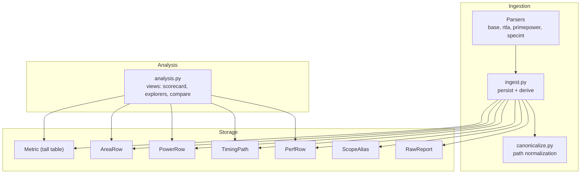
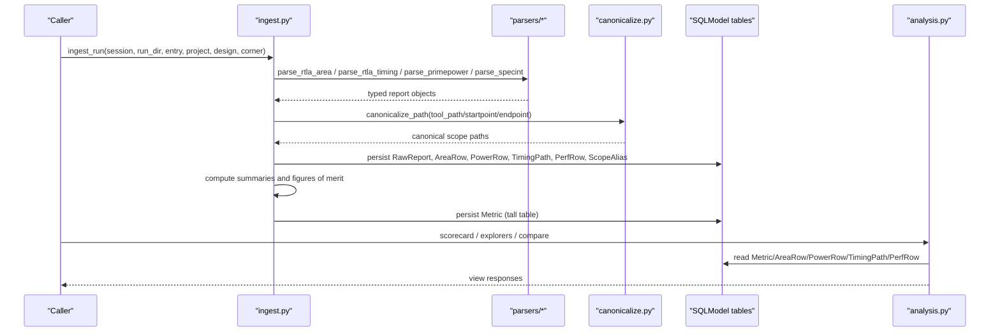
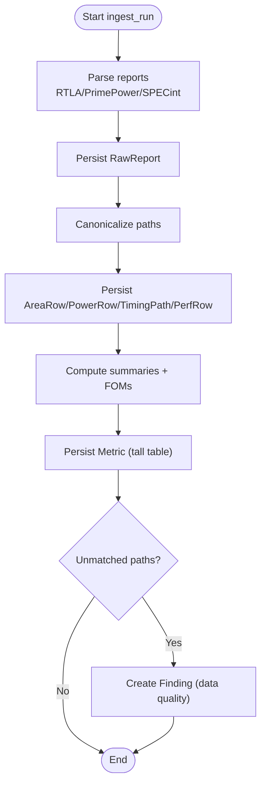
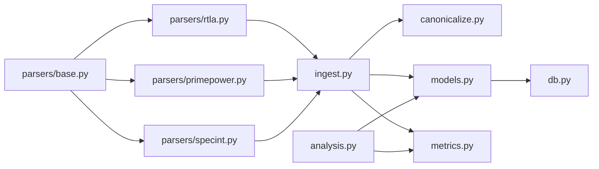

# Metrics System & Tall Table Pattern

<cite>
**Referenced Files in This Document**
- [models.py](file://backend/ppa/models.py)
- [metrics.py](file://backend/ppa/metrics.py)
- [canonicalize.py](file://backend/ppa/canonicalize.py)
- [ingest.py](file://backend/ppa/ingest.py)
- [analysis.py](file://backend/ppa/analysis.py)
- [db.py](file://backend/ppa/db.py)
- [parsers/base.py](file://backend/ppa/parsers/base.py)
- [parsers/rtla.py](file://backend/ppa/parsers/rtla.py)
- [parsers/primepower.py](file://backend/ppa/parsers/primepower.py)
- [parsers/specint.py](file://backend/ppa/parsers/specint.py)
</cite>

## Table of Contents
1. Introduction
2. Project Structure
3. Core Components
4. Architecture Overview
5. Detailed Component Analysis
6. Dependency Analysis
7. Performance Considerations
8. Troubleshooting Guide
9. Conclusion
10. Appendices

## Introduction
This document explains PPA-Profiler’s flexible metrics system built on a tall table pattern, and how it coexists with typed domain tables to provide both schema flexibility and strong query performance. The central idea is:
- A tall Metric table stores arbitrary key/value pairs discovered by parsers or derived during ingestion. It enables open-ended metric discovery without schema changes.
- Typed domain tables (AreaRow, PowerRow, TimingPath, PerfRow) store structured data for high-performance queries and cross-domain analysis.
- Canonicalization normalizes scope paths across EDA tools so that area, power, timing, and performance data can be joined and compared reliably.
- Ingestion persists raw reports, typed rows, aliases, and derived tall metrics; the analysis layer exposes views over these tables for dashboards and comparisons.

## Project Structure
The metrics pipeline spans parsing, canonicalization, persistence, derivation, and querying:
- Parsers convert tool outputs into typed report objects.
- Ingestion persists RawReport entries, typed rows, ScopeAlias mappings, and tall Metric entries.
- Canonicalization ensures consistent hierarchy paths across tools.
- Analysis functions expose views for scorecards, explorers, comparisons, and findings.

**Diagram sources**
- [ingest.py:1-312](file://backend/ppa/ingest.py#L1-L312)
- [models.py:1-217](file://backend/ppa/models.py#L1-L217)
- [analysis.py:1-439](file://backend/ppa/analysis.py#L1-L439)
- [canonicalize.py:1-79](file://backend/ppa/canonicalize.py#L1-L79)
- [parsers/base.py:1-139](file://backend/ppa/parsers/base.py#L1-L139)
- [parsers/rtla.py:1-182](file://backend/ppa/parsers/rtla.py#L1-L182)
- [parsers/primepower.py:1-86](file://backend/ppa/parsers/primepower.py#L1-L86)
- [parsers/specint.py:1-66](file://backend/ppa/parsers/specint.py#L1-L66)

**Section sources**
- [ingest.py:1-312](file://backend/ppa/ingest.py#L1-L312)
- [models.py:1-217](file://backend/ppa/models.py#L1-L217)
- [analysis.py:1-439](file://backend/ppa/analysis.py#L1-L439)
- [canonicalize.py:1-79](file://backend/ppa/canonicalize.py#L1-L79)
- [parsers/base.py:1-139](file://backend/ppa/parsers/base.py#L1-L139)
- [parsers/rtla.py:1-182](file://backend/ppa/parsers/rtla.py#L1-L182)
- [parsers/primepower.py:1-86](file://backend/ppa/parsers/primepower.py#L1-L86)
- [parsers/specint.py:1-66](file://backend/ppa/parsers/specint.py#L1-L66)

## Core Components
- Metric (tall table): Stores arbitrary metrics per run with key/value/unit/scope_path. Indexes on run_id, key, and scope_path enable efficient lookups and grouping.
- AreaRow, PowerRow, TimingPath, PerfRow: Typed tables for domain-specific hierarchical data and benchmark results. Indexed on run_id, scope_path/path_group/benchmark for fast queries.
- ScopeAlias: Maps tool-reported paths to canonical paths, enabling cross-tool joins and data-quality checks.
- RawReport: Tracks each parsed file with sha256, parser version, and parse status for reproducibility and re-parsing.

Key indexing strategy:
- run_id indexes on all metric tables for per-run filtering.
- scope_path indexes on AreaRow/PowerRow/Metric for hierarchical slicing.
- path_group index on TimingPath for group-wise summaries.
- benchmark index on PerfRow for per-benchmark comparisons.

**Section sources**
- [models.py:83-149](file://backend/ppa/models.py#L83-L149)
- [models.py:153-158](file://backend/ppa/models.py#L153-L158)
- [models.py:69-79](file://backend/ppa/models.py#L69-L79)

## Architecture Overview
The ingestion pipeline transforms heterogeneous tool outputs into normalized, indexed storage and derives summary metrics. The analysis layer provides deterministic views over these tables.

**Diagram sources**
- [ingest.py:61-240](file://backend/ppa/ingest.py#L61-L240)
- [canonicalize.py:19-40](file://backend/ppa/canonicalize.py#L19-L40)
- [analysis.py:46-167](file://backend/ppa/analysis.py#L46-L167)
- [models.py:69-149](file://backend/ppa/models.py#L69-L149)

## Detailed Component Analysis

### Tall Table Pattern: Metric Model
- Purpose: Store any metric discovered by parsers or derived during ingestion without requiring schema changes.
- Schema highlights:
  - run_id: links metric to a specific run.
  - key: namespaced keys like "timing.wns_ns", "area.total_um2", "fom.specint_score".
  - value: numeric metric value.
  - unit: optional unit string.
  - scope_path: optional hierarchical scope for scoped metrics.
- Indexing:
  - run_id, key, and scope_path are indexed to support:
    - Fast per-run metric retrieval.
    - Efficient key-based aggregation.
    - Hierarchical slicing by scope_path.

Usage examples:
- Ingestion writes derived metrics such as timing, area, power, performance, and figures of merit into Metric.
- Analysis reads Metric via a simple key-value map per run for scorecards and comparisons.

**Section sources**
- [models.py:83-91](file://backend/ppa/models.py#L83-L91)
- [ingest.py:189-215](file://backend/ppa/ingest.py#L189-L215)
- [analysis.py:29-31](file://backend/ppa/analysis.py#L29-L31)

### Typed Domain Models: AreaRow, PowerRow, TimingPath, PerfRow
- AreaRow: Hierarchical area breakdown with total_area, comb_area, seq_area, macro_area, clock_area, buf_inv_area, inst_count. Includes parent_path and depth for tree traversal.
- PowerRow: Hierarchical power breakdown with internal, switching, leakage, total. Includes parent_path and depth.
- TimingPath: Individual timing paths with slack, required, arrival, start/endpoints, owning modules, logic depth, and hold flags.
- PerfRow: Per-benchmark performance metrics including IPC, cycles, instructions, ratio at 1GHz, cache miss rates, branch misprediction percentage.

Indexing and access patterns:
- All typed tables index run_id for per-run queries.
- AreaRow/PowerRow index scope_path for hierarchical exploration.
- TimingPath indexes path_group for group summaries.
- PerfRow indexes benchmark for per-benchmark comparisons.

Derived summaries and FOMs:
- Summaries read top-level rows only to avoid double-counting hierarchical totals.
- Figures of merit combine timing, area, power, and performance into unified scores and efficiency metrics.

**Section sources**
- [models.py:93-149](file://backend/ppa/models.py#L93-L149)
- [metrics.py:192-234](file://backend/ppa/metrics.py#L192-L234)
- [metrics.py:90-137](file://backend/ppa/metrics.py#L90-L137)
- [analysis.py:224-274](file://backend/ppa/analysis.py#L224-L274)
- [analysis.py:279-326](file://backend/ppa/analysis.py#L279-L326)
- [analysis.py:331-356](file://backend/ppa/analysis.py#L331-L356)

### Canonicalization: Normalizing Scope Paths Across Tools
- Problem: Different tools use different separators and generate block naming conventions (e.g., dot vs slash, brackets vs underscores).
- Solution: canonicalize_path converts tool paths to a single canonical form using:
  - Separator unification (dots/backslashes to slashes).
  - Generate index normalization (brackets to underscored indices).
  - Dangling underscore cleanup.
- Additional helpers:
  - depth_of(path), parent_of(path), common_ancestor(a,b), owner_module(startpoint, endpoint, top).
  - match_report(known, reported) identifies unmatched paths for data quality findings.

Impact:
- Enables cross-domain joins between area and power hierarchies.
- Supports module-level attribution for timing paths.
- Surfaces unmatched paths as findings rather than silently dropping them.

**Section sources**
- [canonicalize.py:1-79](file://backend/ppa/canonicalize.py#L1-L79)
- [ingest.py:117-141](file://backend/ppa/ingest.py#L117-L141)
- [ingest.py:145-153](file://backend/ppa/ingest.py#L145-L153)
- [ingest.py:230-239](file://backend/ppa/ingest.py#L230-L239)

### Ingestion Pipeline: From Reports to Metrics
- Report parsing:
  - RTLA area/timing/qor, PrimePower hierarchical power, SPECint benchmarks.
  - Each parser returns typed report objects with warnings and metadata.
- Persistence:
  - RawReport records file identity (sha256, size, parser version) and parse status.
  - AreaRow/PowerRow/TimingPath/PerfRow persisted with canonicalized paths.
  - ScopeAlias maps tool_path to canonical_path for traceability.
- Derived metrics:
  - Summaries computed from typed rows (area/power/timing/performance).
  - Figures of merit computed and stored as tall Metric entries under "fom.*".
  - Domain summaries stored as tall Metric entries under "timing.*", "area.*", "power.*", "perf.*".
- Data quality:
  - Unmatched power vs area paths detected and recorded as findings.

**Diagram sources**
- [ingest.py:61-240](file://backend/ppa/ingest.py#L61-L240)
- [ingest.py:230-239](file://backend/ppa/ingest.py#L230-L239)

**Section sources**
- [ingest.py:25-31](file://backend/ppa/ingest.py#L25-L31)
- [ingest.py:93-113](file://backend/ppa/ingest.py#L93-L113)
- [ingest.py:115-169](file://backend/ppa/ingest.py#L115-L169)
- [ingest.py:170-228](file://backend/ppa/ingest.py#L170-L228)
- [ingest.py:230-239](file://backend/ppa/ingest.py#L230-L239)

### Query Patterns and Views
- Scorecard: Aggregates tall Metric values for a run, compares against baseline, and shows budgets and top findings.
- Comparisons: Computes deltas and net-score decomposition between runs.
- Explorers:
  - Area explorer: hierarchical area breakdown with shares and deltas.
  - Power explorer: hierarchical power breakdown with density and deltas.
  - Timing explorer: path groups, histograms, critical modules leaderboard.
  - Perf explorer: per-benchmark IPC and ratios with deltas.
- Hotspot: Combines area, power, and timing criticality to rank modules.
- Findings: Filters and sorts findings by severity/category/status.

These views demonstrate when to use typed tables (hierarchical exploration, path-group summaries) versus tall metrics (cross-domain KPIs, FOMs, budget tracking).

**Section sources**
- [analysis.py:46-167](file://backend/ppa/analysis.py#L46-L167)
- [analysis.py:204-219](file://backend/ppa/analysis.py#L204-L219)
- [analysis.py:224-274](file://backend/ppa/analysis.py#L224-L274)
- [analysis.py:279-326](file://backend/ppa/analysis.py#L279-L326)
- [analysis.py:331-356](file://backend/ppa/analysis.py#L331-L356)
- [analysis.py:361-398](file://backend/ppa/analysis.py#L361-L398)
- [analysis.py:403-423](file://backend/ppa/analysis.py#L403-L423)

## Dependency Analysis
- Parsers depend on base types and common utilities; they produce typed report objects consumed by ingestion.
- Ingestion depends on canonicalization for path normalization and on metrics computations for derived tall metrics.
- Analysis depends on models and metrics computations to build deterministic views.
- Database engine configuration uses SQLite with WAL and foreign keys enabled for concurrency and integrity.

**Diagram sources**
- [parsers/base.py:1-139](file://backend/ppa/parsers/base.py#L1-L139)
- [parsers/rtla.py:1-182](file://backend/ppa/parsers/rtla.py#L1-L182)
- [parsers/primepower.py:1-86](file://backend/ppa/parsers/primepower.py#L1-L86)
- [parsers/specint.py:1-66](file://backend/ppa/parsers/specint.py#L1-L66)
- [ingest.py:1-312](file://backend/ppa/ingest.py#L1-L312)
- [canonicalize.py:1-79](file://backend/ppa/canonicalize.py#L1-L79)
- [models.py:1-217](file://backend/ppa/models.py#L1-L217)
- [metrics.py:1-258](file://backend/ppa/metrics.py#L1-L258)
- [db.py:1-50](file://backend/ppa/db.py#L1-L50)
- [analysis.py:1-439](file://backend/ppa/analysis.py#L1-L439)

**Section sources**
- [db.py:13-30](file://backend/ppa/db.py#L13-L30)
- [ingest.py:1-312](file://backend/ppa/ingest.py#L1-L312)
- [analysis.py:1-439](file://backend/ppa/analysis.py#L1-L439)

## Performance Considerations
- Use typed tables for hierarchical queries and joins:
  - AreaRow/PowerRow indexed on scope_path enable efficient drill-down and delta waterfalls.
  - TimingPath indexed on path_group supports fast group summaries and histograms.
  - PerfRow indexed on benchmark allows quick per-benchmark comparisons.
- Use tall Metric for cross-domain KPIs and FOMs:
  - Keyed lookups by run_id and key are O(1) with indexes; aggregations over keys are efficient.
- Avoid double-counting hierarchical totals:
  - Summaries read top-level rows only; do not sum entire tables.
- Leverage canonical paths:
  - Consistent scope_path enables accurate joins and reduces mismatch overhead.
- Database tuning:
  - SQLite WAL mode improves concurrent reads/writes.
  - Foreign keys enforced for referential integrity.

[No sources needed since this section provides general guidance]

## Troubleshooting Guide
- Missing or malformed reports:
  - RawReport captures parse_status and parse_log; check for errors and missing files.
- Parser upgrades:
  - parser_version and sha256 allow detecting format changes and re-parsing if needed.
- Unmatched paths:
  - Data-quality findings flag power paths that do not match area paths after canonicalization.
- Summary anomalies:
  - Ensure summaries read top-level rows only to avoid double-counting.
- Baseline context:
  - Ensure baseline_run is set correctly for comparisons and deltas.

**Section sources**
- [ingest.py:93-113](file://backend/ppa/ingest.py#L93-L113)
- [ingest.py:230-239](file://backend/ppa/ingest.py#L230-L239)
- [analysis.py:34-41](file://backend/ppa/analysis.py#L34-L41)

## Conclusion
PPA-Profiler’s metrics system combines a flexible tall table (Metric) with typed domain tables (AreaRow, PowerRow, TimingPath, PerfRow) to balance adaptability and performance. Canonicalization ensures consistent scope paths across tools, enabling reliable cross-domain analysis. The ingestion pipeline persists provenance, typed rows, aliases, and derived tall metrics; the analysis layer provides deterministic views for scorecards, explorers, and comparisons. Use typed tables for hierarchical and join-heavy queries, and tall metrics for cross-domain KPIs and FOMs.

[No sources needed since this section summarizes without analyzing specific files]

## Appendices

### When to Use Tall Tables vs Typed Views
- Use tall Metric when:
  - Storing arbitrary or evolving metrics without schema changes.
  - Aggregating cross-domain KPIs and FOMs.
  - Tracking derived summaries and ratios.
- Use typed views when:
  - Performing hierarchical exploration (area/power breakdowns).
  - Joining across domains using canonical scope paths.
  - Analyzing timing path groups and benchmark-specific metrics.

[No sources needed since this section provides general guidance]