# Data Ingestion Pipeline

<cite>
**Referenced Files in This Document**
- [ingest.py](file://backend/ppa/ingest.py)
- [parsers/base.py](file://backend/ppa/parsers/base.py)
- [parsers/rtla.py](file://backend/ppa/parsers/rtla.py)
- [parsers/primepower.py](file://backend/ppa/parsers/primepower.py)
- [parsers/specint.py](file://backend/ppa/parsers/specint.py)
- [canonicalize.py](file://backend/ppa/canonicalize.py)
- [metrics.py](file://backend/ppa/metrics.py)
- [models.py](file://backend/ppa/models.py)
- [db.py](file://backend/ppa/db.py)
- [config.py](file://backend/ppa/config.py)
- [cli.py](file://backend/ppa/cli.py)
- [main.py](file://backend/ppa/main.py)
- [rules.py](file://backend/ppa/rules.py)
- [manifest.json](file://sample_runs/manifest.json)
</cite>

## Table of Contents
1. [Introduction](#introduction)
2. [Project Structure](#project-structure)
3. [Core Components](#core-components)
4. [Architecture Overview](#architecture-overview)
5. [Detailed Component Analysis](#detailed-component-analysis)
6. [Dependency Analysis](#dependency-analysis)
7. [Performance Considerations](#performance-considerations)
8. [Troubleshooting Guide](#troubleshooting-guide)
9. [Conclusion](#conclusion)
10. [Appendices](#appendices)

## Introduction
This document explains the end-to-end data ingestion pipeline that orchestrates EDA tool report processing for PPA (Power, Performance, Area) analysis. It covers file discovery, format detection and parser selection, parsing, validation, canonicalization of hierarchy paths, metric derivation, and database storage. It also documents error handling strategies, progress tracking via findings and raw report logs, and configuration options for tuning behavior. The pipeline is designed to be robust against missing or malformed reports, supports batch ingestion across multiple runs, and integrates a deterministic rule engine to surface data quality and design insights after ingestion.

## Project Structure
The ingestion pipeline lives under backend/ppa and is orchestrated by CLI and API entry points. Key modules:
- Orchestration and persistence: ingest.py, db.py, models.py
- Parsing: parsers/{base, rtla, primepower, specint}.py
- Canonicalization: canonicalize.py
- Metrics and figures of merit: metrics.py
- Rule evaluation and findings: rules.py
- Configuration: config.py
- Entry points: cli.py (CLI), main.py (FastAPI server)
- Sample data and manifest: sample_runs/manifest.json

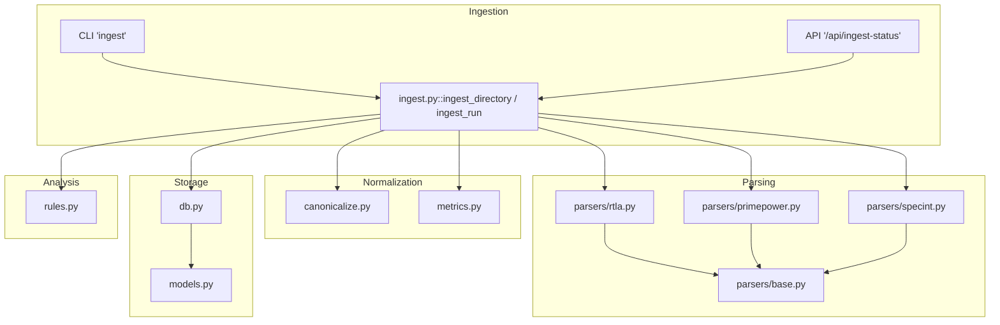

**Diagram sources**
- [cli.py:34-48](file://backend/ppa/cli.py#L34-L48)
- [ingest.py:267-311](file://backend/ppa/ingest.py#L267-L311)
- [parsers/rtla.py:25-181](file://backend/ppa/parsers/rtla.py#L25-L181)
- [parsers/primepower.py:19-85](file://backend/ppa/parsers/primepower.py#L19-L85)
- [parsers/specint.py:21-65](file://backend/ppa/parsers/specint.py#L21-L65)
- [canonicalize.py:19-79](file://backend/ppa/canonicalize.py#L19-L79)
- [metrics.py:90-137](file://backend/ppa/metrics.py#L90-L137)
- [db.py:13-49](file://backend/ppa/db.py#L13-L49)
- [models.py:55-180](file://backend/ppa/models.py#L55-L180)
- [rules.py:313-352](file://backend/ppa/rules.py#L313-L352)

**Section sources**
- [cli.py:34-48](file://backend/ppa/cli.py#L34-L48)
- [ingest.py:267-311](file://backend/ppa/ingest.py#L267-L311)
- [db.py:13-49](file://backend/ppa/db.py#L13-L49)
- [models.py:55-180](file://backend/ppa/models.py#L55-L180)

## Core Components
- File discovery and orchestration: Reads a manifest listing run directories and iterates through them to parse and persist each run’s reports.
- Parser registry: A fixed list maps report kinds to filenames and parser functions with version tags.
- Parsing and validation: Each parser returns typed result objects; exceptions are caught per report so one failure does not stop others.
- Canonicalization: Hierarchy paths from different tools are normalized to a common form to enable cross-domain joins and comparisons.
- Metric derivation: Summaries and figures of merit are computed from parsed data and stored as tall metrics.
- Persistence: SQLModel-backed SQLite tables store identity, provenance, raw reports, domain rows, metrics, aliases, baselines, and findings.
- Rule engine: After ingestion, deterministic rules evaluate metrics and domain rows to produce findings about timing, area, power, performance, and data quality.

**Section sources**
- [ingest.py:25-31](file://backend/ppa/ingest.py#L25-L31)
- [ingest.py:61-240](file://backend/ppa/ingest.py#L61-L240)
- [canonicalize.py:19-79](file://backend/ppa/canonicalize.py#L19-L79)
- [metrics.py:90-137](file://backend/ppa/metrics.py#L90-L137)
- [models.py:55-180](file://backend/ppa/models.py#L55-L180)
- [rules.py:313-352](file://backend/ppa/rules.py#L313-L352)

## Architecture Overview
The ingestion workflow proceeds in these stages:
1. Manifest-driven discovery: Load manifest.json to enumerate runs with labels, parameters, corners, and order.
2. Run creation: For each run directory, create or reuse project/design/corner/config entities and create a Run record.
3. Report parsing: For each expected report kind, read the file, invoke the corresponding parser, and capture status/logs.
4. Canonicalization and mapping: Normalize tool-reported paths to canonical forms and map to domain rows (area/power/timing/perf).
5. Metric computation: Derive summaries and figures of merit; persist both detailed rows and aggregated metrics.
6. Findings generation: Run the rule engine over all runs to detect issues and opportunities.

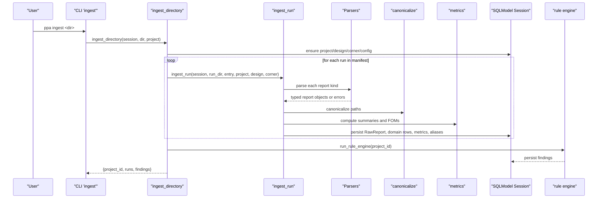

**Diagram sources**
- [cli.py:34-48](file://backend/ppa/cli.py#L34-L48)
- [ingest.py:267-311](file://backend/ppa/ingest.py#L267-L311)
- [ingest.py:61-240](file://backend/ppa/ingest.py#L61-L240)
- [parsers/rtla.py:25-181](file://backend/ppa/parsers/rtla.py#L25-L181)
- [parsers/primepower.py:19-85](file://backend/ppa/parsers/primepower.py#L19-L85)
- [parsers/specint.py:21-65](file://backend/ppa/parsers/specint.py#L21-L65)
- [canonicalize.py:19-79](file://backend/ppa/canonicalize.py#L19-L79)
- [metrics.py:90-137](file://backend/ppa/metrics.py#L90-L137)
- [rules.py:313-352](file://backend/ppa/rules.py#L313-L352)

## Detailed Component Analysis

### File Discovery and Batch Processing
- Manifest-based discovery: The pipeline reads manifest.json at the root of the provided directory. Each entry defines label, params, corner, stage, and order.
- Batch iteration: The manifest entries are sorted by order and processed sequentially. Missing directories are skipped without failing the entire job.
- Baseline setup: If no baseline exists for the project, the first run in the manifest becomes the golden baseline automatically.

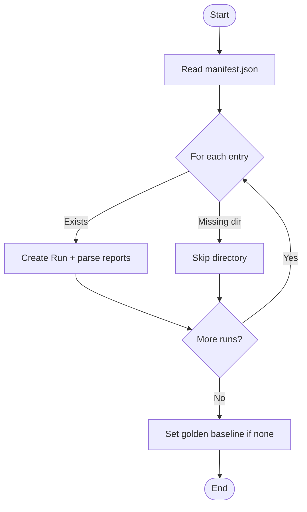

**Diagram sources**
- [ingest.py:267-311](file://backend/ppa/ingest.py#L267-L311)
- [manifest.json:1-206](file://sample_runs/manifest.json#L1-L206)

**Section sources**
- [ingest.py:267-311](file://backend/ppa/ingest.py#L267-L311)
- [manifest.json:1-206](file://sample_runs/manifest.json#L1-L206)

### Format Detection and Parser Selection
- Fixed report specification: REPORT_SPECS enumerates supported report kinds, expected filenames, parser functions, and parser versions.
- Deterministic selection: For each run, the pipeline checks existence of each expected file and invokes the corresponding parser. There is no dynamic “auto-detect”; instead, it tries known formats based on filename conventions.
- Version tagging: Each parser exposes a VERSION string used to track parser upgrades and support reparsing when needed.

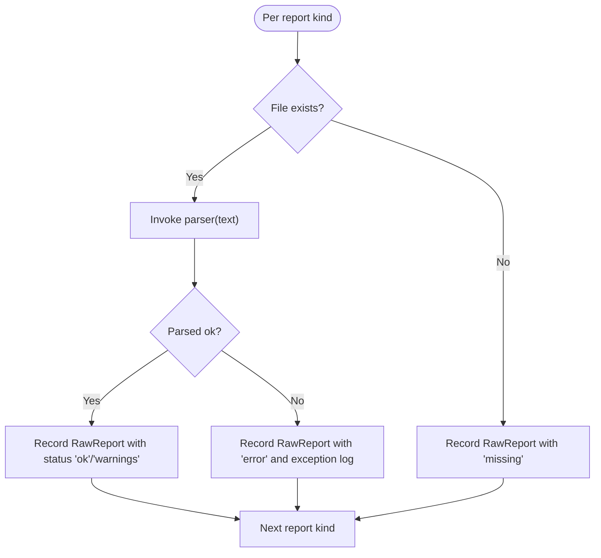

**Diagram sources**
- [ingest.py:25-31](file://backend/ppa/ingest.py#L25-L31)
- [ingest.py:93-113](file://backend/ppa/ingest.py#L93-L113)
- [parsers/rtla.py:25-181](file://backend/ppa/parsers/rtla.py#L25-L181)
- [parsers/primepower.py:19-85](file://backend/ppa/parsers/primepower.py#L19-L85)
- [parsers/specint.py:21-65](file://backend/ppa/parsers/specint.py#L21-L65)

**Section sources**
- [ingest.py:25-31](file://backend/ppa/ingest.py#L25-L31)
- [ingest.py:93-113](file://backend/ppa/ingest.py#L93-L113)

### Parsing Logic and Validation
- RTLA parsers:
  - Area: Parses hierarchical area table, computes depth from indentation, captures totals.
  - Timing: Extracts clocks, path groups, slack histogram, and top violating paths; validates presence of required sections.
  - QoR: Extracts key metrics from a labeled section.
- PrimePower parser:
  - Parses supply voltage, toggle rate, clock gating efficiency, categories, and hierarchical power rows; detects total row.
- SPECint parser:
  - Parses benchmark results including IPC, cycles, instructions, ratios, and optional cache/misprediction metrics.
- Validation:
  - Each parser raises a specific ParseError if critical sections are missing, ensuring early detection of incompatible formats.
  - Warnings are collected for unparsed lines to aid debugging without halting ingestion.

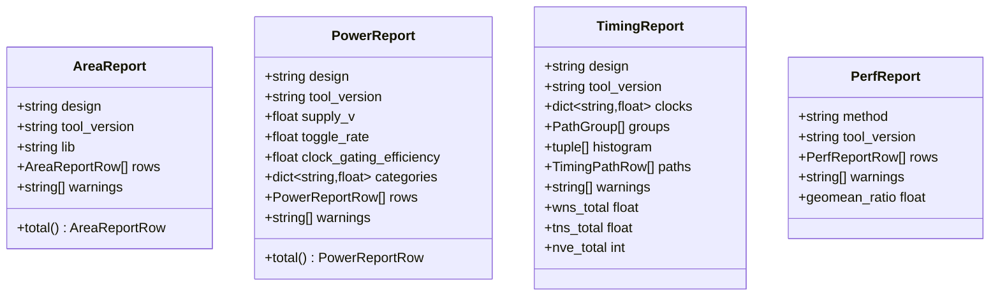

**Diagram sources**
- [parsers/base.py:7-139](file://backend/ppa/parsers/base.py#L7-L139)

**Section sources**
- [parsers/rtla.py:25-181](file://backend/ppa/parsers/rtla.py#L25-L181)
- [parsers/primepower.py:19-85](file://backend/ppa/parsers/primepower.py#L19-L85)
- [parsers/specint.py:21-65](file://backend/ppa/parsers/specint.py#L21-L65)
- [parsers/base.py:7-139](file://backend/ppa/parsers/base.py#L7-L139)

### Canonicalization and Path Matching
- Normalization: Converts separators, generate block indices, and trailing underscores into a canonical slash-separated form.
- Depth and parent: Computes depth and parent path for hierarchical relationships.
- Owner module: Attributes timing paths to owning modules using common ancestors.
- Matching: Compares reported vs known canonical paths to identify unmatched hierarchies, surfacing them as data-quality findings.

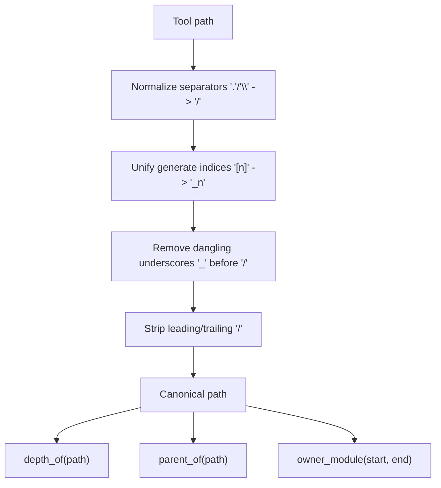

**Diagram sources**
- [canonicalize.py:19-79](file://backend/ppa/canonicalize.py#L19-L79)

**Section sources**
- [canonicalize.py:19-79](file://backend/ppa/canonicalize.py#L19-L79)

### Metric Derivation and Figures of Merit
- Domain summaries:
  - Area summary uses the top-level row to avoid double-counting children.
  - Power summary aggregates internal, switching, leakage, and total; includes category breakdowns and toggling/gating metrics.
  - Timing summary computes worst/negative slack, number of violations, and derives fmax from target period and WNS.
- Figures of merit:
  - Combines performance (SPECint ratio), frequency (timing-derived or fixed), area, and power to compute scores, efficiencies, energy-delay products, and more.
- Storage:
  - Derived metrics are persisted as key-value pairs with units and scope where applicable.

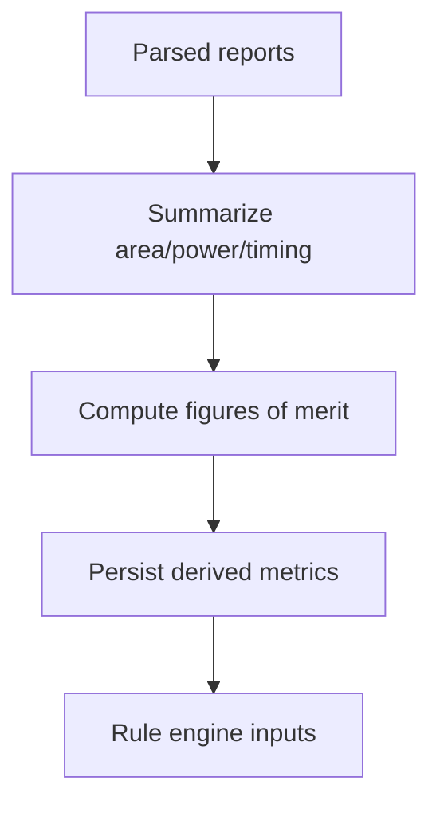

**Diagram sources**
- [metrics.py:90-137](file://backend/ppa/metrics.py#L90-L137)
- [metrics.py:192-234](file://backend/ppa/metrics.py#L192-L234)
- [ingest.py:170-215](file://backend/ppa/ingest.py#L170-L215)

**Section sources**
- [metrics.py:90-137](file://backend/ppa/metrics.py#L90-L137)
- [metrics.py:192-234](file://backend/ppa/metrics.py#L192-L234)
- [ingest.py:170-215](file://backend/ppa/ingest.py#L170-L215)

### Database Storage Schema and Provenance
- Identity and provenance:
  - Project, Design, Config, Corner, Run define context and lineage.
  - RawReport records file provenance, checksums, parser version, parse status, and logs.
- Domain rows:
  - AreaRow, PowerRow, TimingPath, PerfRow store detailed measurements keyed by run and canonical paths.
- Metrics and aliases:
  - Metric stores tall key-value metrics; ScopeAlias maps tool paths to canonical paths for traceability.
- Baseline and findings:
  - Baseline marks reference runs; Finding captures rule-triggered insights with severity, category, and evidence.

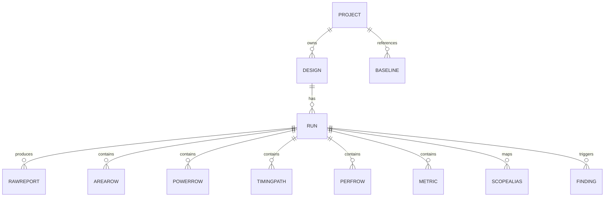

**Diagram sources**
- [models.py:17-180](file://backend/ppa/models.py#L17-L180)

**Section sources**
- [models.py:17-180](file://backend/ppa/models.py#L17-L180)

### Error Handling Strategies and Progress Tracking
- Per-report resilience: Exceptions during parsing are caught and recorded in RawReport.parse_status and parse_log; other reports continue processing.
- Missing files: Recorded explicitly with a “missing” status to drive downstream data-quality checks.
- Data-quality findings:
  - Unmatched power vs area paths are flagged.
  - Rule engine flags missing reports, parse warnings/errors, timing violations, budget breaches, performance regressions, and ROI anomalies.
- Progress visibility:
  - CLI prints counts of ingested runs and findings raised.
  - API provides an ingest status endpoint to query current state.

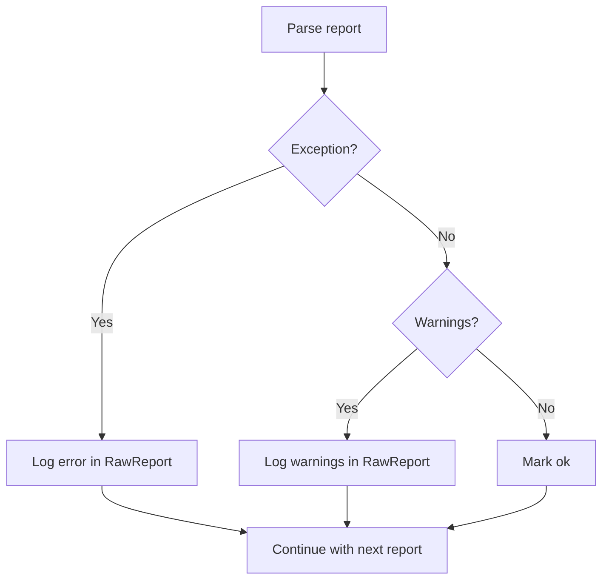

**Diagram sources**
- [ingest.py:93-113](file://backend/ppa/ingest.py#L93-L113)
- [ingest.py:230-239](file://backend/ppa/ingest.py#L230-L239)
- [rules.py:269-287](file://backend/ppa/rules.py#L269-L287)

**Section sources**
- [ingest.py:93-113](file://backend/ppa/ingest.py#L93-L113)
- [ingest.py:230-239](file://backend/ppa/ingest.py#L230-L239)
- [rules.py:269-287](file://backend/ppa/rules.py#L269-L287)

### Parallel Parsing and Resource Management
- Current implementation: Sequential processing per run and per report kind within a single session.
- Scalability considerations:
  - Use separate sessions per run to reduce contention.
  - Employ background workers (e.g., Celery or asyncio) to parallelize parsing across runs while batching writes.
  - Tune SQLite WAL pragmas already set for concurrency and durability.
  - Consider chunked commits and connection pooling for large datasets.

[No sources needed since this section provides general guidance]

### Configuration Options
- Settings via environment variables with prefix PPA_:
  - Storage: database path, sample data directory.
  - AI endpoints: base URL, model name, API key placeholder, timeouts, max tool rounds.
  - Server: frontend distribution path.
- CLI/API usage:
  - CLI commands: init, gen-sample, ingest, demo, serve, check-format.
  - API endpoints: ingest status, rules listing, and various analysis endpoints.

**Section sources**
- [config.py:12-30](file://backend/ppa/config.py#L12-L30)
- [cli.py:18-94](file://backend/ppa/cli.py#L18-L94)
- [main.py:154-162](file://backend/ppa/main.py#L154-L162)

## Dependency Analysis
Key dependencies and coupling:
- ingest.py depends on parsers, canonicalize, metrics, models, and rules.
- Parsers depend on base types and common utilities.
- db.py initializes SQLite engine with WAL and foreign keys.
- rules.py consumes metrics and domain rows to produce findings.

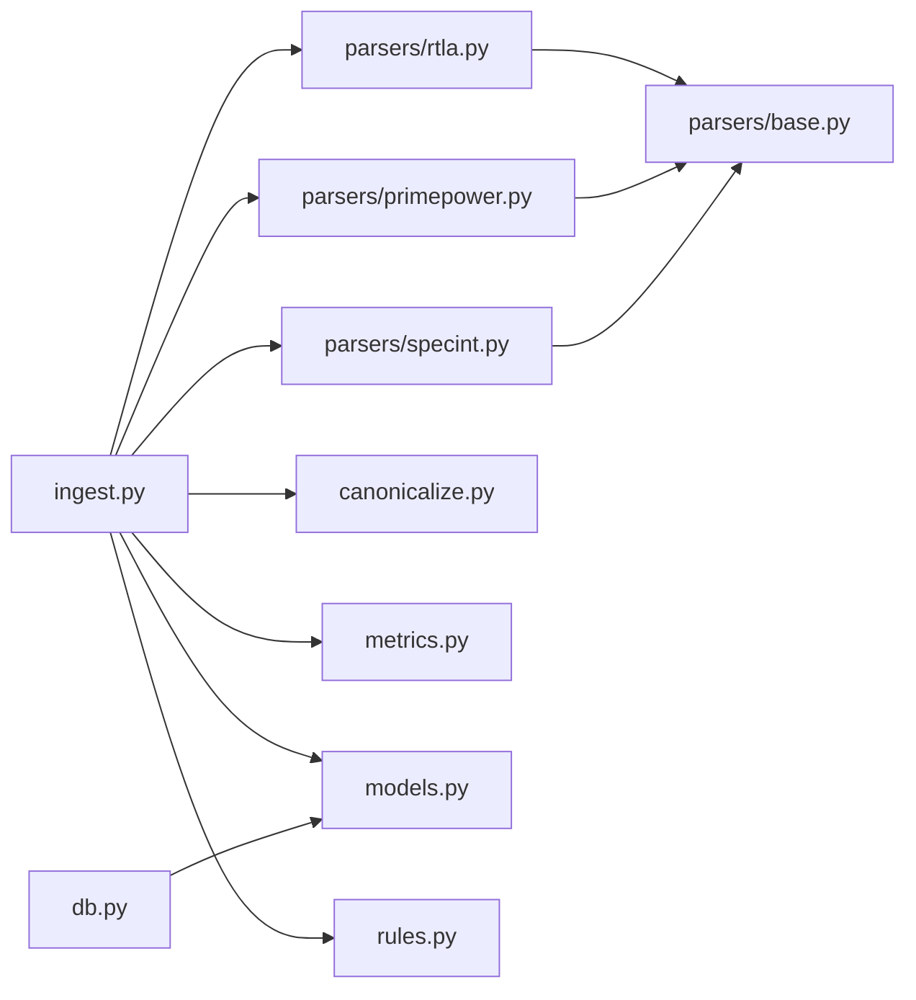

**Diagram sources**
- [ingest.py:11-23](file://backend/ppa/ingest.py#L11-L23)
- [parsers/rtla.py:13-16](file://backend/ppa/parsers/rtla.py#L13-L16)
- [parsers/primepower.py:12-16](file://backend/ppa/parsers/primepower.py#L12-L16)
- [parsers/specint.py:8-12](file://backend/ppa/parsers/specint.py#L8-L12)
- [canonicalize.py:1-10](file://backend/ppa/canonicalize.py#L1-L10)
- [metrics.py:1-8](file://backend/ppa/metrics.py#L1-L8)
- [db.py:6-10](file://backend/ppa/db.py#L6-L10)
- [rules.py:11-16](file://backend/ppa/rules.py#L11-L16)

**Section sources**
- [ingest.py:11-23](file://backend/ppa/ingest.py#L11-L23)
- [db.py:6-10](file://backend/ppa/db.py#L6-L10)
- [rules.py:11-16](file://backend/ppa/rules.py#L11-L16)

## Performance Considerations
- SQLite WAL mode improves concurrent reads/writes and durability.
- Batching writes: Accumulate rows and metrics per run and commit once to reduce transaction overhead.
- Avoid double-counting: Summaries use top-level rows to prevent inflated metrics.
- Indexes: Primary and indexed columns (e.g., run_id, kind, scope_path) accelerate queries for exploration and comparison.
- Future optimizations:
  - Parallel parsing across runs with worker pools.
  - Chunked commits and temporary tables for large batches.
  - Connection pooling and careful session scoping.

[No sources needed since this section provides general guidance]

## Troubleshooting Guide
Common issues and diagnostics:
- Parser mismatch: Use the CLI command to test a report file and see which parser matched and how many rows/warnings were extracted.
- Missing reports: RawReport entries will show “missing” status; rule engine will flag missing report kinds.
- Parse errors: RawReport.parse_log contains the exception message; investigate parser expectations and report format changes.
- Unmatched paths: Data-quality findings indicate mismatches between power and area hierarchies; review canonicalization and tool output differences.
- Baseline not set: Ensure the first manifest entry corresponds to the intended baseline; otherwise set manually.

**Section sources**
- [cli.py:72-94](file://backend/ppa/cli.py#L72-L94)
- [ingest.py:93-113](file://backend/ppa/ingest.py#L93-L113)
- [ingest.py:230-239](file://backend/ppa/ingest.py#L230-L239)
- [rules.py:269-287](file://backend/ppa/rules.py#L269-L287)

## Conclusion
The ingestion pipeline provides a robust, deterministic flow from raw EDA tool reports to structured, queryable data with rich provenance and actionable insights. It emphasizes resilience (per-report error handling), clarity (canonical paths and metadata), and extensibility (parser registry and rule engine). With configuration-driven settings and CLI/API interfaces, teams can integrate batch ingestion into CI/CD pipelines, monitor progress via findings, and iterate on parsers and rules as tool outputs evolve.

[No sources needed since this section summarizes without analyzing specific files]

## Appendices

### End-to-End Sequence: Single Run Ingestion
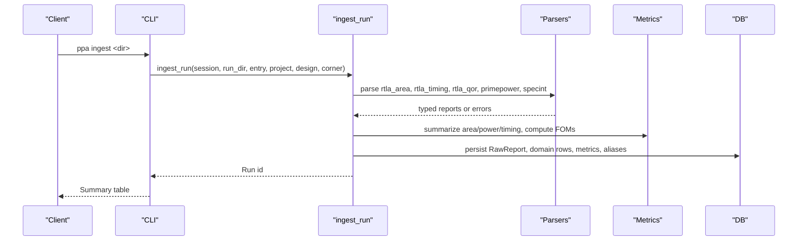

**Diagram sources**
- [cli.py:34-48](file://backend/ppa/cli.py#L34-L48)
- [ingest.py:61-240](file://backend/ppa/ingest.py#L61-L240)
- [parsers/rtla.py:25-181](file://backend/ppa/parsers/rtla.py#L25-L181)
- [parsers/primepower.py:19-85](file://backend/ppa/parsers/primepower.py#L19-L85)
- [parsers/specint.py:21-65](file://backend/ppa/parsers/specint.py#L21-L65)
- [metrics.py:90-137](file://backend/ppa/metrics.py#L90-L137)