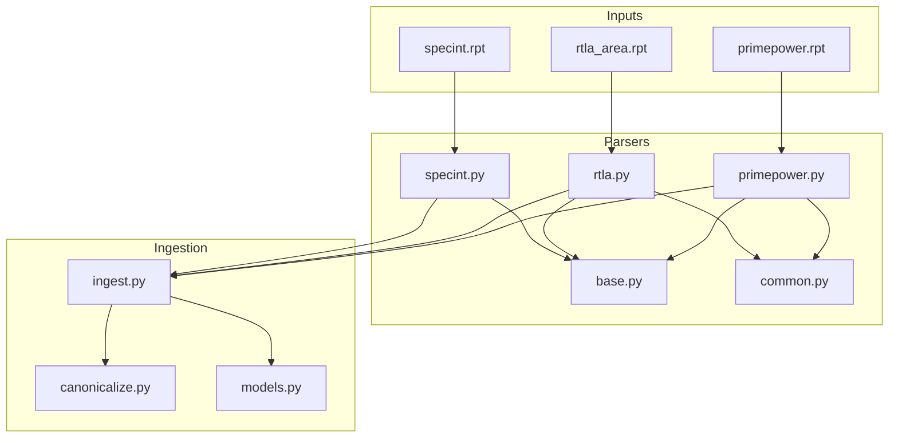
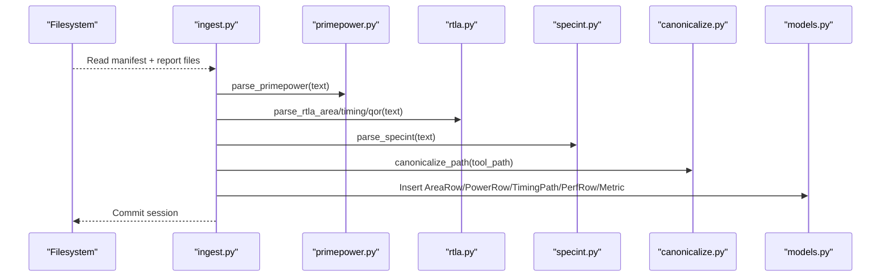
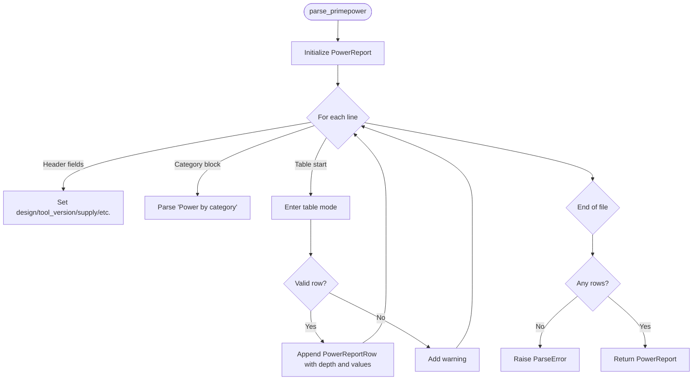
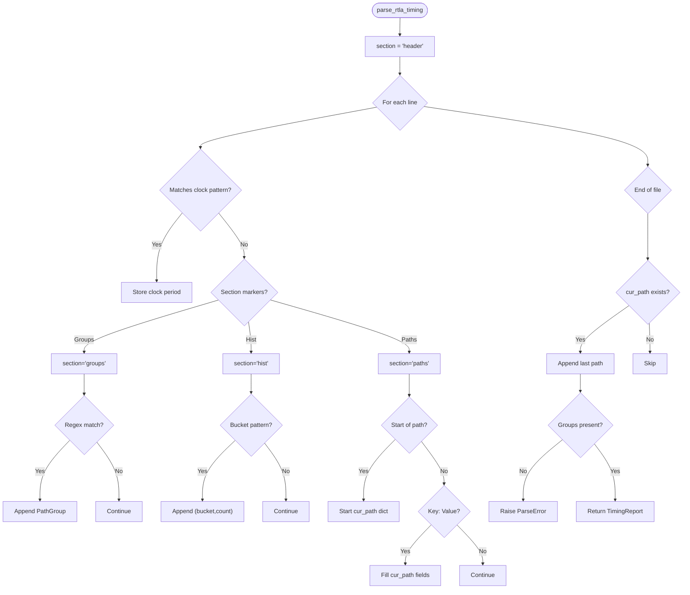
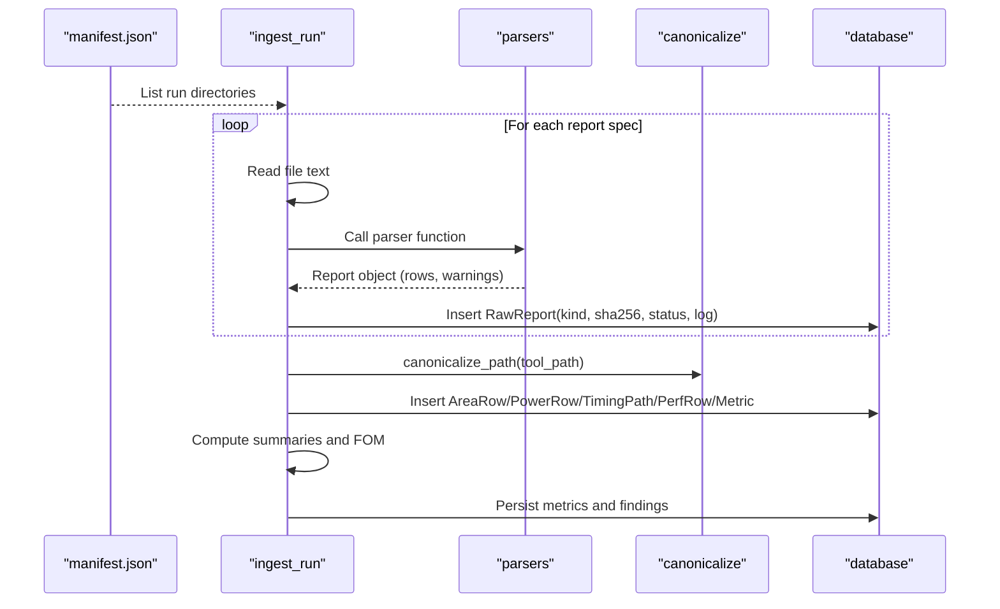
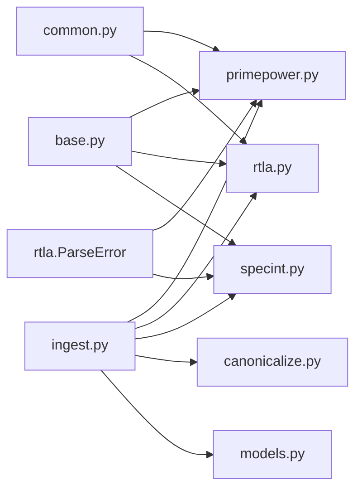

# EDA Tool Parser System

<cite>
**Referenced Files in This Document**
- [base.py](file://backend/ppa/parsers/base.py)
- [common.py](file://backend/ppa/parsers/common.py)
- [primepower.py](file://backend/ppa/parsers/primepower.py)
- [rtla.py](file://backend/ppa/parsers/rtla.py)
- [specint.py](file://backend/ppa/parsers/specint.py)
- [ingest.py](file://backend/ppa/ingest.py)
- [canonicalize.py](file://backend/ppa/canonicalize.py)
- [models.py](file://backend/ppa/models.py)
- [primepower.rpt](file://sample_runs/baseline/primepower.rpt)
- [rtla_area.rpt](file://sample_runs/baseline/rtla_area.rpt)
- [specint.rpt](file://sample_runs/baseline/specint.rpt)
</cite>

## Table of Contents
1. Introduction
2. Project Structure
3. Core Components
4. Architecture Overview
5. Detailed Component Analysis
6. Dependency Analysis
7. Performance Considerations
8. Troubleshooting Guide
9. Conclusion
10. Appendices

## Introduction
This document explains the extensible parser system that ingests EDA tool outputs for PPA-Profiler and converts them into canonical, database-ready forms. It covers:
- The base parser data model and shared utilities
- Specific parsers for PrimePower (power), RTLA (area, timing, QoR), and SPECint (performance benchmarks)
- The ingestion pipeline that validates data integrity, normalizes paths, and persists results
- Patterns for adding new EDA tools and extending the system
- Error handling strategies and performance considerations for large reports

## Project Structure
The parser subsystem lives under backend/ppa/parsers and is orchestrated by the ingestion pipeline in ingest.py. Canonical path normalization and database models are provided by canonicalize.py and models.py respectively. Sample report files demonstrate expected formats.

**Diagram sources**
- [primepower.py:19-85](file://backend/ppa/parsers/primepower.py#L19-L85)
- [rtla.py:25-181](file://backend/ppa/parsers/rtla.py#L25-L181)
- [specint.py:21-65](file://backend/ppa/parsers/specint.py#L21-L65)
- [ingest.py:25-31](file://backend/ppa/ingest.py#L25-L31)
- [canonicalize.py:19-40](file://backend/ppa/canonicalize.py#L19-L40)
- [models.py:69-149](file://backend/ppa/models.py#L69-L149)

**Section sources**
- [ingest.py:25-31](file://backend/ppa/ingest.py#L25-L31)
- [primepower.py:1-86](file://backend/ppa/parsers/primepower.py#L1-L86)
- [rtla.py:1-182](file://backend/ppa/parsers/rtla.py#L1-L182)
- [specint.py:1-66](file://backend/ppa/parsers/specint.py#L1-L66)
- [canonicalize.py:1-79](file://backend/ppa/canonicalize.py#L1-L79)
- [models.py:1-217](file://backend/ppa/models.py#L1-L217)

## Core Components
- Base dataclasses define canonical result types for area, timing, power, and performance reports. These ensure consistent downstream processing and storage.
- Common utilities provide robust parsing helpers for numbers, key-value pairs, and row splitting.
- Report-specific parsers implement format-aware logic to extract structured data from raw text.
- Ingestion orchestrates parsing, validation, canonicalization, persistence, and derived metrics computation.

Key responsibilities:
- Dataclass contracts: AreaReportRow/AreaReport, TimingPathRow/TimingReport, PowerReportRow/PowerReport, PerfReportRow/PerfReport
- Shared parsing helpers: numeric conversion with comma handling, token checks, key-value extraction
- Format-specific parsing: hierarchical indentation handling, section detection, regex-based field extraction
- Pipeline orchestration: file discovery, error isolation per report, path canonicalization, metric derivation, rule evaluation

**Section sources**
- [base.py:7-139](file://backend/ppa/parsers/base.py#L7-L139)
- [common.py:6-32](file://backend/ppa/parsers/common.py#L6-L32)
- [ingest.py:61-240](file://backend/ppa/ingest.py#L61-L240)

## Architecture Overview
The ingestion pipeline reads a run directory, discovers report files, invokes the appropriate parser, records parse status and logs, then persists normalized rows and metrics. Path canonicalization ensures cross-tool consistency. Derived metrics and figures of merit are computed and stored as key-value metrics.

**Diagram sources**
- [ingest.py:93-169](file://backend/ppa/ingest.py#L93-L169)
- [canonicalize.py:19-40](file://backend/ppa/canonicalize.py#L19-L40)
- [models.py:93-149](file://backend/ppa/models.py#L93-L149)

## Detailed Component Analysis

### Base Data Model
Defines canonical structures returned by parsers and consumed by ingestion:
- AreaReportRow/AreaReport: hierarchical area breakdown with totals and warnings
- TimingReport/PathGroup/TimingPathRow: clock periods, group summaries, histogram buckets, and detailed paths
- PowerReport/PowerReportRow: supply voltage, toggle rate, gating efficiency, categories, and hierarchical power
- PerfReport/PerfReportRow: benchmark-level IPC, cycles, instructions, ratios, and optional cache/misprediction stats

Complexity notes:
- Aggregations like total slack or geometric mean are O(n) over groups or rows
- Warnings list grows with unparsed lines; keep log truncation reasonable during ingestion

**Section sources**
- [base.py:7-139](file://backend/ppa/parsers/base.py#L7-L139)

### Common Utilities
- to_float: safely parses numbers with commas and scientific notation; returns None on failure
- is_number: quick check for numeric tokens
- split_row: whitespace-split helper
- parse_kv: simple key:value extractor with configurable separator

These utilities reduce duplication and centralize robustness for number parsing across parsers.

**Section sources**
- [common.py:6-32](file://backend/ppa/parsers/common.py#L6-L32)

### PrimePower Parser
Extracts design metadata, supply voltage, toggle rate, clock gating efficiency, category totals, and hierarchical power rows. Handles indentation-based depth calculation and recognizes a special “Total” row.

Parsing flow highlights:
- Section detection via header keywords
- Category block parsing until blank line
- Hierarchical table parsing with last-four-columns numeric validation
- Warning accumulation for unrecognized lines
- Raises ParseError if no hierarchy rows found

**Diagram sources**
- [primepower.py:19-85](file://backend/ppa/parsers/primepower.py#L19-L85)

**Section sources**
- [primepower.py:19-85](file://backend/ppa/parsers/primepower.py#L19-L85)
- [primepower.rpt:1-42](file://sample_runs/baseline/primepower.rpt#L1-L42)

### RTLA Parser
Handles three report types:
- Area: hierarchical cell area with indentation-based depth and a “Total” row
- Timing: clocks, path group summaries, slack histogram, and top violating paths
- QoR: free-form metric key-value extraction after a marker

Key patterns:
- Regex-driven extraction for clocks, groups, and histogram buckets
- Section state machine to switch between header, groups, histogram, and paths
- Robust fallback defaults for missing fields when building TimingPathRow
- Raises ParseError when critical sections are missing

**Diagram sources**
- [rtla.py:81-135](file://backend/ppa/parsers/rtla.py#L81-L135)

**Section sources**
- [rtla.py:25-71](file://backend/ppa/parsers/rtla.py#L25-L71)
- [rtla.py:81-150](file://backend/ppa/parsers/rtla.py#L81-L150)
- [rtla.py:155-181](file://backend/ppa/parsers/rtla.py#L155-L181)

### SPECint Parser
Parses benchmark tables with columns for reference IPC, cycles, instructions, IPC, ratio at 1GHz, and optional L1D/L2 MPKI and branch misprediction percentage. Normalizes missing values and ignores summary rows.

Behavior:
- Detects table region after “Benchmark” header
- Validates first token as a benchmark ID prefix
- Builds PerfReportRow with safe defaults for optional fields
- Accumulates warnings for unparsed lines

**Section sources**
- [specint.py:21-65](file://backend/ppa/parsers/specint.py#L21-L65)
- [specint.rpt:1-21](file://sample_runs/baseline/specint.rpt#L1-L21)

### Ingestion Pipeline
Orchestrates parsing, validation, canonicalization, persistence, and derived metrics:
- REPORT_SPECS enumerates supported reports, filenames, parser functions, and parser versions
- For each report:
  - Reads file content and invokes parser
  - Records RawReport with sha256, size, parser version, status, and truncated log
  - On exception, marks error and continues with other reports
- After parsing:
  - Reconstructs full area paths from indentation and stores aliases
  - Canonicalizes paths for area, power, and timing endpoints
  - Stores AreaRow, PowerRow, TimingPath, PerfRow, Metric entries
  - Computes timing/area/power/performance summaries and figures of merit
  - Flags unmatched power vs area paths as data-quality findings

**Diagram sources**
- [ingest.py:93-240](file://backend/ppa/ingest.py#L93-L240)
- [canonicalize.py:19-40](file://backend/ppa/canonicalize.py#L19-L40)
- [models.py:69-149](file://backend/ppa/models.py#L69-L149)

**Section sources**
- [ingest.py:25-31](file://backend/ppa/ingest.py#L25-L31)
- [ingest.py:61-240](file://backend/ppa/ingest.py#L61-L240)

### Path Canonicalization
Normalizes tool-reported hierarchy paths to a single canonical form:
- Unifies separators (“.” or “\” to “/”)
- Converts generate block indices from bracketed form to underscore-indexed form
- Removes dangling underscores left by certain naming styles
- Provides depth, parent, common ancestor, owner module, and set matching utilities

Impact:
- Enables cross-domain joins between area, power, and timing scopes
- Surfaces unmatched paths as data-quality findings rather than silent drops

**Section sources**
- [canonicalize.py:1-79](file://backend/ppa/canonicalize.py#L1-L79)

### Database Models
Typed SQLModel classes store identity/provenance, metrics, and analysis artifacts:
- Identity: Project, Design, Config, Corner, Run
- Provenance: RawReport with sha256, parser version, parse status/log
- Metrics: tall Metric table plus typed tables for AreaRow, PowerRow, TimingPath, PerfRow
- Cross-cutting: ScopeAlias mapping tool paths to canonical paths; Baseline, Finding, Annotation, ChatSession/Message, RuleFeedback

**Section sources**
- [models.py:17-217](file://backend/ppa/models.py#L17-L217)

## Dependency Analysis
Parser modules depend on:
- base.py for canonical dataclasses
- common.py for parsing helpers
- rtla.py defines a shared ParseError used by primepower.py and specint.py

Ingestion depends on:
- All parsers via imports
- canonicalize.py for path normalization
- models.py for persistence
- metrics module for summaries (imported but not shown here)

**Diagram sources**
- [primepower.py:12-14](file://backend/ppa/parsers/primepower.py#L12-L14)
- [specint.py:8-10](file://backend/ppa/parsers/specint.py#L8-L10)
- [ingest.py:17-22](file://backend/ppa/ingest.py#L17-L22)

**Section sources**
- [primepower.py:12-14](file://backend/ppa/parsers/primepower.py#L12-L14)
- [specint.py:8-10](file://backend/ppa/parsers/specint.py#L8-L10)
- [ingest.py:17-22](file://backend/ppa/ingest.py#L17-L22)

## Performance Considerations
- Streaming line-by-line parsing: Each parser iterates over text.splitlines(), which is memory-efficient for large reports compared to loading entire structures into memory.
- Early exits and section flags: Parsers use flags (e.g., in_table, in_categories) to skip irrelevant lines quickly.
- Numeric parsing optimization: to_float centralizes string-to-float conversion with comma removal and exception handling, reducing repeated try/except blocks.
- Batch ingestion: ingest_directory processes multiple runs sequentially; consider parallelizing across runs if I/O-bound, while keeping per-run parsing sequential to avoid contention.
- Path canonicalization cost: O(L) per path where L is path length; batch operations minimize overhead.
- Logging truncation: parse_log is limited to first 50 warnings to control storage size.

Recommendations:
- For very large reports, consider streaming chunked reads if future refactors allow it.
- Use indexes on scope_path, path_group, and benchmark in queries for faster analytics.
- Cache parser versions and SHA256 hashes to detect reparsing needs efficiently.

[No sources needed since this section provides general guidance]

## Troubleshooting Guide
Common issues and how the system handles them:
- Missing report files: Recorded as RawReport with parse_status="error" and parse_log="missing file"; ingestion continues with other reports.
- Parser exceptions: Caught per report; RawReport captures exception message; other reports still processed.
- Empty or malformed reports: Parsers raise ParseError when critical sections are missing (e.g., no hierarchy rows, no path-group summary, no metric rows).
- Unmatched paths: After ingestion, unmatched power vs area paths are flagged as data-quality findings with evidence JSON listing up to 20 paths.

Debugging tips:
- Inspect RawReport.parse_log for truncated warnings or errors
- Verify report headers match expected keys (Design, Tool/Version, Library, Benchmark)
- Ensure canonicalization aligns tool paths with RTL expectations; use ScopeAlias mappings to diagnose mismatches

**Section sources**
- [ingest.py:93-113](file://backend/ppa/ingest.py#L93-L113)
- [ingest.py:230-239](file://backend/ppa/ingest.py#L230-L239)
- [primepower.py:83-85](file://backend/ppa/parsers/primepower.py#L83-L85)
- [rtla.py:69-71](file://backend/ppa/parsers/rtla.py#L69-L71)
- [rtla.py:133-135](file://backend/ppa/parsers/rtla.py#L133-L135)
- [rtla.py:179-181](file://backend/ppa/parsers/rtla.py#L179-L181)
- [specint.py:63-65](file://backend/ppa/parsers/specint.py#L63-L65)

## Conclusion
The parser system provides a robust, extensible foundation for ingesting diverse EDA tool outputs into a unified, queryable database. By standardizing data through base dataclasses, leveraging shared parsing utilities, and enforcing canonical path normalization, the system enables reliable cross-domain analysis and reporting. The ingestion pipeline isolates failures, preserves provenance, and derives actionable metrics and findings. Extending support for new tools follows a clear pattern: implement a parser returning base dataclasses, register it in REPORT_SPECS, and rely on existing canonicalization and persistence logic.

[No sources needed since this section summarizes without analyzing specific files]

## Appendices

### How to Add Support for a New EDA Tool
Steps:
1. Implement a parser function that accepts raw text and returns an instance of the appropriate base dataclass (e.g., AreaReport, PowerReport, TimingReport, PerfReport).
   - Use common.py helpers for robust numeric parsing and key-value extraction.
   - Follow section detection patterns similar to existing parsers.
   - Raise a descriptive ParseError when required sections are missing.
2. Register the parser in ingest.py’s REPORT_SPECS with:
   - A unique kind name
   - Expected filename
   - Parser function reference
   - Parser VERSION string
3. If your tool uses different path naming conventions, ensure canonicalize_path can normalize them; add rules if necessary.
4. Extend ingestion logic if you need to persist additional typed rows or compute new derived metrics.
5. Add sample reports to sample_runs for testing and validation.

Best practices:
- Keep parsers idempotent and deterministic
- Accumulate warnings for unparsed lines to aid debugging
- Avoid storing large intermediate structures; process line-by-line
- Validate inputs early and fail fast with informative errors

**Section sources**
- [ingest.py:25-31](file://backend/ppa/ingest.py#L25-L31)
- [canonicalize.py:19-40](file://backend/ppa/canonicalize.py#L19-L40)
- [primepower.py:19-85](file://backend/ppa/parsers/primepower.py#L19-L85)
- [rtla.py:25-181](file://backend/ppa/parsers/rtla.py#L25-L181)
- [specint.py:21-65](file://backend/ppa/parsers/specint.py#L21-L65)