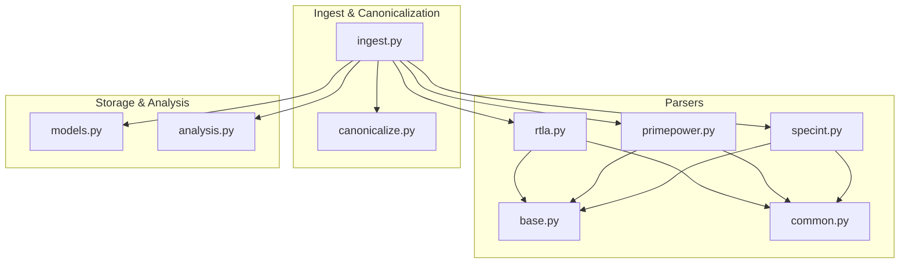
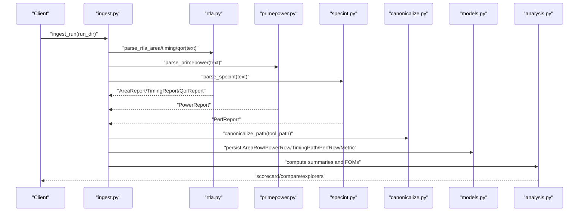
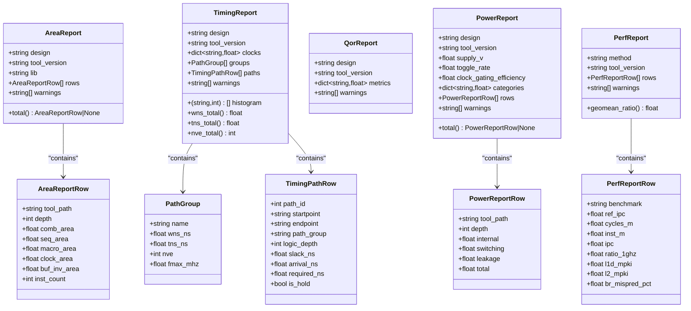
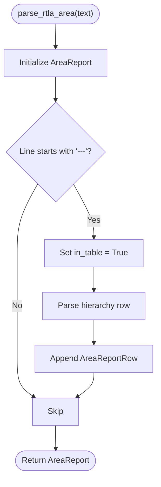
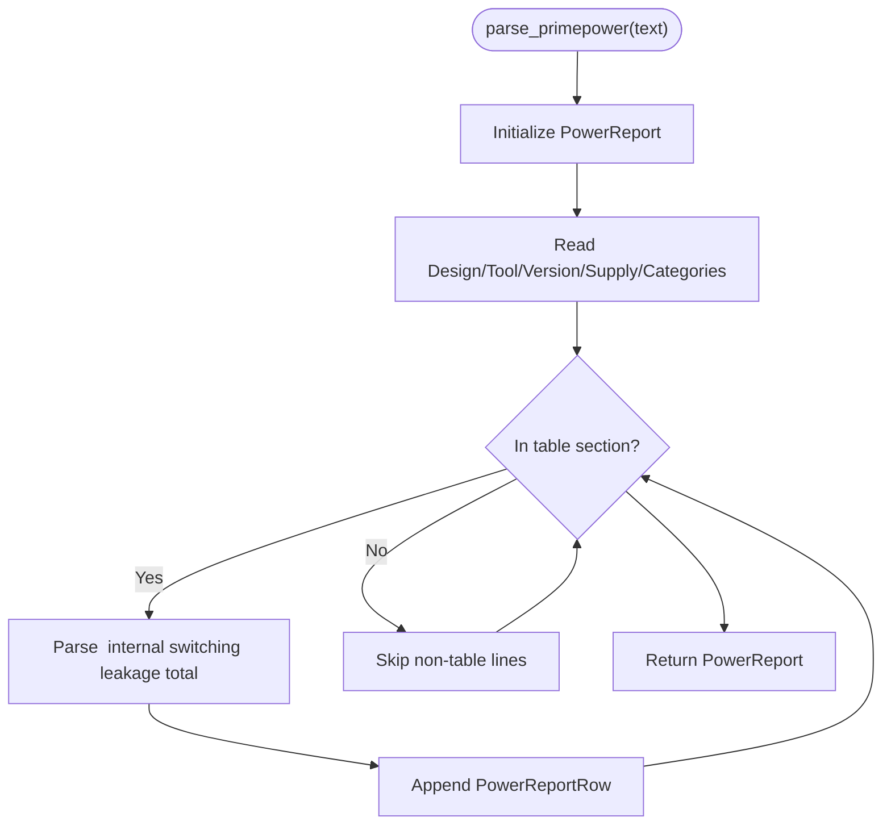
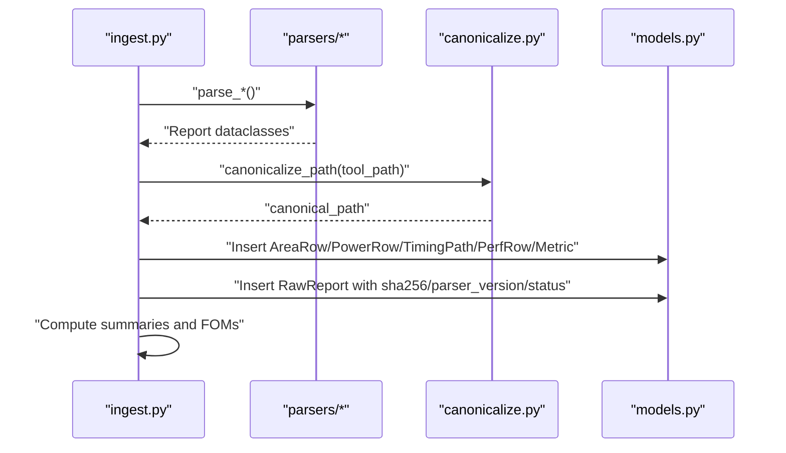
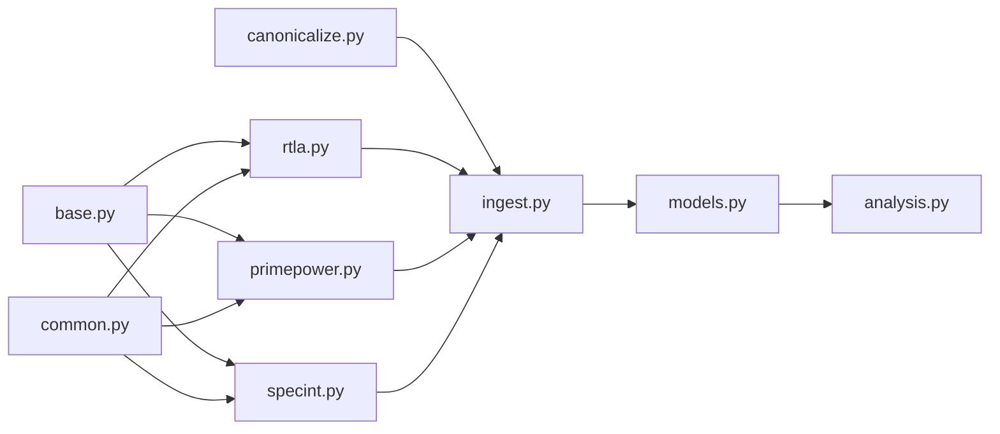

# Parser Architecture & Base Classes

<cite>
**Referenced Files in This Document**
- [base.py](file://backend/ppa/parsers/base.py)
- [common.py](file://backend/ppa/parsers/common.py)
- [rtla.py](file://backend/ppa/parsers/rtla.py)
- [primepower.py](file://backend/ppa/parsers/primepower.py)
- [specint.py](file://backend/ppa/parsers/specint.py)
- [canonicalize.py](file://backend/ppa/canonicalize.py)
- [ingest.py](file://backend/ppa/ingest.py)
- [models.py](file://backend/ppa/models.py)
- [analysis.py](file://backend/ppa/analysis.py)
</cite>

## Table of Contents
1. Introduction
2. Project Structure
3. Core Components
4. Architecture Overview
5. Detailed Component Analysis
6. Dependency Analysis
7. Performance Considerations
8. Troubleshooting Guide
9. Conclusion

## Introduction
This document explains the parser architecture and base classes that standardize EDA report ingestion in PPA-Profiler. It focuses on the dataclass-based result types (AreaReport, PowerReport, TimingReport, QorReport, PerfReport), the shared parsing utilities, and how parsers implement a consistent interface to produce canonical results. It also documents the canonical data model used by the ingest pipeline to persist and analyze cross-tool reports, enabling comparison across different EDA tools and runs.

## Project Structure
The parser subsystem lives under backend/ppa/parsers and is consumed by the ingest pipeline. The key layers are:
- Parsers: tool-specific text parsers that return standardized dataclasses
- Common utilities: shared helpers for number parsing and line splitting
- Canonicalization: hierarchy path normalization to unify tool-specific naming
- Ingest: orchestrates parsing, canonicalization, persistence, and derived metrics
- Models: SQLModel definitions for persistent storage and analysis queries

**Diagram sources**
- [rtla.py:1-182](file://backend/ppa/parsers/rtla.py#L1-L182)
- [primepower.py:1-86](file://backend/ppa/parsers/primepower.py#L1-L86)
- [specint.py:1-66](file://backend/ppa/parsers/specint.py#L1-L66)
- [base.py:1-139](file://backend/ppa/parsers/base.py#L1-L139)
- [common.py:1-33](file://backend/ppa/parsers/common.py#L1-L33)
- [ingest.py:1-312](file://backend/ppa/ingest.py#L1-L312)
- [canonicalize.py:1-79](file://backend/ppa/canonicalize.py#L1-L79)
- [models.py:1-217](file://backend/ppa/models.py#L1-L217)
- [analysis.py:1-439](file://backend/ppa/analysis.py#L1-L439)

**Section sources**
- [ingest.py:25-31](file://backend/ppa/ingest.py#L25-L31)
- [models.py:69-149](file://backend/ppa/models.py#L69-L149)

## Core Components
The core of the parser system is a set of dataclass-based result types that define a canonical schema for each report kind. These types ensure that downstream components (ingest, metrics, analysis) can rely on a stable contract regardless of the source tool or format.

Key result types:
- AreaReport and AreaReportRow: hierarchical area breakdown with per-level fields (combinational, sequential, macro, clock, buffer/inverter area, instruction count). Includes a convenience property to access the total row.
- TimingReport, PathGroup, TimingPathRow: timing summary including clocks, group-level WNS/TNS/NVE/Fmax, slack histogram, and detailed violating paths with start/endpoints, logic depth, slack, arrival/required times, and hold detection.
- QorReport: design-level quality-of-results metrics as a flexible key-value map.
- PowerReport and PowerReportRow: hierarchical power breakdown with internal, switching, leakage, and total power per module; plus design-level supply voltage, toggle rate, clock gating efficiency, and category totals. Includes a convenience property to access the total row.
- PerfReport and PerfReportRow: performance benchmark rows (e.g., SPECint) with IPC, cycles, instructions, ratio at 1 GHz, cache miss rates, branch misprediction, and a geometric mean helper.

These types provide:
- Strong typing and validation via dataclasses
- Optional fields for sparse data (e.g., optional MPKI values)
- Derived properties for common aggregations (e.g., wns_total, tns_total, geomean_ratio)

**Section sources**
- [base.py:7-139](file://backend/ppa/parsers/base.py#L7-L139)

## Architecture Overview
The parser architecture follows a clear separation of concerns:
- Tool-specific parsers parse raw text into standardized dataclasses
- The ingest pipeline coordinates parsing, canonicalizes hierarchy paths, persists normalized data, and computes derived metrics
- The analysis layer queries persisted data to serve UI views and AI tools

**Diagram sources**
- [ingest.py:61-240](file://backend/ppa/ingest.py#L61-L240)
- [rtla.py:25-182](file://backend/ppa/parsers/rtla.py#L25-L182)
- [primepower.py:19-86](file://backend/ppa/parsers/primepower.py#L19-L86)
- [specint.py:21-66](file://backend/ppa/parsers/specint.py#L21-L66)
- [canonicalize.py:19-79](file://backend/ppa/canonicalize.py#L19-L79)
- [models.py:93-149](file://backend/ppa/models.py#L93-L149)
- [analysis.py:69-167](file://backend/ppa/analysis.py#L69-L167)

## Detailed Component Analysis

### Dataclass Result Types (Canonical Report Model)
The canonical model defines a uniform shape for all reports, enabling cross-tool comparison and robust downstream processing.

**Diagram sources**
- [base.py:7-139](file://backend/ppa/parsers/base.py#L7-L139)

**Section sources**
- [base.py:7-139](file://backend/ppa/parsers/base.py#L7-L139)

### Parsing Utilities
Shared helpers reduce duplication and improve robustness across parsers:
- Number parsing with comma handling and scientific notation support
- Token splitting and key-value extraction

These utilities are used by all parsers to convert raw tokens into typed values safely.

**Section sources**
- [common.py:6-33](file://backend/ppa/parsers/common.py#L6-L33)

### RTLA Parsers (Area, Timing, QoR)
The RTLA parsers implement three report types:
- Area: extracts hierarchical area rows from indented tables, reconstructing full paths based on indentation depth
- Timing: parses clock periods, path group summaries, slack histograms, and top violating paths
- QoR: collects metric key-value pairs

Error handling includes raising a specific ParseError when critical sections are missing, ensuring early failure detection.

**Diagram sources**
- [rtla.py:25-71](file://backend/ppa/parsers/rtla.py#L25-L71)

**Section sources**
- [rtla.py:25-182](file://backend/ppa/parsers/rtla.py#L25-L182)

### PrimePower Parser (Hierarchical Power)
The PrimePower parser reads hierarchical power rows and category totals. It normalizes dot-separated paths and generate block indices so they align with RTLA’s canonical form. It also captures design-level metadata such as supply voltage, toggle rate, and clock gating efficiency.

**Diagram sources**
- [primepower.py:19-86](file://backend/ppa/parsers/primepower.py#L19-L86)

**Section sources**
- [primepower.py:1-86](file://backend/ppa/parsers/primepower.py#L1-L86)

### SPECint Parser (Performance)
The SPECint parser extracts per-benchmark performance metrics, including IPC, cycles, instructions, ratio at 1 GHz, and optional cache/branch metrics. It pads missing values and records unparsed lines as warnings.

**Section sources**
- [specint.py:1-66](file://backend/ppa/parsers/specint.py#L1-L66)

### Canonicalization and Path Normalization
To enable cross-tool joins, the system normalizes instance paths:
- Unifies separators ('.', '\', '/') to '/'
- Converts generate block indices like [0] to _0
- Removes dangling underscores left by certain naming styles
- Provides helpers for depth, parent, common ancestor, and owner module attribution

This ensures that area and power hierarchies can be compared even if tools use different path conventions.

**Section sources**
- [canonicalize.py:1-79](file://backend/ppa/canonicalize.py#L1-L79)

### Ingest Pipeline Integration
The ingest pipeline:
- Invokes parsers for each expected report file
- Records raw report metadata (sha256, parser version, parse status)
- Reconstructs full paths for area reports using indentation
- Canonicalizes paths and stores aliases mapping tool paths to canonical paths
- Persists normalized rows (AreaRow, PowerRow, TimingPath, PerfRow) and metrics
- Computes derived metrics and figures of merit
- Detects unmatched paths between area and power reports and creates data-quality findings

**Diagram sources**
- [ingest.py:61-240](file://backend/ppa/ingest.py#L61-L240)
- [canonicalize.py:19-79](file://backend/ppa/canonicalize.py#L19-L79)
- [models.py:69-149](file://backend/ppa/models.py#L69-L149)

**Section sources**
- [ingest.py:61-240](file://backend/ppa/ingest.py#L61-L240)

### Persistence Model
The database model mirrors the canonical report structures:
- AreaRow: hierarchical area with computed total_area
- PowerRow: hierarchical power with internal/switching/leakage/total
- TimingPath: individual timing paths with modules and slack metrics
- PerfRow: per-benchmark performance metrics
- Metric: tall table for arbitrary derived metrics
- RawReport: provenance and parse status for each input file

This design supports efficient querying and comparison across runs and domains.

**Section sources**
- [models.py:69-149](file://backend/ppa/models.py#L69-L149)

### Analysis Layer Usage
The analysis layer consumes persisted data to provide:
- Scorecards with Figures of Merit and budget comparisons
- Comparisons between runs with delta waterfalls
- Explorers for area, power, timing, and performance
- Hotspot identification combining area, power, and timing criticality
- Findings listing with severity and category filters

This demonstrates how the canonical parser outputs feed into high-level analytics and user interfaces.

**Section sources**
- [analysis.py:69-439](file://backend/ppa/analysis.py#L69-L439)

## Dependency Analysis
Parser dependencies and relationships:
- All parsers depend on base dataclasses for output structure
- Parsers share common utilities for robust token parsing
- PrimePower and RTLA parsers normalize paths to align with canonical forms
- Ingest depends on all parsers and canonicalization to build a unified dataset
- Analysis depends on models and metrics to serve views

**Diagram sources**
- [base.py:1-139](file://backend/ppa/parsers/base.py#L1-L139)
- [common.py:1-33](file://backend/ppa/parsers/common.py#L1-L33)
- [rtla.py:1-182](file://backend/ppa/parsers/rtla.py#L1-L182)
- [primepower.py:1-86](file://backend/ppa/parsers/primepower.py#L1-L86)
- [specint.py:1-66](file://backend/ppa/parsers/specint.py#L1-L66)
- [canonicalize.py:1-79](file://backend/ppa/canonicalize.py#L1-L79)
- [ingest.py:1-312](file://backend/ppa/ingest.py#L1-L312)
- [models.py:1-217](file://backend/ppa/models.py#L1-L217)
- [analysis.py:1-439](file://backend/ppa/analysis.py#L1-L439)

**Section sources**
- [ingest.py:25-31](file://backend/ppa/ingest.py#L25-L31)

## Performance Considerations
- Line-by-line parsing minimizes memory usage for large reports
- Regular expressions are used sparingly for well-defined patterns (clocks, groups, buckets)
- Canonicalization avoids expensive string operations by using simple replacements and splits
- Aggregations (e.g., wns_total, geomean_ratio) are computed lazily via properties where possible
- Ingest batches inserts and commits once per run to reduce database overhead

[No sources needed since this section provides general guidance]

## Troubleshooting Guide
Common issues and their handling:
- Missing report files: recorded as RawReport with parse_status "error" and log message
- Parser exceptions: caught and logged without halting other report ingestion
- Unparsed lines: appended to warnings for visibility and debugging
- Unmatched paths: detected between area and power reports and surfaced as data-quality findings

Use the ingest status view to inspect parse logs and identify problematic files or formats.

**Section sources**
- [ingest.py:93-113](file://backend/ppa/ingest.py#L93-L113)
- [ingest.py:230-239](file://backend/ppa/ingest.py#L230-L239)

## Conclusion
The parser architecture in PPA-Profiler establishes a robust, extensible foundation for integrating diverse EDA tools. By defining canonical dataclasses, providing shared parsing utilities, and enforcing path normalization, the system ensures data integrity and enables meaningful cross-tool analysis. The ingest pipeline transforms heterogeneous reports into a unified, queryable dataset, while the analysis layer exposes actionable insights through scorecards, comparisons, and explorers. This design supports future extensions with new parsers and tools while maintaining consistency and reliability.