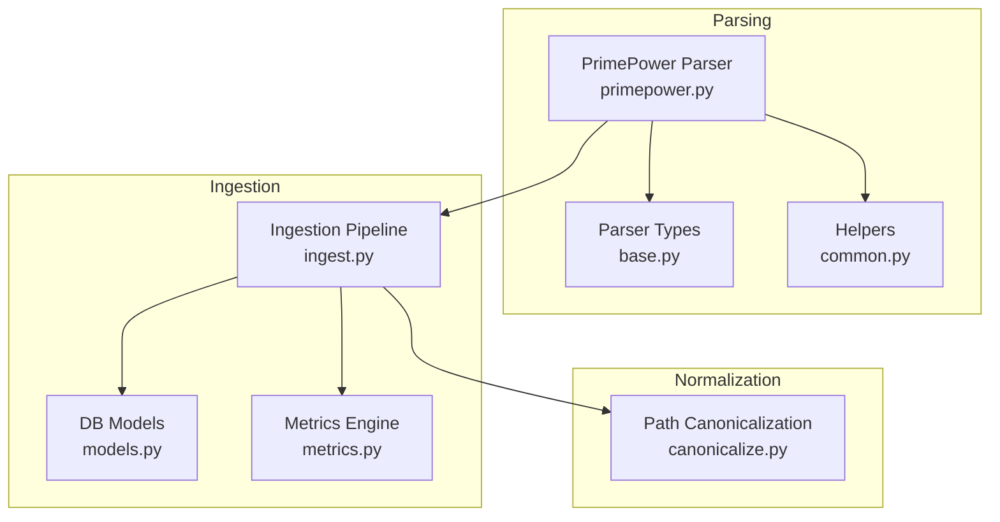
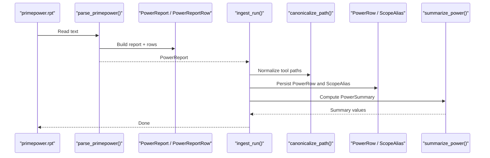
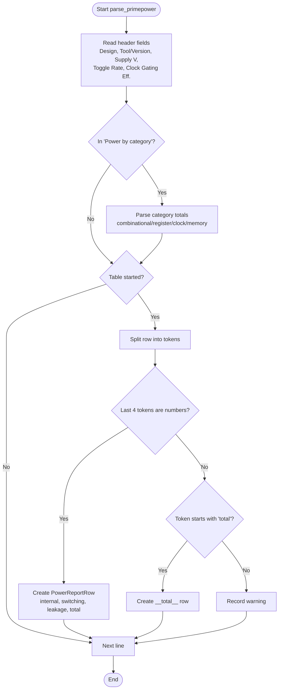
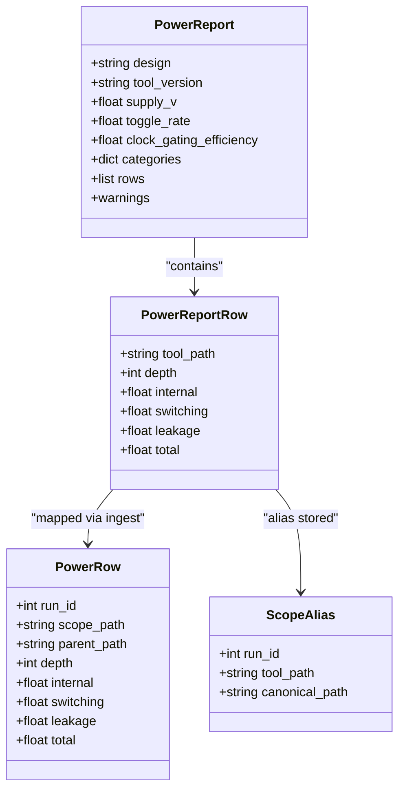
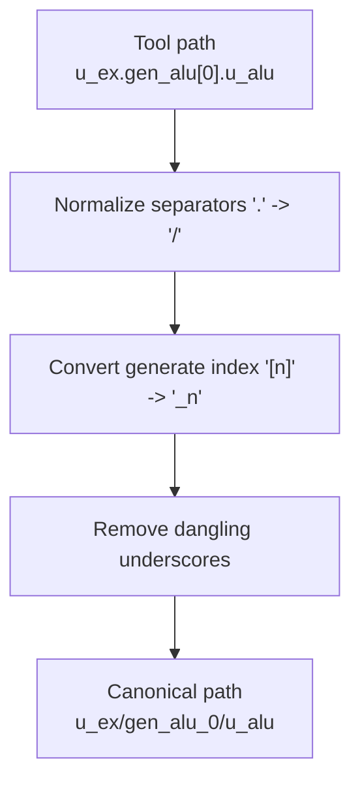
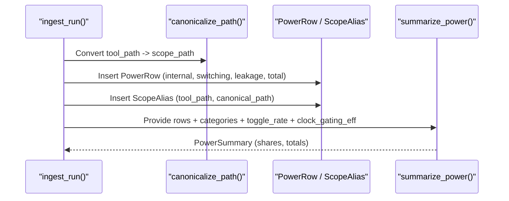
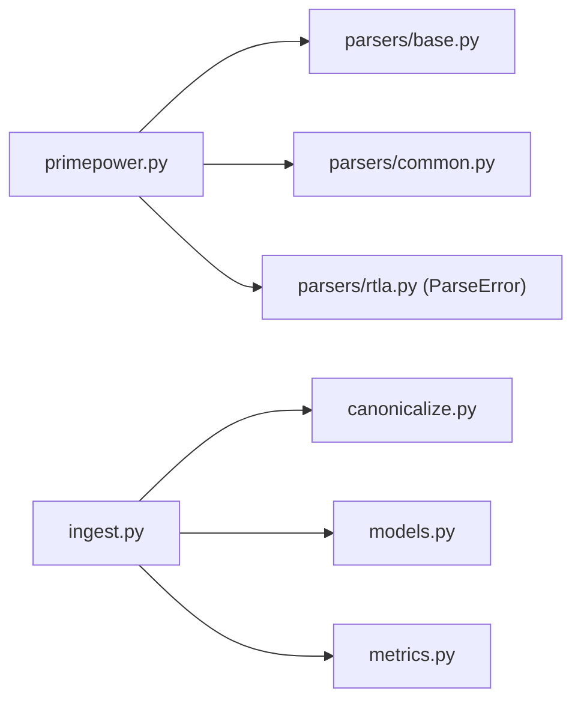

# PrimePower Parser Implementation

<cite>
**Referenced Files in This Document**
- [primepower.py](file://backend/ppa/parsers/primepower.py)
- [base.py](file://backend/ppa/parsers/base.py)
- [common.py](file://backend/ppa/parsers/common.py)
- [rtla.py](file://backend/ppa/parsers/rtla.py)
- [canonicalize.py](file://backend/ppa/canonicalize.py)
- [ingest.py](file://backend/ppa/ingest.py)
- [models.py](file://backend/ppa/models.py)
- [metrics.py](file://backend/ppa/metrics.py)
- [baseline primepower.rpt](file://sample_runs/baseline/primepower.rpt)
- [leaky primepower.rpt](file://sample_runs/leaky/primepower.rpt)
</cite>

## Table of Contents
1. [Introduction](#introduction)
2. [Project Structure](#project-structure)
3. [Core Components](#core-components)
4. [Architecture Overview](#architecture-overview)
5. [Detailed Component Analysis](#detailed-component-analysis)
6. [Dependency Analysis](#dependency-analysis)
7. [Performance Considerations](#performance-considerations)
8. [Troubleshooting Guide](#troubleshooting-guide)
9. [Conclusion](#conclusion)

## Introduction
This document explains the PrimePower parser implementation that processes vectorless hierarchical power reports to extract internal, switching, and leakage power components. It covers parsing logic for hierarchical breakdowns, supply voltage handling, default toggle rate extraction, category totals, and how parsed data is mapped into the canonical PowerReport model and persisted into the database. It also addresses error handling for malformed reports, performance considerations for large reports, and batch ingestion capabilities across multiple runs.

## Project Structure
The PrimePower parser lives under the parsers package and integrates with a shared parsing framework:
- Parser-specific logic: backend/ppa/parsers/primepower.py
- Shared types and structures: backend/ppa/parsers/base.py
- Parsing helpers (number conversion, tokenization): backend/ppa/parsers/common.py
- Canonical path normalization to align tool paths across domains: backend/ppa/canonicalize.py
- Ingestion pipeline that orchestrates parsing, canonicalization, persistence, and derived metrics: backend/ppa/ingest.py
- Database models for storing parsed results: backend/ppa/models.py
- Metrics engine for summaries and figures of merit: backend/ppa/metrics.py
- Sample PrimePower reports used for validation: sample_runs/*/primepower.rpt

**Diagram sources**
- [primepower.py:19-85](file://backend/ppa/parsers/primepower.py#L19-L85)
- [base.py:86-108](file://backend/ppa/parsers/base.py#L86-L108)
- [common.py:9-32](file://backend/ppa/parsers/common.py#L9-L32)
- [canonicalize.py:19-48](file://backend/ppa/canonicalize.py#L19-L48)
- [ingest.py:129-141](file://backend/ppa/ingest.py#L129-L141)
- [models.py:108-118](file://backend/ppa/models.py#L108-L118)
- [metrics.py:206-221](file://backend/ppa/metrics.py#L206-L221)

**Section sources**
- [primepower.py:1-85](file://backend/ppa/parsers/primepower.py#L1-L85)
- [ingest.py:25-31](file://backend/ppa/ingest.py#L25-L31)

## Core Components
- PrimePower parser: Reads report header metadata (design, tool version, supply voltage, default toggle rate, clock gating efficiency), parses “Power by category” totals, and iterates hierarchical rows to extract internal, switching, leakage, and total power per instance.
- Parser result model: PowerReport and PowerReportRow define the canonical in-memory representation returned by the parser.
- Path canonicalization: Converts tool-specific hierarchy paths (dot-separated, generate block indices) into a canonical slash-separated form to enable cross-domain joins with area/timing data.
- Ingestion: Orchestrates parsing, canonicalization, persistence to database tables (PowerRow, ScopeAlias), and computation of derived metrics and summaries.
- Metrics: Summarizes top-level power totals and categories, computes shares and efficiencies, and feeds higher-level figures of merit.

**Section sources**
- [primepower.py:19-85](file://backend/ppa/parsers/primepower.py#L19-L85)
- [base.py:86-108](file://backend/ppa/parsers/base.py#L86-L108)
- [canonicalize.py:19-48](file://backend/ppa/canonicalize.py#L19-L48)
- [ingest.py:129-141](file://backend/ppa/ingest.py#L129-L141)
- [metrics.py:206-221](file://backend/ppa/metrics.py#L206-L221)

## Architecture Overview
The PrimePower parser is one of several parsers invoked by the ingestion pipeline. It returns a typed PowerReport object which is then transformed into database rows and summarized into metrics.

**Diagram sources**
- [primepower.py:19-85](file://backend/ppa/parsers/primepower.py#L19-L85)
- [ingest.py:129-141](file://backend/ppa/ingest.py#L129-L141)
- [canonicalize.py:19-48](file://backend/ppa/canonicalize.py#L19-L48)
- [metrics.py:206-221](file://backend/ppa/metrics.py#L206-L221)

## Detailed Component Analysis

### PrimePower Parser Logic
- Header parsing: Extracts design name, tool version, supply voltage (V), default toggle rate, and clock gating efficiency percentage. These fields populate PowerReport attributes.
- Category totals: Parses “Power by category” section to capture combinational, register, clock, and memory power contributions. Keys are normalized to lowercase.
- Hierarchical rows: Iterates lines after the table separator, extracting instance names and four numeric columns: internal, switching, leakage, total. Indentation determines depth; a special “Total” line is captured with a sentinel tool_path.
- Error handling: Unparsed lines are recorded as warnings; if no hierarchy rows are found, a ParseError is raised.

**Diagram sources**
- [primepower.py:19-85](file://backend/ppa/parsers/primepower.py#L19-L85)

**Section sources**
- [primepower.py:19-85](file://backend/ppa/parsers/primepower.py#L19-L85)

### Data Structures and Mapping
- Parser output: PowerReport contains metadata (design, tool_version, supply_v, toggle_rate, clock_gating_efficiency), categories mapping, and a list of PowerReportRow entries.
- Database mapping: Each PowerReportRow maps to a PowerRow with scope_path (canonicalized), parent_path, depth, and power components. A ScopeAlias stores the original tool_path alongside the canonical path for traceability.
- Metrics mapping: The top-level PowerRow and categories feed PowerSummary, computing leakage share, clock power share, and other derived metrics.

**Diagram sources**
- [base.py:86-108](file://backend/ppa/parsers/base.py#L86-L108)
- [models.py:108-118](file://backend/ppa/models.py#L108-L118)
- [ingest.py:129-141](file://backend/ppa/ingest.py#L129-L141)

**Section sources**
- [base.py:86-108](file://backend/ppa/parsers/base.py#L86-L108)
- [models.py:108-118](file://backend/ppa/models.py#L108-L118)
- [ingest.py:129-141](file://backend/ppa/ingest.py#L129-L141)

### Hierarchy and Path Canonicalization
- Input formats: PrimePower uses dot-separated paths and generate block indices like u_ex.gen_alu[0].u_alu.
- Canonicalization: Replaces separators to slashes, converts generate indices to underscore-formatted segments, and cleans up dangling underscores to produce stable canonical paths such as u_ex/gen_alu_0/u_alu.
- Depth and parent: depth_of counts segments; parent_of extracts the immediate parent path.

**Diagram sources**
- [canonicalize.py:19-48](file://backend/ppa/canonicalize.py#L19-L48)

**Section sources**
- [canonicalize.py:19-48](file://backend/ppa/canonicalize.py#L19-L48)

### Supply Voltage and Toggle Rate Handling
- Supply voltage: Parsed from the “Supply” line, stripping units and converting to float; defaults to 0.0 if missing or invalid.
- Default toggle rate: Parsed from “Default toggle rate” line; stored as a float for later use in metrics and analysis.
- Clock gating efficiency: Parsed from “Clock gating efficiency” line, stripping percent sign; stored for summary and reporting.

**Section sources**
- [primepower.py:31-42](file://backend/ppa/parsers/primepower.py#L31-L42)

### Example Input Formats
- Baseline example includes header metadata, category totals, and hierarchical rows with indentation indicating depth.
- Leaky example demonstrates higher leakage contributions while maintaining the same structure.

Key elements present in both examples:
- Design, Version, Supply, Default toggle rate, Clock gating efficiency
- Power by category (mW)
- Hierarchical power (mW) with Instance, Internal, Switching, Leakage, Total columns
- Total row at the end

**Section sources**
- [baseline primepower.rpt:1-42](file://sample_runs/baseline/primepower.rpt#L1-L42)
- [leaky primepower.rpt:1-42](file://sample_runs/leaky/primepower.rpt#L1-L42)

### Error Handling for Malformed Reports
- Warnings: Lines that do not match expected patterns are appended to warnings for visibility without halting parsing.
- Fatal errors: If no hierarchy rows are found, a ParseError is raised to signal a malformed or incompatible report format.
- Ingestion resilience: During batch ingestion, individual parser failures are caught and recorded as parse errors without aborting processing of other reports.

**Section sources**
- [primepower.py:81-85](file://backend/ppa/parsers/primepower.py#L81-L85)
- [ingest.py:100-113](file://backend/ppa/ingest.py#L100-L113)

### Integration with Ingestion and Metrics
- Ingestion: After parsing, each row’s tool_path is canonicalized and stored as scope_path; parent_path and depth are computed. Original tool_path is preserved in ScopeAlias.
- Metrics: The top-level PowerRow and categories are used to compute PowerSummary, including leakage share and clock power share. Derived metrics are persisted as key-value metrics for downstream analysis.

**Diagram sources**
- [ingest.py:129-141](file://backend/ppa/ingest.py#L129-L141)
- [metrics.py:206-221](file://backend/ppa/metrics.py#L206-L221)

**Section sources**
- [ingest.py:129-141](file://backend/ppa/ingest.py#L129-L141)
- [metrics.py:206-221](file://backend/ppa/metrics.py#L206-L221)

## Dependency Analysis
- PrimePower parser depends on:
  - base.PowerReport and base.PowerReportRow for structured output
  - common.to_float for robust numeric parsing
  - rtla.ParseError for consistent error signaling
- Ingestion depends on:
  - canonicalize functions for path normalization
  - models for database schema
  - metrics for summaries and derived values
- External inputs:
  - Sample PrimePower reports provide realistic input formats

**Diagram sources**
- [primepower.py:12-14](file://backend/ppa/parsers/primepower.py#L12-L14)
- [ingest.py:11-23](file://backend/ppa/ingest.py#L11-L23)

**Section sources**
- [primepower.py:12-14](file://backend/ppa/parsers/primepower.py#L12-L14)
- [ingest.py:11-23](file://backend/ppa/ingest.py#L11-L23)

## Performance Considerations
- Line-by-line parsing: The parser processes reports line by line, minimizing memory overhead and enabling streaming-like behavior even for large files.
- Numeric parsing: Uses a helper to handle comma-separated thousands and scientific notation, reducing parsing errors and improving robustness.
- Batch ingestion: The ingestion loop handles multiple report types per run directory and continues processing even if one parser fails, recording errors for later inspection.
- Path canonicalization: Regex-based transformations are efficient and applied per row; caching could be considered if repeated paths dominate.
- Metrics computation: Summaries operate on aggregated data (top-level row and categories), avoiding expensive per-row computations.

Optimization opportunities:
- Precompile regexes once and reuse across calls (already done in canonicalize).
- Consider incremental parsing for extremely large reports if needed.
- Profile numeric conversions if reports contain massive numbers of rows.

[No sources needed since this section provides general guidance]

## Troubleshooting Guide
Common issues and resolutions:
- No hierarchy rows found: Indicates the report lacks expected hierarchical sections or formatting has changed. Check report structure against known formats and adjust parser column positions if necessary.
- Unparsed lines: Warnings indicate lines that did not match expected patterns. Review report layout and ensure alignment with expected columns.
- Missing supply or toggle rate: Defaults are applied; verify report headers include these fields if required for downstream analysis.
- Path mismatches: Canonicalization ensures consistent paths; unmatched paths between power and area reports trigger data-quality findings. Investigate differences in naming conventions or generate block indexing.

**Section sources**
- [primepower.py:81-85](file://backend/ppa/parsers/primepower.py#L81-L85)
- [ingest.py:230-239](file://backend/ppa/ingest.py#L230-L239)

## Conclusion
The PrimePower parser reliably extracts hierarchical power metrics from vectorless reports, normalizes them into a canonical model, and integrates with the ingestion pipeline to persist and summarize data. It handles supply voltage, toggle rates, and category totals, and provides robust error handling for malformed reports. The canonicalization layer enables cross-domain joins with area and timing data, supporting comprehensive analysis and performance evaluation. For large reports, the line-by-line approach and resilient ingestion ensure scalability and maintainability.