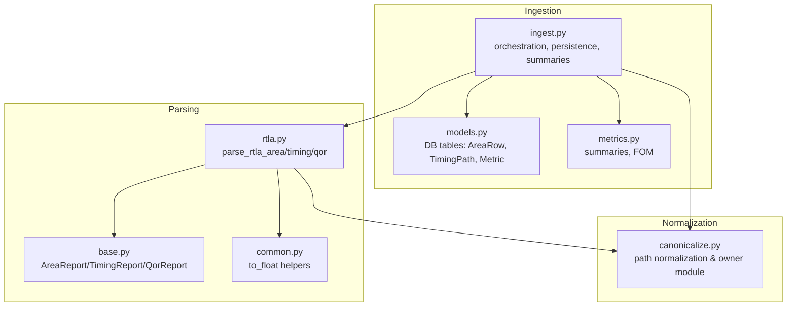
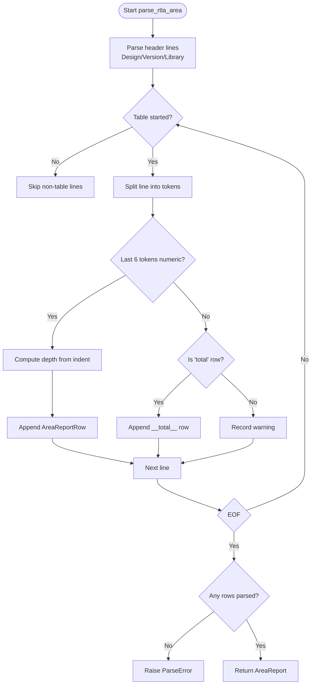
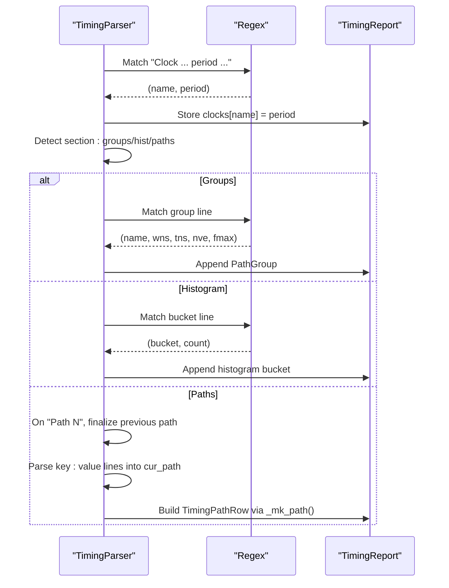
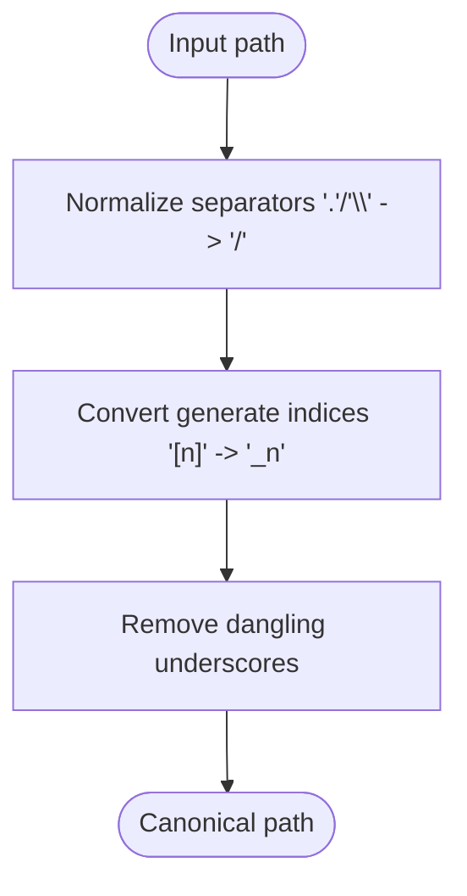
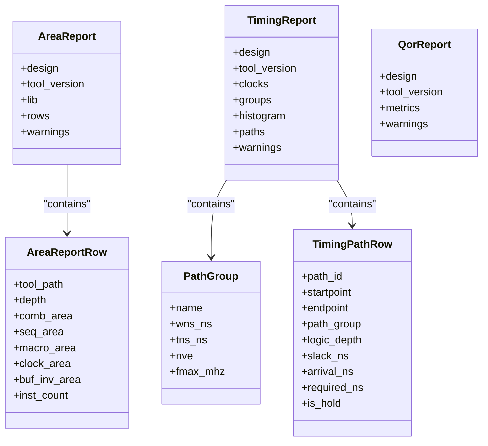
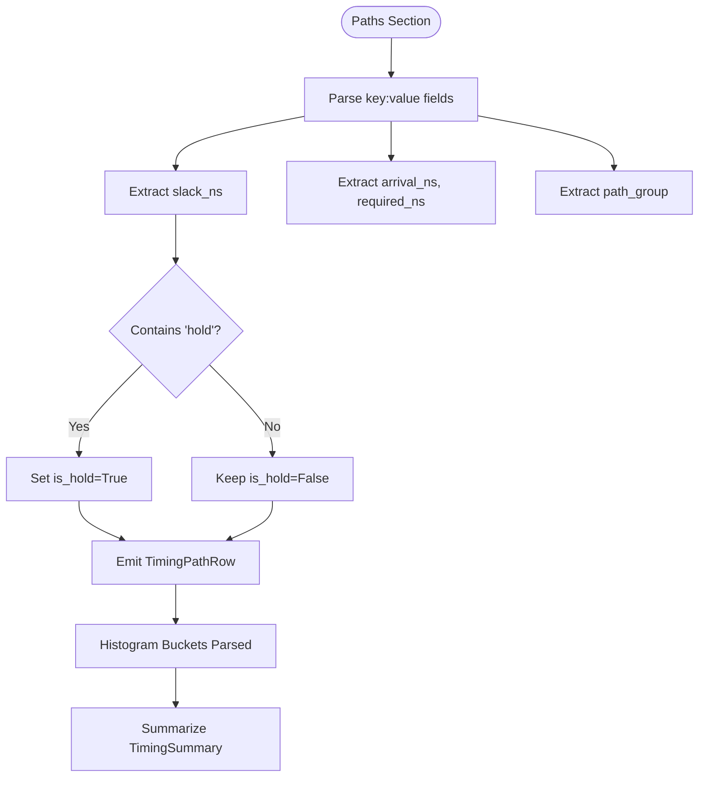
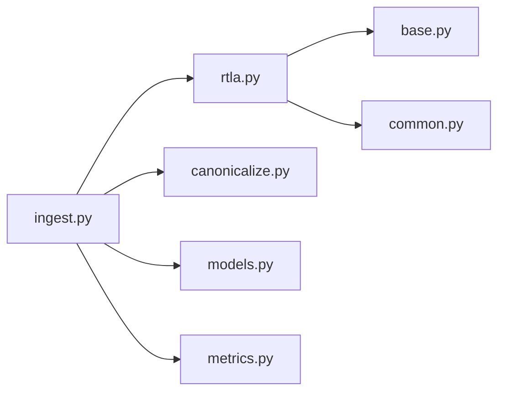

# RTLA Parser Implementation

<cite>
**Referenced Files in This Document**
- [rtla.py](file://backend/ppa/parsers/rtla.py)
- [base.py](file://backend/ppa/parsers/base.py)
- [common.py](file://backend/ppa/parsers/common.py)
- [canonicalize.py](file://backend/ppa/canonicalize.py)
- [ingest.py](file://backend/ppa/ingest.py)
- [models.py](file://backend/ppa/models.py)
- [metrics.py](file://backend/ppa/metrics.py)
- [rtla_area.rpt](file://sample_runs/baseline/rtla_area.rpt)
- [rtla_timing.rpt](file://sample_runs/baseline/rtla_timing.rpt)
- [rtla_qor.rpt](file://sample_runs/baseline/rtla_qor.rpt)
</cite>

## Table of Contents
1. [Introduction](#introduction)
2. [Project Structure](#project-structure)
3. [Core Components](#core-components)
4. [Architecture Overview](#architecture-overview)
5. [Detailed Component Analysis](#detailed-component-analysis)
6. [Dependency Analysis](#dependency-analysis)
7. [Performance Considerations](#performance-considerations)
8. [Troubleshooting Guide](#troubleshooting-guide)
9. [Conclusion](#conclusion)
10. [Appendices](#appendices)

## Introduction
This document explains the RTLA (RTL-Architect) parser implementation used by the PPA Profiler to ingest and normalize RTL-to-architect reports. It covers how the parser handles three primary report types:
- Area reports (hierarchical area breakdown)
- Timing reports (path groups, slack histograms, top violating paths)
- Quality of Results (QoR) summaries (key metrics)

It details parsing logic for area breakdowns by component type, timing path analysis with slack calculations, clock domain handling, and histogram generation. It also documents conversion from RTLA-specific output into canonical data models (AreaReport, TimingReport, QorReport), and how these are persisted and summarized into downstream metrics. Finally, it addresses versioning and format variation handling.

## Project Structure
The RTLA parsing pipeline is implemented as a small set of focused modules:
- Parsers: parse raw text into typed dataclasses
- Canonicalization: normalize hierarchy paths across tools
- Ingestion: orchestrate parsing, persistence, and metric derivation
- Models: define database schema and canonical row types
- Metrics: compute summaries and figures of merit



**Diagram sources**
- [rtla.py:25-181](file://backend/ppa/parsers/rtla.py#L25-L181)
- [base.py:7-83](file://backend/ppa/parsers/base.py#L7-L83)
- [common.py:9-32](file://backend/ppa/parsers/common.py#L9-L32)
- [canonicalize.py:19-78](file://backend/ppa/canonicalize.py#L19-L78)
- [ingest.py:25-252](file://backend/ppa/ingest.py#L25-L252)
- [models.py:69-135](file://backend/ppa/models.py#L69-L135)
- [metrics.py:14-137](file://backend/ppa/metrics.py#L14-L137)

**Section sources**
- [rtla.py:1-181](file://backend/ppa/parsers/rtla.py#L1-L181)
- [ingest.py:1-312](file://backend/ppa/ingest.py#L1-L312)

## Core Components
- Area parser: parses hierarchical area rows, computes depth from indentation, and captures totals.
- Timing parser: extracts clocks, path group summaries, slack histograms, and top violating paths; builds TimingPathRow objects.
- QoR parser: extracts key metrics into a dictionary.
- Canonicalization: normalizes tool-reported instance paths to a canonical form and attributes timing paths to owning modules.
- Ingestion: orchestrates parsing, persists results, derives summaries, and stores derived metrics.

Key data structures:
- AreaReport, AreaReportRow: hierarchical area breakdown per module.
- TimingReport, PathGroup, TimingPathRow: timing summary, per-group stats, and per-path details.
- QorReport: key QoR metrics.

**Section sources**
- [base.py:7-83](file://backend/ppa/parsers/base.py#L7-L83)
- [rtla.py:25-181](file://backend/ppa/parsers/rtla.py#L25-L181)

## Architecture Overview
End-to-end flow from raw RTLA reports to canonical metrics:

```mermaid
sequenceDiagram
participant FS as "Filesystem"
participant ING as "ingest.py"
participant PAR as "rtla.py"
participant CAN as "canonicalize.py"
participant DB as "models.py"
participant MET as "metrics.py"
FS-->>ING : Read rtla_area.rpt / rtla_timing.rpt / rtla_qor.rpt
ING->>PAR : parse_rtla_area(text)
PAR-->>ING : AreaReport
ING->>CAN : canonicalize_path(tool_path)
CAN-->>ING : canonical scope_path
ING->>DB : Insert AreaRow, ScopeAlias
ING->>PAR : parse_rtla_timing(text)
PAR-->>ING : TimingReport (clocks, groups, histogram, paths)
ING->>CAN : canonicalize_path(startpoint/endpoint)
ING->>DB : Insert TimingPath
ING->>PAR : parse_rtla_qor(text)
PAR-->>ING : QorReport (metrics dict)
ING->>DB : Insert Metric rows (qor.*)
ING->>MET : summarize_area / summarize_timing / figures_of_merit
MET-->>ING : Derived metrics
ING->>DB : Insert derived metrics
```

**Diagram sources**
- [ingest.py:93-228](file://backend/ppa/ingest.py#L93-L228)
- [rtla.py:25-181](file://backend/ppa/parsers/rtla.py#L25-L181)
- [canonicalize.py:19-78](file://backend/ppa/canonicalize.py#L19-L78)
- [models.py:69-135](file://backend/ppa/models.py#L69-L135)
- [metrics.py:192-234](file://backend/ppa/metrics.py#L192-L234)

## Detailed Component Analysis

### Area Report Parsing
- Input format: Hierarchical table with columns for comb, seq, macro, clock, buf/inv areas, and cell counts. Indentation encodes hierarchy depth.
- Logic:
  - Detect header lines (Design, Version/Library) and table start marker.
  - For each row, split tokens; validate last six tokens as numbers to identify area rows.
  - Compute depth from indentation and append AreaReportRow.
  - Capture total row separately for roll-up validation.
  - Warn on unparsed lines; raise error if no rows found.



**Diagram sources**
- [rtla.py:25-71](file://backend/ppa/parsers/rtla.py#L25-L71)

**Section sources**
- [rtla.py:25-71](file://backend/ppa/parsers/rtla.py#L25-L71)
- [base.py:7-30](file://backend/ppa/parsers/base.py#L7-L30)

### Timing Report Parsing
- Input format: Clock definition, path group summary table, setup slack histogram, and top violating paths with fields like startpoint, endpoint, path group, logic depth, slack, arrival, required.
- Logic:
  - Extract clock name and period via regex.
  - Identify sections by keywords: path group summary, histogram, top paths.
  - Parse path group rows into PathGroup (excluding total).
  - Parse histogram buckets into list of (label, count).
  - Parse each path block into TimingPathRow; handle continuation lines for startpoint/endpoint.
  - Derive is_hold based on path_group or slack field content.



**Diagram sources**
- [rtla.py:76-150](file://backend/ppa/parsers/rtla.py#L76-L150)

**Section sources**
- [rtla.py:76-150](file://backend/ppa/parsers/rtla.py#L76-L150)
- [base.py:32-75](file://backend/ppa/parsers/base.py#L32-L75)

### QoR Summary Parsing
- Input format: Key-value metrics table under a “Metric” header.
- Logic:
  - After header, read lines until end; split into name/value pairs.
  - Convert value to float; store in metrics dict.
  - Warn on unparsable lines; raise error if no metrics found.

**Section sources**
- [rtla.py:155-181](file://backend/ppa/parsers/rtla.py#L155-L181)
- [base.py:77-83](file://backend/ppa/parsers/base.py#L77-L83)

### Hierarchy Path Canonicalization
- Purpose: Normalize different path spellings (separators, generate blocks, trailing underscores) into a single canonical form.
- Behavior:
  - Replace separators '.' and '\' with '/'.
  - Convert generate indices like gen_x[0] to gen_x_0.
  - Remove dangling underscores left by certain naming styles.
  - Provide utilities for depth, parent, common ancestor, and owner module attribution.



**Diagram sources**
- [canonicalize.py:19-40](file://backend/ppa/canonicalize.py#L19-L40)

**Section sources**
- [canonicalize.py:19-78](file://backend/ppa/canonicalize.py#L19-L78)

### Conversion to Canonical Data Models
- Area:
  - Reconstruct full paths from indentation using a stack; map to canonical paths.
  - Persist AreaRow with computed total_area and metadata; record ScopeAlias mapping tool_path to canonical_path.
- Timing:
  - Canonicalize startpoint/endpoint; attribute start_module/end_module via owner_module.
  - Persist TimingPath with slack, arrival, required, logic_depth, and hold detection.
- QoR:
  - Store each metric as a Metric row with key prefixed by “qor.”.



**Diagram sources**
- [base.py:7-83](file://backend/ppa/parsers/base.py#L7-L83)

**Section sources**
- [ingest.py:115-169](file://backend/ppa/ingest.py#L115-L169)
- [models.py:93-135](file://backend/ppa/models.py#L93-L135)

### Clock Domain Handling
- The timing parser extracts clock names and periods from the report header and stores them in TimingReport.clocks.
- During ingestion, timing paths are stored with a default clock label “clk”. If multiple clocks exist, downstream consumers can use TimingReport.clocks to interpret slack relative to the appropriate clock period.

**Section sources**
- [rtla.py:76-90](file://backend/ppa/parsers/rtla.py#L76-L90)
- [ingest.py:143-153](file://backend/ppa/ingest.py#L143-L153)

### Slack Calculations and Histogram Generation
- Slack per path is parsed directly from the “Slack” field and stored in TimingPathRow.slack_ns.
- Path group summaries provide WNS and TNS per group; the timing summary aggregates these to compute overall WNS/TNS/NVE and derive Fmax.
- Histogram buckets are parsed as (label, count) tuples and later converted to a list of dicts for summaries.



**Diagram sources**
- [rtla.py:106-150](file://backend/ppa/parsers/rtla.py#L106-L150)
- [metrics.py:224-234](file://backend/ppa/metrics.py#L224-L234)

**Section sources**
- [rtla.py:106-150](file://backend/ppa/parsers/rtla.py#L106-L150)
- [metrics.py:14-30](file://backend/ppa/metrics.py#L14-L30)

### Examples of RTLA Output Formats
- Area report example: Hierarchical table with indented module names and numeric columns for area breakdown and cell counts. See sample file for structure.
- Timing report example: Clock definition, path group summary table, setup slack histogram, and top violating paths with labeled fields.
- QoR report example: Key-value metrics table under a “Metric” header.

These formats drive the parsers’ tokenization and regex matching strategies.

**Section sources**
- [rtla_area.rpt:1-34](file://sample_runs/baseline/rtla_area.rpt#L1-L34)
- [rtla_timing.rpt:1-86](file://sample_runs/baseline/rtla_timing.rpt#L1-L86)
- [rtla_qor.rpt:1-17](file://sample_runs/baseline/rtla_qor.rpt#L1-L17)

## Dependency Analysis
The RTLA parser depends on shared parsing utilities and integrates with canonicalization and ingestion layers.



**Diagram sources**
- [rtla.py:11-14](file://backend/ppa/parsers/rtla.py#L11-L14)
- [ingest.py:11-23](file://backend/ppa/ingest.py#L11-L23)

**Section sources**
- [rtla.py:11-14](file://backend/ppa/parsers/rtla.py#L11-L14)
- [ingest.py:11-23](file://backend/ppa/ingest.py#L11-L23)

## Performance Considerations
- Line-by-line parsing is efficient and memory-light; suitable for large reports.
- Regex usage is minimal and targeted to known patterns; avoid overfitting to exact whitespace.
- Path reconstruction uses a simple stack; O(n) over rows.
- Canonicalization applies string operations per path; complexity proportional to path length.
- Avoid unnecessary conversions; only parse numeric fields when needed.

[No sources needed since this section provides general guidance]

## Troubleshooting Guide
Common issues and mitigations:
- Missing files: Ingestion records RawReport with parse_status “error” and continues processing other reports.
- Unparsed lines: Parsers append warnings; ingestion logs up to 50 warnings per report.
- No rows found: Parsers raise ParseError; ingestion catches exceptions and records parse_log.
- Format drift: The parser includes a version tag (“rtla-0.1”) and comments advising verification against real outputs; adjust token positions if necessary.

Recommended checks:
- Use provided sample reports to validate parser behavior.
- Inspect RawReport.parse_log for detailed diagnostics.
- Verify that path canonicalization matches expected hierarchy.

**Section sources**
- [ingest.py:93-113](file://backend/ppa/ingest.py#L93-L113)
- [rtla.py:69-71](file://backend/ppa/parsers/rtla.py#L69-L71)
- [rtla.py:133-135](file://backend/ppa/parsers/rtla.py#L133-L135)
- [rtla.py:179-181](file://backend/ppa/parsers/rtla.py#L179-L181)

## Conclusion
The RTLA parser implementation provides robust, versioned parsing for area, timing, and QoR reports, converting them into canonical models for storage and analysis. It handles hierarchy normalization, clock domain extraction, slack-based timing analysis, and histogram parsing. The ingestion layer ensures persistence, metric derivation, and data-quality findings. With clear separation of concerns and defensive parsing, the system remains adaptable to format variations while maintaining reliable downstream analytics.

[No sources needed since this section summarizes without analyzing specific files]

## Appendices

### Sample Data References
- Area report: hierarchical breakdown with indented modules and numeric columns.
- Timing report: clock definitions, path group summaries, slack histograms, and top violating paths.
- QoR report: key metrics such as area, cell count, critical path levels, WNS/TNS, and estimated Fmax.

**Section sources**
- [rtla_area.rpt:1-34](file://sample_runs/baseline/rtla_area.rpt#L1-L34)
- [rtla_timing.rpt:1-86](file://sample_runs/baseline/rtla_timing.rpt#L1-L86)
- [rtla_qor.rpt:1-17](file://sample_runs/baseline/rtla_qor.rpt#L1-L17)