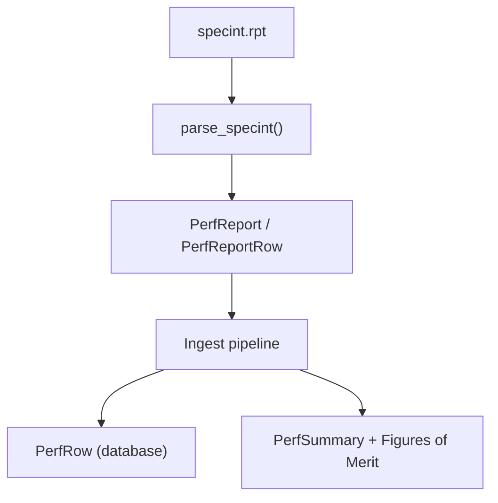
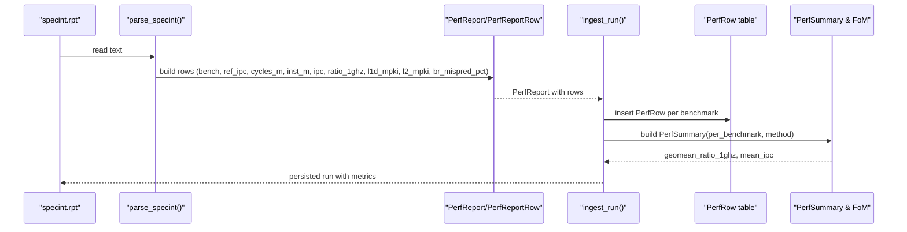
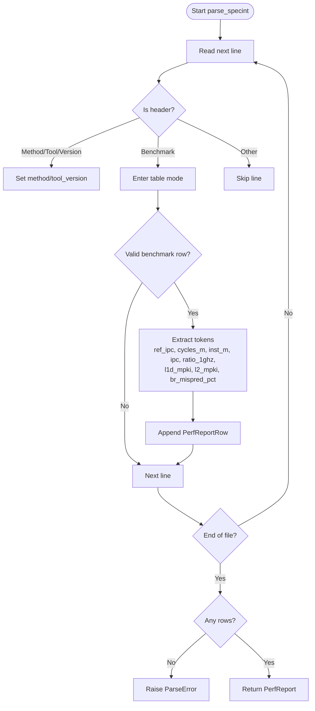
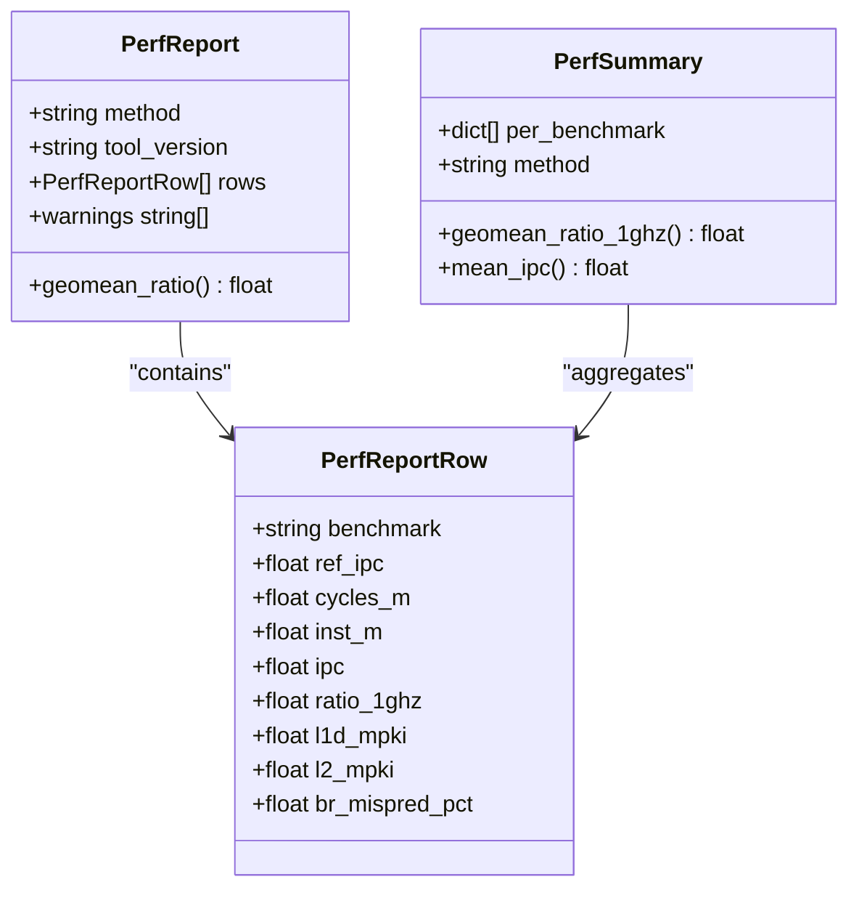
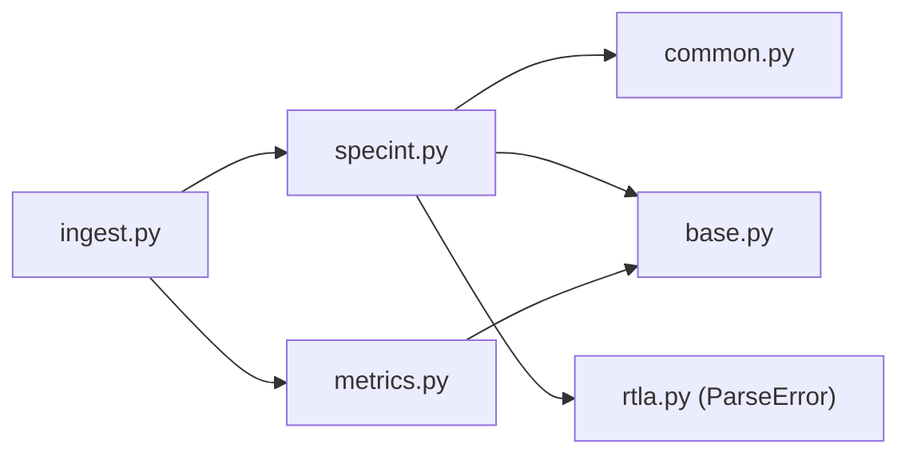

# SPECint Performance Parser

<cite>
**Referenced Files in This Document**
- [specint.py](file://backend/ppa/parsers/specint.py)
- [base.py](file://backend/ppa/parsers/base.py)
- [common.py](file://backend/ppa/parsers/common.py)
- [models.py](file://backend/ppa/models.py)
- [ingest.py](file://backend/ppa/ingest.py)
- [metrics.py](file://backend/ppa/metrics.py)
- [rtla.py](file://backend/ppa/parsers/rtla.py)
- [specint.rpt (baseline sample)](file://sample_runs/baseline/specint.rpt)
</cite>

## Table of Contents
1. [Introduction](#introduction)
2. [Project Structure](#project-structure)
3. [Core Components](#core-components)
4. [Architecture Overview](#architecture-overview)
5. [Detailed Component Analysis](#detailed-component-analysis)
6. [Dependency Analysis](#dependency-analysis)
7. [Performance Considerations](#performance-considerations)
8. [Troubleshooting Guide](#troubleshooting-guide)
9. [Conclusion](#conclusion)
10. [Appendices](#appendices)

## Introduction
This document explains the SPECint performance benchmark parser that processes SPECint-style reports to extract per-benchmark performance metrics, including IPC (Instructions Per Cycle), cycle counts, instruction counts, and normalized ratios at 1 GHz. It also documents how the parser handles reference performance normalization, geometric mean calculations, and mapping into the canonical PerfReport data model and database schema. Where available, it covers handling of cache miss rates (L1D MPKI, L2 MPKI) and branch prediction statistics (branch misprediction percentage).

## Project Structure
The SPECint parsing pipeline is part of a broader ingestion system that reads multiple report types and persists them into a relational store with typed metric tables. The SPECint-specific logic lives in a dedicated parser module and integrates with shared parsing utilities and canonical models.

**Diagram sources**
- [specint.py:21-65](file://backend/ppa/parsers/specint.py#L21-L65)
- [base.py:111-139](file://backend/ppa/parsers/base.py#L111-L139)
- [ingest.py:155-187](file://backend/ppa/ingest.py#L155-L187)
- [metrics.py:70-137](file://backend/ppa/metrics.py#L70-L137)

**Section sources**
- [specint.py:1-66](file://backend/ppa/parsers/specint.py#L1-L66)
- [ingest.py:25-31](file://backend/ppa/ingest.py#L25-L31)

## Core Components
- SPECint parser: parses per-benchmark rows from SPECint-style text output, extracting fields such as ref IPC, cycles, instructions, IPC, ratio@1GHz, and optional microarchitectural stats.
- Canonical data model: defines PerfReport and PerfReportRow structures used by parsers and downstream components.
- Ingestion pipeline: orchestrates parsing, persistence, and derivation of summary metrics and figures of merit.
- Metrics engine: computes geometric means, mean IPC, and higher-level figures of merit combining performance, timing, area, and power.

Key responsibilities:
- Robust tokenization and numeric conversion for varied formats.
- Graceful handling of missing or optional fields.
- Mapping parsed results into typed database rows for analysis.
- Deriving geometric mean and other aggregate metrics for reporting.

**Section sources**
- [specint.py:21-65](file://backend/ppa/parsers/specint.py#L21-L65)
- [base.py:111-139](file://backend/ppa/parsers/base.py#L111-L139)
- [ingest.py:155-187](file://backend/ppa/ingest.py#L155-L187)
- [metrics.py:70-137](file://backend/ppa/metrics.py#L70-L137)

## Architecture Overview
The end-to-end flow starts with reading a SPECint report file, parsing it into an in-memory report object, persisting each row to the database, and computing derived metrics for comparison and visualization.

**Diagram sources**
- [specint.py:21-65](file://backend/ppa/parsers/specint.py#L21-L65)
- [ingest.py:155-187](file://backend/ppa/ingest.py#L155-L187)
- [metrics.py:70-137](file://backend/ppa/metrics.py#L70-L137)

## Detailed Component Analysis

### SPECint Parser Logic
The parser scans lines to identify header metadata (method, tool version), then enters a table region after encountering a Benchmark header. It skips separator lines and extracts tokens for each benchmark row. It expects at least six tokens per row and maps them to:
- benchmark name
- ref IPC
- cycles (millions)
- instructions (millions)
- IPC
- ratio@1GHz
- optional L1D MPKI, L2 MPKI, branch misprediction percentage

Missing values are treated as zero where appropriate; optional fields can be None if not present. If no benchmark rows are found, it raises a parse error.

**Diagram sources**
- [specint.py:21-65](file://backend/ppa/parsers/specint.py#L21-L65)

**Section sources**
- [specint.py:21-65](file://backend/ppa/parsers/specint.py#L21-L65)

### Data Models and Mapping
- In-memory model: PerfReport contains method, tool_version, rows, and warnings. Each PerfReportRow holds benchmark-specific metrics and optional microarchitectural stats.
- Database model: PerfRow mirrors these fields for persistence, enabling queries and comparisons across runs.

Mapping highlights:
- Direct field mapping from PerfReportRow to PerfRow during ingestion.
- Optional fields (cache misses, branch mispredictions) are preserved as nullable values.

**Section sources**
- [base.py:111-139](file://backend/ppa/parsers/base.py#L111-L139)
- [models.py:137-149](file://backend/ppa/models.py#L137-L149)
- [ingest.py:155-163](file://backend/ppa/ingest.py#L155-L163)

### Reference Normalization and Geometric Mean
- Reference normalization: Each benchmark includes a ref IPC value representing the reference implementation’s IPC. The parser preserves this value alongside measured IPC and ratio@1GHz.
- Geometric mean calculation: The metrics engine computes the geometric mean of ratio@1GHz across benchmarks to produce a single performance index. This avoids arithmetic mean bias and aligns with standard benchmark aggregation practices.

**Diagram sources**
- [base.py:111-139](file://backend/ppa/parsers/base.py#L111-L139)
- [metrics.py:70-86](file://backend/ppa/metrics.py#L70-L86)

**Section sources**
- [base.py:124-139](file://backend/ppa/parsers/base.py#L124-L139)
- [metrics.py:70-86](file://backend/ppa/metrics.py#L70-L86)

### Cache Miss Rates and Branch Prediction Statistics
Where available, the parser captures:
- L1D MPKI (misses per kilo-instruction)
- L2 MPKI
- Branch misprediction percentage

These fields are optional and stored as nullable values. They enable deeper analysis of memory and branch behavior when present in the report.

**Section sources**
- [specint.py:40-57](file://backend/ppa/parsers/specint.py#L40-L57)
- [base.py:111-122](file://backend/ppa/parsers/base.py#L111-L122)
- [models.py:137-149](file://backend/ppa/models.py#L137-L149)

### Example Report Format and Extraction
A typical SPECint report includes:
- Header lines with Method and Version
- A Benchmark table with columns for Ref IPC, Cycles(M), Insts(M), IPC, Ratio@1GHz, L1D MPKI, L2 MPKI, BrMisp%
- A Geomean row summarizing the geometric mean of ratio@1GHz

Extraction steps:
- Identify header metadata (method, tool version)
- Enter table mode upon seeing Benchmark header
- For each valid row, tokenize and map to fields
- Ignore separator lines and non-data lines
- Record warnings for unparsed lines

**Section sources**
- [specint.rpt (baseline sample):1-21](file://sample_runs/baseline/specint.rpt#L1-L21)
- [specint.py:21-65](file://backend/ppa/parsers/specint.py#L21-L65)

### Integration with Ingestion Pipeline
The ingestion pipeline:
- Registers SPECint parsing among other report types
- Reads the specint.rpt file and invokes parse_specint
- Persists each PerfReportRow as a PerfRow in the database
- Builds PerfSummary and computes figures of merit, including geometric mean and mean IPC
- Stores derived metrics for analysis and comparison

**Section sources**
- [ingest.py:25-31](file://backend/ppa/ingest.py#L25-L31)
- [ingest.py:155-187](file://backend/ppa/ingest.py#L155-L187)
- [metrics.py:70-137](file://backend/ppa/metrics.py#L70-L137)

## Dependency Analysis
The SPECint parser depends on shared utilities and integrates with the ingestion pipeline and metrics engine.

**Diagram sources**
- [specint.py:6-10](file://backend/ppa/parsers/specint.py#L6-L10)
- [ingest.py:17-22](file://backend/ppa/ingest.py#L17-L22)
- [metrics.py:1-9](file://backend/ppa/metrics.py#L1-L9)

**Section sources**
- [specint.py:6-10](file://backend/ppa/parsers/specint.py#L6-L10)
- [ingest.py:17-22](file://backend/ppa/ingest.py#L17-L22)

## Performance Considerations
- Parsing efficiency: The parser processes lines sequentially with simple tokenization; complexity is linear in the number of lines.
- Numeric conversion: Uses robust float parsing with comma removal; failures return None to avoid crashes.
- Missing data: Optional fields default to None or zero to maintain robustness across varying report formats.
- Aggregation: Geometric mean computation uses logarithms for numerical stability across many benchmarks.

[No sources needed since this section provides general guidance]

## Troubleshooting Guide
Common issues and resolutions:
- No benchmark rows found: Ensure the input file contains a Benchmark table with at least one valid row. The parser will raise a parse error if none are detected.
- Unparsed lines: Warnings are recorded for lines that do not match expected patterns; inspect logs to adjust expectations or preprocess inputs.
- Missing optional fields: L1D MPKI, L2 MPKI, and branch misprediction may be absent; they are handled as None and do not break parsing.
- Tool/version metadata: Method and tool version are captured from header lines; ensure headers follow expected format.

**Section sources**
- [specint.py:59-65](file://backend/ppa/parsers/specint.py#L59-L65)
- [rtla.py:19-20](file://backend/ppa/parsers/rtla.py#L19-L20)

## Conclusion
The SPECint performance parser provides a robust mechanism to extract per-benchmark metrics from SPECint-style reports, normalize against reference performance, and compute geometric means for comparative analysis. It integrates seamlessly with the ingestion pipeline to persist data and derive higher-level metrics, supporting detailed performance evaluation and optimization workflows.

[No sources needed since this section summarizes without analyzing specific files]

## Appendices

### Field Mapping Summary
- benchmark: string identifier for the benchmark suite entry
- ref_ipc: reference IPC for normalization baseline
- cycles_m: cycle count in millions
- inst_m: instruction count in millions
- ipc: measured Instructions Per Cycle
- ratio_1ghz: performance ratio normalized to 1 GHz
- l1d_mpki: L1 data cache misses per kilo-instruction (optional)
- l2_mpki: L2 cache misses per kilo-instruction (optional)
- br_mispred_pct: branch misprediction percentage (optional)

**Section sources**
- [base.py:111-122](file://backend/ppa/parsers/base.py#L111-L122)
- [models.py:137-149](file://backend/ppa/models.py#L137-L149)

### Geometric Mean and Figures of Merit
- Geometric mean of ratio@1GHz across benchmarks yields a single performance index.
- Mean IPC provides an average IPC across benchmarks.
- Figures of merit combine performance with frequency, area, and power to produce composite scores and efficiencies.

**Section sources**
- [metrics.py:70-137](file://backend/ppa/metrics.py#L70-L137)