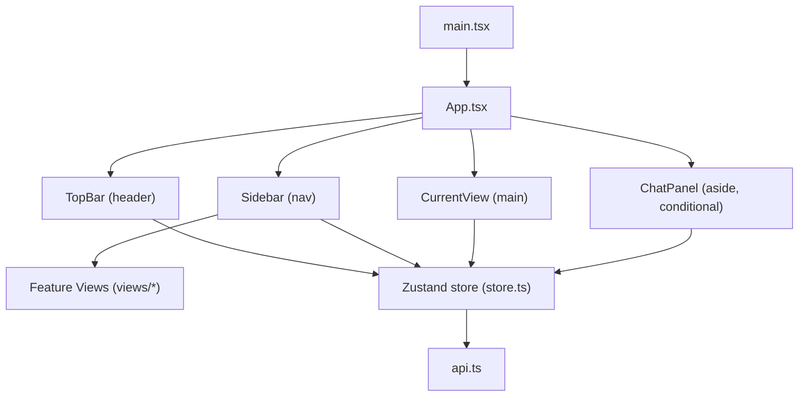
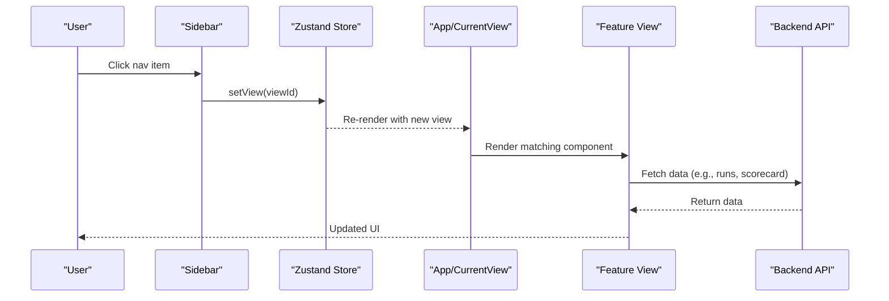
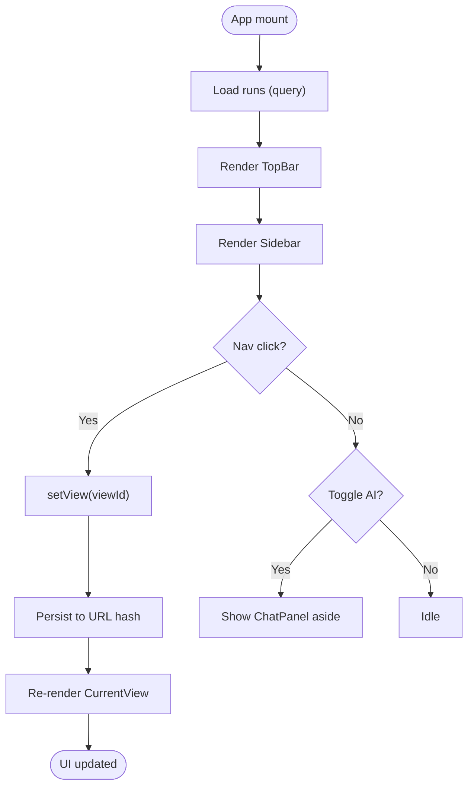
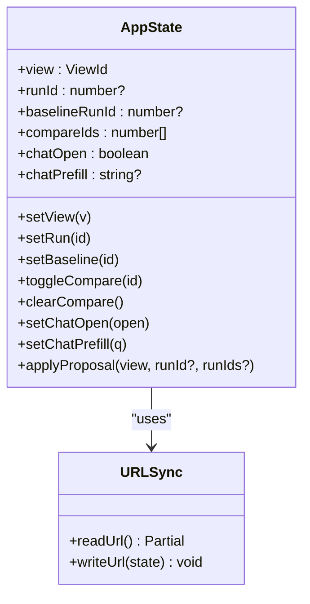
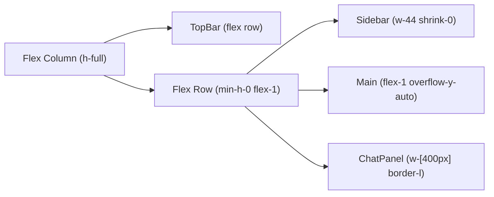
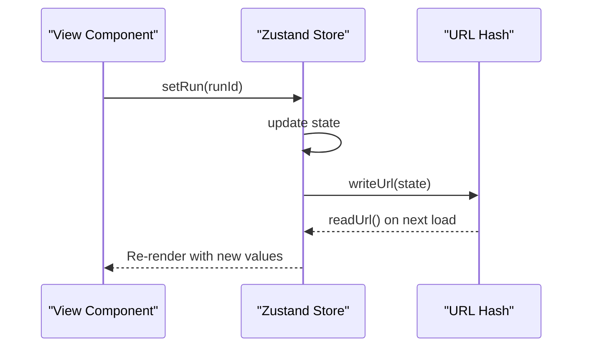
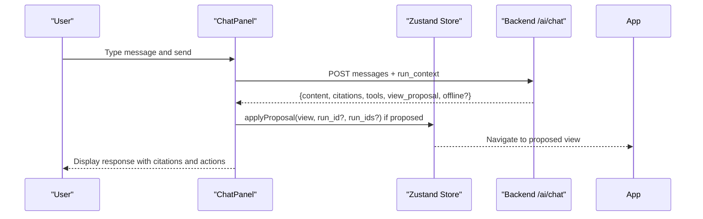
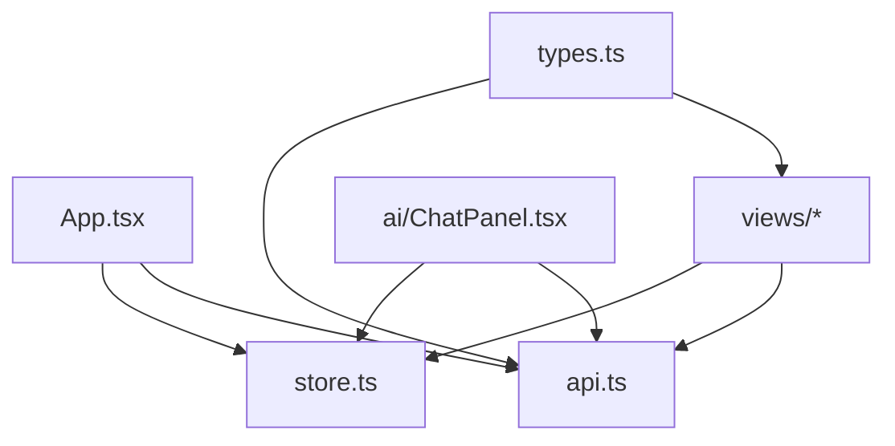

# Application Architecture & Layout

<cite>
**Referenced Files in This Document**
- [App.tsx](file://frontend/src/App.tsx)
- [store.ts](file://frontend/src/store.ts)
- [main.tsx](file://frontend/src/main.tsx)
- [api.ts](file://frontend/src/api.ts)
- [types.ts](file://frontend/src/types.ts)
- [ChatPanel.tsx](file://frontend/src/ai/ChatPanel.tsx)
- [RunExplorer.tsx](file://frontend/src/views/RunExplorer.tsx)
- [Scorecard.tsx](file://frontend/src/views/Scorecard.tsx)
- [ui.tsx](file://frontend/src/components/ui.tsx)
</cite>

## Table of Contents
1. Introduction
2. Project Structure
3. Core Components
4. Architecture Overview
5. Detailed Component Analysis
6. Dependency Analysis
7. Performance Considerations
8. Troubleshooting Guide
9. Conclusion
10. Appendices

## Introduction
This document explains the main application architecture and layout system of PPA-Profiler’s frontend. It focuses on how the App shell composes TopBar, Sidebar, and CurrentView to render feature views; how navigation is managed via state (not a routing library); how responsive layouts are implemented with Tailwind CSS; how global state is centralized using Zustand; and how the AI chat panel integrates alongside the main content. It also provides guidance for adding new views while preserving consistent patterns.

## Project Structure
The frontend entry renders React with TanStack Query and mounts the App component. The App defines:
- A TopBar that shows branding, current group context, run/baseline selectors, compare count, and LLM status.
- A Sidebar that groups navigation items into sections and toggles the AI assistant panel.
- A CurrentView that switches between feature views based on the active view id.
- An optional ChatPanel rendered as an aside when open.

**Diagram sources**
- [main.tsx:1-18](file://frontend/src/main.tsx#L1-L18)
- [App.tsx:1-152](file://frontend/src/App.tsx#L1-L152)
- [store.ts:1-84](file://frontend/src/store.ts#L1-L84)
- [api.ts:1-49](file://frontend/src/api.ts#L1-L49)

**Section sources**
- [main.tsx:1-18](file://frontend/src/main.tsx#L1-L18)
- [App.tsx:1-152](file://frontend/src/App.tsx#L1-L152)

## Core Components
- TopBar: Displays app branding, current navigation group, run selection, baseline selection, comparison tray count, and LLM availability. It reads runs from the backend and updates global run/baseline selections through the store.
- Sidebar: Renders grouped navigation entries derived from a central NAV configuration. Clicking an item sets the active view via the store. Includes a toggle for the AI Assistant panel.
- CurrentView: A switch-based router that renders the appropriate view component based on the active view id. Defaults to RunExplorer if no view is set.
- ChatPanel: A side panel that sends messages to the AI endpoint, displays responses with citations and tool traces, and can propose opening another view.

Key responsibilities:
- Navigation state is centralized in the Zustand store and synchronized with the URL hash for shareable links.
- Data fetching uses TanStack Query for caching and background updates.
- UI is built with Tailwind CSS utility classes for responsive flexbox layouts.

**Section sources**
- [App.tsx:17-152](file://frontend/src/App.tsx#L17-L152)
- [store.ts:1-84](file://frontend/src/store.ts#L1-L84)
- [ChatPanel.tsx:1-186](file://frontend/src/ai/ChatPanel.tsx#L1-L186)

## Architecture Overview
The application follows a state-driven rendering model:
- Global state holds the current view, selected run, baseline run, comparison list, and chat panel visibility.
- Changing state triggers re-renders and persists relevant parts to the URL hash.
- Feature views consume state and fetch data via TanStack Query.
- The AI panel communicates with the backend to provide insights and can propose navigating to other views.

**Diagram sources**
- [App.tsx:83-131](file://frontend/src/App.tsx#L83-L131)
- [store.ts:24-72](file://frontend/src/store.ts#L24-L72)
- [api.ts:23-49](file://frontend/src/api.ts#L23-L49)

## Detailed Component Analysis

### App Shell: TopBar, Sidebar, CurrentView
- TopBar
  - Loads available runs and AI status via TanStack Query.
  - Provides controls to select the current run and baseline run.
  - Shows the active navigation group and number of compared runs.
  - Updates global state through store setters.
- Sidebar
  - Derives groups from the NAV array and renders buttons per group.
  - Highlights the active view and supports toggling the AI panel.
- CurrentView
  - Switches on the active view id to render the correct feature view.
  - Defaults to RunExplorer when no view is active.

**Diagram sources**
- [App.tsx:31-152](file://frontend/src/App.tsx#L31-L152)
- [store.ts:24-72](file://frontend/src/store.ts#L24-L72)

**Section sources**
- [App.tsx:31-152](file://frontend/src/App.tsx#L31-L152)

### Navigation System: State-Based Routing
- Centralized NAV configuration defines all navigable views, labels, and grouping.
- Active view is stored in Zustand and synced to the URL hash for deep linking and sharing.
- URL parsing initializes state on load; writing state updates the URL without full page reloads.
- No traditional router library is used; switching is done by rendering different components based on state.

**Diagram sources**
- [store.ts:1-84](file://frontend/src/store.ts#L1-L84)

**Section sources**
- [store.ts:1-84](file://frontend/src/store.ts#L1-L84)

### Responsive Layout Design with Tailwind CSS
- The shell uses a vertical flex column with a header and a flexible body.
- The body contains a fixed-width Sidebar and a fluid main area that scrolls vertically.
- When the AI panel is open, it appears as a fixed-width aside to the right.
- Utility classes control spacing, borders, backgrounds, typography, and hover states consistently across components.

**Diagram sources**
- [App.tsx:133-152](file://frontend/src/App.tsx#L133-L152)

**Section sources**
- [App.tsx:133-152](file://frontend/src/App.tsx#L133-L152)

### Global State Management with Zustand
- Single store manages view, run selection, baseline, comparison tray, and chat panel state.
- URL synchronization ensures the app state is shareable and survives refreshes.
- Selectors allow components to subscribe only to needed slices of state.
- Helper functions encapsulate common operations like toggling comparisons or applying AI proposals.

**Diagram sources**
- [store.ts:24-72](file://frontend/src/store.ts#L24-L72)

**Section sources**
- [store.ts:1-84](file://frontend/src/store.ts#L1-L84)

### Chat Panel Integration Pattern
- The ChatPanel receives a context function that captures current run, baseline, compare ids, and active view.
- Messages are sent to the backend with conversation history and context.
- Responses include content, citations, tool traces, and optional view proposals.
- Users can accept view proposals to navigate directly to suggested views.

**Diagram sources**
- [ChatPanel.tsx:22-186](file://frontend/src/ai/ChatPanel.tsx#L22-L186)
- [store.ts:64-72](file://frontend/src/store.ts#L64-L72)
- [api.ts:41-43](file://frontend/src/api.ts#L41-L43)

**Section sources**
- [ChatPanel.tsx:22-186](file://frontend/src/ai/ChatPanel.tsx#L22-L186)
- [store.ts:64-72](file://frontend/src/store.ts#L64-L72)
- [api.ts:41-43](file://frontend/src/api.ts#L41-L43)

### Example: Adding a New View
To add a new view while maintaining consistency:
1. Create a new view component under views/.
2. Add an entry to the NAV array in App.tsx with id, label, and group.
3. Add a case in CurrentView to render the new component for the new id.
4. If the view needs data, use TanStack Query with api methods defined in api.ts.
5. Use shared UI primitives from components/ui.tsx for consistent cards, tables, deltas, and badges.
6. Optionally integrate with the AI panel by setting chatPrefill or responding to view proposals.

Reference paths:
- NAV definition and CurrentView mapping: [App.tsx:17-131](file://frontend/src/App.tsx#L17-L131)
- Shared UI primitives: [ui.tsx:1-97](file://frontend/src/components/ui.tsx#L1-L97)
- Example view usage of store and API: [RunExplorer.tsx:1-109](file://frontend/src/views/RunExplorer.tsx#L1-L109), [Scorecard.tsx:1-124](file://frontend/src/views/Scorecard.tsx#L1-L124)

**Section sources**
- [App.tsx:17-131](file://frontend/src/App.tsx#L17-L131)
- [ui.tsx:1-97](file://frontend/src/components/ui.tsx#L1-L97)
- [RunExplorer.tsx:1-109](file://frontend/src/views/RunExplorer.tsx#L1-L109)
- [Scorecard.tsx:1-124](file://frontend/src/views/Scorecard.tsx#L1-L124)

## Dependency Analysis
- App depends on store for navigation and selection state, and on api for data fetching.
- Views depend on store and api to read/write state and fetch data.
- ChatPanel depends on store for context and navigation actions, and on api for AI communication.
- Types define contracts between frontend and backend payloads.

**Diagram sources**
- [App.tsx:1-152](file://frontend/src/App.tsx#L1-L152)
- [store.ts:1-84](file://frontend/src/store.ts#L1-L84)
- [api.ts:1-49](file://frontend/src/api.ts#L1-L49)
- [types.ts:1-132](file://frontend/src/types.ts#L1-L132)

**Section sources**
- [App.tsx:1-152](file://frontend/src/App.tsx#L1-L152)
- [store.ts:1-84](file://frontend/src/store.ts#L1-L84)
- [api.ts:1-49](file://frontend/src/api.ts#L1-L49)
- [types.ts:1-132](file://frontend/src/types.ts#L1-L132)

## Performance Considerations
- Use TanStack Query to cache and deduplicate requests; default stale time and retry settings are configured at the root.
- Keep store slices small; components should subscribe only to necessary fields via selectors.
- Avoid unnecessary re-renders by memoizing expensive computations within views.
- Prefer lazy loading of heavy views if the application grows significantly.
- Ensure API endpoints return minimal payloads; paginate large lists where applicable.

[No sources needed since this section provides general guidance]

## Troubleshooting Guide
- Navigation not updating: Verify that setView is called and that the view id exists in NAV and CurrentView. Check URL hash persistence.
- Data not loading: Confirm that the corresponding api method is correctly defined and that the backend endpoint responds successfully.
- AI panel not showing: Ensure chatOpen is true in store and that the ChatPanel is conditionally rendered in App.
- Incorrect baseline/deltas: Confirm baselineRunId is set and that views compute deltas against the baseline correctly.
- Chat errors: Inspect error handling in ChatPanel and verify backend /ai/chat availability.

**Section sources**
- [App.tsx:83-152](file://frontend/src/App.tsx#L83-L152)
- [ChatPanel.tsx:36-75](file://frontend/src/ai/ChatPanel.tsx#L36-L75)
- [store.ts:24-72](file://frontend/src/store.ts#L24-L72)

## Conclusion
PPA-Profiler’s frontend uses a simple, robust architecture centered around a state-driven shell. Navigation is managed via a centralized store and URL sync rather than a routing library, enabling easy deep linking and sharing. The layout is responsive and consistent, leveraging Tailwind CSS utilities. The AI assistant integrates seamlessly as a side panel, providing contextual insights and navigation suggestions. Adding new views is straightforward by extending the NAV configuration and CurrentView mapping while reusing shared UI primitives and patterns.

[No sources needed since this section summarizes without analyzing specific files]

## Appendices

### Key Patterns Summary
- State-driven routing: [store.ts:24-72](file://frontend/src/store.ts#L24-L72)
- Grouped navigation: [App.tsx:17-114](file://frontend/src/App.tsx#L17-L114)
- Conditional AI panel: [App.tsx:143-147](file://frontend/src/App.tsx#L143-L147), [ChatPanel.tsx:22-186](file://frontend/src/ai/ChatPanel.tsx#L22-L186)
- Shared UI components: [ui.tsx:1-97](file://frontend/src/components/ui.tsx#L1-L97)
- Data fetching with TanStack Query: [main.tsx:7-17](file://frontend/src/main.tsx#L7-L17), [api.ts:23-49](file://frontend/src/api.ts#L23-L49)