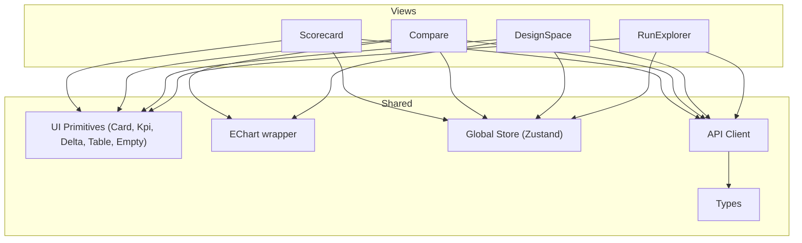
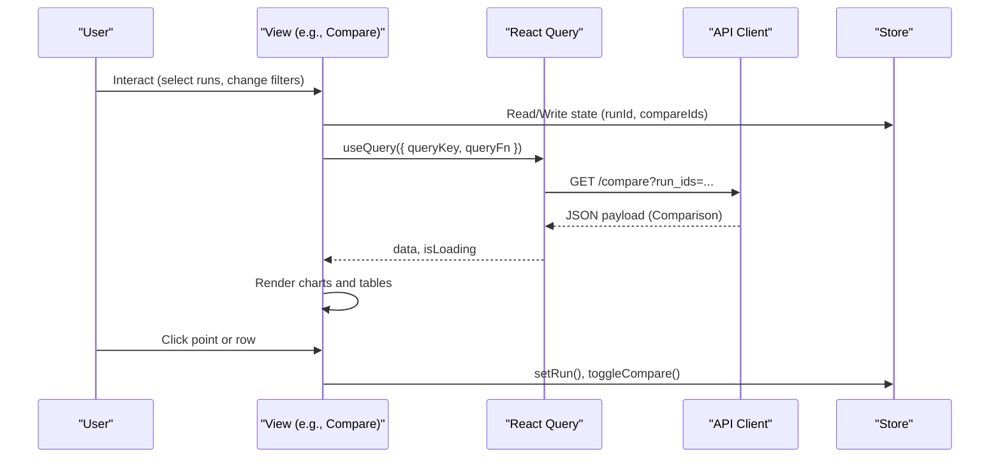
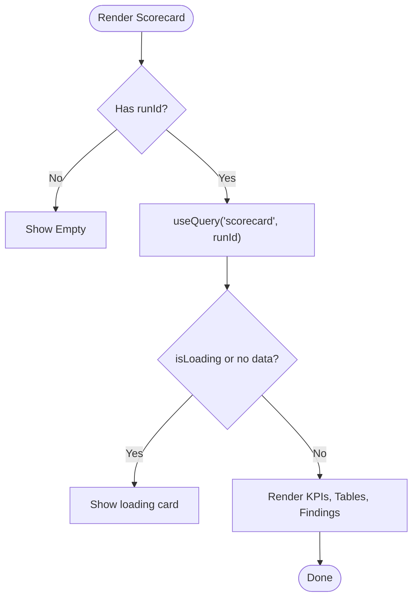
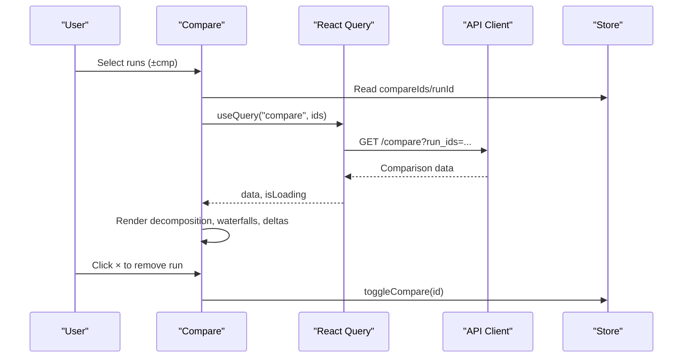
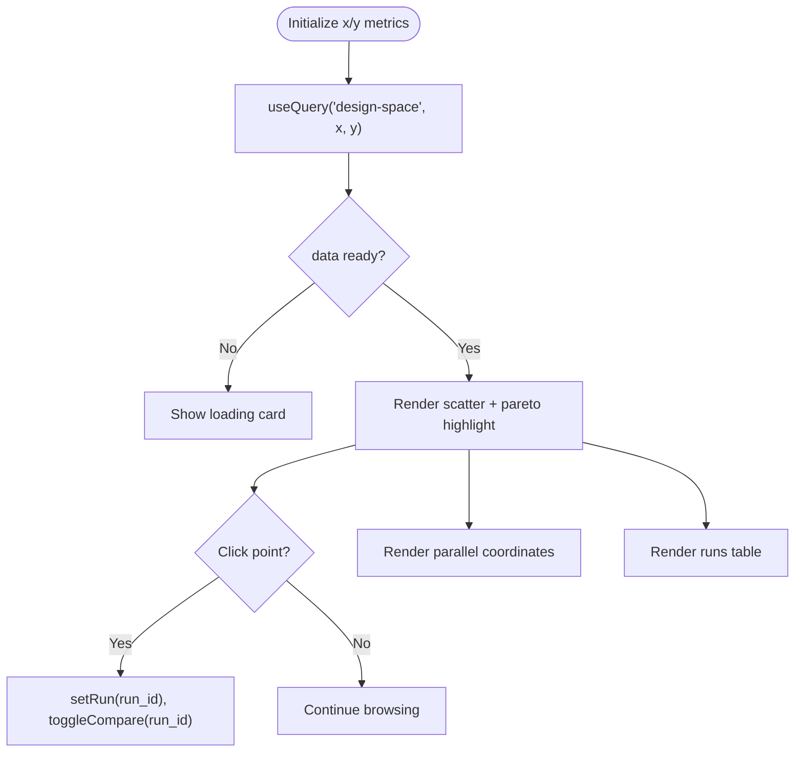
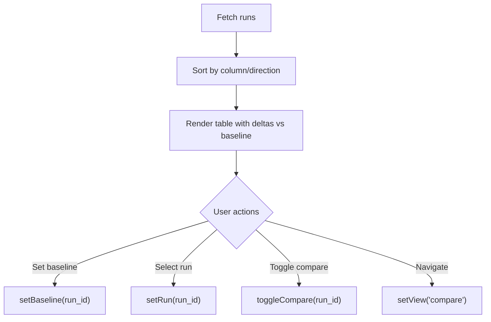
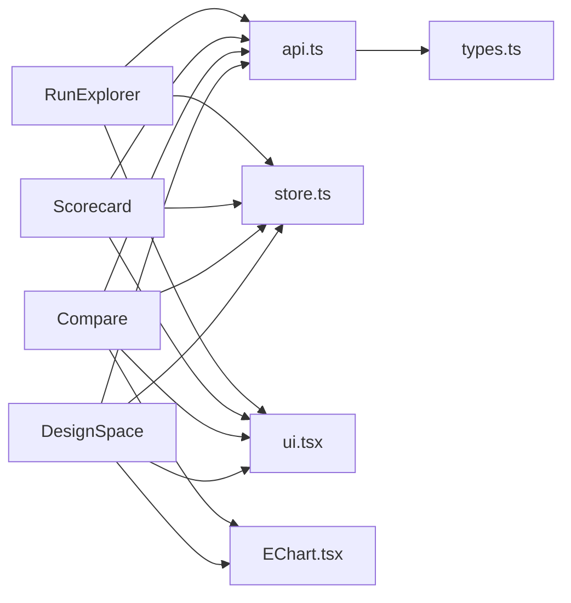

# Core View Components

<cite>
**Referenced Files in This Document**
- [Scorecard.tsx](file://frontend/src/views/Scorecard.tsx)
- [Compare.tsx](file://frontend/src/views/Compare.tsx)
- [DesignSpace.tsx](file://frontend/src/views/DesignSpace.tsx)
- [RunExplorer.tsx](file://frontend/src/views/RunExplorer.tsx)
- [api.ts](file://frontend/src/api.ts)
- [types.ts](file://frontend/src/types.ts)
- [store.ts](file://frontend/src/store.ts)
- [ui.tsx](file://frontend/src/components/ui.tsx)
- [EChart.tsx](file://frontend/src/components/EChart.tsx)
</cite>

## Table of Contents
1. [Introduction](#introduction)
2. [Project Structure](#project-structure)
3. [Core Components](#core-components)
4. [Architecture Overview](#architecture-overview)
5. [Detailed Component Analysis](#detailed-component-analysis)
6. [Dependency Analysis](#dependency-analysis)
7. [Performance Considerations](#performance-considerations)
8. [Troubleshooting Guide](#troubleshooting-guide)
9. [Conclusion](#conclusion)

## Introduction
This document explains the core view components that provide primary user interaction points in PPA-Profiler’s frontend: Scorecard, Compare, DesignSpace, and RunExplorer. It covers their responsibilities, data fetching patterns using React Query, error handling strategies, loading states management, component composition, prop interfaces, and event handling patterns used across these views.

## Project Structure
The core views live under the views directory and rely on shared UI primitives, charting, types, and a global store for navigation and selection state. Data is fetched via a small API client that wraps fetch calls and returns typed responses.

**Diagram sources**
- [Scorecard.tsx:1-124](file://frontend/src/views/Scorecard.tsx#L1-L124)
- [Compare.tsx:1-148](file://frontend/src/views/Compare.tsx#L1-L148)
- [DesignSpace.tsx:1-119](file://frontend/src/views/DesignSpace.tsx#L1-L119)
- [RunExplorer.tsx:1-109](file://frontend/src/views/RunExplorer.tsx#L1-L109)
- [api.ts:1-49](file://frontend/src/api.ts#L1-L49)
- [ui.tsx:1-97](file://frontend/src/components/ui.tsx#L1-L97)
- [EChart.tsx:1-27](file://frontend/src/components/EChart.tsx#L1-L27)
- [store.ts:1-84](file://frontend/src/store.ts#L1-L84)
- [types.ts:1-132](file://frontend/src/types.ts#L1-L132)

**Section sources**
- [Scorecard.tsx:1-124](file://frontend/src/views/Scorecard.tsx#L1-L124)
- [Compare.tsx:1-148](file://frontend/src/views/Compare.tsx#L1-L148)
- [DesignSpace.tsx:1-119](file://frontend/src/views/DesignSpace.tsx#L1-L119)
- [RunExplorer.tsx:1-109](file://frontend/src/views/RunExplorer.tsx#L1-L109)
- [api.ts:1-49](file://frontend/src/api.ts#L1-L49)
- [ui.tsx:1-97](file://frontend/src/components/ui.tsx#L1-L97)
- [EChart.tsx:1-27](file://frontend/src/components/EChart.tsx#L1-L27)
- [store.ts:1-84](file://frontend/src/store.ts#L1-L84)
- [types.ts:1-132](file://frontend/src/types.ts#L1-L132)

## Core Components
- Scorecard: Displays overall metrics and KPIs for a selected run with summary statistics, deltas vs baseline, budget checks, and findings.
- Compare: Multi-run analysis showing delta calculations, net score decomposition, waterfall charts by module for area and power, and comparative tables.
- DesignSpace: Multi-dimensional plotting with Pareto front identification, interactive scatter plots, parallel coordinates, and a runs table.
- RunExplorer: Lists all runs, supports sorting, baseline selection, comparison tray toggling, and quick navigation to other views.

Key cross-cutting concerns:
- Data fetching: All views use React Query hooks with query keys derived from runtime state to cache and refetch data.
- Error handling: The API client throws on non-OK responses; views handle loading states and empty states gracefully.
- State management: Global Zustand store tracks current view, selected run, baseline run, and comparison tray; URL sync keeps state shareable.

**Section sources**
- [Scorecard.tsx:1-124](file://frontend/src/views/Scorecard.tsx#L1-L124)
- [Compare.tsx:1-148](file://frontend/src/views/Compare.tsx#L1-L148)
- [DesignSpace.tsx:1-119](file://frontend/src/views/DesignSpace.tsx#L1-L119)
- [RunExplorer.tsx:1-109](file://frontend/src/views/RunExplorer.tsx#L1-L109)
- [api.ts:1-49](file://frontend/src/api.ts#L1-L49)
- [store.ts:1-84](file://frontend/src/store.ts#L1-L84)

## Architecture Overview
The views are thin presentational layers that:
- Read global state from the store (selected run, baseline, compare list).
- Fetch data via React Query using typed endpoints from the API client.
- Render UI using shared primitives and ECharts-based visualizations.
- Dispatch events to update the store (select run, toggle compare, change view).

**Diagram sources**
- [Compare.tsx:27-40](file://frontend/src/views/Compare.tsx#L27-L40)
- [api.ts:23-27](file://frontend/src/api.ts#L23-L27)
- [store.ts:45-71](file://frontend/src/store.ts#L45-L71)

## Detailed Component Analysis

### Scorecard Component
Purpose:
- Present a single-run overview with KPIs, domain summaries (timing, area, power, performance), budget status, and open findings.

Data flow:
- Reads selected runId from the store.
- Uses React Query to fetch scorecard data keyed by runId.
- Renders KPI cards with deltas vs baseline and budget indicators.
- Shows timing, area, power, and performance tables.
- Lists top findings with severity badges.

Error handling and loading:
- If no runId is selected, shows an empty placeholder.
- While loading or when data is absent, shows a card with a loading message.
- Errors thrown by the API client will bubble up; consider adding a boundary in your app shell to display errors consistently.

Event handling:
- No direct user interactions in this view; it is primarily read-only.

Composition:
- Uses Card, Kpi, Delta, Table, SevBadge, fmt, and Empty from UI primitives.

Prop interfaces used:
- Kpi: label, value, unit?, delta?, invertDelta?, target?, overBudget?
- Delta: pct, invert?, digits?
- Table: head, children
- SevBadge: severity
- Empty: msg?

**Diagram sources**
- [Scorecard.tsx:6-16](file://frontend/src/views/Scorecard.tsx#L6-L16)
- [Scorecard.tsx:17-123](file://frontend/src/views/Scorecard.tsx#L17-L123)

**Section sources**
- [Scorecard.tsx:1-124](file://frontend/src/views/Scorecard.tsx#L1-L124)
- [ui.tsx:3-97](file://frontend/src/components/ui.tsx#L3-L97)
- [types.ts:28-40](file://frontend/src/types.ts#L28-L40)

### Compare Component
Purpose:
- Provide multi-run comparison with delta calculations, net score decomposition, and waterfall charts for area and power by module.

Data flow:
- Reads compareIds and runId from the store to determine which runs to compare.
- Uses React Query to fetch comparison data keyed by the joined ids.
- Renders per-comparison blocks with config diffs, net score decomposition bar chart, figures-of-merit delta table, and waterfalls.

Error handling and loading:
- Requires at least two runs to compare; otherwise shows an empty message.
- While loading or without data, shows a loading card.

Event handling:
- Allows removing a run from the comparison tray via a close button.
- Integrates with the store to toggle compare entries.

Composition:
- Uses Card, Delta, Table, fmt, shortModule, and EChart with a custom palette.

Prop interfaces used:
- Waterfall local props: items (module, delta), title, unit
- EChart: option, height, onEvent?

**Diagram sources**
- [Compare.tsx:27-40](file://frontend/src/views/Compare.tsx#L27-L40)
- [Compare.tsx:55-143](file://frontend/src/views/Compare.tsx#L55-L143)
- [api.ts:23-27](file://frontend/src/api.ts#L23-L27)
- [store.ts:55-60](file://frontend/src/store.ts#L55-L60)

**Section sources**
- [Compare.tsx:1-148](file://frontend/src/views/Compare.tsx#L1-L148)
- [EChart.tsx:1-27](file://frontend/src/components/EChart.tsx#L1-L27)
- [ui.tsx:1-97](file://frontend/src/components/ui.tsx#L1-L97)
- [types.ts:42-53](file://frontend/src/types.ts#L42-L53)

### DesignSpace Component
Purpose:
- Explore design space across multiple metrics with Pareto front identification, interactive scatter plots, parallel coordinates, and a sortable runs table.

Data flow:
- Maintains local x/y metric selections.
- Uses React Query to fetch design-space data based on selected axes.
- Renders:
  - Scatter plot highlighting Pareto-optimal points and dominated points.
  - Parallel coordinates visualization across all metrics.
  - Runs table sorted by Pareto status and y-axis metric.

Error handling and loading:
- Shows a loading card while data is being fetched.

Event handling:
- Clicking a scatter point selects the run and adds it to the comparison tray.
- Changing x/y metrics triggers a new query.

Composition:
- Uses Card, Table, fmt, and EChart.

Prop interfaces used:
- EChart: option, height, onEvent?
- Table: head, children

**Diagram sources**
- [DesignSpace.tsx:17-26](file://frontend/src/views/DesignSpace.tsx#L17-L26)
- [DesignSpace.tsx:30-75](file://frontend/src/views/DesignSpace.tsx#L30-L75)
- [DesignSpace.tsx:77-116](file://frontend/src/views/DesignSpace.tsx#L77-L116)
- [api.ts:23-27](file://frontend/src/api.ts#L23-L27)
- [store.ts:52-60](file://frontend/src/store.ts#L52-L60)

**Section sources**
- [DesignSpace.tsx:1-119](file://frontend/src/views/DesignSpace.tsx#L1-L119)
- [EChart.tsx:1-27](file://frontend/src/components/EChart.tsx#L1-L27)
- [ui.tsx:1-97](file://frontend/src/components/ui.tsx#L1-L97)
- [types.ts:55-63](file://frontend/src/types.ts#L55-L63)

### RunExplorer Component
Purpose:
- List all runs with key metrics, WNS, and findings count; allow setting baseline, selecting a run, and adding runs to the comparison tray.

Data flow:
- Fetches runs list via React Query.
- Sorts rows by selected column and direction.
- Computes deltas vs baseline inline for each metric.

Error handling and loading:
- Shows a loading card while data is being fetched.

Event handling:
- Radio button sets baseline.
- Row click selects the run.
- “±cmp” toggles inclusion in the comparison tray.
- Button navigates to Compare view when at least two runs are selected.

Composition:
- Uses Card, Table, Delta, fmt.

Prop interfaces used:
- Table: head, children
- Delta: pct, invert?, digits?

**Diagram sources**
- [RunExplorer.tsx:18-29](file://frontend/src/views/RunExplorer.tsx#L18-L29)
- [RunExplorer.tsx:32-105](file://frontend/src/views/RunExplorer.tsx#L32-L105)
- [store.ts:52-60](file://frontend/src/store.ts#L52-L60)

**Section sources**
- [RunExplorer.tsx:1-109](file://frontend/src/views/RunExplorer.tsx#L1-L109)
- [ui.tsx:1-97](file://frontend/src/components/ui.tsx#L1-L97)
- [types.ts:1-11](file://frontend/src/types.ts#L1-L11)

## Dependency Analysis
- Views depend on:
  - api.ts for data access (typed endpoints).
  - store.ts for global state (current view, selection, baseline, compare tray).
  - ui.tsx for reusable UI primitives.
  - EChart.tsx for chart rendering.
  - types.ts for TypeScript contracts.

**Diagram sources**
- [RunExplorer.tsx:1-109](file://frontend/src/views/RunExplorer.tsx#L1-L109)
- [Scorecard.tsx:1-124](file://frontend/src/views/Scorecard.tsx#L1-L124)
- [Compare.tsx:1-148](file://frontend/src/views/Compare.tsx#L1-L148)
- [DesignSpace.tsx:1-119](file://frontend/src/views/DesignSpace.tsx#L1-L119)
- [api.ts:1-49](file://frontend/src/api.ts#L1-L49)
- [store.ts:1-84](file://frontend/src/store.ts#L1-L84)
- [ui.tsx:1-97](file://frontend/src/components/ui.tsx#L1-L97)
- [EChart.tsx:1-27](file://frontend/src/components/EChart.tsx#L1-L27)
- [types.ts:1-132](file://frontend/src/types.ts#L1-L132)

**Section sources**
- [api.ts:1-49](file://frontend/src/api.ts#L1-L49)
- [store.ts:1-84](file://frontend/src/store.ts#L1-L84)
- [ui.tsx:1-97](file://frontend/src/components/ui.tsx#L1-L97)
- [EChart.tsx:1-27](file://frontend/src/components/EChart.tsx#L1-L27)
- [types.ts:1-132](file://frontend/src/types.ts#L1-L132)

## Performance Considerations
- React Query caching: Each view uses stable query keys derived from runtime state, enabling automatic caching and background refetches.
- Chart rendering: EChart is configured with notMerge and lazyUpdate to avoid unnecessary re-renders; canvas renderer is used for better performance.
- Data shaping: Views compute lightweight derived data locally (e.g., deltas, sort order) to minimize server load.
- Budget checks: Visual budget violations are computed client-side to avoid extra requests.

[No sources needed since this section provides general guidance]

## Troubleshooting Guide
Common issues and resolutions:
- No data shown:
  - Ensure a run is selected for Scorecard; otherwise an empty placeholder is displayed.
  - For Compare, ensure at least two runs are added to the comparison tray.
- Loading indefinitely:
  - Verify network connectivity and backend availability.
  - Check that query keys are valid and enabled conditions are met.
- Errors after API call:
  - The API client throws on non-OK responses; wrap views with an error boundary to display user-friendly messages.
- Incorrect deltas:
  - Confirm baseline is set correctly in RunExplorer; deltas are computed relative to the baseline run.

**Section sources**
- [api.ts:8-21](file://frontend/src/api.ts#L8-L21)
- [Scorecard.tsx:14-15](file://frontend/src/views/Scorecard.tsx#L14-L15)
- [Compare.tsx:36-39](file://frontend/src/views/Compare.tsx#L36-L39)
- [RunExplorer.tsx:24-29](file://frontend/src/views/RunExplorer.tsx#L24-L29)

## Conclusion
The core views provide a cohesive experience for exploring PPA results:
- Scorecard offers a concise, budget-aware snapshot of a run’s metrics.
- Compare enables deep multi-run analysis with clear deltas and visual decompositions.
- DesignSpace helps identify trade-offs and Pareto-optimal configurations through interactive plots.
- RunExplorer serves as the central hub for listing, filtering, and navigating runs.

Together, they leverage React Query for robust data fetching, a consistent UI primitive library, and a global store for seamless cross-view interactions.

[No sources needed since this section summarizes without analyzing specific files]