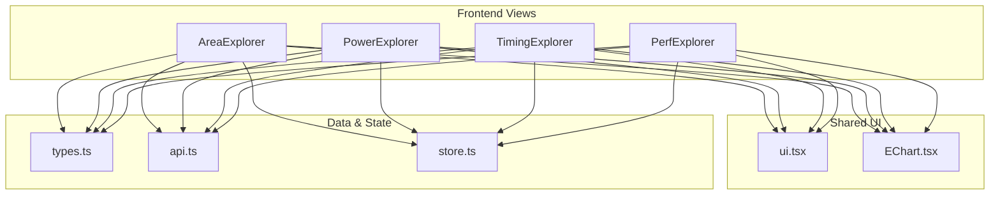
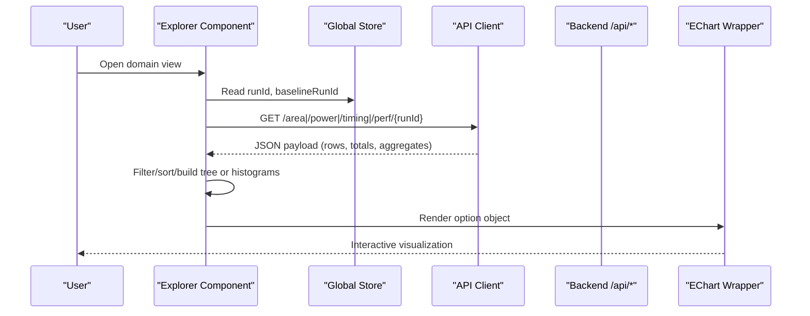
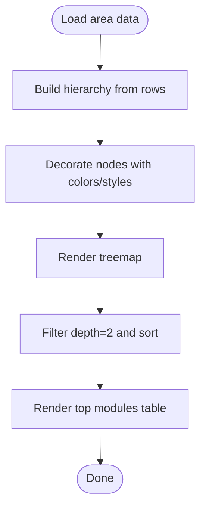
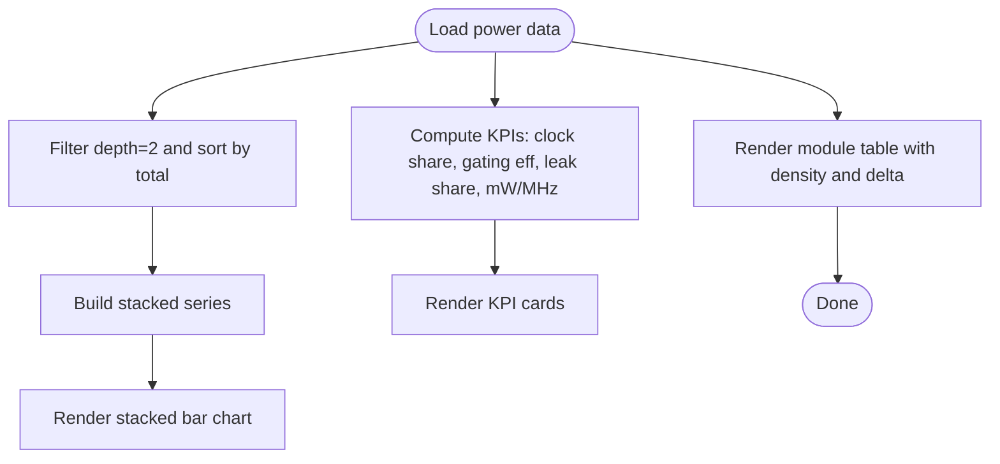
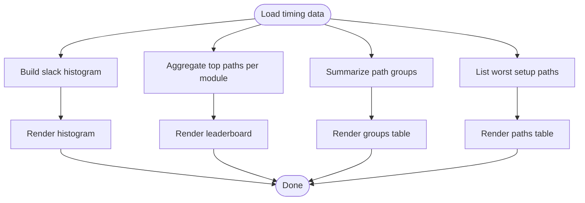
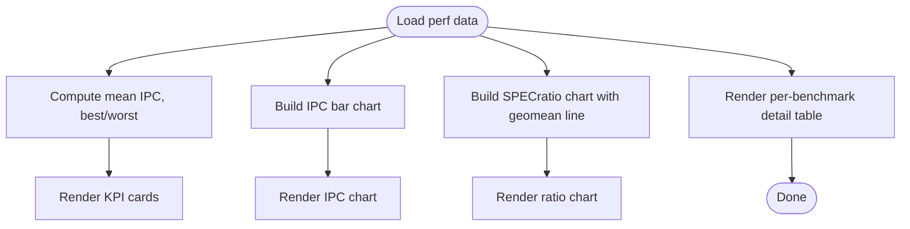
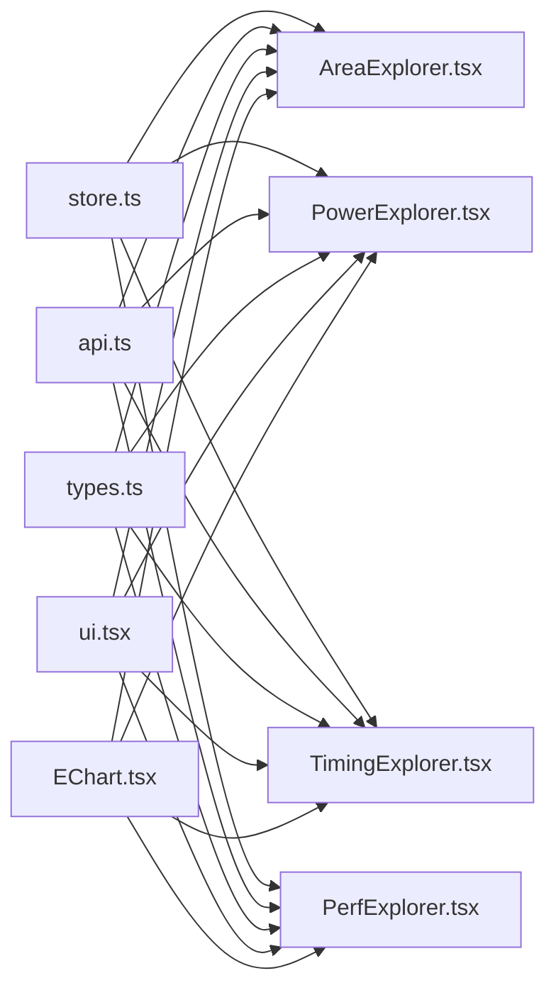

# Domain Explorer Components

<cite>
**Referenced Files in This Document**
- [AreaExplorer.tsx](file://frontend/src/views/AreaExplorer.tsx)
- [PowerExplorer.tsx](file://frontend/src/views/PowerExplorer.tsx)
- [TimingExplorer.tsx](file://frontend/src/views/TimingExplorer.tsx)
- [PerfExplorer.tsx](file://frontend/src/views/PerfExplorer.tsx)
- [EChart.tsx](file://frontend/src/components/EChart.tsx)
- [ui.tsx](file://frontend/src/components/ui.tsx)
- [types.ts](file://frontend/src/types.ts)
- [api.ts](file://frontend/src/api.ts)
- [store.ts](file://frontend/src/store.ts)
- [App.tsx](file://frontend/src/App.tsx)
</cite>

## Table of Contents
1. Introduction
2. Project Structure
3. Core Components
4. Architecture Overview
5. Detailed Component Analysis
6. Dependency Analysis
7. Performance Considerations
8. Troubleshooting Guide
9. Conclusion

## Introduction
This document explains PPA-Profiler’s domain-specific explorer components that provide detailed analysis for different hardware design aspects: Area, Power, Timing, and Performance. It covers how each explorer fetches data, transforms it into visualizations, and exposes interactive features to help engineers analyze area utilization, power consumption, timing constraints, and performance metrics. It also documents shared patterns across explorers such as data filtering, chart customization, and export-friendly layouts.

## Project Structure
The explorers are React components under frontend/src/views. They share a common UI toolkit (cards, tables, deltas, formatting), a chart wrapper around ECharts, a typed API client, and a global store for run selection and baseline context. The application routes to the active view from App.tsx.

**Diagram sources**
- [AreaExplorer.tsx:1-139](file://frontend/src/views/AreaExplorer.tsx#L1-L139)
- [PowerExplorer.tsx:1-101](file://frontend/src/views/PowerExplorer.tsx#L1-L101)
- [TimingExplorer.tsx:1-106](file://frontend/src/views/TimingExplorer.tsx#L1-L106)
- [PerfExplorer.tsx:1-133](file://frontend/src/views/PerfExplorer.tsx#L1-L133)
- [EChart.tsx:1-27](file://frontend/src/components/EChart.tsx#L1-L27)
- [ui.tsx:1-97](file://frontend/src/components/ui.tsx#L1-L97)
- [types.ts:1-132](file://frontend/src/types.ts#L1-L132)
- [api.ts:1-49](file://frontend/src/api.ts#L1-L49)
- [store.ts:1-84](file://frontend/src/store.ts#L1-L84)

**Section sources**
- [App.tsx:17-29](file://frontend/src/App.tsx#L17-L29)
- [App.tsx:116-130](file://frontend/src/App.tsx#L116-L130)

## Core Components
- AreaExplorer: Builds a hierarchical treemap of module area usage with drill-down and delta coloring; shows top-level modules in a table with composition breakdowns.
- PowerExplorer: Stacked bar chart of internal/switching/leakage by module; KPI cards for clock power share, gating efficiency, leakage share, and mW/MHz; module table with density and deltas.
- TimingExplorer: Slack histogram, critical-module leaderboard, path group summary, and worst setup paths table; highlights violations and long combinational chains.
- PerfExplorer: Per-benchmark IPC and SPECratio @1GHz charts with geomean line; KPIs for geomean ratio, mean IPC, best/worst benchmarks; per-benchmark detail including cache misses and branch mispredictions.

Common patterns:
- Data fetching via react-query with query keys scoped by runId.
- Shared UI primitives: Card, Table, Delta, fmt, shortModule.
- Chart configuration objects passed to a thin ECharts wrapper.
- Consistent loading and empty states.
- Baseline-relative deltas using a globally selected baseline run.

**Section sources**
- [AreaExplorer.tsx:32-139](file://frontend/src/views/AreaExplorer.tsx#L32-L139)
- [PowerExplorer.tsx:7-101](file://frontend/src/views/PowerExplorer.tsx#L7-L101)
- [TimingExplorer.tsx:7-106](file://frontend/src/views/TimingExplorer.tsx#L7-L106)
- [PerfExplorer.tsx:11-133](file://frontend/src/views/PerfExplorer.tsx#L11-L133)
- [ui.tsx:3-97](file://frontend/src/components/ui.tsx#L3-L97)
- [EChart.tsx:1-27](file://frontend/src/components/EChart.tsx#L1-L27)

## Architecture Overview
Each explorer follows a consistent flow: read current runId from global state, fetch domain data from the backend API, transform rows into visualization-ready structures, render charts and tables, and expose interactive controls.

**Diagram sources**
- [AreaExplorer.tsx:32-45](file://frontend/src/views/AreaExplorer.tsx#L32-L45)
- [PowerExplorer.tsx:7-17](file://frontend/src/views/PowerExplorer.tsx#L7-L17)
- [TimingExplorer.tsx:7-17](file://frontend/src/views/TimingExplorer.tsx#L7-L17)
- [PerfExplorer.tsx:11-20](file://frontend/src/views/PerfExplorer.tsx#L11-L20)
- [api.ts:23-32](file://frontend/src/api.ts#L23-L32)
- [store.ts:7-22](file://frontend/src/store.ts#L7-L22)

## Detailed Component Analysis

### AreaExplorer
Responsibilities:
- Fetch area hierarchy and totals for the selected run.
- Build a hierarchical tree from flat rows and render a treemap with zoom-to-node and breadcrumb navigation.
- Color nodes by composition or delta vs baseline; size by area or instance count.
- Show top level-2 modules in a table with composition columns (comb, seq, macro, buf/inv), sequence ratio, and delta.

Key implementation details:
- Tree building uses parent-child relationships derived from scope_path and depth to create nested nodes for treemap rendering.
- Tooltip displays module path, area, share, and delta vs baseline.
- Top modules are filtered at depth 2 and sorted by either total_area or inst_count.

Interactive features:
- Switch color mapping between composition and delta.
- Switch sizing metric between area and instance count.
- Drill down into submodules via treemap node click; navigate back via breadcrumb.

Performance considerations:
- Memoization of the built tree avoids recomputation on re-renders.
- Treemap is configured without roaming to reduce interaction overhead.

Export-friendly layout:
- Uses responsive grid and compact typography suitable for screenshots or PDF exports.

**Diagram sources**
- [AreaExplorer.tsx:9-30](file://frontend/src/views/AreaExplorer.tsx#L9-L30)
- [AreaExplorer.tsx:47-85](file://frontend/src/views/AreaExplorer.tsx#L47-L85)
- [AreaExplorer.tsx:87-131](file://frontend/src/views/AreaExplorer.tsx#L87-L131)

**Section sources**
- [AreaExplorer.tsx:9-139](file://frontend/src/views/AreaExplorer.tsx#L9-L139)
- [types.ts:65-82](file://frontend/src/types.ts#L65-L82)

### PowerExplorer
Responsibilities:
- Fetch power breakdown by module and aggregate metrics.
- Present stacked bars of internal, switching, and leakage per module.
- Display KPI cards for clock power share, clock gating efficiency, leakage share, and mW/MHz.
- Provide a module-level table with density and delta vs baseline.

Key implementation details:
- Level-2 modules are sorted by total power for the stacked bar chart.
- Leakage share is computed from root-level row if available.
- Density values are scaled for display.

Interactive features:
- Hover tooltips on stacked bars show per-component contributions.
- Conditional highlighting based on thresholds (e.g., high leakage share).

Optimization opportunities:
- High clock power share suggests gating/CTS improvements.
- Low gating efficiency indicates wasted clock power.
- High leakage share may indicate overly aggressive VT mix.

**Diagram sources**
- [PowerExplorer.tsx:18-33](file://frontend/src/views/PowerExplorer.tsx#L18-L33)
- [PowerExplorer.tsx:35-75](file://frontend/src/views/PowerExplorer.tsx#L35-L75)
- [PowerExplorer.tsx:77-97](file://frontend/src/views/PowerExplorer.tsx#L77-L97)

**Section sources**
- [PowerExplorer.tsx:7-101](file://frontend/src/views/PowerExplorer.tsx#L7-L101)
- [types.ts:84-91](file://frontend/src/types.ts#L84-L91)

### TimingExplorer
Responsibilities:
- Fetch timing statistics, slack histogram, critical-module leaderboard, path groups, and worst paths.
- Visualize slack distribution and identify modules owning the most critical paths.
- Summarize path groups and list worst setup paths with startpoint, endpoint, slack, logic depth, and module.

Key implementation details:
- Histogram colors violate endpoints negatively (red) versus neutral.
- Leaderboard highlights the top module when its share is significant.
- Worst paths table highlights negative slack and long combinational chains.

Interactive features:
- Tooltips on histogram and leaderboard bars.
- Visual cues for violations and structural issues (long logic depth).

Constraint validation:
- WNS and TNS indicate overall timing health; NVE counts violating endpoints.
- Fmax provides frequency insight.

**Diagram sources**
- [TimingExplorer.tsx:18-43](file://frontend/src/views/TimingExplorer.tsx#L18-L43)
- [TimingExplorer.tsx:69-100](file://frontend/src/views/TimingExplorer.tsx#L69-L100)

**Section sources**
- [TimingExplorer.tsx:7-106](file://frontend/src/views/TimingExplorer.tsx#L7-L106)
- [types.ts:93-103](file://frontend/src/types.ts#L93-L103)

### PerfExplorer
Responsibilities:
- Fetch per-benchmark performance metrics including IPC, ratios at 1 GHz, cache miss rates, and branch misprediction percentages.
- Display KPIs: geomean SPECint/GHz, mean IPC, best and worst benchmarks.
- Visualize IPC per benchmark and SPECratio @1GHz with a geomean reference line.
- Provide a detailed table for per-benchmark insights.

Key implementation details:
- Mean IPC computed over all benchmarks.
- Benchmarks sorted by ratio_1ghz to identify best and worst.
- Geomean line shown on the ratio chart when available.

Interactive features:
- Color-coded bars for IPC deltas (green/red).
- Hover tooltips for precise values.

Optimization guidance:
- Net score equals SPECint/GHz × Fmax; large IPC gains can be offset by frequency loss.
- Cache miss and branch misprediction columns help pinpoint microarchitectural bottlenecks.

**Diagram sources**
- [PerfExplorer.tsx:22-66](file://frontend/src/views/PerfExplorer.tsx#L22-L66)
- [PerfExplorer.tsx:77-129](file://frontend/src/views/PerfExplorer.tsx#L77-L129)

**Section sources**
- [PerfExplorer.tsx:11-133](file://frontend/src/views/PerfExplorer.tsx#L11-L133)
- [types.ts:105-111](file://frontend/src/types.ts#L105-L111)

## Dependency Analysis
Explorers depend on:
- Global store for run selection and baseline context.
- API client for data retrieval.
- Types for strongly-typed payloads.
- UI components for consistent presentation.
- EChart wrapper for rendering charts.

**Diagram sources**
- [store.ts:7-22](file://frontend/src/store.ts#L7-L22)
- [api.ts:23-32](file://frontend/src/api.ts#L23-L32)
- [types.ts:65-111](file://frontend/src/types.ts#L65-L111)
- [ui.tsx:3-97](file://frontend/src/components/ui.tsx#L3-L97)
- [EChart.tsx:1-27](file://frontend/src/components/EChart.tsx#L1-L27)

**Section sources**
- [store.ts:7-22](file://frontend/src/store.ts#L7-L22)
- [api.ts:23-32](file://frontend/src/api.ts#L23-L32)
- [types.ts:65-111](file://frontend/src/types.ts#L65-L111)
- [ui.tsx:3-97](file://frontend/src/components/ui.tsx#L3-L97)
- [EChart.tsx:1-27](file://frontend/src/components/EChart.tsx#L1-L27)

## Performance Considerations
- Use memoization for expensive computations (e.g., tree building) to avoid unnecessary re-renders.
- Prefer lightweight chart configurations and disable non-essential interactions (e.g., roam) where not needed.
- Keep datasets small for client-side sorting/filtering; leverage backend aggregation when possible.
- For large treemaps or tables, consider pagination or virtualization if data grows significantly.
- Avoid heavy DOM operations inside chart callbacks; keep event handlers minimal.

[No sources needed since this section provides general guidance]

## Troubleshooting Guide
Common issues and resolutions:
- No data displayed: Ensure a run is selected; explorers return an empty state when runId is null.
- Loading indefinitely: Check network requests to /api/* endpoints; verify backend availability and correct runId.
- Incorrect deltas: Confirm baseline run is set; deltas are relative to the selected baseline.
- Chart not rendering: Verify EChart receives a valid option object; check console for ECharts errors.
- Misaligned hierarchies: Ensure scope_path and parent fields are consistent; area/power joins rely on canonical hierarchy names.

Operational tips:
- Use the UI’s KPI cards and conditional colors to quickly spot anomalies (e.g., high leakage share, negative slack).
- Inspect the module tables for exact numbers and deltas when investigating issues.

**Section sources**
- [AreaExplorer.tsx:44-45](file://frontend/src/views/AreaExplorer.tsx#L44-L45)
- [PowerExplorer.tsx:15-16](file://frontend/src/views/PowerExplorer.tsx#L15-L16)
- [TimingExplorer.tsx:15-16](file://frontend/src/views/TimingExplorer.tsx#L15-L16)
- [PerfExplorer.tsx:19-20](file://frontend/src/views/PerfExplorer.tsx#L19-L20)
- [api.ts:8-21](file://frontend/src/api.ts#L8-L21)

## Conclusion
PPA-Profiler’s domain explorers provide a consistent, interactive experience for analyzing area, power, timing, and performance. Each component leverages shared UI and charting infrastructure, typed data contracts, and a global state model to deliver focused insights. By combining hierarchical views, statistical summaries, and actionable KPIs, these explorers enable rapid identification of optimization opportunities and support informed design decisions.

[No sources needed since this section summarizes without analyzing specific files]