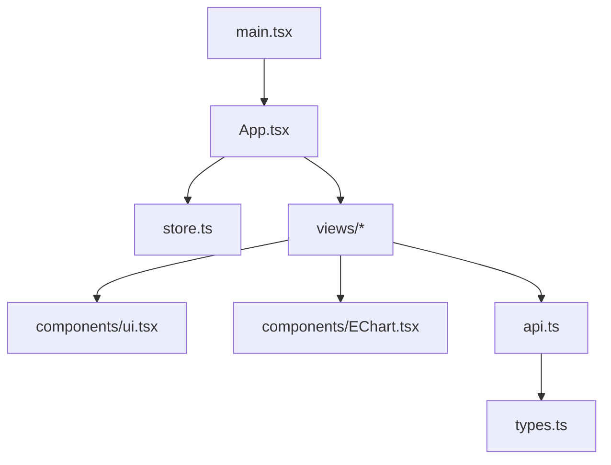
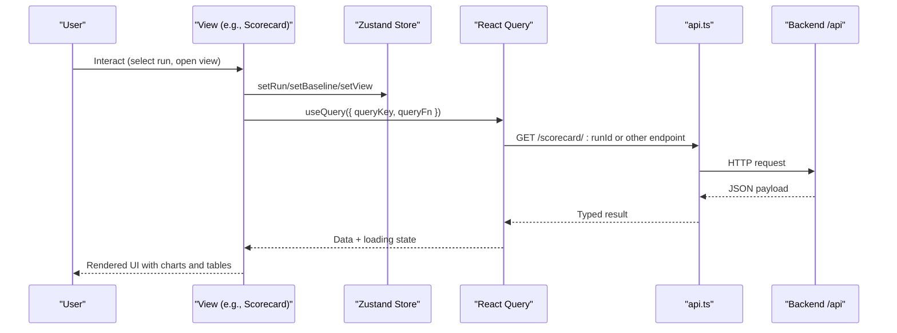
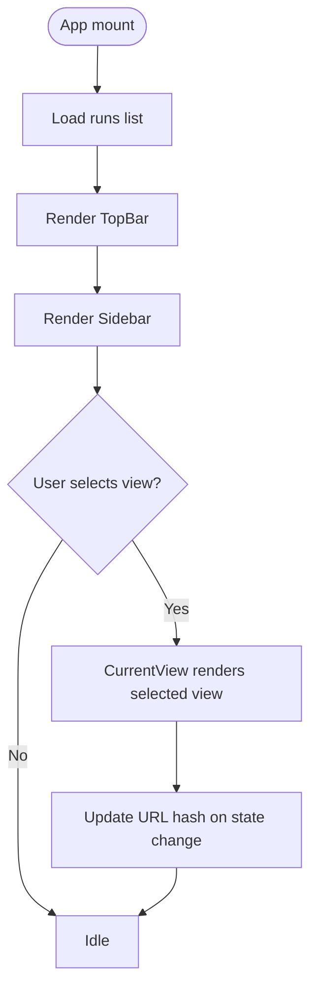
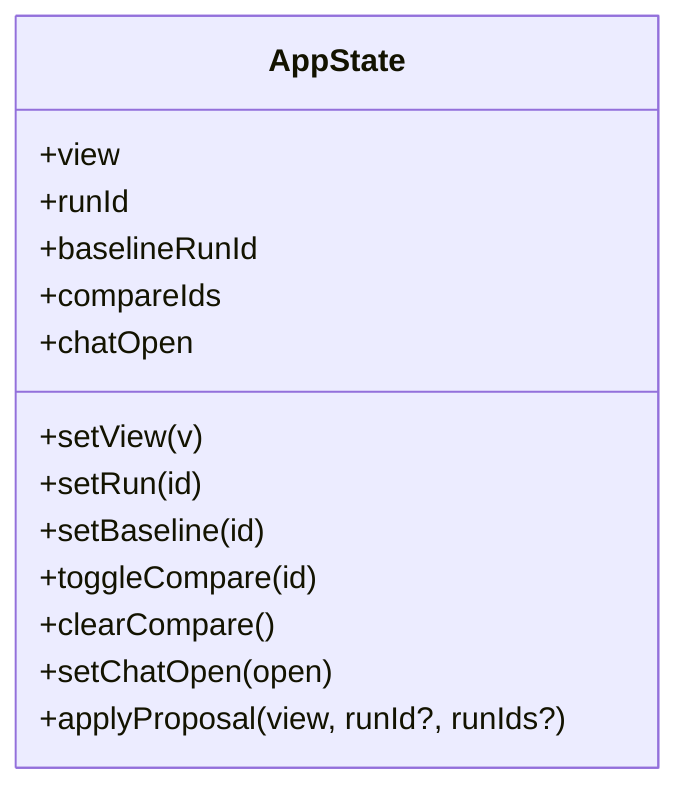
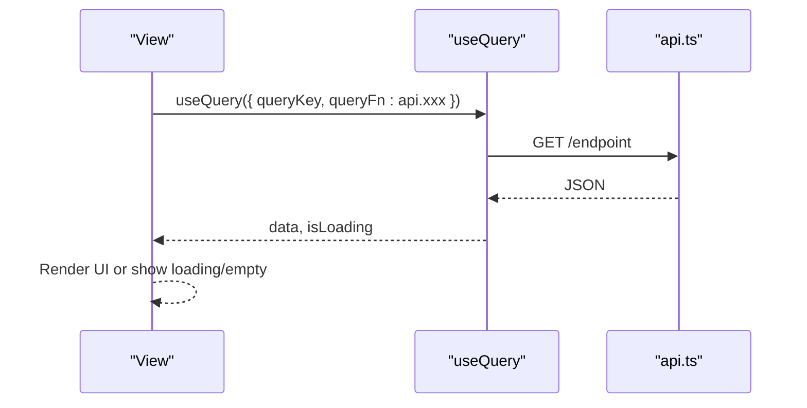
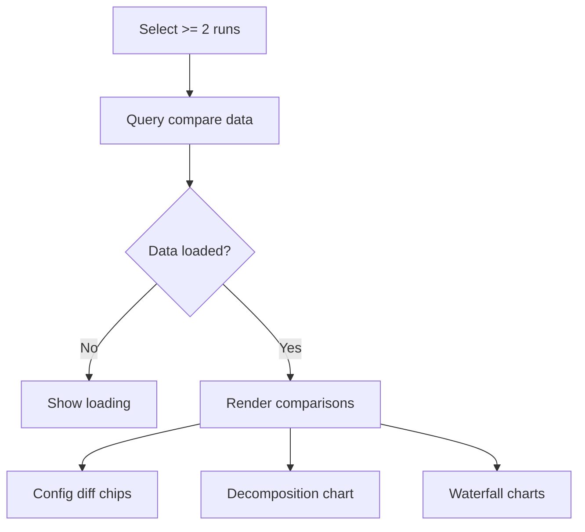
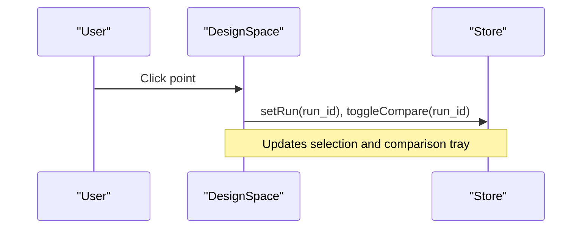
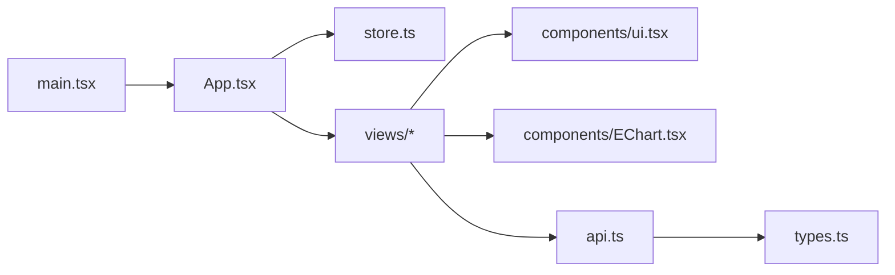

# Frontend Components & Views

<cite>
**Referenced Files in This Document**
- [App.tsx](file://frontend/src/App.tsx)
- [store.ts](file://frontend/src/store.ts)
- [api.ts](file://frontend/src/api.ts)
- [types.ts](file://frontend/src/types.ts)
- [main.tsx](file://frontend/src/main.tsx)
- [EChart.tsx](file://frontend/src/components/EChart.tsx)
- [ui.tsx](file://frontend/src/components/ui.tsx)
- [Scorecard.tsx](file://frontend/src/views/Scorecard.tsx)
- [Compare.tsx](file://frontend/src/views/Compare.tsx)
- [DesignSpace.tsx](file://frontend/src/views/DesignSpace.tsx)
- [AreaExplorer.tsx](file://frontend/src/views/AreaExplorer.tsx)
- [PowerExplorer.tsx](file://frontend/src/views/PowerExplorer.tsx)
- [TimingExplorer.tsx](file://frontend/src/views/TimingExplorer.tsx)
- [RunExplorer.tsx](file://frontend/src/views/RunExplorer.tsx)
</cite>

## Table of Contents
1. [Introduction](#introduction)
2. [Project Structure](#project-structure)
3. [Core Components](#core-components)
4. [Architecture Overview](#architecture-overview)
5. [Detailed Component Analysis](#detailed-component-analysis)
6. [Dependency Analysis](#dependency-analysis)
7. [Performance Considerations](#performance-considerations)
8. [Troubleshooting Guide](#troubleshooting-guide)
9. [Conclusion](#conclusion)
10. [Appendices](#appendices)

## Introduction
This document describes the PPA-Profiler frontend, a React and TypeScript application that provides interactive analysis of area, power, timing, and performance across design runs. It covers the component architecture, reusable UI components, feature-specific views, global state management with Zustand, data fetching via TanStack Query, ECharts-based visualizations, responsive styling with Tailwind CSS, and accessibility considerations.

## Project Structure
The frontend is organized into:
- Application shell and routing by view: App.tsx
- Global state and URL synchronization: store.ts
- API client for backend endpoints: api.ts
- Shared types for server payloads: types.ts
- Reusable UI primitives: components/ui.tsx
- Chart wrapper and palette: components/EChart.tsx
- Feature views: views/* (Scorecard, Compare, DesignSpace, AreaExplorer, PowerExplorer, TimingExplorer, RunExplorer)
- Bootstrap and query client setup: main.tsx

**Diagram sources**
- [App.tsx:1-152](file://frontend/src/App.tsx#L1-L152)
- [store.ts:1-80](file://frontend/src/store.ts#L1-L80)
- [api.ts:1-49](file://frontend/src/api.ts#L1-L49)
- [types.ts:1-132](file://frontend/src/types.ts#L1-L132)
- [main.tsx:1-18](file://frontend/src/main.tsx#L1-L18)

**Section sources**
- [App.tsx:1-152](file://frontend/src/App.tsx#L1-L152)
- [main.tsx:1-18](file://frontend/src/main.tsx#L1-L18)

## Core Components
- App layout and navigation: TopBar, Sidebar, CurrentView selector, and ChatPanel integration.
- Global state: run selection, baseline, comparison tray, current view, and chat panel visibility; persisted to URL hash for shareable links.
- Data fetching: TanStack Query hooks call api.* methods; results are typed using types.ts.
- Visualizations: EChart wrapper around echarts-for-react with consistent palette and event handling.
- UI primitives: Card, Table, Kpi, Delta, SevBadge, Empty, Spinner, formatting helpers.

Key responsibilities:
- App.tsx orchestrates layout, navigation, and view rendering based on store.view.
- store.ts centralizes cross-cutting state and syncs it to the URL for deep linking and bookmarking.
- api.ts encapsulates HTTP calls and error propagation.
- EChart.tsx standardizes chart configuration and event binding.
- ui.tsx provides consistent, accessible building blocks for tables, cards, metrics, and status badges.

**Section sources**
- [App.tsx:17-152](file://frontend/src/App.tsx#L17-L152)
- [store.ts:1-80](file://frontend/src/store.ts#L1-L80)
- [api.ts:1-49](file://frontend/src/api.ts#L1-L49)
- [EChart.tsx:1-27](file://frontend/src/components/EChart.tsx#L1-L27)
- [ui.tsx:1-97](file://frontend/src/components/ui.tsx#L1-L97)

## Architecture Overview
The app follows a unidirectional data flow:
- User interactions update Zustand store (e.g., selected run, baseline, compare list).
- Views subscribe to store and trigger queries via react-query.
- Queries call api.ts functions which fetch from /api endpoints.
- Responses are typed and rendered by views using EChart and ui primitives.
- The URL hash mirrors key state for sharing and persistence.

**Diagram sources**
- [App.tsx:31-80](file://frontend/src/App.tsx#L31-L80)
- [store.ts:22-68](file://frontend/src/store.ts#L22-L68)
- [api.ts:8-49](file://frontend/src/api.ts#L8-L49)
- [Scorecard.tsx:6-15](file://frontend/src/views/Scorecard.tsx#L6-L15)

## Detailed Component Analysis

### Application Shell and Routing
- TopBar loads available runs and AI status, exposes run/baseline selectors, and shows compare count.
- Sidebar groups navigation entries and switches active view via store.setView.
- CurrentView renders the selected view component based on store.view.
- Optional ChatPanel appears when enabled.

**Diagram sources**
- [App.tsx:31-152](file://frontend/src/App.tsx#L31-L152)
- [store.ts:22-68](file://frontend/src/store.ts#L22-L68)

**Section sources**
- [App.tsx:17-152](file://frontend/src/App.tsx#L17-L152)
- [store.ts:1-80](file://frontend/src/store.ts#L1-L80)

### Global State Management (Zustand)
- Stores view, runId, baselineRunId, compareIds, chatOpen.
- Provides setters that also write to URL hash for shareable links.
- Exposes aiContext() to pass current context to AI features.

**Diagram sources**
- [store.ts:1-80](file://frontend/src/store.ts#L1-L80)

**Section sources**
- [store.ts:1-80](file://frontend/src/store.ts#L1-L80)

### Data Fetching Patterns
- Each view uses react-query’s useQuery with a stable queryKey including runId or compareIds.
- api.ts defines typed endpoints for all backend routes.
- Errors propagate as thrown errors from fetch wrappers; views handle loading and empty states.

**Diagram sources**
- [Scorecard.tsx:6-15](file://frontend/src/views/Scorecard.tsx#L6-L15)
- [api.ts:23-49](file://frontend/src/api.ts#L23-L49)

**Section sources**
- [api.ts:1-49](file://frontend/src/api.ts#L1-L49)
- [Scorecard.tsx:6-15](file://frontend/src/views/Scorecard.tsx#L6-L15)

### Reusable UI Components
- Card: container with optional title and right-aligned content.
- Table: responsive table with header and body.
- Kpi: metric card with value, unit, delta, target, and over-budget highlighting.
- Delta: percentage delta with color coding and inversion support.
- SevBadge: severity badge for findings.
- Empty/Spinner: placeholder states.
- Helpers: fmt for number formatting, shortModule for path display.

Usage examples:
- Scorecard composes Kpi, Delta, Table, Card to present metrics and budgets.
- Compare uses Card, Table, Delta, and EChart for waterfalls and decomposition charts.
- Domain explorers combine Table and EChart for hierarchical and stacked visualizations.

**Section sources**
- [ui.tsx:1-97](file://frontend/src/components/ui.tsx#L1-L97)
- [Scorecard.tsx:1-124](file://frontend/src/views/Scorecard.tsx#L1-L124)
- [Compare.tsx:1-148](file://frontend/src/views/Compare.tsx#L1-L148)

### ECharts Integration
- EChart wraps echarts-for-react with consistent height, canvas renderer, and event binding.
- PALETTE provides consistent colors for good/bad/neutral/accent/muted.
- Views build options for scatter, parallel coordinates, treemap, stacked bars, histograms, and bar charts.

Accessibility notes:
- Charts include tooltips and axis labels for screen readers where supported.
- Color choices are complemented by text labels and patterns (e.g., positive/negative indicators).

**Section sources**
- [EChart.tsx:1-27](file://frontend/src/components/EChart.tsx#L1-L27)
- [DesignSpace.tsx:30-75](file://frontend/src/views/DesignSpace.tsx#L30-L75)
- [PowerExplorer.tsx:20-31](file://frontend/src/views/PowerExplorer.tsx#L20-L31)
- [TimingExplorer.tsx:18-43](file://frontend/src/views/TimingExplorer.tsx#L18-L43)

### Scorecard View
- Displays overall metrics, deltas vs baseline, domain summaries, and top findings.
- Uses Kpi for key figures with targets and budget overage flags.
- Shows timing, area, power, and performance snapshots in compact cards.

**Section sources**
- [Scorecard.tsx:6-124](file://frontend/src/views/Scorecard.tsx#L6-L124)

### Compare View
- Requires at least two runs in the comparison tray to render.
- Shows config diffs, net score decomposition, and per-metric deltas.
- Visualizes area and power deltas by module as waterfall charts.

**Diagram sources**
- [Compare.tsx:27-148](file://frontend/src/views/Compare.tsx#L27-L148)

**Section sources**
- [Compare.tsx:1-148](file://frontend/src/views/Compare.tsx#L1-L148)

### DesignSpace View
- Scatter plot of Pareto-optimal vs dominated points with selectable axes.
- Parallel coordinates visualization across multiple figures of merit.
- Click-to-select behavior updates global run and adds to comparison tray.

**Diagram sources**
- [DesignSpace.tsx:17-119](file://frontend/src/views/DesignSpace.tsx#L17-L119)
- [store.ts:43-68](file://frontend/src/store.ts#L43-L68)

**Section sources**
- [DesignSpace.tsx:1-119](file://frontend/src/views/DesignSpace.tsx#L1-L119)

### Area Explorer
- Builds a hierarchy tree from rows and renders a treemap with drill-down and breadcrumb navigation.
- Supports coloring by composition or delta vs baseline; sizing by area or instance count.
- Presents top-level modules in a sortable table with deltas and sequence ratio highlights.

**Section sources**
- [AreaExplorer.tsx:1-139](file://frontend/src/views/AreaExplorer.tsx#L1-L139)

### Power Explorer
- Summarizes total power and key indicators (clock share, gating efficiency, leakage share).
- Stacked bar chart of internal/switching/leakage by module.
- Module table includes density and delta vs baseline.

**Section sources**
- [PowerExplorer.tsx:1-101](file://frontend/src/views/PowerExplorer.tsx#L1-L101)

### Timing Explorer
- Shows WNS/TNS/NVE/Fmax summary.
- Histogram of setup slack to diagnose single-path vs systemic issues.
- Leaderboard of critical modules and worst paths table with logic depth highlights.

**Section sources**
- [TimingExplorer.tsx:1-106](file://frontend/src/views/TimingExplorer.tsx#L1-L106)

### Run Explorer
- Lists all runs with sortability and inline deltas vs baseline.
- Allows setting baseline and adding runs to comparison tray.
- Quick link to Compare view when enough runs are selected.

**Section sources**
- [RunExplorer.tsx:1-109](file://frontend/src/views/RunExplorer.tsx#L1-L109)

## Dependency Analysis
- App depends on store for navigation and selection, and imports views and AI panel.
- Views depend on store for selection, api for data, and ui/EChart for presentation.
- api depends on types for response shapes.
- main sets up QueryClient and mounts App.

**Diagram sources**
- [App.tsx:1-152](file://frontend/src/App.tsx#L1-L152)
- [store.ts:1-80](file://frontend/src/store.ts#L1-L80)
- [api.ts:1-49](file://frontend/src/api.ts#L1-L49)
- [types.ts:1-132](file://frontend/src/types.ts#L1-L132)
- [main.tsx:1-18](file://frontend/src/main.tsx#L1-L18)

**Section sources**
- [App.tsx:1-152](file://frontend/src/App.tsx#L1-L152)
- [store.ts:1-80](file://frontend/src/store.ts#L1-L80)
- [api.ts:1-49](file://frontend/src/api.ts#L1-L49)
- [types.ts:1-132](file://frontend/src/types.ts#L1-L132)
- [main.tsx:1-18](file://frontend/src/main.tsx#L1-L18)

## Performance Considerations
- Use react-query caching and staleTime to reduce network load; default configured in main.tsx.
- Prefer memoization for derived structures (e.g., AreaExplorer builds tree once per dataset).
- Keep chart options minimal and avoid unnecessary re-renders by stabilizing keys and props.
- Lazy rendering of heavy charts via notMerge and lazyUpdate in EChart.
- Avoid excessive reflows by using Tailwind utility classes for layout and spacing.

[No sources needed since this section provides general guidance]

## Troubleshooting Guide
Common issues and remedies:
- No data shown: ensure a run is selected; views guard against missing runId and render Empty placeholders.
- Network errors: api.get throws on non-ok responses; react-query will surface errors; verify backend availability and CORS if applicable.
- Comparison requires two runs: Compare view explicitly checks compareIds length and prompts selection.
- URL state mismatch: store writes to URL hash on every mutation; refresh should restore state.

**Section sources**
- [api.ts:8-21](file://frontend/src/api.ts#L8-L21)
- [store.ts:22-68](file://frontend/src/store.ts#L22-L68)
- [Compare.tsx:27-39](file://frontend/src/views/Compare.tsx#L27-L39)
- [Scorecard.tsx:6-15](file://frontend/src/views/Scorecard.tsx#L6-L15)

## Conclusion
The PPA-Profiler frontend delivers a cohesive, data-driven interface for analyzing area, power, timing, and performance across design runs. Its architecture separates concerns cleanly between layout, state, data fetching, and visualization. The combination of Zustand, react-query, and ECharts enables responsive, shareable, and richly interactive experiences. Tailwind CSS ensures consistent styling, while reusable UI components promote maintainability and accessibility.

[No sources needed since this section summarizes without analyzing specific files]

## Appendices

### Styling and Theming with Tailwind CSS v4
- Dark theme base with slate tones and accent colors for emphasis.
- Consistent border and background opacity utilities for layered surfaces.
- Responsive grids and typography scales for readability across devices.
- Palette constants in EChart.tsx align chart visuals with UI themes.

[No sources needed since this section provides general guidance]

### Accessibility Considerations
- Semantic HTML elements (header, nav, main, aside) improve structure for assistive technologies.
- Descriptive labels and titles on controls and charts.
- Color contrast and redundant cues (text labels alongside colors) for clarity.
- Keyboard navigable controls (buttons, selects, radio inputs).

[No sources needed since this section provides general guidance]