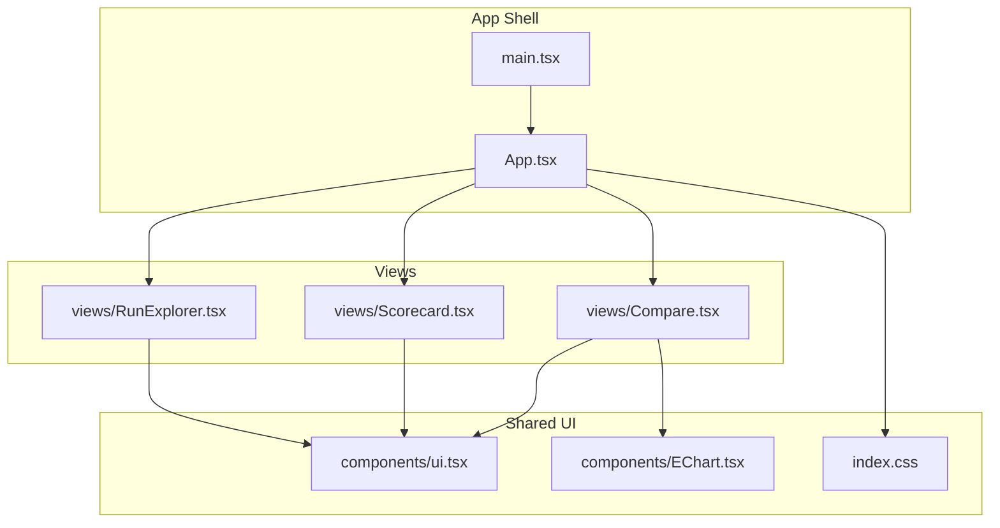
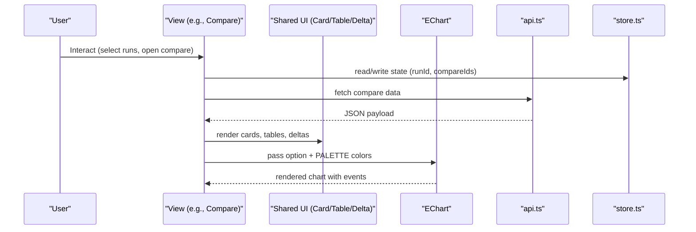
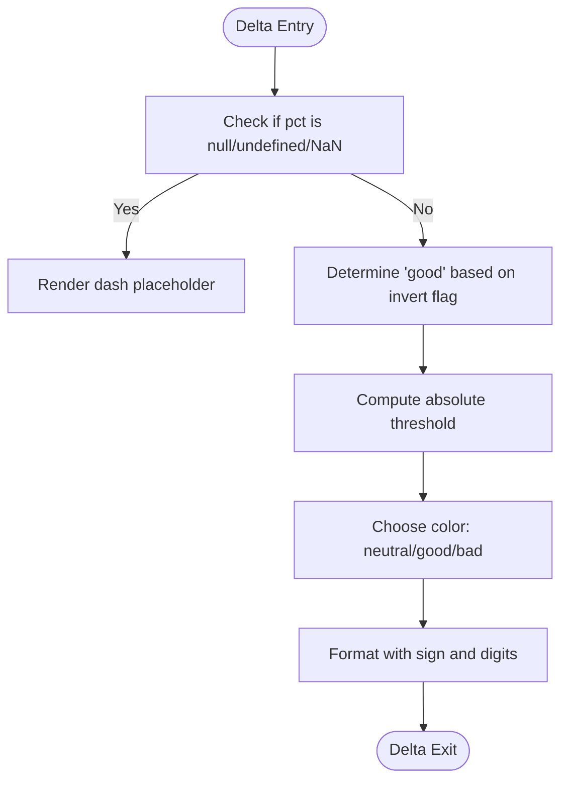
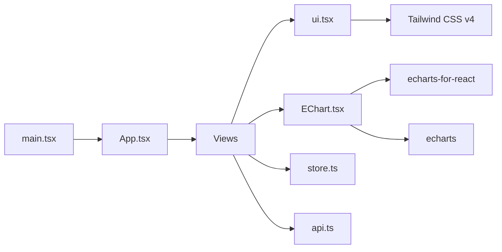

# Shared UI Components

<cite>
**Referenced Files in This Document**
- [EChart.tsx](file://frontend/src/components/EChart.tsx)
- [ui.tsx](file://frontend/src/components/ui.tsx)
- [index.css](file://frontend/src/index.css)
- [package.json](file://frontend/package.json)
- [App.tsx](file://frontend/src/App.tsx)
- [main.tsx](file://frontend/src/main.tsx)
- [RunExplorer.tsx](file://frontend/src/views/RunExplorer.tsx)
- [Compare.tsx](file://frontend/src/views/Compare.tsx)
- [Scorecard.tsx](file://frontend/src/views/Scorecard.tsx)
- [types.ts](file://frontend/src/types.ts)
- [api.ts](file://frontend/src/api.ts)
- [store.ts](file://frontend/src/store.ts)
</cite>

## Table of Contents
1. [Introduction](#introduction)
2. [Project Structure](#project-structure)
3. [Core Components](#core-components)
4. [Architecture Overview](#architecture-overview)
5. [Detailed Component Analysis](#detailed-component-analysis)
6. [Dependency Analysis](#dependency-analysis)
7. [Performance Considerations](#performance-considerations)
8. [Troubleshooting Guide](#troubleshooting-guide)
9. [Conclusion](#conclusion)
10. [Appendices](#appendices)

## Introduction
This document describes PPA-Profiler’s shared UI components that provide consistent visual elements and interactions across the application. It focuses on:
- EChart: a wrapper around ECharts for rich, responsive data visualizations with consistent styling and theme integration.
- ui.tsx: reusable UI primitives (cards, tables, badges, deltas, KPIs, empty states, spinners) built with Tailwind CSS v4.
It also explains composition patterns, prop interfaces, styling approaches, accessibility considerations, responsive design, customization options, and integration patterns with the broader frontend architecture.

## Project Structure
The shared UI lives under frontend/src/components and is consumed by views such as RunExplorer, Scorecard, and Compare. The app shell (App.tsx) composes navigation and layout, while main.tsx bootstraps React and global styles.



**Diagram sources**
- [main.tsx:1-18](file://frontend/src/main.tsx#L1-L18)
- [App.tsx:1-152](file://frontend/src/App.tsx#L1-L152)
- [EChart.tsx:1-27](file://frontend/src/components/EChart.tsx#L1-L27)
- [ui.tsx:1-97](file://frontend/src/components/ui.tsx#L1-L97)
- [index.css:1-19](file://frontend/src/index.css#L1-L19)
- [RunExplorer.tsx:1-109](file://frontend/src/views/RunExplorer.tsx#L1-L109)
- [Scorecard.tsx:1-124](file://frontend/src/views/Scorecard.tsx#L1-L124)
- [Compare.tsx:1-148](file://frontend/src/views/Compare.tsx#L1-L148)

**Section sources**
- [main.tsx:1-18](file://frontend/src/main.tsx#L1-L18)
- [App.tsx:1-152](file://frontend/src/App.tsx#L1-L152)
- [index.css:1-19](file://frontend/src/index.css#L1-L19)

## Core Components
- EChart: A thin wrapper around echarts-for-react to standardize chart height, width behavior, renderer selection, and event binding. Also exports a shared color palette for consistent theming.
- ui.tsx: Provides Card, SevBadge, Delta, Kpi, fmt, shortModule, Table, Empty, Spinner. These are styled with Tailwind utilities and follow a dark theme baseline.

Key responsibilities:
- Consistent visual language across charts and UI blocks.
- Centralized formatting helpers and delta visualization.
- Reusable containers and status indicators.

**Section sources**
- [EChart.tsx:1-27](file://frontend/src/components/EChart.tsx#L1-L27)
- [ui.tsx:1-97](file://frontend/src/components/ui.tsx#L1-L97)

## Architecture Overview
The UI system integrates with the app via:
- Global styles and dark mode from index.css.
- State management via store.ts (Zustand), which drives view selection and context (runId, baseline, compareIds).
- Data fetching via api.ts using TanStack Query in views.
- Views compose shared UI components to present data consistently.



**Diagram sources**
- [Compare.tsx:1-148](file://frontend/src/views/Compare.tsx#L1-L148)
- [EChart.tsx:1-27](file://frontend/src/components/EChart.tsx#L1-L27)
- [ui.tsx:1-97](file://frontend/src/components/ui.tsx#L1-L97)
- [api.ts:1-49](file://frontend/src/api.ts#L1-L49)
- [store.ts:1-84](file://frontend/src/store.ts#L1-L84)

## Detailed Component Analysis

### EChart Component
Purpose:
- Provide a consistent chart surface with fixed height, full width, canvas renderer, and optional event handling.
- Export a shared palette for consistent color semantics across charts.

Props:
- option: ECharts configuration object.
- height: numeric or string; defaults to 320.
- onEvent: optional { type, handler } to bind a single chart event.

Behavior:
- Forces width to 100% and sets explicit height for predictable sizing.
- Uses notMerge and lazyUpdate for performance.
- Renders with canvas renderer for better performance in dense charts.
- Binds a single event if provided.

Styling and Theme:
- Inherits global dark theme from index.css.
- Use PALETTE constants for semantic colors (good/bad/neutral/accent/muted).

Usage examples:
- Waterfall bar charts in Compare showing area/power deltas with good/bad coloring.
- Horizontal bar charts for decomposition metrics.

Accessibility:
- ECharts provides tooltips and keyboard interaction by default; ensure labels and axis titles are descriptive.
- For screen readers, consider adding aria-labels at the container level where appropriate.

Extensibility:
- Add more props for theme overrides or event bindings if needed.
- Keep chart options minimal and derived from view logic to maintain separation of concerns.

**Section sources**
- [EChart.tsx:1-27](file://frontend/src/components/EChart.tsx#L1-L27)
- [Compare.tsx:1-148](file://frontend/src/views/Compare.tsx#L1-L148)

#### Class Diagram (Conceptual)
```mermaid
classDiagram
class EChart {
+option Record<string, unknown>
+height number|string
+onEvent {type : string; handler : function}
}
class PALETTE {
+good string
+bad string
+neutral string
+accent string
+muted string
}
```

**Diagram sources**
- [EChart.tsx:1-27](file://frontend/src/components/EChart.tsx#L1-L27)

### UI Primitives (ui.tsx)
Components overview:
- Card: Container with optional title and right-side content; uses rounded borders and subtle background.
- SevBadge: Severity indicator with predefined styles per severity level.
- Delta: Displays percentage change with color coding based on direction and magnitude; supports inversion for metrics where lower is better.
- Kpi: Key metric card with label, value, unit, delta, target, and over-budget highlighting.
- fmt: Number formatter with locale-aware output and configurable digits.
- shortModule: Truncates module paths for display.
- Table: Responsive table with header row and striped body rows.
- Empty: Placeholder message when no data is available.
- Spinner: Loading placeholder.

Prop interfaces and behavior:
- Card accepts title, children, right, className for flexible composition.
- SevBadge takes severity string and falls back to info style.
- Delta handles null/undefined/NaN gracefully and formats with sign prefix.
- Kpi supports optional unit, delta, target, and overBudget flag for budget alerts.
- Table requires head array and children rows.

Styling approach:
- Built entirely with Tailwind CSS v4 utilities.
- Dark theme base via index.css; components use slate tones and accent colors.
- Consistent spacing, typography, and border styles.

Accessibility:
- Use semantic HTML (table, th, td) for Table.
- Ensure meaningful text for buttons and inputs in consuming views.
- Color contrast is designed for dark backgrounds; test critical information with color-blind palettes.

Responsive design:
- Table wraps horizontally on small screens.
- Cards and grids adapt via utility classes in views; components remain flexible.

Customization:
- Extend SevBadge styles for new severities.
- Override component classNames via className where supported.
- Create higher-order wrappers for specialized Kpi variants if needed.

**Section sources**
- [ui.tsx:1-97](file://frontend/src/components/ui.tsx#L1-L97)
- [index.css:1-19](file://frontend/src/index.css#L1-L19)

#### Flowchart: Delta Calculation Logic


**Diagram sources**
- [ui.tsx:35-44](file://frontend/src/components/ui.tsx#L35-L44)

### Integration Patterns in Views
- RunExplorer: Uses Card, Table, Delta, fmt to present runs, set baselines, and show deltas vs baseline.
- Scorecard: Composes Kpi, Delta, SevBadge, Table, Card to summarize metrics and findings.
- Compare: Combines EChart with PALETTE for waterfalls and decomposition charts; uses Card, Table, Delta, fmt.

These patterns demonstrate:
- Composition over inheritance: views assemble small, focused components.
- Centralized formatting and delta logic reduce duplication.
- Consistent visual hierarchy and spacing across pages.

**Section sources**
- [RunExplorer.tsx:1-109](file://frontend/src/views/RunExplorer.tsx#L1-L109)
- [Scorecard.tsx:1-124](file://frontend/src/views/Scorecard.tsx#L1-L124)
- [Compare.tsx:1-148](file://frontend/src/views/Compare.tsx#L1-L148)

## Dependency Analysis
External dependencies relevant to UI:
- echarts and echarts-for-react for charting.
- Tailwind CSS v4 for styling.
- React and ReactDOM for rendering.
- TanStack Query for data fetching in views.
- Zustand for state management.



**Diagram sources**
- [package.json:1-30](file://frontend/package.json#L1-L30)
- [EChart.tsx:1-27](file://frontend/src/components/EChart.tsx#L1-L27)
- [ui.tsx:1-97](file://frontend/src/components/ui.tsx#L1-L97)
- [App.tsx:1-152](file://frontend/src/App.tsx#L1-L152)
- [main.tsx:1-18](file://frontend/src/main.tsx#L1-L18)

**Section sources**
- [package.json:1-30](file://frontend/package.json#L1-L30)

## Performance Considerations
- EChart uses canvas renderer and lazy updates to improve rendering performance for large datasets.
- Avoid passing deeply nested option objects on every render; memoize chart options where possible in views.
- Use notMerge to prevent unintended state accumulation in charts.
- Prefer lightweight components (Table, Card) for dense layouts; defer heavy computations to backend or memoized selectors.
- Limit re-renders by keeping state changes minimal and colocated in store.ts.

[No sources needed since this section provides general guidance]

## Troubleshooting Guide
Common issues and resolutions:
- Charts not rendering or blank:
  - Ensure EChart receives a valid option object and non-zero height.
  - Verify echarts-for-react is installed and compatible with echarts version.
- Event handlers not firing:
  - Confirm onEvent.type matches an ECharts event name and handler signature.
- Styling inconsistencies:
  - Check that index.css imports Tailwind and sets dark color scheme.
  - Ensure components are wrapped in a theme-aware root.
- Data loading states:
  - Use Empty and Spinner appropriately; guard against undefined data before rendering.
- Accessibility:
  - Add descriptive labels to interactive elements in views.
  - Ensure sufficient color contrast for status indicators.

**Section sources**
- [EChart.tsx:1-27](file://frontend/src/components/EChart.tsx#L1-L27)
- [index.css:1-19](file://frontend/src/index.css#L1-L19)
- [ui.tsx:1-97](file://frontend/src/components/ui.tsx#L1-L97)

## Conclusion
PPA-Profiler’s shared UI components deliver a cohesive, accessible, and responsive interface through:
- A standardized chart wrapper (EChart) with consistent theming and performance settings.
- A robust set of UI primitives (Card, Table, Delta, Kpi, etc.) built with Tailwind CSS v4.
- Clear composition patterns that keep views focused on business logic while reusing presentation logic.
Adopting these components ensures visual consistency, reduces duplication, and simplifies extending the UI system with new features.

[No sources needed since this section summarizes without analyzing specific files]

## Appendices

### Prop Interfaces Summary
- EChart:
  - option: Record<string, unknown>
  - height?: number | string
  - onEvent?: { type: string; handler: (params: unknown) => void }
- Card:
  - title?: ReactNode
  - children: ReactNode
  - right?: ReactNode
  - className?: string
- SevBadge:
  - severity: string
- Delta:
  - pct: number | null | undefined
  - invert?: boolean
  - digits?: number
- Kpi:
  - label: string
  - value: string
  - unit?: string
  - delta?: ReactNode
  - invertDelta?: boolean
  - target?: ReactNode
  - overBudget?: boolean
- Table:
  - head: string[]
  - children: ReactNode
- Empty:
  - msg?: string
- Spinner:
  - none

**Section sources**
- [EChart.tsx:1-27](file://frontend/src/components/EChart.tsx#L1-L27)
- [ui.tsx:1-97](file://frontend/src/components/ui.tsx#L1-L97)

### Example Usage References
- EChart usage in waterfall and decomposition charts:
  - [Compare.tsx:7-25](file://frontend/src/views/Compare.tsx#L7-L25)
  - [Compare.tsx:88-105](file://frontend/src/views/Compare.tsx#L88-L105)
- UI primitives usage:
  - RunExplorer table and deltas: [RunExplorer.tsx:41-93](file://frontend/src/views/RunExplorer.tsx#L41-L93)
  - Scorecard KPIs and badges: [Scorecard.tsx:35-59](file://frontend/src/views/Scorecard.tsx#L35-L59), [Scorecard.tsx:106-120](file://frontend/src/views/Scorecard.tsx#L106-L120)

**Section sources**
- [Compare.tsx:1-148](file://frontend/src/views/Compare.tsx#L1-L148)
- [RunExplorer.tsx:1-109](file://frontend/src/views/RunExplorer.tsx#L1-L109)
- [Scorecard.tsx:1-124](file://frontend/src/views/Scorecard.tsx#L1-L124)