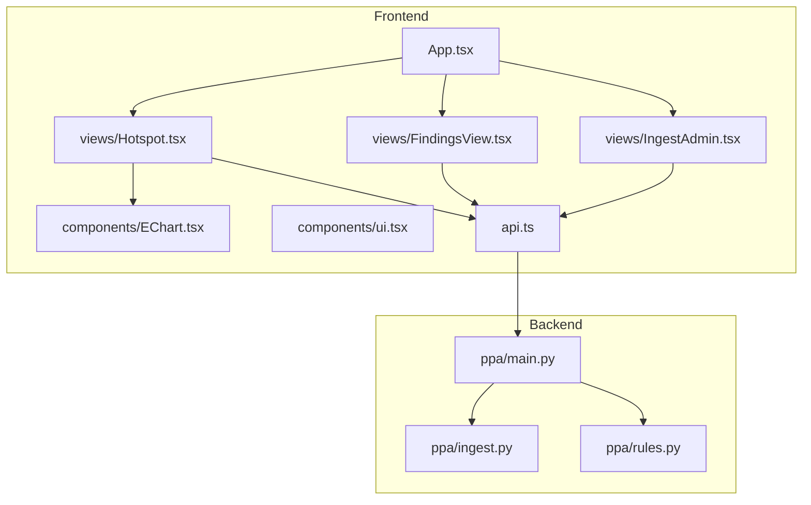
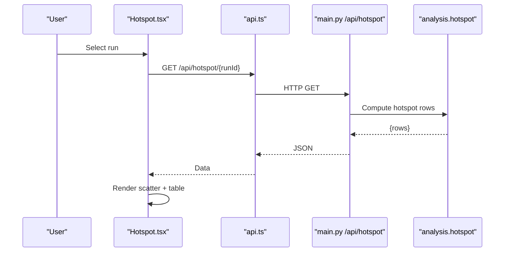
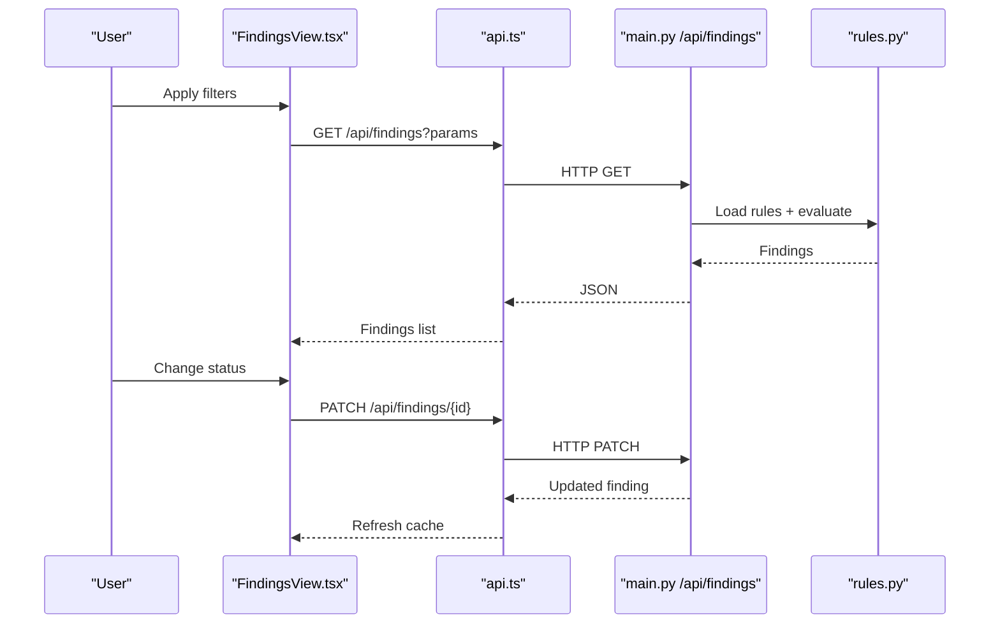
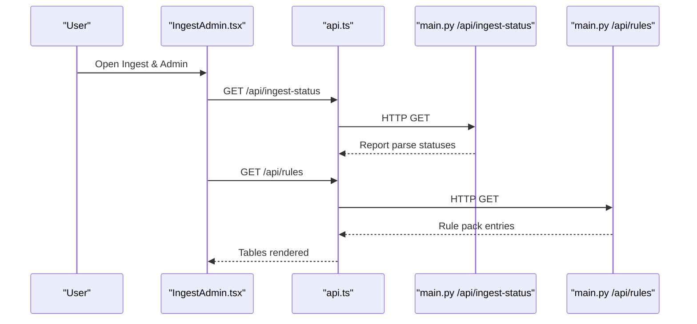
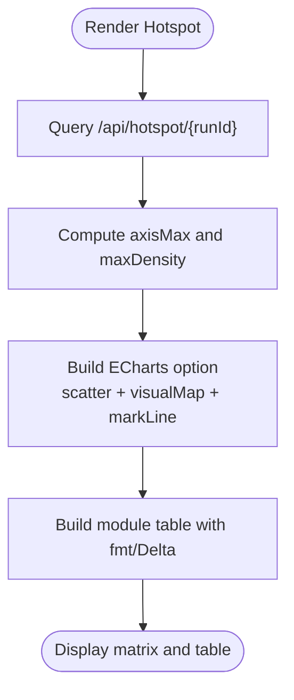
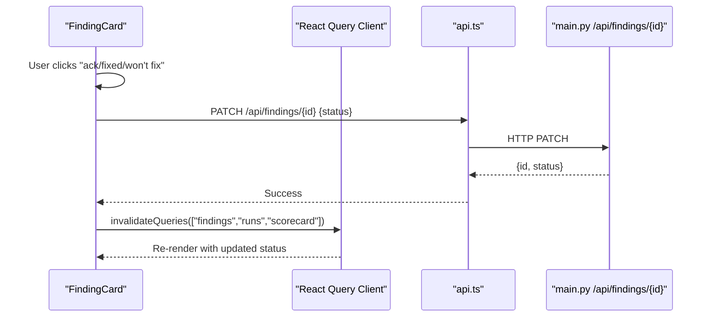
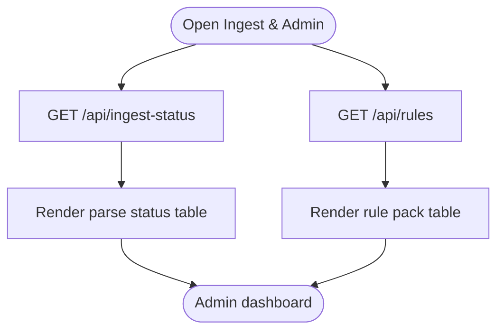
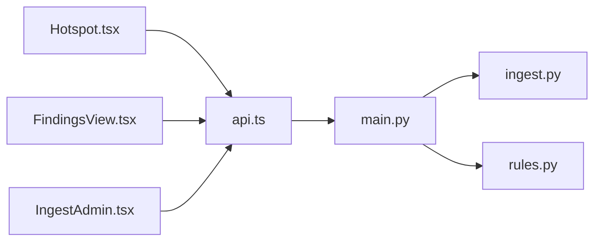

# Specialized View Components

<cite>
**Referenced Files in This Document**
- [App.tsx](file://frontend/src/App.tsx)
- [Hotspot.tsx](file://frontend/src/views/Hotspot.tsx)
- [FindingsView.tsx](file://frontend/src/views/FindingsView.tsx)
- [IngestAdmin.tsx](file://frontend/src/views/IngestAdmin.tsx)
- [EChart.tsx](file://frontend/src/components/EChart.tsx)
- [ui.tsx](file://frontend/src/components/ui.tsx)
- [api.ts](file://frontend/src/api.ts)
- [types.ts](file://frontend/src/types.ts)
- [ingest.py](file://backend/ppa/ingest.py)
- [rules.py](file://backend/ppa/rules.py)
- [main.py](file://backend/ppa/main.py)
</cite>

## Table of Contents
1. Introduction
2. Project Structure
3. Core Components
4. Architecture Overview
5. Detailed Component Analysis
6. Dependency Analysis
7. Performance Considerations
8. Troubleshooting Guide
9. Conclusion

## Introduction
This document explains PPA-Profiler’s specialized view components that provide advanced analysis and administrative functionality:
- Hotspot component for hotspot matrix visualization combining area, power, timing criticality, and density to identify optimization targets across multiple dimensions.
- FindingsView component for displaying rule-based diagnostic results with status management, feedback collection, and resolution workflows.
- IngestAdmin component for managing data ingestion processes, monitoring import jobs, and handling EDA tool output processing.

These components implement advanced UI patterns such as matrix visualizations, status tracking interfaces, and administrative controls, and they integrate with backend services for real-time updates and user workflow optimization.

## Project Structure
The frontend organizes specialized views under src/views and composes them via the application shell. The API layer abstracts HTTP calls to the backend, while shared UI primitives standardize cards, tables, badges, and formatting utilities. The backend exposes REST endpoints for hotspots, findings, ingest status, and rules, and implements ingestion and rule evaluation logic.

**Diagram sources**
- [App.tsx:17-29](file://frontend/src/App.tsx#L17-L29)
- [Hotspot.tsx:1-119](file://frontend/src/views/Hotspot.tsx#L1-L119)
- [FindingsView.tsx:1-206](file://frontend/src/views/FindingsView.tsx#L1-L206)
- [IngestAdmin.tsx:1-96](file://frontend/src/views/IngestAdmin.tsx#L1-L96)
- [EChart.tsx:1-27](file://frontend/src/components/EChart.tsx#L1-L27)
- [api.ts:23-48](file://frontend/src/api.ts#L23-L48)
- [main.py:94-162](file://backend/ppa/main.py#L94-L162)

**Section sources**
- [App.tsx:17-29](file://frontend/src/App.tsx#L17-L29)
- [api.ts:23-48](file://frontend/src/api.ts#L23-L48)
- [main.py:94-162](file://backend/ppa/main.py#L94-L162)

## Core Components
- Hotspot: Renders a scatter plot (area share vs power share) with bubble size encoding timing criticality and color encoding power density; includes a module table with deltas and highlights.
- FindingsView: Displays rule-generated findings with filters (scope, severity, category, status), per-finding status transitions, feedback voting, and AI-assisted explanation prompts.
- IngestAdmin: Shows ingestion status per report kind with SHA-256 and parser version, lists active diagnosis rules, and provides CLI quickstart guidance.

Key UI patterns:
- Matrix visualization using a chart library with visual mapping and interactive tooltips.
- Status tracking interface with inline actions and optimistic refreshes.
- Administrative controls with tabular reporting and actionable hints.

**Section sources**
- [Hotspot.tsx:7-118](file://frontend/src/views/Hotspot.tsx#L7-L118)
- [FindingsView.tsx:32-130](file://frontend/src/views/FindingsView.tsx#L32-L130)
- [IngestAdmin.tsx:5-95](file://frontend/src/views/IngestAdmin.tsx#L5-L95)
- [ui.tsx:3-92](file://frontend/src/components/ui.tsx#L3-L92)

## Architecture Overview
The specialized views consume data from backend APIs. The Hotspot view queries run-specific aggregated metrics and renders an ECharts scatter plot. The FindingsView queries filtered findings and supports PATCH operations to update finding status and POST operations to submit feedback. The IngestAdmin view queries ingestion status and rule definitions.

**Diagram sources**
- [Hotspot.tsx:8-16](file://frontend/src/views/Hotspot.tsx#L8-L16)
- [api.ts:32](file://frontend/src/api.ts#L32)
- [main.py:94-96](file://backend/ppa/main.py#L94-L96)

**Diagram sources**
- [FindingsView.tsx:139-147](file://frontend/src/views/FindingsView.tsx#L139-L147)
- [FindingsView.tsx:45-53](file://frontend/src/views/FindingsView.tsx#L45-L53)
- [api.ts:33-47](file://frontend/src/api.ts#L33-L47)
- [main.py:101-131](file://backend/ppa/main.py#L101-L131)
- [rules.py:313-352](file://backend/ppa/rules.py#L313-L352)

**Diagram sources**
- [IngestAdmin.tsx:6-11](file://frontend/src/views/IngestAdmin.tsx#L6-L11)
- [api.ts:39-40](file://frontend/src/api.ts#L39-L40)
- [main.py:154-162](file://backend/ppa/main.py#L154-L162)

## Detailed Component Analysis

### Hotspot Component
- Purpose: Visualize modules on a two-dimensional plane (area share vs power share) with bubble size representing timing criticality and color representing power density. Provide a detailed table with absolute values, percentages, densities, and deltas versus baseline.
- Data flow: Queries run-specific hotspot data, computes axis maxima and visual map ranges, maps rows to chart series, and renders a table with conditional highlighting.
- Advanced UI patterns:
  - Scatter plot with visual mapping dimension for density and dynamic symbol sizing based on criticality.
  - Interactive tooltip showing area/power shares, criticality, and density.
  - Table with delta indicators and threshold-based row highlighting.
- Real-time updates: Uses query key including runId to refetch when selection changes.

**Diagram sources**
- [Hotspot.tsx:8-22](file://frontend/src/views/Hotspot.tsx#L8-L22)
- [Hotspot.tsx:24-72](file://frontend/src/views/Hotspot.tsx#L24-L72)
- [Hotspot.tsx:91-115](file://frontend/src/views/Hotspot.tsx#L91-L115)
- [EChart.tsx:3-17](file://frontend/src/components/EChart.tsx#L3-L17)
- [ui.tsx:35-44](file://frontend/src/components/ui.tsx#L35-L44)

**Section sources**
- [Hotspot.tsx:7-118](file://frontend/src/views/Hotspot.tsx#L7-L118)
- [EChart.tsx:1-27](file://frontend/src/components/EChart.tsx#L1-L27)
- [ui.tsx:35-44](file://frontend/src/components/ui.tsx#L35-L44)

### FindingsView Component
- Purpose: Display deterministic rule-based findings with filtering by scope, severity, category, and status; enable status transitions and feedback collection; integrate with AI assistant for explanations.
- Data flow: Queries filtered findings; each FindingCard supports status updates via PATCH and feedback via POST; invalidates relevant caches to reflect changes immediately.
- Advanced UI patterns:
  - Inline status buttons with busy states and immediate cache refresh.
  - Feedback voting with single-use state to prevent duplicate votes.
  - Evidence chips rendering numeric evidence with consistent formatting.
  - Severity badges and status colors for quick scanning.
- Workflow optimization: Prefills AI chat with context about the selected finding to accelerate root cause analysis.

**Diagram sources**
- [FindingsView.tsx:39-53](file://frontend/src/views/FindingsView.tsx#L39-L53)
- [api.ts:44-47](file://frontend/src/api.ts#L44-L47)
- [main.py:114-131](file://backend/ppa/main.py#L114-L131)

**Section sources**
- [FindingsView.tsx:32-130](file://frontend/src/views/FindingsView.tsx#L32-L130)
- [FindingsView.tsx:132-206](file://frontend/src/views/FindingsView.tsx#L132-L206)
- [ui.tsx:19-33](file://frontend/src/components/ui.tsx#L19-L33)

### IngestAdmin Component
- Purpose: Monitor ingestion status per report kind, display rule pack contents, and provide CLI quickstart commands for ingestion and serving.
- Data flow: Queries ingestion status and rules; renders tables with file names, hashes, parser versions, and logs; displays rule parameters for transparency.
- Administrative controls:
  - Status table with truncated filenames and hover titles for full paths.
  - Rule table listing id, category, severity, title, and thresholds.
  - CLI snippet for one-shot demo, ingestion, and serving.

**Diagram sources**
- [IngestAdmin.tsx:6-11](file://frontend/src/views/IngestAdmin.tsx#L6-L11)
- [IngestAdmin.tsx:20-51](file://frontend/src/views/IngestAdmin.tsx#L20-L51)
- [IngestAdmin.tsx:53-75](file://frontend/src/views/IngestAdmin.tsx#L53-L75)
- [api.ts:39-40](file://frontend/src/api.ts#L39-L40)
- [main.py:154-162](file://backend/ppa/main.py#L154-L162)

**Section sources**
- [IngestAdmin.tsx:5-95](file://frontend/src/views/IngestAdmin.tsx#L5-L95)
- [api.ts:39-40](file://frontend/src/api.ts#L39-L40)
- [main.py:154-162](file://backend/ppa/main.py#L154-L162)

## Dependency Analysis
- Frontend dependencies:
  - Views depend on api.ts for data fetching and mutation.
  - Hotspot depends on EChart for visualization and ui.tsx for shared components.
  - FindingsView depends on React Query client for cache invalidation and ui.tsx for badges and formatting.
  - IngestAdmin depends on api.ts and ui.tsx for tables and cards.
- Backend dependencies:
  - main.py defines endpoints for hotspot, findings, ingest-status, and rules.
  - ingest.py parses reports, persists canonicalized metrics, and triggers rule engine.
  - rules.py loads YAML rule pack and evaluates pure functions to produce findings.

**Diagram sources**
- [Hotspot.tsx:1-119](file://frontend/src/views/Hotspot.tsx#L1-L119)
- [FindingsView.tsx:1-206](file://frontend/src/views/FindingsView.tsx#L1-L206)
- [IngestAdmin.tsx:1-96](file://frontend/src/views/IngestAdmin.tsx#L1-L96)
- [api.ts:23-48](file://frontend/src/api.ts#L23-L48)
- [main.py:94-162](file://backend/ppa/main.py#L94-L162)
- [ingest.py:61-240](file://backend/ppa/ingest.py#L61-L240)
- [rules.py:313-352](file://backend/ppa/rules.py#L313-L352)

**Section sources**
- [api.ts:23-48](file://frontend/src/api.ts#L23-L48)
- [main.py:94-162](file://backend/ppa/main.py#L94-L162)
- [ingest.py:61-240](file://backend/ppa/ingest.py#L61-L240)
- [rules.py:313-352](file://backend/ppa/rules.py#L313-L352)

## Performance Considerations
- Hotspot matrix:
  - Use computed axis maxima and visual map ranges to avoid reflows.
  - Limit label overlap with layout options and reduce symbol sizes for dense datasets.
- FindingsView:
  - Invalidate only necessary query keys after mutations to minimize re-renders.
  - Debounce filter changes if needed to reduce network requests.
- IngestAdmin:
  - Paginate or truncate long logs in tables to keep UI responsive.
  - Cache rule pack responses longer since rules change infrequently.

[No sources needed since this section provides general guidance]

## Troubleshooting Guide
- No data in Hotspot:
  - Ensure a run is selected; the component returns empty until runId is set.
  - Verify /api/hotspot/{runId} returns rows and check error messages from api.ts.
- Findings not updating:
  - Confirm PATCH /api/findings/{id} succeeds and cache invalidation runs.
  - Check status enum validation on the backend endpoint.
- Ingest status shows errors:
  - Inspect log column for parser errors; verify file existence and parser version.
  - Re-ingest after fixing tool outputs or updating parsers.

**Section sources**
- [Hotspot.tsx:8-16](file://frontend/src/views/Hotspot.tsx#L8-L16)
- [api.ts:8-21](file://frontend/src/api.ts#L8-L21)
- [FindingsView.tsx:45-53](file://frontend/src/views/FindingsView.tsx#L45-L53)
- [main.py:114-131](file://backend/ppa/main.py#L114-L131)
- [IngestAdmin.tsx:20-51](file://frontend/src/views/IngestAdmin.tsx#L20-L51)
- [ingest.py:93-113](file://backend/ppa/ingest.py#L93-L113)

## Conclusion
PPA-Profiler’s specialized views combine powerful visualizations, robust status management, and administrative controls to streamline PPA analysis workflows:
- Hotspot provides multi-dimensional insight into where design effort yields the greatest impact.
- FindingsView turns deterministic diagnostics into actionable tasks with feedback loops.
- IngestAdmin offers visibility into ingestion health and rule configuration.

Together, these components deliver a cohesive experience for designers and administrators to optimize designs efficiently and confidently.