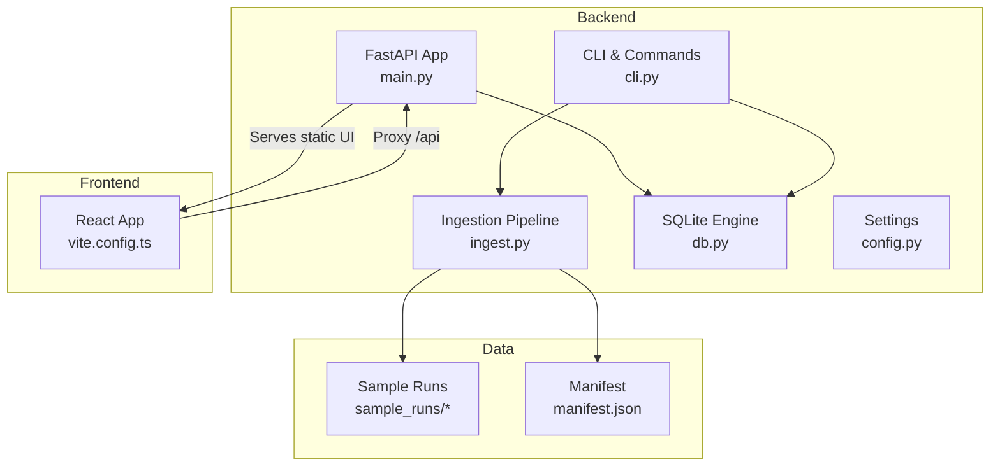
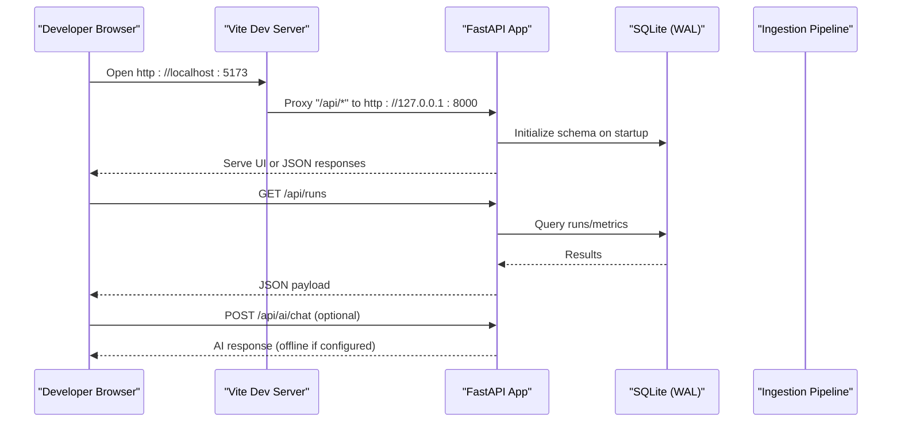
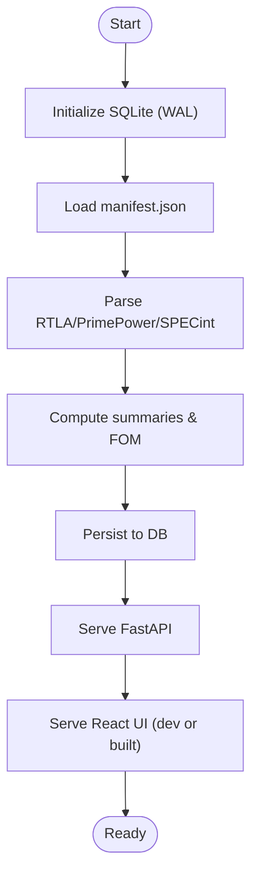
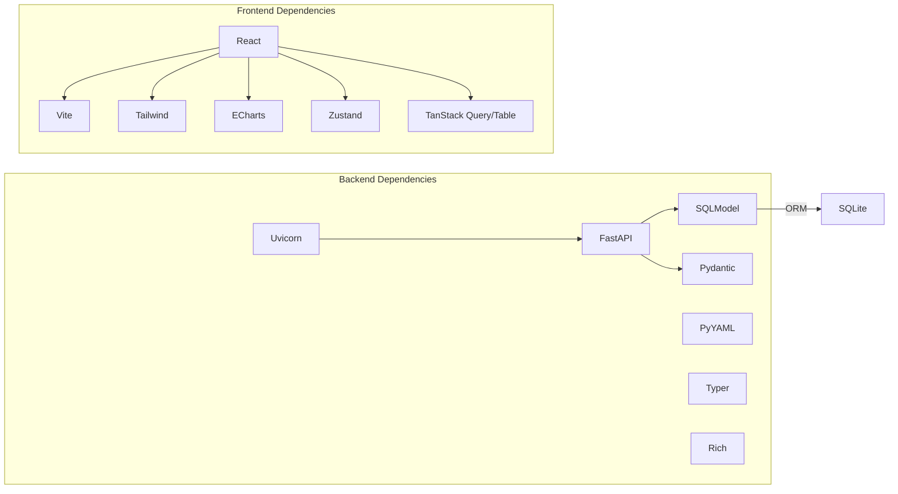

# Getting Started

<cite>
**Referenced Files in This Document**
- [backend/requirements.txt](file://backend/requirements.txt)
- [frontend/package.json](file://frontend/package.json)
- [backend/ppa/main.py](file://backend/ppa/main.py)
- [backend/ppa/config.py](file://backend/ppa/config.py)
- [backend/ppa/db.py](file://backend/ppa/db.py)
- [backend/ppa/cli.py](file://backend/ppa/cli.py)
- [backend/ppa/ingest.py](file://backend/ppa/ingest.py)
- [sample_runs/manifest.json](file://sample_runs/manifest.json)
- [sample_runs/baseline/primepower.rpt](file://sample_runs/baseline/primepower.rpt)
- [sample_runs/baseline/specint.rpt](file://sample_runs/baseline/specint.rpt)
- [frontend/vite.config.ts](file://frontend/vite.config.ts)
</cite>

## Table of Contents
1. Introduction
2. Project Structure
3. Core Components
4. Architecture Overview
5. Detailed Component Analysis
6. Dependency Analysis
7. Performance Considerations
8. Troubleshooting Guide
9. Conclusion
10. Appendices

## Introduction
PPA-Profiler is an end-to-end Power-Performance-Area (PPA) analysis workbench for RISC-V hardware design optimization. It combines a FastAPI-based backend with a React frontend to ingest, analyze, and visualize PPA data from EDA tools such as PrimePower, RTLA, and SPECint. The platform stores results in a local SQLite database, exposes REST APIs, and serves a web UI for exploration, comparison, and AI-assisted insights.

This guide helps you set up the environment, run the application, load sample data, and navigate the interface for your first experience.

## Project Structure
The repository is organized into three main parts:
- Backend: Python FastAPI server, CLI, parsers, ingestion pipeline, and SQLite storage
- Frontend: React + Vite + Tailwind app that proxies API calls to the backend
- Sample data: Pre-generated reports under sample_runs with a manifest describing each run

**Diagram sources**
- [backend/ppa/main.py:19-30](file://backend/ppa/main.py#L19-L30)
- [backend/ppa/cli.py:18-69](file://backend/ppa/cli.py#L18-L69)
- [backend/ppa/ingest.py:267-312](file://backend/ppa/ingest.py#L267-L312)
- [backend/ppa/db.py:13-44](file://backend/ppa/db.py#L13-L44)
- [backend/ppa/config.py:12-30](file://backend/ppa/config.py#L12-L30)
- [frontend/vite.config.ts:5-13](file://frontend/vite.config.ts#L5-L13)
- [sample_runs/manifest.json:1-206](file://sample_runs/manifest.json#L1-L206)

**Section sources**
- [backend/ppa/main.py:19-30](file://backend/ppa/main.py#L19-L30)
- [backend/ppa/cli.py:18-69](file://backend/ppa/cli.py#L18-L69)
- [backend/ppa/ingest.py:267-312](file://backend/ppa/ingest.py#L267-L312)
- [backend/ppa/db.py:13-44](file://backend/ppa/db.py#L13-L44)
- [backend/ppa/config.py:12-30](file://backend/ppa/config.py#L12-L30)
- [frontend/vite.config.ts:5-13](file://frontend/vite.config.ts#L5-L13)
- [sample_runs/manifest.json:1-206](file://sample_runs/manifest.json#L1-L206)

## Core Components
- FastAPI Application: Defines REST endpoints for runs, scorecards, comparisons, explorers, findings, and AI chat; mounts the built frontend or returns a hint when not built.
- CLI: Provides commands to initialize the database, generate sample data, ingest runs, serve the app, and check report parsing.
- Ingestion Pipeline: Parses RTLA area/timing/QoR, PrimePower power, and SPECint performance reports; computes summaries and figures of merit; persists normalized metrics and findings.
- Database: SQLite with WAL enabled; schema created via SQLModel on startup or via CLI init.
- Settings: Centralized configuration with environment variable overrides (PPA_*).
- Frontend: React app using Vite; proxies API requests to the backend during development.

**Section sources**
- [backend/ppa/main.py:36-205](file://backend/ppa/main.py#L36-L205)
- [backend/ppa/cli.py:18-99](file://backend/ppa/cli.py#L18-L99)
- [backend/ppa/ingest.py:25-31](file://backend/ppa/ingest.py#L25-L31)
- [backend/ppa/ingest.py:61-240](file://backend/ppa/ingest.py#L61-L240)
- [backend/ppa/db.py:13-44](file://backend/ppa/db.py#L13-L44)
- [backend/ppa/config.py:12-30](file://backend/ppa/config.py#L12-L30)
- [frontend/vite.config.ts:5-13](file://frontend/vite.config.ts#L5-L13)

## Architecture Overview
PPA-Profiler follows a layered architecture:
- Presentation: React SPA served by FastAPI (built dist) or proxied via Vite dev server
- API Layer: FastAPI routes exposing analysis, ingestion status, rules, and AI endpoints
- Data Access: SQLModel sessions over SQLite
- Processing: Report parsers and rule engine produce canonical metrics and findings
- Storage: SQLite database with WAL mode for concurrency and durability

**Diagram sources**
- [frontend/vite.config.ts:7-12](file://frontend/vite.config.ts#L7-L12)
- [backend/ppa/main.py:27-30](file://backend/ppa/main.py#L27-L30)
- [backend/ppa/main.py:36-205](file://backend/ppa/main.py#L36-L205)
- [backend/ppa/db.py:13-44](file://backend/ppa/db.py#L13-L44)

## Detailed Component Analysis

### Installation and Environment Setup
- Python environment
  - Use Python 3.x with a virtual environment
  - Install backend dependencies listed in requirements.txt
- Node.js environment
  - Use Node.js LTS recommended for Vite/React toolchain
  - Install frontend dependencies listed in package.json
- Database initialization
  - SQLite database file is created automatically at runtime or via CLI init
  - WAL mode is enabled for better concurrency

Prerequisites
- Familiarity with EDA outputs: PrimePower power reports, RTLA area/timing/QoR reports, and SPECint performance summaries
- Basic understanding of RISC-V microarchitecture concepts (e.g., ROB, LSQ, caches, clock gating)

Environment variables (optional)
- PPA_DB_PATH: Override SQLite database path
- PPA_SAMPLE_DIR: Override sample runs directory
- PPA_AI_BASE_URL, PPA_AI_MODEL, PPA_AI_API_KEY, PPA_AI_TIMEOUT_S, PPA_AI_MAX_TOOL_ROUNDS: Configure AI endpoint settings
- PPA_FRONTEND_DIST: Override built frontend location

**Section sources**
- [backend/requirements.txt:1-11](file://backend/requirements.txt#L1-L11)
- [frontend/package.json:1-29](file://frontend/package.json#L1-L29)
- [backend/ppa/db.py:13-29](file://backend/ppa/db.py#L13-L29)
- [backend/ppa/config.py:12-30](file://backend/ppa/config.py#L12-L30)

### Quick Start Guide
Step-by-step:
1. Create and activate a Python virtual environment
2. Install backend dependencies
3. Create and install frontend dependencies
4. Initialize the database
5. Generate and ingest sample data
6. Start the backend server
7. Start the frontend dev server
8. Open the application in your browser

Details:
- Initialize database: use the CLI init command
- Generate sample data: use the CLI gen-sample command to create realistic reports under sample_runs
- Ingest sample data: use the CLI ingest command pointing to sample_runs to parse and load all runs defined in manifest.json
- Run backend: use the CLI serve command to start the FastAPI server
- Run frontend: use the dev script to start Vite; it proxies /api to the backend

What happens during ingestion:
- Reads manifest.json to discover run directories
- For each run, parses RTLA area/timing/QoR, PrimePower power, and SPECint performance reports
- Computes derived metrics and figures of merit
- Persists normalized rows and metrics to SQLite
- Runs rule engine to raise findings based on data quality and thresholds

**Section sources**
- [backend/ppa/cli.py:18-69](file://backend/ppa/cli.py#L18-L69)
- [backend/ppa/ingest.py:267-312](file://backend/ppa/ingest.py#L267-L312)
- [sample_runs/manifest.json:1-206](file://sample_runs/manifest.json#L1-L206)

### Running the Application
- Backend server
  - Starts FastAPI with CORS enabled
  - Initializes the database on startup
  - Serves REST API endpoints and optionally the built frontend
- Frontend dev server
  - Serves the React app on port 5173
  - Proxies /api requests to http://127.0.0.1:8000

**Diagram sources**
- [backend/ppa/main.py:27-30](file://backend/ppa/main.py#L27-L30)
- [backend/ppa/ingest.py:267-312](file://backend/ppa/ingest.py#L267-L312)
- [frontend/vite.config.ts:7-12](file://frontend/vite.config.ts#L7-L12)

### Loading Sample Data
- The sample_runs directory contains multiple configurations (e.g., baseline, rob96, l1d64, nocg, leaky)
- Each run includes:
  - primepower.rpt: hierarchical power breakdown
  - rtla_area.rpt: area hierarchy
  - rtla_timing.rpt: timing paths and groups
  - rtla_qor.rpt: QoR metrics
  - specint.rpt: performance benchmarks and IPC ratios
- The manifest.json defines labels, parameters, corner, stage, and order for each run

Example files:
- PrimePower report shows categories and hierarchical instances with internal, switching, leakage, and total power
- SPECint report lists benchmarks with reference IPC, cycles, instructions, IPC, ratio@1GHz, cache miss rates, and branch misprediction

**Section sources**
- [sample_runs/manifest.json:1-206](file://sample_runs/manifest.json#L1-L206)
- [sample_runs/baseline/primepower.rpt:1-42](file://sample_runs/baseline/primepower.rpt#L1-L42)
- [sample_runs/baseline/specint.rpt:1-21](file://sample_runs/baseline/specint.rpt#L1-L21)

### Basic Navigation Through the Web Interface
After starting the app:
- Explore runs: list available runs and their metadata
- Scorecard: view aggregated metrics and figures of merit for a selected run
- Compare: select two or more runs to compare side-by-side
- Design space: plot trade-offs between metrics (e.g., power vs performance)
- Area/Power/Timing explorers: drill into hierarchical breakdowns and critical paths
- Findings: review automated data-quality and rule-based findings
- AI chat: optional AI-assisted explanations and proposals (requires configured AI endpoint)

Note: The exact navigation depends on the built UI; the backend provides the underlying APIs for these views.

[No sources needed since this section describes general usage without analyzing specific files]

## Dependency Analysis
Key runtime dependencies:
- Backend
  - FastAPI, Uvicorn for HTTP serving
  - SQLModel and SQLAlchemy for ORM and engine management
  - Pydantic for request/response models
  - PyYAML for rule definitions
  - Typer for CLI
  - Rich for console output
- Frontend
  - React, ReactDOM
  - Vite build toolchain
  - Tailwind CSS
  - ECharts for visualizations
  - Zustand for state management
  - TanStack Query/Table for data fetching and tables

**Diagram sources**
- [backend/requirements.txt:1-11](file://backend/requirements.txt#L1-L11)
- [frontend/package.json:11-28](file://frontend/package.json#L11-L28)

**Section sources**
- [backend/requirements.txt:1-11](file://backend/requirements.txt#L1-L11)
- [frontend/package.json:11-28](file://frontend/package.json#L11-L28)

## Performance Considerations
- SQLite with WAL mode improves read concurrency and reduces locking contention for multi-run datasets
- Ingestion computes summaries and figures of merit once per run to avoid repeated calculations
- Keep the number of ingested runs reasonable for local SQLite performance; consider partitioning large datasets across projects
- Frontend uses efficient charting libraries; ensure only necessary data is fetched per view

[No sources needed since this section provides general guidance]

## Troubleshooting Guide
Common issues and resolutions:
- Missing Python dependencies
  - Ensure you installed packages from requirements.txt inside the virtual environment
- Missing Node.js dependencies
  - Ensure you installed packages from package.json in the frontend directory
- Database not initialized
  - Run the CLI init command to create the SQLite database and schema
- No sample data loaded
  - Use the CLI gen-sample command to generate reports under sample_runs
  - Use the CLI ingest command to parse and load them into the database
- Port conflicts
  - Change backend host/port or frontend dev server port if needed
- Frontend cannot reach API
  - Verify Vite proxy target matches the backend address and port
- AI features unavailable
  - Configure AI endpoint settings via environment variables; ensure the service is reachable

Verification steps:
- Check API availability by opening the backend docs or calling /api/runs
- Confirm ingestion completed by checking the number of runs and findings reported by the CLI
- Validate parsed reports using the CLI check-format command on individual report files

**Section sources**
- [backend/ppa/cli.py:18-99](file://backend/ppa/cli.py#L18-L99)
- [backend/ppa/main.py:27-30](file://backend/ppa/main.py#L27-L30)
- [frontend/vite.config.ts:7-12](file://frontend/vite.config.ts#L7-L12)

## Conclusion
PPA-Profiler provides a streamlined workflow to ingest, analyze, and visualize RISC-V PPA data. With minimal setup, you can load sample runs, explore trade-offs, and leverage automated findings to guide design optimizations. The modular architecture allows extension with new parsers, rules, and AI capabilities while keeping the user experience simple and focused.

[No sources needed since this section summarizes without analyzing specific files]

## Appendices

### Prerequisites Checklist
- Python 3.x with virtual environment support
- Node.js LTS for frontend development
- Familiarity with EDA tool outputs: PrimePower, RTLA, SPECint
- Basic knowledge of RISC-V microarchitecture concepts

### Environment Variables Reference
- PPA_DB_PATH: Path to SQLite database file
- PPA_SAMPLE_DIR: Path to sample runs directory
- PPA_AI_BASE_URL: Base URL for AI endpoint
- PPA_AI_MODEL: Model identifier for AI endpoint
- PPA_AI_API_KEY: API key placeholder (ignored by some backends like Ollama)
- PPA_AI_TIMEOUT_S: Timeout for AI requests
- PPA_AI_MAX_TOOL_ROUNDS: Maximum tool rounds for AI interactions
- PPA_FRONTEND_DIST: Path to built frontend assets

**Section sources**
- [backend/ppa/config.py:12-30](file://backend/ppa/config.py#L12-L30)