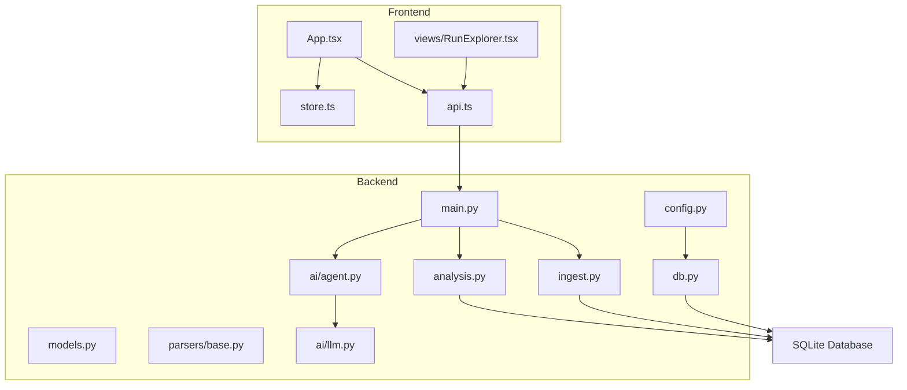
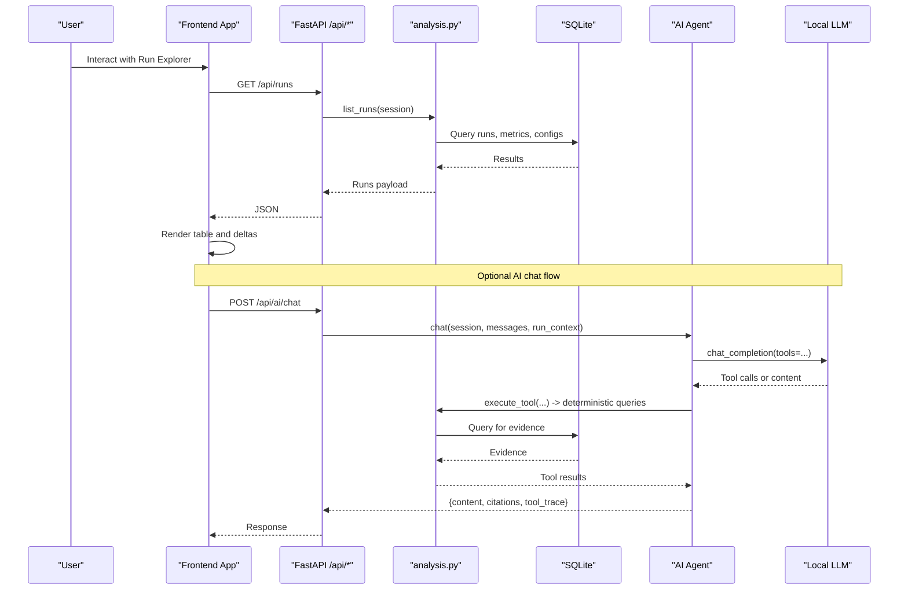
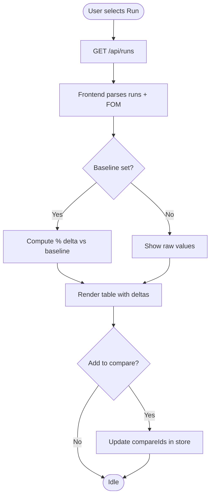
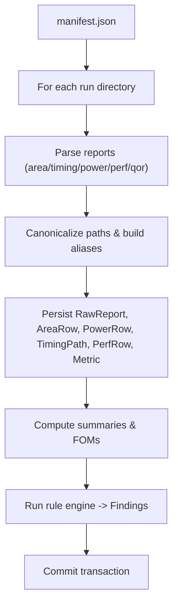
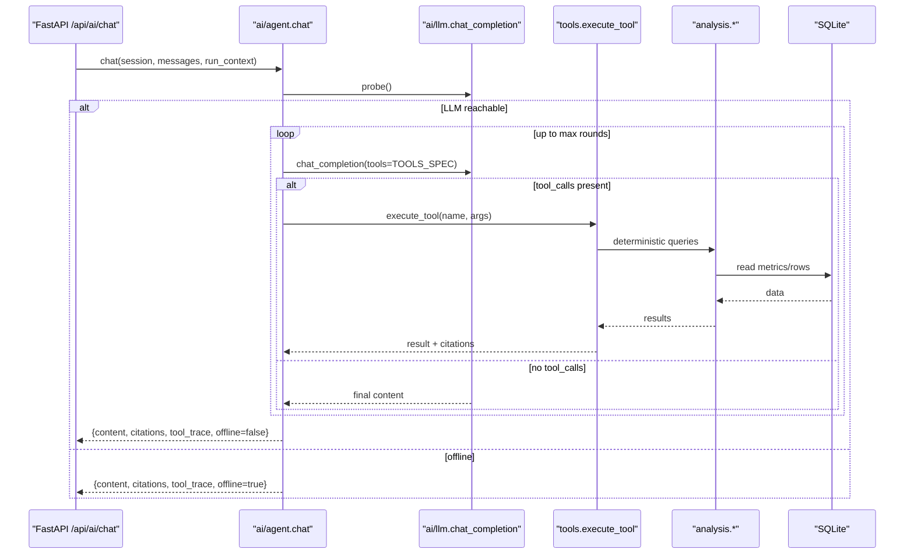
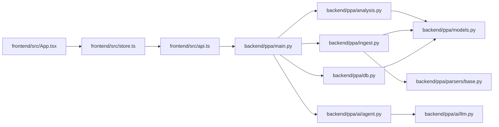

# System Overview

<cite>
**Referenced Files in This Document**
- [backend/ppa/main.py](file://backend/ppa/main.py)
- [backend/ppa/config.py](file://backend/ppa/config.py)
- [backend/ppa/db.py](file://backend/ppa/db.py)
- [backend/ppa/models.py](file://backend/ppa/models.py)
- [backend/ppa/analysis.py](file://backend/ppa/analysis.py)
- [backend/ppa/ingest.py](file://backend/ppa/ingest.py)
- [backend/ppa/parsers/base.py](file://backend/ppa/parsers/base.py)
- [backend/ppa/ai/llm.py](file://backend/ppa/ai/llm.py)
- [backend/ppa/ai/agent.py](file://backend/ppa/ai/agent.py)
- [frontend/src/App.tsx](file://frontend/src/App.tsx)
- [frontend/src/api.ts](file://frontend/src/api.ts)
- [frontend/src/store.ts](file://frontend/src/store.ts)
- [frontend/src/views/RunExplorer.tsx](file://frontend/src/views/RunExplorer.tsx)
- [backend/requirements.txt](file://backend/requirements.txt)
- [frontend/package.json](file://frontend/package.json)
</cite>

## Table of Contents
1. Introduction
2. Project Structure
3. Core Components
4. Architecture Overview
5. Detailed Component Analysis
6. Dependency Analysis
7. Performance Considerations
8. Troubleshooting Guide
9. Conclusion

## Introduction
PPA-Profiler is a client-server web application for RISC-V Power-Performance-Area (PPA) analysis. The FastAPI backend exposes REST APIs and serves the React frontend, while the frontend provides interactive visualizations across area, power, timing, performance, comparisons, and AI-assisted diagnosis. Data flows from EDA tool outputs through parsers into a SQLite database, where an analysis layer computes metrics and findings that drive both UI views and AI tools.

## Project Structure
The repository is organized into three main areas:
- Backend (Python/FastAPI): API endpoints, ingestion pipeline, analysis functions, AI integration, and SQLite persistence.
- Frontend (React/TypeScript/Vite): SPA with views, state management, and API clients.
- Sample data: Example runs used for demonstration and testing.

**Diagram sources**
- [backend/ppa/main.py:19-205](file://backend/ppa/main.py#L19-L205)
- [backend/ppa/config.py:12-30](file://backend/ppa/config.py#L12-L30)
- [backend/ppa/db.py:13-49](file://backend/ppa/db.py#L13-L49)
- [backend/ppa/models.py:17-217](file://backend/ppa/models.py#L17-L217)
- [backend/ppa/analysis.py:46-439](file://backend/ppa/analysis.py#L46-L439)
- [backend/ppa/ingest.py:61-312](file://backend/ppa/ingest.py#L61-L312)
- [backend/ppa/parsers/base.py:7-139](file://backend/ppa/parsers/base.py#L7-L139)
- [backend/ppa/ai/llm.py:15-60](file://backend/ppa/ai/llm.py#L15-L60)
- [backend/ppa/ai/agent.py:51-200](file://backend/ppa/ai/agent.py#L51-L200)
- [frontend/src/App.tsx:17-152](file://frontend/src/App.tsx#L17-L152)
- [frontend/src/api.ts:23-48](file://frontend/src/api.ts#L23-L48)
- [frontend/src/store.ts:22-80](file://frontend/src/store.ts#L22-L80)
- [frontend/src/views/RunExplorer.tsx:18-109](file://frontend/src/views/RunExplorer.tsx#L18-L109)

**Section sources**
- [backend/ppa/main.py:19-205](file://backend/ppa/main.py#L19-L205)
- [frontend/src/App.tsx:17-152](file://frontend/src/App.tsx#L17-L152)

## Core Components
- FastAPI server: Mounts CORS middleware, initializes the database on startup, mounts static frontend assets, and defines REST endpoints for runs, scorecard, compare, design space, explorers, findings, ingest status, rules, and AI chat/status.
- Ingestion pipeline: Parses multiple report types, canonicalizes paths, persists raw reports and derived tables, computes summary metrics and figures-of-merit, and triggers rule-based findings.
- Analysis layer: Provides deterministic query functions per view; these are also consumed by AI tools to ensure trustable answers.
- AI integration: Thin OpenAI-compatible HTTP client to local models (e.g., Ollama), with a deterministic offline fallback when no model is reachable.
- Persistence: SQLite with WAL enabled, SQLModel schema covering identity/provenance, metrics, analysis artifacts, and AI session logs.
- Frontend SPA: React app with Zustand store, TanStack Query for data fetching, and view components that call typed API helpers.

**Section sources**
- [backend/ppa/main.py:22-205](file://backend/ppa/main.py#L22-L205)
- [backend/ppa/ingest.py:25-312](file://backend/ppa/ingest.py#L25-L312)
- [backend/ppa/analysis.py:46-439](file://backend/ppa/analysis.py#L46-L439)
- [backend/ppa/ai/llm.py:15-60](file://backend/ppa/ai/llm.py#L15-L60)
- [backend/ppa/ai/agent.py:51-200](file://backend/ppa/ai/agent.py#L51-L200)
- [backend/ppa/db.py:13-49](file://backend/ppa/db.py#L13-L49)
- [backend/ppa/models.py:17-217](file://backend/ppa/models.py#L17-L217)
- [frontend/src/api.ts:23-48](file://frontend/src/api.ts#L23-L48)
- [frontend/src/store.ts:22-80](file://frontend/src/store.ts#L22-L80)

## Architecture Overview
The system follows a client-server pattern:
- Frontend requests data via REST endpoints and renders interactive views.
- Backend routes requests to analysis functions or ingestion/AI handlers.
- Data originates from EDA tool reports, parsed and stored in SQLite, then queried for visualization and AI reasoning.

**Diagram sources**
- [backend/ppa/main.py:38-194](file://backend/ppa/main.py#L38-L194)
- [backend/ppa/analysis.py:46-439](file://backend/ppa/analysis.py#L46-L439)
- [backend/ppa/ai/agent.py:51-115](file://backend/ppa/ai/agent.py#L51-L115)
- [backend/ppa/ai/llm.py:15-60](file://backend/ppa/ai/llm.py#L15-L60)
- [frontend/src/api.ts:23-48](file://frontend/src/api.ts#L23-L48)
- [frontend/src/views/RunExplorer.tsx:18-109](file://frontend/src/views/RunExplorer.tsx#L18-L109)

## Detailed Component Analysis

### Client-Server Interaction and Data Flow
- Frontend uses a typed API client to fetch lists, details, comparisons, and AI status.
- State (selected run, baseline, comparison set, current view) is persisted in URL hash and Zustand store.
- Views like Run Explorer request runs, compute deltas vs baseline, and allow adding runs to comparison.

**Diagram sources**
- [frontend/src/api.ts:23-48](file://frontend/src/api.ts#L23-L48)
- [frontend/src/store.ts:22-80](file://frontend/src/store.ts#L22-L80)
- [frontend/src/views/RunExplorer.tsx:18-109](file://frontend/src/views/RunExplorer.tsx#L18-L109)
- [backend/ppa/analysis.py:46-64](file://backend/ppa/analysis.py#L46-L64)

**Section sources**
- [frontend/src/App.tsx:17-152](file://frontend/src/App.tsx#L17-L152)
- [frontend/src/api.ts:23-48](file://frontend/src/api.ts#L23-L48)
- [frontend/src/store.ts:22-80](file://frontend/src/store.ts#L22-L80)
- [frontend/src/views/RunExplorer.tsx:18-109](file://frontend/src/views/RunExplorer.tsx#L18-L109)
- [backend/ppa/analysis.py:46-64](file://backend/ppa/analysis.py#L46-L64)

### Ingestion Pipeline: From Reports to Database
- Ingest reads manifest-driven run directories, parses multiple report types, canonicalizes module paths, persists raw reports and derived tables, computes summaries and FOMs, and runs rule checks to generate findings.

**Diagram sources**
- [backend/ppa/ingest.py:25-312](file://backend/ppa/ingest.py#L25-L312)
- [backend/ppa/parsers/base.py:7-139](file://backend/ppa/parsers/base.py#L7-L139)
- [backend/ppa/models.py:69-149](file://backend/ppa/models.py#L69-L149)

**Section sources**
- [backend/ppa/ingest.py:61-312](file://backend/ppa/ingest.py#L61-L312)
- [backend/ppa/parsers/base.py:7-139](file://backend/ppa/parsers/base.py#L7-L139)
- [backend/ppa/models.py:69-149](file://backend/ppa/models.py#L69-L149)

### AI Integration: Tool-Calling Loop and Offline Fallback
- The agent probes the local LLM endpoint; if unavailable, it falls back to a deterministic offline analyst that answers using context packs and analysis functions.
- When available, the agent iteratively calls typed tools backed by analysis functions to gather evidence, then composes a response with citations and optional view proposals.

**Diagram sources**
- [backend/ppa/main.py:167-194](file://backend/ppa/main.py#L167-L194)
- [backend/ppa/ai/agent.py:51-115](file://backend/ppa/ai/agent.py#L51-L115)
- [backend/ppa/ai/llm.py:15-60](file://backend/ppa/ai/llm.py#L15-L60)
- [backend/ppa/analysis.py:46-439](file://backend/ppa/analysis.py#L46-L439)

**Section sources**
- [backend/ppa/ai/agent.py:51-200](file://backend/ppa/ai/agent.py#L51-L200)
- [backend/ppa/ai/llm.py:15-60](file://backend/ppa/ai/llm.py#L15-L60)
- [backend/ppa/main.py:167-194](file://backend/ppa/main.py#L167-L194)

### Technology Stack Choices
- Backend: Python with FastAPI for high-performance async APIs, Pydantic for validation, SQLModel for ORM, SQLite with WAL for lightweight persistence, httpx for HTTP calls to local LLMs.
- Frontend: React with TypeScript, Vite for fast builds, Tailwind CSS for styling, ECharts for visualizations, Zustand for state, TanStack Query for caching and background updates.
- AI: OpenAI-compatible protocol to connect to local models (e.g., Ollama), with deterministic offline mode ensuring usability without external services.

**Section sources**
- [backend/requirements.txt:1-11](file://backend/requirements.txt#L1-L11)
- [frontend/package.json:1-30](file://frontend/package.json#L1-L30)
- [backend/ppa/config.py:12-30](file://backend/ppa/config.py#L12-L30)

### Cross-Cutting Concerns
- CORS: Enabled with permissive origins/methods/headers for development convenience.
- Static file serving: If a built frontend exists at the configured path, it is mounted at the root; otherwise, a simple API-only root response is returned.
- Session management: Stateless REST; user context is maintained in the frontend store and URL hash. AI sessions and messages are persisted in SQLite for auditability.
- Configuration: All settings (database path, sample dir, AI endpoint/model/key/timeout, frontend dist) are loaded via environment variables prefixed with PPA_.

**Section sources**
- [backend/ppa/main.py:22-24](file://backend/ppa/main.py#L22-L24)
- [backend/ppa/main.py:199-205](file://backend/ppa/main.py#L199-L205)
- [backend/ppa/main.py:177-194](file://backend/ppa/main.py#L177-L194)
- [backend/ppa/config.py:12-30](file://backend/ppa/config.py#L12-L30)
- [frontend/src/store.ts:22-80](file://frontend/src/store.ts#L22-L80)

## Dependency Analysis
High-level dependencies between major modules:

**Diagram sources**
- [frontend/src/api.ts:23-48](file://frontend/src/api.ts#L23-L48)
- [frontend/src/store.ts:22-80](file://frontend/src/store.ts#L22-L80)
- [frontend/src/App.tsx:17-152](file://frontend/src/App.tsx#L17-L152)
- [backend/ppa/main.py:19-205](file://backend/ppa/main.py#L19-L205)
- [backend/ppa/analysis.py:46-439](file://backend/ppa/analysis.py#L46-L439)
- [backend/ppa/ingest.py:25-312](file://backend/ppa/ingest.py#L25-L312)
- [backend/ppa/parsers/base.py:7-139](file://backend/ppa/parsers/base.py#L7-L139)
- [backend/ppa/ai/agent.py:51-200](file://backend/ppa/ai/agent.py#L51-L200)
- [backend/ppa/ai/llm.py:15-60](file://backend/ppa/ai/llm.py#L15-L60)
- [backend/ppa/db.py:13-49](file://backend/ppa/db.py#L13-L49)
- [backend/ppa/models.py:17-217](file://backend/ppa/models.py#L17-L217)

**Section sources**
- [backend/ppa/main.py:19-205](file://backend/ppa/main.py#L19-L205)
- [backend/ppa/analysis.py:46-439](file://backend/ppa/analysis.py#L46-L439)
- [backend/ppa/ingest.py:25-312](file://backend/ppa/ingest.py#L25-L312)
- [backend/ppa/ai/agent.py:51-200](file://backend/ppa/ai/agent.py#L51-L200)
- [backend/ppa/ai/llm.py:15-60](file://backend/ppa/ai/llm.py#L15-L60)
- [frontend/src/api.ts:23-48](file://frontend/src/api.ts#L23-L48)
- [frontend/src/store.ts:22-80](file://frontend/src/store.ts#L22-L80)
- [frontend/src/App.tsx:17-152](file://frontend/src/App.tsx#L17-L152)

## Performance Considerations
- Database: SQLite with WAL improves concurrency and durability for tens of runs; consider connection pooling or switching to a serverless DB if scaling beyond single-process usage.
- Parsing and ingestion: Batch inserts and minimal round-trips reduce overhead; ensure parser versions and checksums enable incremental reparsing only when needed.
- Analysis queries: Use indexed columns (run_id, scope_path, category, severity) to speed up explorers and findings filters.
- Frontend: TanStack Query caches responses; avoid excessive polling by relying on event-driven updates after ingestion.
- AI: Local LLM latency dominates chat responses; cache tool results where appropriate and limit tool rounds to bound response time.

[No sources needed since this section provides general guidance]

## Troubleshooting Guide
- No runs ingested: Ensure manifest.json exists under the target directory and that report files are present; check ingest status endpoint for parse errors and logs.
- Parser errors: RawReport entries capture parse_status and parse_log; verify parser versions and report formats.
- AI offline: If the local model endpoint is unreachable, the system falls back to offline mode; start the local model service or adjust PPA_AI_BASE_URL and related settings.
- CORS issues: Confirm browser origin matches allowed origins; for development, permissive CORS is enabled but production should restrict origins.
- Static frontend not served: If the frontend dist path does not exist, the root returns a JSON hint; build the frontend and place the dist at the configured path.

**Section sources**
- [backend/ppa/ingest.py:93-113](file://backend/ppa/ingest.py#L93-L113)
- [backend/ppa/main.py:154-162](file://backend/ppa/main.py#L154-L162)
- [backend/ppa/main.py:167-194](file://backend/ppa/main.py#L167-L194)
- [backend/ppa/main.py:22-24](file://backend/ppa/main.py#L22-L24)
- [backend/ppa/main.py:199-205](file://backend/ppa/main.py#L199-L205)
- [backend/ppa/config.py:12-30](file://backend/ppa/config.py#L12-L30)

## Conclusion
PPA-Profiler combines a robust ingestion pipeline, a deterministic analysis layer, and an AI assistant to deliver an integrated PPA analysis workbench. The FastAPI backend provides a clean REST surface and serves the React SPA, while SQLite ensures simplicity and portability. With careful configuration of CORS, static assets, and AI endpoints, the system scales well for small-to-medium teams and can be adapted for larger deployments by upgrading persistence and introducing caching layers.

[No sources needed since this section summarizes without analyzing specific files]