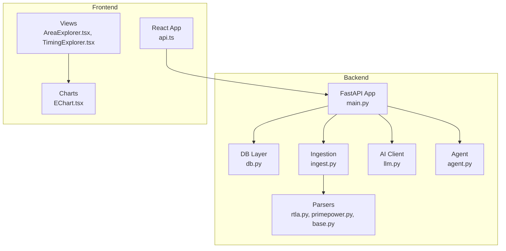
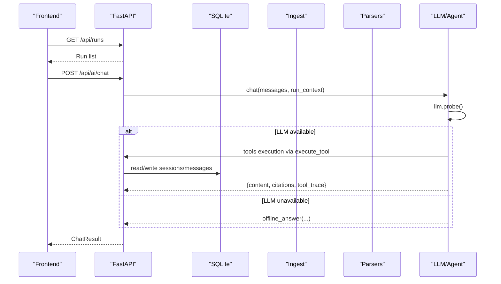
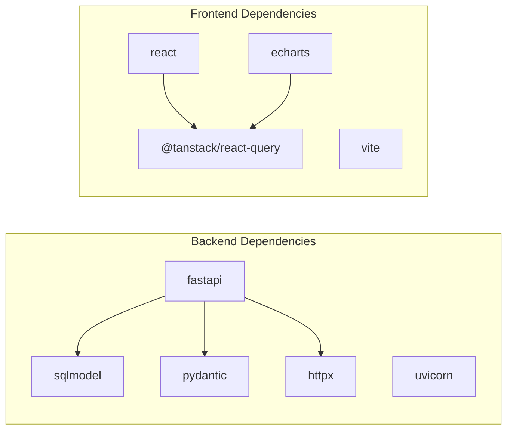

# Troubleshooting & FAQ

<cite>
**Referenced Files in This Document**
- [main.py](file://backend/ppa/main.py)
- [config.py](file://backend/ppa/config.py)
- [db.py](file://backend/ppa/db.py)
- [ingest.py](file://backend/ppa/ingest.py)
- [base.py](file://backend/ppa/parsers/base.py)
- [rtla.py](file://backend/ppa/parsers/rtla.py)
- [primepower.py](file://backend/ppa/parsers/primepower.py)
- [llm.py](file://backend/ppa/ai/llm.py)
- [agent.py](file://backend/ppa/ai/agent.py)
- [api.ts](file://frontend/src/api.ts)
- [EChart.tsx](file://frontend/src/components/EChart.tsx)
- [AreaExplorer.tsx](file://frontend/src/views/AreaExplorer.tsx)
- [TimingExplorer.tsx](file://frontend/src/views/TimingExplorer.tsx)
- [package.json](file://frontend/package.json)
- [requirements.txt](file://backend/requirements.txt)
</cite>

## Table of Contents
1. Introduction
2. Project Structure
3. Core Components
4. Architecture Overview
5. Detailed Component Analysis
6. Dependency Analysis
7. Performance Considerations
8. Troubleshooting Guide
9. Conclusion
10. Appendices

## Introduction
This document provides comprehensive troubleshooting and frequently asked questions for PPA-Profiler. It focuses on resolving installation issues (Python dependencies, Node.js modules, database initialization), parser problems (malformed EDA tool outputs, unsupported formats, validation errors), AI integration issues (LLM connectivity, rate limiting, context management), frontend concerns (API connectivity, chart rendering, browser compatibility), debugging techniques, log analysis guidance, performance profiling approaches, known limitations, workarounds, migration procedures, and common questions about PPA analysis concepts and workflows.

## Project Structure
PPA-Profiler consists of:
- Backend: FastAPI application with ingestion, parsing, metrics, rules, and AI agent endpoints.
- Frontend: React + Vite app consuming backend APIs and rendering charts via ECharts.
- Data: SQLite database with WAL mode; sample runs used for demos.

**Diagram sources**
- [main.py:1-206](file://backend/ppa/main.py#L1-L206)
- [db.py:1-50](file://backend/ppa/db.py#L1-L50)
- [ingest.py:1-312](file://backend/ppa/ingest.py#L1-L312)
- [rtla.py:1-182](file://backend/ppa/parsers/rtla.py#L1-L182)
- [primepower.py:1-86](file://backend/ppa/parsers/primepower.py#L1-L86)
- [base.py:1-139](file://backend/ppa/parsers/base.py#L1-L139)
- [llm.py:1-60](file://backend/ppa/ai/llm.py#L1-L60)
- [agent.py:1-231](file://backend/ppa/ai/agent.py#L1-L231)
- [api.ts:1-49](file://frontend/src/api.ts#L1-L49)
- [EChart.tsx:1-27](file://frontend/src/components/EChart.tsx#L1-L27)
- [AreaExplorer.tsx:1-139](file://frontend/src/views/AreaExplorer.tsx#L1-L139)
- [TimingExplorer.tsx:1-30](file://frontend/src/views/TimingExplorer.tsx#L1-L30)

**Section sources**
- [main.py:1-206](file://backend/ppa/main.py#L1-L206)
- [config.py:1-31](file://backend/ppa/config.py#L1-L31)
- [db.py:1-50](file://backend/ppa/db.py#L1-L50)
- [package.json:1-30](file://frontend/package.json#L1-L30)
- [requirements.txt:1-11](file://backend/requirements.txt#L1-L11)

## Core Components
- API server mounts CORS, initializes DB on startup, exposes REST endpoints for runs, scorecard, compare, design space, area/power/timing/perf/hotspot, findings, ingest status, rules, and AI chat/status.
- Database layer creates SQLite engine with WAL and foreign keys enabled; provides session dependency injection.
- Ingestion pipeline reads manifest, parses reports, persists rows/metrics, computes summaries and figures of merit, and triggers rule engine to generate findings.
- Parsers define typed report structures and parse RTLA area/timing/QOR and PrimePower hierarchical power reports.
- AI client wraps OpenAI-compatible HTTP calls; agent orchestrates tool-calling loop with offline fallback.
- Frontend uses a small API client to call backend endpoints and renders data with ECharts.

**Section sources**
- [main.py:27-206](file://backend/ppa/main.py#L27-L206)
- [db.py:13-50](file://backend/ppa/db.py#L13-L50)
- [ingest.py:25-312](file://backend/ppa/ingest.py#L25-L312)
- [base.py:7-139](file://backend/ppa/parsers/base.py#L7-L139)
- [rtla.py:25-182](file://backend/ppa/parsers/rtla.py#L25-L182)
- [primepower.py:19-86](file://backend/ppa/parsers/primepower.py#L19-L86)
- [llm.py:11-60](file://backend/ppa/ai/llm.py#L11-L60)
- [agent.py:51-231](file://backend/ppa/ai/agent.py#L51-L231)
- [api.ts:6-49](file://frontend/src/api.ts#L6-L49)

## Architecture Overview
The system follows a layered architecture:
- Frontend UI calls backend REST APIs.
- Backend routes invoke analysis and ingestion logic.
- Ingestion depends on parsers to transform raw text into structured models.
- AI features are optional and degrade gracefully to an offline analyst when the LLM is unavailable.

**Diagram sources**
- [main.py:167-194](file://backend/ppa/main.py#L167-L194)
- [agent.py:51-115](file://backend/ppa/ai/agent.py#L51-L115)
- [llm.py:15-60](file://backend/ppa/ai/llm.py#L15-L60)
- [db.py:43-50](file://backend/ppa/db.py#L43-L50)

## Detailed Component Analysis

### Installation and Environment
- Python dependencies: Ensure all packages from requirements.txt are installed in your virtual environment. Missing or conflicting versions can cause import failures or runtime errors.
- Node.js modules: The frontend requires Node.js and npm/yarn. Build the frontend to produce a dist directory that the backend serves statically. If the dist directory is missing, the backend returns a hint instead of the UI.
- Database initialization: On startup, the app initializes the SQLite database and enables WAL mode for better concurrency. If initialization fails, check file permissions and disk space.

Common symptoms and fixes:
- ImportError or version conflicts: Reinstall dependencies using requirements.txt in a clean virtual environment.
- Frontend not loading: Build the frontend and ensure the configured frontend_dist path exists.
- Database errors: Verify write permissions to the configured db_path and sufficient disk space.

**Section sources**
- [requirements.txt:1-11](file://backend/requirements.txt#L1-L11)
- [package.json:6-28](file://frontend/package.json#L6-L28)
- [main.py:27-30](file://backend/ppa/main.py#L27-L30)
- [main.py:199-206](file://backend/ppa/main.py#L199-L206)
- [db.py:13-30](file://backend/ppa/db.py#L13-L30)

### Parser Issues
- Malformed EDA tool outputs: Parsers raise specific ParseError types when expected sections or rows are missing. For example, RTLA area/timing/QOR and PrimePower parsers require certain headers and table rows.
- Unsupported report formats: Parsers are tuned for synthetic-style reports. Real tool outputs may differ; use the provided checks and adjust token positions only if necessary.
- Data validation errors: Ingestion records parse_status and parse_log per report. Warnings are captured; missing files are logged as errors.

Troubleshooting steps:
- Inspect RawReport entries for parse_status and parse_log to identify which report failed and why.
- Validate report structure against expected sections (e.g., “Path Group” summary for timing, hierarchy rows for area/power).
- Confirm that canonicalization maps tool-specific paths consistently across reports.

**Section sources**
- [rtla.py:19-20](file://backend/ppa/parsers/rtla.py#L19-L20)
- [rtla.py:25-71](file://backend/ppa/parsers/rtla.py#L25-L71)
- [rtla.py:81-135](file://backend/ppa/parsers/rtla.py#L81-L135)
- [primepower.py:19-86](file://backend/ppa/parsers/primepower.py#L19-L86)
- [ingest.py:93-113](file://backend/ppa/ingest.py#L93-L113)
- [base.py:7-139](file://backend/ppa/parsers/base.py#L7-L139)

### AI Integration Problems
- LLM connection failures: The client raises LLMUnavailable on connection or HTTP errors. The agent falls back to an offline deterministic answer when the endpoint is unreachable.
- Rate limiting: If the LLM endpoint enforces limits, reduce request frequency or increase timeouts. Adjust ai_timeout_s and ai_max_tool_rounds via configuration.
- Context management: The agent builds a conversation with system prompt and optional run context. If context is too large, it truncates to avoid payload bloat.

Diagnostics:
- Use /api/ai/status to probe availability and model listing.
- Check tool_trace and citations in chat responses to understand what tools were called and what data was used.
- If offline mode activates, start the local model endpoint and pull the configured model.

**Section sources**
- [llm.py:11-60](file://backend/ppa/ai/llm.py#L11-L60)
- [agent.py:51-115](file://backend/ppa/ai/agent.py#L51-L115)
- [agent.py:120-231](file://backend/ppa/ai/agent.py#L120-L231)
- [config.py:17-22](file://backend/ppa/config.py#L17-L22)
- [main.py:167-194](file://backend/ppa/main.py#L167-L194)

### Frontend Troubleshooting
- API connectivity: The frontend fetches from /api. Ensure CORS is allowed and the backend is reachable. Errors surface as thrown errors with status and response text.
- Chart rendering: ECharts is used via echarts-for-react. If charts do not render, verify that the option object is valid and that the container has height. Canvas renderer is explicitly set.
- Browser compatibility: Modern browsers supported by React 18 and Vite. If issues occur, clear caches and ensure polyfills are not required.

Diagnostics:
- Open browser DevTools Network tab to inspect API requests/responses.
- Check console for JavaScript errors related to fetch or ECharts options.
- Confirm that the frontend build succeeded and the dist directory is present.

**Section sources**
- [api.ts:8-21](file://frontend/src/api.ts#L8-L21)
- [EChart.tsx:1-27](file://frontend/src/components/EChart.tsx#L1-L27)
- [AreaExplorer.tsx:32-139](file://frontend/src/views/AreaExplorer.tsx#L32-L139)
- [TimingExplorer.tsx:7-30](file://frontend/src/views/TimingExplorer.tsx#L7-L30)
- [main.py:22-24](file://backend/ppa/main.py#L22-L24)

### Debugging Techniques
- Backend logs: Ingestion captures parse logs and warnings per report. Use /api/ingest-status to review parse outcomes.
- AI trace: Chat responses include tool_trace and citations to reconstruct decisions and data provenance.
- Database inspection: SQLite with WAL enabled; queries can be run directly if needed for diagnostics.

Best practices:
- Reproduce issues with sample_runs to isolate environment problems.
- Validate report formats before ingestion to prevent cascading errors.
- Keep configurations explicit via environment variables prefixed with PPA_.

**Section sources**
- [ingest.py:93-113](file://backend/ppa/ingest.py#L93-L113)
- [main.py:154-162](file://backend/ppa/main.py#L154-L162)
- [agent.py:66-115](file://backend/ppa/ai/agent.py#L66-L115)
- [db.py:22-30](file://backend/ppa/db.py#L22-L30)
- [config.py:12-31](file://backend/ppa/config.py#L12-L31)

### Performance Profiling Approaches
- Ingestion throughput: Monitor how many reports are parsed per run and where errors occur. Large hierarchies in area/power reports can increase processing time.
- AI latency: Tune ai_timeout_s and ai_max_tool_rounds to balance responsiveness and completeness.
- Frontend rendering: ECharts with canvas renderer is efficient; avoid overly deep treemaps or excessive series.

Optimization tips:
- Pre-validate reports to fail fast during ingestion.
- Cache frequent queries at the API layer if needed.
- Limit the number of concurrent AI tool calls via configuration.

[No sources needed since this section provides general guidance]

## Dependency Analysis
Key dependencies and their roles:
- Backend: FastAPI, Uvicorn, SQLModel, Pydantic, PyYAML, httpx, Typer, Rich, pytest.
- Frontend: React, React DOM, ECharts, echarts-for-react, TanStack Query/Table, Zustand, Vite, Tailwind, TypeScript.

**Diagram sources**
- [requirements.txt:1-11](file://backend/requirements.txt#L1-L11)
- [package.json:11-28](file://frontend/package.json#L11-L28)

**Section sources**
- [requirements.txt:1-11](file://backend/requirements.txt#L1-L11)
- [package.json:11-28](file://frontend/package.json#L11-L28)

## Performance Considerations
- SQLite WAL mode improves read concurrency and reduces locking contention.
- Ingestion batches inserts and commits once per run to minimize overhead.
- AI tool rounds are capped to prevent runaway loops; tune based on endpoint capabilities.
- Frontend uses lazy updates and canvas rendering for smoother interactions.

[No sources needed since this section provides general guidance]

## Troubleshooting Guide

### Installation Issues
- Python dependency conflicts:
  - Symptom: Import errors or runtime exceptions.
  - Action: Create a fresh virtual environment and install requirements.txt.
- Node.js module problems:
  - Symptom: Frontend build fails or assets missing.
  - Action: Install dependencies and run the build script; ensure dist exists.
- Database initialization failures:
  - Symptom: Startup errors or inability to query data.
  - Action: Check db_path permissions and disk space; verify SQLite availability.

**Section sources**
- [requirements.txt:1-11](file://backend/requirements.txt#L1-L11)
- [package.json:6-28](file://frontend/package.json#L6-L28)
- [main.py:27-30](file://backend/ppa/main.py#L27-L30)
- [db.py:13-30](file://backend/ppa/db.py#L13-L30)

### Parser-Related Issues
- Malformed EDA tool outputs:
  - Symptom: ParseError raised; ingestion marks report as error with parse_log.
  - Action: Inspect RawReport entries; validate report format; adjust parser only if necessary.
- Unsupported report formats:
  - Symptom: No rows or groups found; warnings emitted.
  - Action: Confirm expected sections exist; consider generating synthetic-like reports for testing.
- Data validation errors:
  - Symptom: Mismatched paths between power and area reports; findings generated.
  - Action: Align scope paths; investigate canonicalization behavior.

**Section sources**
- [rtla.py:25-71](file://backend/ppa/parsers/rtla.py#L25-L71)
- [rtla.py:81-135](file://backend/ppa/parsers/rtla.py#L81-L135)
- [primepower.py:19-86](file://backend/ppa/parsers/primepower.py#L19-L86)
- [ingest.py:230-239](file://backend/ppa/ingest.py#L230-L239)

### AI Integration Problems
- LLM connection failures:
  - Symptom: Chat returns offline answer; status shows unavailable.
  - Action: Start local model endpoint; verify base URL and model name; adjust timeout.
- Rate limiting:
  - Symptom: HTTP errors or slow responses.
  - Action: Increase ai_timeout_s; reduce tool rounds; implement retries at client if needed.
- Context management issues:
  - Symptom: Truncated context or unexpected behavior.
  - Action: Ensure run_context fits within payload limits; rely on tool results rather than large prompts.

**Section sources**
- [llm.py:15-60](file://backend/ppa/ai/llm.py#L15-L60)
- [agent.py:51-115](file://backend/ppa/ai/agent.py#L51-L115)
- [config.py:17-22](file://backend/ppa/config.py#L17-L22)
- [main.py:167-194](file://backend/ppa/main.py#L167-L194)

### Frontend Troubleshooting
- API connectivity:
  - Symptom: Fetch errors with status codes.
  - Action: Check CORS settings; confirm backend is running; inspect network tab.
- Chart rendering problems:
  - Symptom: Blank charts or layout issues.
  - Action: Validate ECharts option; ensure container height; use canvas renderer.
- Browser compatibility:
  - Symptom: Polyfill or feature errors.
  - Action: Use modern browsers; clear cache; update dependencies.

**Section sources**
- [api.ts:8-21](file://frontend/src/api.ts#L8-L21)
- [EChart.tsx:1-27](file://frontend/src/components/EChart.tsx#L1-L27)
- [AreaExplorer.tsx:32-139](file://frontend/src/views/AreaExplorer.tsx#L32-L139)
- [TimingExplorer.tsx:7-30](file://frontend/src/views/TimingExplorer.tsx#L7-L30)
- [main.py:22-24](file://backend/ppa/main.py#L22-L24)

### Log Analysis Guidance
- Ingestion logs:
  - Use /api/ingest-status to review parse_status and parse_log for each report.
- AI traces:
  - Examine tool_trace and citations in chat responses to understand tool usage and data sources.
- Database state:
  - Inspect tables via SQLModel or direct SQLite access for anomalies.

**Section sources**
- [ingest.py:93-113](file://backend/ppa/ingest.py#L93-L113)
- [main.py:154-162](file://backend/ppa/main.py#L154-L162)
- [agent.py:66-115](file://backend/ppa/ai/agent.py#L66-L115)

### Known Limitations and Workarounds
- Parsers built against synthetic-style reports; real outputs may require minor adjustments.
- AI features depend on a reachable OpenAI-compatible endpoint; otherwise, offline analyst provides limited answers.
- Frontend static serving requires a built dist directory; without it, only API docs are available.

Workarounds:
- Validate reports before ingestion to catch format mismatches early.
- Configure timeouts and round limits to manage AI responsiveness.
- Build frontend artifacts and serve them via the backend.

**Section sources**
- [rtla.py:1-8](file://backend/ppa/parsers/rtla.py#L1-L8)
- [primepower.py:1-9](file://backend/ppa/parsers/primepower.py#L1-L9)
- [agent.py:120-231](file://backend/ppa/ai/agent.py#L120-L231)
- [main.py:199-206](file://backend/ppa/main.py#L199-L206)

### Migration Procedures for Schema Changes
- When adding new tables or fields:
  - Update SQLModel models and ensure init_db recreates metadata.
  - Back up the SQLite database before migration.
  - Test ingestion with sample runs to validate schema changes.
- Versioning parsers:
  - Increment parser VERSION when formats change; ingestion tracks parser_version per report to detect upgrades.

**Section sources**
- [db.py:43-45](file://backend/ppa/db.py#L43-L45)
- [ingest.py:105-112](file://backend/ppa/ingest.py#L105-L112)
- [rtla.py:16](file://backend/ppa/parsers/rtla.py#L16)
- [primepower.py:16](file://backend/ppa/parsers/primepower.py#L16)

### Frequently Asked Questions
- What is PPA analysis?
  - Power-Performance-Area analysis evaluates trade-offs among power consumption, performance metrics (e.g., SPECint score), and silicon area for hardware designs.
- How are EDA tool outputs integrated?
  - Reports are parsed into structured models; ingestion normalizes paths and derives metrics; discrepancies trigger data-quality findings.
- Best practices for hardware design optimization workflows?
  - Validate reports early; align scope paths across tools; monitor findings; use AI insights cautiously and verify numbers via tool results; iterate with baseline comparisons.

[No sources needed since this section summarizes conceptual content]

## Conclusion
PPA-Profiler provides a robust pipeline for ingesting EDA reports, deriving metrics, and offering AI-assisted analysis with graceful degradation. Most issues stem from environment setup, report format mismatches, or AI endpoint availability. Use the diagnostic endpoints and logs to pinpoint problems, validate inputs, and tune configurations for performance and reliability.

[No sources needed since this section summarizes without analyzing specific files]

## Appendices

### Common Error Patterns and Resolutions
- Missing report files:
  - Ingestion marks parse_status as error with “missing file”. Provide the expected files in the run directory.
- Unmatched paths:
  - Findings indicate unmatched power vs area paths. Align scope paths or investigate tool output differences.
- Offline AI mode:
  - Indicates LLM endpoint unreachable. Start the local model or configure a compatible endpoint.

**Section sources**
- [ingest.py:93-113](file://backend/ppa/ingest.py#L93-L113)
- [ingest.py:230-239](file://backend/ppa/ingest.py#L230-L239)
- [agent.py:120-231](file://backend/ppa/ai/agent.py#L120-L231)